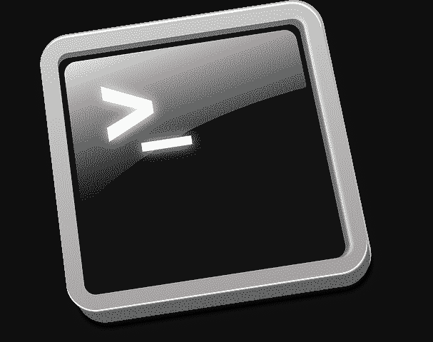

# 用错误解决方案满足基本需求

> 原文：<https://medium.com/geekculture/git-bare-necessities-with-error-resolution-ef11b6ce2571?source=collection_archive---------11----------------------->

## 学习基本的 Git 命令和问题解决(侧重于 Xcode 用户)



来自 [Pixabay](https://pixabay.com/) 的图片

最初使用命令行可能会令人望而生畏。好吧，让我们面对现实吧，有时候当我们试图输入正确的命令时，我们都会紧张得毛骨悚然。但是，当一个命令按预期发挥作用时，我们感到的宽慰和力量值得我们喝一大杯咖啡。

在本文中，我将讨论 Xcode 用户应该在工具箱中使用的几个 Git 命令。Xcode 可以在您启动项目时创建一个新的 Git 存储库，并使用内置的 Git 工具简化源代码管理。您可以直接从 Xcode 提交和推送。然而，有很多理由让您掌握一些 Git 命令。

# Git 的一般用途

Git 是开发人员进行源代码管理(SCM)的首选工具。这是一个在 GNU 通用公共许可证版本 2 下发布的免费开源版本控制系统。

开发人员使用 Git 来跟踪和管理他们内容的增量变化。项目文件和文件夹的更改历史记录保存在用户计算机的本地存储库中。建议使用 GitHub 这样的托管服务来远程存储存储库。这至少确保了您拥有源代码的备份副本。

Git 中的默认分支称为 main 或 master。我将在整篇文章中提到主要分支。

此时，我假设您已经设置了 Git 和 GitHub 库，并且正在寻找一些有用的提示和问题解决方案。所以，我们继续。

# 有用的命令和错误解决方案

## 更改目录

打开终端时运行的第一个命令是将 shell 实例的工作目录更改为项目路径:

```
cd <project directory>
```

一旦你在终端窗口中输入`cd[space]`，你就可以很容易地从 Finder 窗口中拖放你想要的项目文件夹。

## 日志输出

我总是运行的第一个 Git 命令是`git log`。这按时间顺序列出了提交到存储库的内容。提交代表项目在单个时间点的状态快照。在日志中，每个提交由描述所做更改的消息和唯一的哈希进一步标识。

Git 日志可以与其他配置选项结合使用。一个有用的标志是`--oneline`,因为它将每个提交压缩成一行。


键入 Ctrl + Z 退出`git log`的输出。

## 结帐——来自过去的爆炸

你希望你回到过去吗？嗯，可以，用`git checkout`！就好像你手里有一个通量电容器。简单地拍一张现在的快照，并冒险到任何时间点，也许是 1955 年。

让我们现实一点。Git checkout 不会创造你偶遇自己的可能性，但是它*是*一个有用的命令。它将头指针移动到本地存储库中的旧提交或另一个*分支*(接下来讨论)。

运行完`git log`之后，在列表中筛选一个先前的提交。使用上面的 gist 示例，输入`git checkout`,后跟适用的哈希代码，以导航到初始提交:

```
git checkout 89024d7
```

用`git switch -`撤销此操作

当从日志中检查提交时，git 确保对当前分支的本地更改已经被提交。否则，您将遇到以下障碍:

```
error: Your local changes to the following files would be overwritten by checkout
```

如果您在签出时遇到这个问题，请确保对当前分支的更改已经提交到您的本地存储库中。在 Xcode 上，这和源代码控制>提交一样简单，输入一条提交消息，然后点击提交。

## 分支

在命令行上使用 Git 的最大优势之一是它的分支功能。分支提供了一个对代码库进行更改的隔离环境。本质上，您可以在不影响主分支的情况下修改代码。

例如，通过将对用户界面的修改封装在不同于主分支的分支上，分支有助于更安全的原型化。如果新的用户界面被接受，简单地合并原型分支和主分支。合并将独立分支(从当前分支分出)的分叉历史集成到当前分支中。同样，如果设计特征是一个半身像，或者在它与主分支合并之后，原型分支可以被删除。

要查看存储库中的现有分支，请输入以下内容:

```
git branch
```

目前唯一的分支是 main 分支，它用星号和绿色标记，表示它是 HEAD/checked 分支。

```
* main
```

创建新分支时，最好使用正确的命名约定。这使得到相关分支的转换更加容易(更多关于命名的信息，请参见底部的链接)。

要创建名为 wip-feature-login-module 的新分支，请输入:

```
git branch wip-feature-login-module
```

创建新分支(它源于主分支)后，签出您的新分支以使用它:

```
git checkout wip-feature-login-module
```

新的分支名称将出现在 Xcode 窗口的左上角，项目名称的下方。进行修改，并确保**提交【Xcode 源代码控制的更改，然后继续下一步，合并。**

## 合并分支

一旦您测试了您的新分支并决定提交那些变更，您将合并*WIP-feature-log in-module*分支和主分支。合并连接了两个发展历史。为此，首先切换回主分支:

```
git checkout main
```

一旦你确认你已经切换到主分支(`Switched to branch 'main'`)，将*WIP-特征-登录-模块*分支合并到主分支中:

```
git merge wip-feature-login-module
```

成功合并分支后，可能不再需要分支 *wip-feature-login-module。*使用以下命令删除分支:

```
git branch -d wip-feature-login-module
```

## 合并冲突

如果每次合并都能顺利进行，那就太好了，但情况并非总是如此。运行`git merge`后，您可能会收到以下错误:

```
Automatic merge failed; fix conflicts and then commit the result.
```

或者

```
error: Merging is not possible because you have unmerged files.
```

如果你遇到这些错误，那是因为主分支已经提交了没有反映在*WIP-feature-log in-module*分支上的变更。此冲突将阻止合并。要查看违规的未合并路径，请运行以下命令:

```
git status
```

运行`git status`是一个安全的赌注，因为它显示了您的工作目录的当前状态，并且不会改变您的本地存储库。此外，它将查明冲突并提供错误解决方案。

事实上，冲突文件的代码将在合并失败时被注释，以帮助您解决问题。您可以直接编辑这些文件，然后使用`git add <file>`暂存新的合并内容。通过创建新的提交来完成合并:

```
git commit -m "resolved merge conflict in <file>"
```

或者，您可以中止合并过程，使用以下命令将文件恢复到合并前的状态:

```
git merge --abort
```

但是，合并失败后，可能会出现以下错误:

```
fatal: There is no merge to abort (MERGE_HEAD missing).
```

或者

```
error: you need to resolve your current index first
```

在这种情况下，失败的合并不能中止，但可以使用以下命令撤消:

```
git reset --merge
```

## 推送至远程存储库

将提交提交到您的本地存储库之后，使用`git push <remote> <branch>`将您的更改发送到远程存储库。

```
git push origin main
```

虽然您可以`push`使用 Xcode，源代码控制> Push，但有时您需要使用命令行。例如，Xcode 中的以下错误会阻止您将本地更改推送到远程存储库:

```
remote repository not found
```

从终端推送存储库，您可能会看到以下错误:

```
remote: Permission to user/repo denied to user/other-repo
```

这表明您正在按下的密钥已连接到不同的存储库。让我们来看看解决这个问题的`git config`设置:

```
git config--list
```

您可能会注意到您的用户名或其他关键数据不正确。根据需要，输入以下命令。您需要在 GitHub 上生成一个个人访问令牌，以便再次推送。

```
git config user.name "your Xcode name"
git config credential.username "your GitHub name"
```

再举一个例子，当我尝试在 Xcode 中推送本地更改时，我在 Xcode 中收到了以下错误:

```
local repository out of date
```

在终端中:

```
error: failed to push some refs to ...hint: Updates were rejected because the remote contains work that you do not have locally.
```

当远程存储库和本地存储库之间发生合并冲突(又来了)时，就会发生这种情况。

大多数软件工程师会告诉你，避免使用`git push -f`来解决这个问题。force 标志可能导致远程存储库丢失提交(即，覆盖在您上次拉取之后被推送的团队成员提交)到否则将被拒绝的推送。

相反，以下终端命令可以完成这项工作，但并不强制:

```
git pull origin main
```

这将首先从远程存储库中检索更新，并在本地应用这些更改。

最后，`git push`到远程存储库。

```
git push origin main
```

# 包扎

您(和我)已经学习了一些基本但重要的 Git 命令。关于 Git 还有很多需要学习的地方，但是现在，向不懂计算机的朋友展示您的技能，看起来像一个命令行绝地。

我将发布这篇文章的更新，以及我在编码过程中遇到的其他错误解决方案。

感谢阅读！

关于用 Xcode 设置 Git 的更多信息:[https://developer . apple . com/documentation/Xcode/source-control-management](https://developer.apple.com/documentation/xcode/source-control-management)

一定要使用适当的命名约定来减少混淆:[https://coding sight . com/git-branching-naming-conventi on-best-practices/](https://codingsight.com/git-branching-naming-convention-best-practices/)。

这篇文章深入探讨了如何解决合并冲突:[https://www . atlassian . com/git/tutorials/using-branches/merge-conflicts](https://www.atlassian.com/git/tutorials/using-branches/merge-conflicts)

git push -f 的真正含义:[https://stack overflow . com/questions/44678942/difference-between-git-push-and-git-push-f](https://stackoverflow.com/questions/44678942/difference-between-git-push-and-git-push-f)