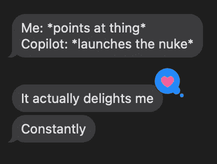

# GitHub 副驾驶和世界主要宗教

> 原文：<https://medium.com/geekculture/github-copilot-vs-major-world-religions-44829926e055?source=collection_archive---------10----------------------->


From the St Louis World’s Fair, 1904 | [Wikimedia](https://en.wikipedia.org/wiki/Louisiana_Purchase_Exposition#/media/File:St_louis_1904_mucha_poster.jpg)

使用 GitHub Copilot 就像在 Applebees 吃烤馄饨一样。你首先需要向自己证明你为什么在 Applebees(如果有人问，你得到了一张礼品卡，三天后就过期了)，你肯定*不会*去享受任何食物——它是淡而无味的；无味！——只有尼安德特人会在这里吃饭，甚至在你的内部对话中，你用一个[硬 T 发音“尼安德特人”，因为你需要向自己证明你是有教养的](https://www.discovermagazine.com/planet-earth/is-it-neander-tal-or-neander-thal)。但是该死的，你不会想浪费一张 25 美元的礼品卡。

进入烤馄饨。

伙计们，在密苏里州圣路易斯市外的苹果蜂菜单上，你找不到这种美味。没错，STL 是世界上唯一的地方(！)Applebees 会包一个馄饨，然后在油里炸。[烤馄饨是圣路易斯的特色。如果苹果蜂烤馄饨](https://en.wikipedia.org/wiki/Toasted_ravioli)[不只是击败所有](https://idioms.thefreedictionary.com/don%27t+that+beat+all!)——它会让你的嘴角出现不自觉卷曲的迹象。油炸食物实在是太多了——你直直地看着那个馄饨，摇摇头，笑得合不拢嘴。

几个月后，这描述了我使用 GitHub Copilot 的经历。

我想 GitHub 在这个比喻中是 Applebees？这篇文章很不清楚。我一开始就对使用这个产品心存疑虑:它能做我做的事情，除了更快，有时更好。而且，虽然我知道 Copilot 肯定不是一个真正的大脑——*它只是一个* [*感知器*](https://en.wikipedia.org/wiki/Perceptron) [*大毒蛇*](https://en.wikipedia.org/wiki/Ouroboros) *你这个傻瓜*——我经常震惊地发现自己在微笑，就像我可能对朋友一样，当它做一些未来十分钟的我会做的事情，而缺少一个人工智能合作程序员。

有一个词可以形容这种产生不可抑制的微笑的感觉，这个词就是*愉悦*。

这不是我编的。这个词是在 iMessage 关于使用 Copilot 的一次非常自然的对话中出现的。



In case you don’t know how iMessage works — the grey boxes mean the *other* person said it.

这难道不是一个有趣的词语选择吗？这里我不想太哲学化；毕竟，深度思考对于基于 Applebees 的媒体文章来说是很难推销的——但这难道不是一个你可以用来描述……也许是一只宠物的行为的词吗？也许是一个人？绝对是你拟人化的东西。

已经有很多关于 GPT3 意识的糟糕的媒体文章，来自像我这样的不合格的白痴，所以我不打算再增加(两)千字(尽管你现在正在阅读的是最好的 Applebees 相关媒体文章中的*很容易*，如果我自己这么说的话)。然而，在继续之前，我会带你去[梅勒妮·米切尔的](/@melaniemitchell.me)博客，她实际上*不知道*她在说什么。她写了一篇关于 [GPT3 在 Hofstadter 的模仿测试](/@melaniemitchell.me/can-gpt-3-make-analogies-16436605c446)中的混合/糟糕结果的伟大文章，这是——总结比我聪明得多的人的数千页——一种简洁的*测量机器理解* *隐喻*的能力的方式。

另一个聪明的人，我会给你介绍的是 Ilya Sutskever，OpenAI 的首席科学家，他在推特上写道(用不同的话)“[顺便说一句，嗯……我认为 GPT3 可能已经有点意识了](https://futurism.com/the-byte/openai-already-sentient)”我在想象他一边说一边用手指卷着头发。

我对这个领域的贡献并不像学术上的那样(不确定你是否能看出来)。很务实。副驾驶，至少目前是我日常消费的一个电动工具。我如何使用 Copilot，它如何影响 *me* ？每分钟有多少不自觉的微笑？样本大小为 1(现在为 2，因为 iMessage 会议)。我不得不承认它比微笑更深刻。我发现自己也不由自主地与副驾驶交谈……回想起来，可能比我感觉舒服的时候更多。呃呃。大声说出来。

哇，根据这些统计，我 83%的忠实读者现在已经关闭了标签。


From a collection of Indian fable, the Panchatantra — “certainly the most frequently translated literary product of India.” | [Wikimedia](https://en.wikipedia.org/wiki/Anthropomorphism#/media/File:Syrischer_Maler_von_1354_001.jpg)

[我们都拟人化](https://psychcentral.com/news/2018/03/01/why-do-we-anthropomorphize#1)。事实上，在软件领域[它甚至被鼓励](https://en.wikipedia.org/wiki/Rubber_duck_debugging)！但是我开始注意到我和副驾驶说话的方式和我和我的车说话的方式有一些明显的不同。"来吧，打开你的引擎"这是对寒冷天气下功能的恳求(我提到圣路易斯了吗？).或者，也许我会给仪表板轻轻拍一些体面的加速适度，三位数马力的 4 缸。这是关于，我不知道——巨大的噪音和加速的身体感觉的兴奋？[我是 Tim the Toolman，在最新的 Binford tool 上咕哝着](https://www.youtube.com/watch?v=YQwYNca4iog)。儿戏。

当我与*副驾驶*交谈时，我发现自己说出了一些事情，因为我对*用*一台机器成功推理 *感到惊讶和高兴。即使你不同意我关于 Copilot 的代码到底有多棒的说法([它可能是个白痴，这是真的](https://www.fast.ai/2021/07/19/copilot/))，或者你对侵犯版权有疑虑[，或者也许你担心](https://fossa.com/blog/analyzing-legal-implications-github-copilot/) [Copilot 的种族偏见](https://venturebeat.com/2021/07/08/openai-warns-ai-behind-githubs-copilot-may-be-susceptible-to-bias/)——考虑一下它与其他编程工具相比在*种类*上的不同。副驾驶输出的那种东西，改变了野兽的本性(放心——大概不是 [*那个*](https://en.wikipedia.org/wiki/The_Beast_(Revelation)) 野兽)。*

从我自己的经验来看，使用 Copilot 与使用我的汽车、钢笔或任何其他工具(包括编程工具)在本质上是不同的。当我与非程序员谈论日常使用人工智能时，我内心挣扎着如何传达这种差异的日益增长的感觉。

再来说说笔。


I don’t know, this sword looks pretty powerful. | [Wikimedia](https://en.wikipedia.org/wiki/The_pen_is_mightier_than_the_sword#/media/File:Cardinal_Richelieu_by_H._A._Ogden.jpg)

在某些方面，使用 Copilot 和用笔来思考我的想法没有太大的不同。我经常这样做，然后愚蠢地在不成熟的想法上点击“发布”(比如像这个)。你不也是用笔推理吗？公平。然而，对我来说，我的笔让我清楚地了解我头脑中已经存在的想法，而不是来自我从未接触过的数百万其他头脑的想法。立刻。这支笔还帮助我将不同来源的想法联系起来，比如在我上一篇广受好评的文章中，我用这支笔将 Unix 哲学和敏捷联系起来。然而，笔不会像副驾驶那样，自己教会我新的编程技术或思考问题的新方法。这支笔毫无用处。这个工具和钢笔有本质的不同。

程序什么的呢？

你们中精明的人可能会意识到，我们程序员已经习惯于使用与其他领域中使用的工具完全不同的工具。我们学习使用计算机作为反馈回路的一部分，我们的反馈回路比其他任何领域都要快几个数量级，并且“更正确”(我把这一点用引号括起来，这样你就可以相信我了)。这已经使我们的工具与众不同，并进而影响我们解决问题的方式。过去我曾几次将建筑或木工做类比，这就是我们处理问题方式的根本区别:建筑工人不会把建筑建错。曾经——更别说字面上的*成千上万次*。物理学家、化学家和生物学家无法在 Docker 容器(即“近乎完美的受控环境”)中运行*数十亿个*实验。另一方面，程序员 [*坚持*在我们建造正确的建筑之前](https://en.wikipedia.org/wiki/Test-driven_development)建造错误的建筑。我们编写代码，称为测试代码，它测试我们代码的正确性并让我们知道我们错了，实际上比我们的反应速度还要快。通过这种方式，**我们可以把犯错作为一种实时推理工具**，这是其他领域无法做到的。


René Descartes, doing some real-time reasoning. | [Wikimedia](https://en.wikipedia.org/wiki/Reason#/media/File:Frans_Hals_-_Portret_van_Ren%C3%A9_Descartes.jpg)

我提出这个小小的转变是为了承认，已经有一些面向程序员的工具与面向非程序员的工具有着本质的不同。然而，我认为 Copilot 正在开拓工具方面的另一个根本区别，甚至是在编程工具之间。让我引用这篇文章中我自己的话:

> 当我与*副驾驶*交谈时，我发现自己在说话，因为我对与机器成功的**推理感到惊讶和高兴。**

这不是我们程序员通常用工具做的事情。不完全是，无论如何。我们通常根据机器的输出自己进行推理。我想出一些解决方案，我写下来，它会告诉我是否错了。副驾驶翻转了它的[小机器头](https://copilot.github.com/head2x.png)。副驾驶员自己进行推理，并询问 ***我*** 是否正确。

这里有一个例子。对于“遗留工具”，就像整个行业现在使用的*，我会先写一些测试代码，如下所示:*

```
*assert(4 == add(2, 2))*
```

*就像我说的，我们程序员想先失败——所以这个断言失败了，因为 add 甚至不存在。接下来，我写一个我知道是错的 add 函数。*

```
*add(a, b) => 0;*
```

*断言再次失败，因为 4 不等于 add(2，2) = 0。最后，我回去，利用计算机告诉我代码是错误的这一事实，我*用我自己的推理*来编写将使这个测试通过的代码:*

```
*add(a, b) => a + b;*
```

*让我们用 Copilot 重做这个实验。记住，这整件事是逆向的——副驾驶要推理，我要告诉它对不对。还是我？*

*首先，我需要一个测试，所以我写:*

```
*// test that add function correctly adds two numbers*
```

*我用英语写了这个，副驾驶问“*是这样吗？？**

```
*assert(4 == add(2, 2))*
```

*根据我精心调整的理由，这看起来是可行的。现在我需要实际的 add 函数，所以我写:*

```
*// function that adds two numbers*
```

*副驾驶再次用令人讨厌的高音调回答，“*是这样吗？？**

```
*add(a, b) => a + b;*
```

*看出区别了吗？副驾驶从我这里拿走了一些*推理*。我们现在在一起了。简而言之:什么是诘问诘问？*

*如果这篇文章是一个关键和皮尔小品，这是当小品变成了阴阳魔界的一集的部分。*

**

*“Medieval depiction of Sparta from the [Nuremberg Chronicle](https://en.wikipedia.org/wiki/Nuremberg_Chronicle) (1493)” | [Wikimedia](https://en.wikipedia.org/wiki/Sparta#/media/File:Nuremberg_chronicles_-_f_28v.png)*

*几十年来，你一直忠实地阅读我的帖子，所以你很自然地理解我通常通过我正在阅读的书中的复杂隐喻来解释事情，比如在我最少被浏览的帖子中，我愚蠢地将其命名为“关于园艺的思考(最终)”(T11)，其中我使用了我随机阅读的一本园艺书作为扩展隐喻——你知道吗，这真的不值得解释。这一次，让我用一部电影和一些主要的世界宗教来解释一下。*

*在电影《300》(我相信是关于赤膊男子杀人的事情)中，当[神王](https://300.fandom.com/wiki/Xerxes_I_of_Persia)薜西斯([一个真实的波斯国王](https://en.wikipedia.org/wiki/Xerxes_I)，在他的时代被奉为神)遇到列奥尼达国王时，他说了一些有趣的事情。"[来，列奥尼达，让我们一起推理](https://clip.cafe/300-2006/let-us-reason-together/)"我说这很有趣，因为扎克·施奈德没有从[以太](https://en.wikipedia.org/wiki/Aether_(classical_element))中变出这条线。神王这么说是因为他相信*他是一个神*——而那个特定的短语 [*薛西斯逐字逐句地从希伯来神*](https://www.biblegateway.com/passage/?search=Isaiah%201%3A18&version=KJV) 那里抄袭来的。换句话说，除了“列奥尼达”部分，这是一段圣经。请注意，不是任何圣经的旧章节，而是来自犹太传统的预言书；你可能知道的“旧约”的一个小节，来自先知以赛亚与上帝的对话。你知道吗，以赛亚？一个受到基督教、犹太教和伊斯兰教传统尊敬的先知？所以大约 55%的现代世界(以及更多的古代世界)。*

*这些都很容易被忽略——事实上，我自己也在边缘忽略它。苹果蜂，赤膊男人，世界宗教。但我提出这些事情的原因(有意双关)是因为这种一起推理的特征在某种程度上已经被数十亿人“搁置”了几千年。*我*肯定没有启动。*

*难道这不值得花点时间思考吗？*

*我经常与周围的人交谈，他们问我是否认为人工智能还有意识。他们认为，因为我知道如何写一些美化的如果/那么，我就有资格分析该死的意识是如何工作的。哦。我没有提出一个可能是错误的原创想法，而是求助于许多其他人的观点和信仰。程序员，不管他们愿不愿意，都不得不越来越多地思考哲学(不要从我们的行业对此毫无准备开始)。我使用的这些工具是什么性质的？我正在以积极的方式影响这个世界吗？*

*我们惊人地接近需要问:我的*工具*今天感觉如何？*