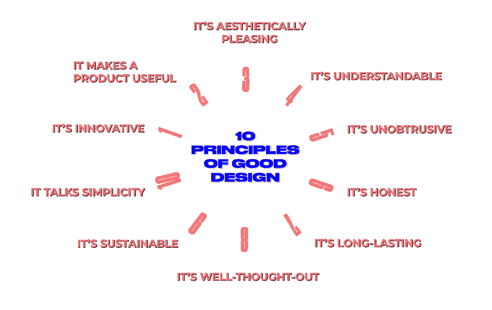
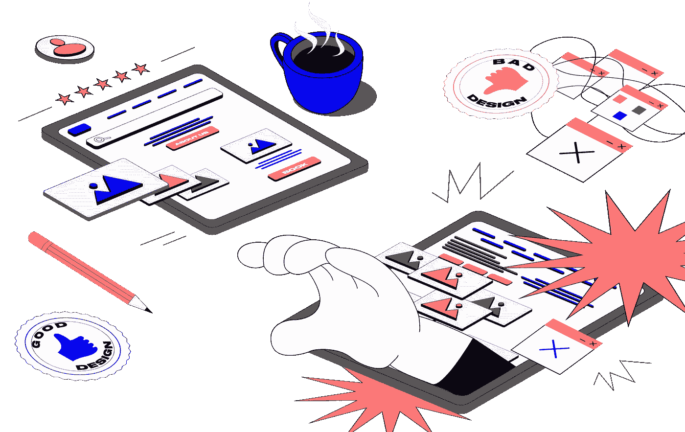
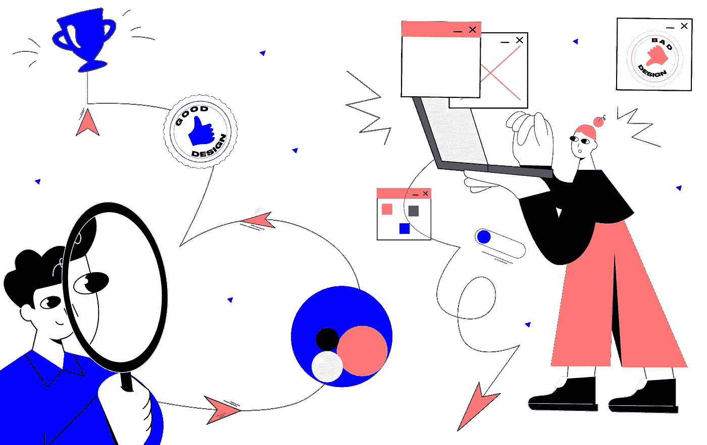
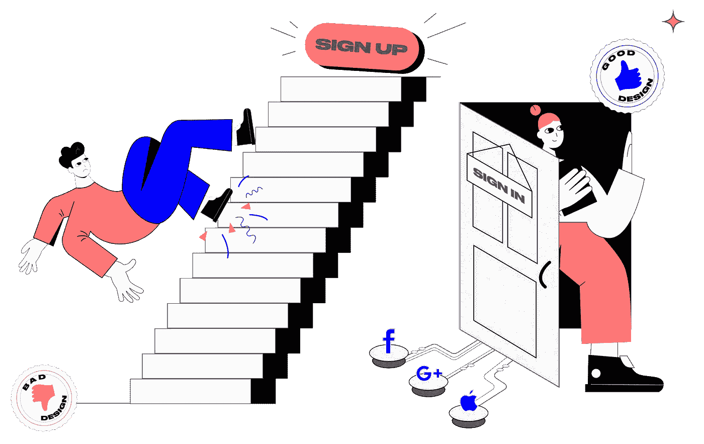
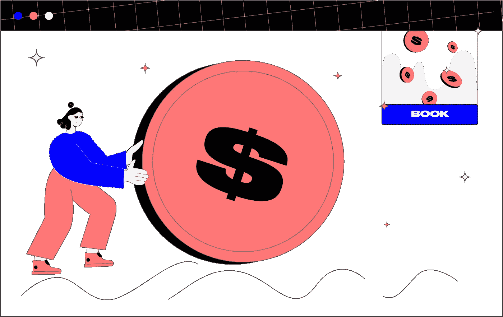

# 好的设计与坏的设计:看区别

> 原文：<https://medium.com/geekculture/good-design-vs-bad-design-see-the-difference-ecfa9ab17bc4?source=collection_archive---------1----------------------->

什么是好的设计？漂亮吗？创新？或者说，功能性？

根据迪特·拉姆斯的说法，以上都有。

迪特·拉姆斯是一位德国工业设计师，他对利基市场产生了深远的影响。他在博朗担任了 30 多年的设计主管，因此他们的大多数产品之所以成为标志性产品，很大程度上是因为 Rams 的远见卓识。基于他的经验，迪特·拉姆斯概述了优秀设计的 10 个原则。

虽然迪特·拉姆斯专门从事消费品设计，但看到他的愿景在现代网站和应用程序中的应用还是很有趣的。他基本上建立了我们现在都遵循的少而精的设计方法。

在这篇文章中，我们不会谈论设计的美学方面——品味不同。相反，我们将[关注它的实用性](https://cxdojo.com/how-to-design-digital-products)——迪特·拉姆斯强调的核心设计特征之一。毕竟，*“设计应该帮助人们。这就是它的作用。”*

# 如何分辨好的设计和坏的设计？

有时，数字产品设计师忽略了上述基本原则，将注意力转移到构建完全不同的、时尚的和艺术的东西上。结果，他们最终得到了一个没人想用的产品。为什么这样——因为*“产品必须以一种易于理解的方式来设计。”当然，这并不意味着设计师应该忽视它的视觉吸引力。好的设计是关于创造美学上复杂的、功能性的和直观的界面。在评估产品设计时，我们始终牢记这一点，我们建议您也这样做。*

作为一家数字产品设计和开发公司，CXDojo 有机会参与许多项目。其中很多都涉及到重新设计的工作。每次我们为客户进行另一次 UX 审计时，我们都会发现同样的设计缺陷。这就是我们编写这本“好设计与坏设计”指南的动机。

我们将考虑好的网页设计和坏的网页设计的例子，这些例子在大多数网站的重要用户交互中是相似的。

## 初诊

第一印象很重要。在人际关系中，它帮助我们对第一次遇到的人做出判断，并决定我们是否愿意保持联系。对一个品牌来说也是如此。但在商业关系的情况下，它决定了一个随机的访问者是否会转化为客户并带来收入。你只有 7 秒钟的时间让第一次用户互动变得积极。

在这个阶段，用户只是浏览页面，并不会深入探索你的服务。这是他们熟悉这个品牌并决定你的网站或应用是否值得信任的时候。他们在寻找某些能证明你是真实的锚。但是什么让一个公司在用户眼中是真实的呢？

*   **公司相关信息。**说说你是怎么开始的，你的价值观是什么，你的使命是什么。让用户听到你的声音，如果你的声音像人，而不是塞满关键词，那就更好了。首先，你讲述你的故事是为了打动用户，而不是谷歌。这样，你对潜在客户表现出尊重，因此，有机会赢得他们的心。
*   **团队。**这是你公司的门面，所以一定要添加你团队成员的真实照片。避免使用库存图片。这不仅仅是一个糟糕设计的例子，在这个几乎每个人都有手机并能拍出质量不错的照片的时代，这是不可接受的。不要担心这样的照片可能看起来不那么时尚和精致——相反，它们使你的品牌人性化，并使它更接近用户。为了进一步加强这种情感纽带，包括你的团队和你的公司的社交档案的链接，这样用户可以更好地联系你的品牌。
*   **评论。**用户生成的内容反映了经过验证的客户的透明意见、照片和评级。这不仅证明了你的公司是真实的，也影响了网站首次访问者的购买决定。一个好的网站设计实践是让在你的网站上留下评论成为可能，或者从外部评论平台如 Google Business、Trustpilot、Yelp，或者像 Tripadvisor 这样的小众评论平台上获取评论。确保展示不同的评论——积极的，中立的，甚至是消极的。虽然这看起来似乎违反直觉，但它确实可以增强用户的信任。观点不同，这完全没关系。
*   **联系人。**轻松获取联系人使公司在用户眼中变得合法。说明你在乎。假设用户找不到必要的信息，面临一个独特的问题，或者只是不知道他们旅程的下一站是哪里。再好的设计也无法对所有非标准的用户场景做出规定。在这种情况下，沟通渠道，如机器人，电话，或常见问题解答部分可以覆盖你。然而，避免太多的干扰——不要一次把这些信息塞满每一页。它不应该分散用户执行主要目标动作的注意力，但它应该在手边，以防任何微小的挑战出现。

## 搜索

搜索栏将网站访问者以最快的速度带到他们想去的地方。事实上，它是界面中使用最多的元素，这意味着访问者将它视为执行目标操作的助手。如果你不帮助用户快速获得他们想要的东西，他们就会永远离开你。所以你不能忽视搜索栏的设计。

想象一下下面的情况。你登陆了一个网站，浏览了它的主页，并决定深入研究。你对这个界面还很陌生，不太确定从哪里可以了解某些产品或服务的信息。您正在搜索字段中输入一个查询，试图找到想要的目的地。但是你得到的只是一个空白的错误页面。

是因为一个糟糕的查询还是糟糕的设计？—肯定是后者。

如果你想获得转化，而不是搅动，你必须坚持一个黄金法则。在设计数字体验时，让用户感觉他们总是在旅程中前进是至关重要的。不要让用户后退一步，因为这必然会导致挫败感。以下是一些让用户的搜索体验变得轻松的技巧:

*   **工具提示。**在与搜索栏互动时，当人们得到一些提示时，例如热门或类似的搜索查询、类别、产品、相关商品和服务、关键字等，他们会很感激。以下拉列表的形式呈现它们，但是避免让它们太长，因为用户很容易分心。
*   **滤镜。**您可以实施基本过滤器或高级过滤器，这取决于您提供的服务或产品。让用户自定义他们认为合适的查询。这将有助于他们快速找到他们想要的东西，并通过点击与你的公司达成交易。如果你有各种不同参数的商品和服务，这是一个双赢的局面。如果不是，忽略这个提示。用户界面的每一个元素都应该有一个存在的理由，超越它从来都不是一个好主意。
*   **建议。不成功的搜索结果是不可避免的，但是如果你的网站有一个好的 UX 设计，它们也会很吸引人。为用户提供备选方案——例如，类似的产品建议或者至少是下一步该怎么做的说明——但不要有空白页。另一种有效的方法是使用与上下文相关的动画来补偿搜索结果不成功所带来的失望。你的目标是让用户尽可能长时间停留在网站上，并让他们更接近转化目标。**
*   **响应和支持。**除了搜索结果页面上的建议或说明之外，您还可以添加一个选项来在线联系客户支持代表，他们将全天候为您提供帮助。此外，通过通知、提示或[动画微交互](https://cxdojo.com/motion-design-how-to-win-hearts-minds-of-your-users)的方式，让你的界面对成功或不成功的用户操作做出响应。

## 登记

90%的网站为用户提供注册账户的机会。这是因为注册充当了通向大量用户数据的门户，这些数据可以进一步用于个性化您提供的内容，并有效地将用户推向您的销售漏斗。虽然注册现在很普遍，但许多网站仍然无法以正确的方式进行注册。糟糕的注册表单设计会导致跳出率增加。

注册表单有许多用途。对于一些公司来说，只要求用户的电子邮件就足够了，而其他公司可能需要额外的信息来微调他们的服务以满足用户的需求。因此，为银行网站设计表单的方法可能不同于为在线杂志设计表单的方法。然而，用户仍然不愿意填写表格，因为这需要时间和个人信息。此外，他们对以这种形式留下电子邮件持谨慎态度，因为他们认为会受到垃圾邮件的轰炸。那么如何说服用户注册呢？

*   **给值。**向用户展示注册的好处会比潜在的不适更切实。让他们知道他们将获得高级功能、独家优惠或免费奖励。如今它仍然有效。
*   **保持简单。**在注册表单中包含尽可能少的字段，并删除所有可选字段。如果做某事是可选的，用户永远不会去做。您可以通过让用户填写个人资料或从分析中获得见解来收集更多信息。
*   **允许社交。**现在，全球近 60%的人使用社交媒体。能够注册谷歌帐户、苹果 ID 或任何社交档案将使用户更容易与网站互动，并为用户节省时间。
*   **分步骤。如果不可能减少字段的数量，你仍然可以通过将表单分成几个步骤来最小化表单。在填写过程中通知用户他们的进度是很重要的。例如，您可以知道还剩多少步骤和多少时间，或者添加一个进度条来显示正在进行的过程的状态。这给用户一种情感上的满足感。**
*   **优化流程。如果有什么事情你可以自动化，那就去做吧。例如，您可以通过自动填写某些信息(如地理位置、首选语言等)来帮助用户完成表单。另外，确保表单自动保存输入的信息。否则，如果页面被刷新，用户将不得不一次又一次地重新填充它。很沮丧，对吧？**

*注意！好的用户界面设计说明了思维模式。例如，人们习惯于在视觉上熟悉的地方看到注册按钮，即在标题的右上角。所以确保它位于那里。这样，用户不必花费额外的时间来搜索期望的功能，并且可以立即继续执行目标动作。此外，使注册功能可从您网站的任何页面访问。*

## 订阅时事通讯

时事通讯是一种吸引用户的好方法，而你在他们与网站早期互动的过程中没能吸引到他们。有了它，您可以开展有关产品发布、特别促销和重要公司更新的活动。但通常，说服用户订阅时事通讯比说服他们注册更具挑战性。而且很容易知道为什么。

用户觉得订阅形式最讨厌的是什么？它通常太具侵扰性。它到处弹出，覆盖页面，分散浏览网站的注意力。因此，它激发的唯一愿望就是永远不要订阅那个网站。

如果你的企业在收入或营销方面严重依赖订阅，遵循下面的提示来确定它的设计。

*   **等等。**大多数访问者对你的网站不熟悉，他们对网站内容一无所知。不要在他们登陆你的网站的那一刻就把订阅盒吐在他们面前。让他们先探索一段时间，以把握价值。
*   **一次就够了。**人们已经厌倦了弹出窗口，为什么还要激怒他们呢？除非你的策略是激怒用户让他们投降，否则不要多次显示订阅弹出窗口。一次就够了，但是要确保有一个弹出的副本告诉用户以后在哪里可以找到订阅功能。这可以是页眉或页脚中的按钮，也可以是配置文件设置中的一个部分。
*   **要透明。如果你尊重用户的时间和消费他们想要的信息的权利，他们会很感激。在他们订阅之前，让他们知道你要发送什么类型的内容以及发送的频率。此外，通知用户可以随时取消订阅，以及如何取消订阅。**
*   **给用户控制权。**一个好的解决方案是允许用户为时事通讯选择感兴趣的主题。首先，它使内容个性化；其次，它增加了用户参与度，从而提高了转化率。

很长一段时间，设计师们一直使用侧边栏来定位广告、横幅，当然还有订阅表单。它起作用了——但是在很久以前。这是一个糟糕的设计例子。随着时间的推移，用户已经学会忽略这个区域，因为它包含了不相关的信息。这种现象被称为“边栏盲”。所以最好避免在那里添加订阅表单。

## 购买

在这里，我们有它——所有商业网站创建的服务的转换目标。撇开利他主义不谈，企业是为了赚钱而创建的，一个好的网站设计可以为此做出贡献。在这个阶段，即使是一个小的设计缺陷也会导致巨大的损失。

你知道旅游网站 Expedia 吗？他们必须亲自了解一个糟糕的网站设计的成本。

通过分析，该公司的[专家意识到](https://www.zdnet.com/article/expedia-on-how-one-extra-data-field-can-cost-12m/)他们需要重新考虑结账表单的设计。不知何故，许多点击购买按钮的客户从未完成订单。当他们开始挖掘原因时，发现有一个领域误导了许多用户。该表单有可选字段“公司”,客户认为该字段需要他们的银行名称。输入之后，他们继续输入下一个字段，即“地址”。凭直觉，他们输入了银行地址——而实际上，这必须是他们的家庭地址。结果，由于地址错误，信用卡验证过程失败。在 Expedia 删除该字段后，他们的年收入增加了 1200 万美元！

你能从 Expedia 的案例中学到什么？

*   再一次，**去掉表单中所有可选的字段**。它们不仅需要额外的填充时间，还会导致用户流失。保持最少的字段数量。毕竟用户完成订单越快越好。
*   **添加字段提示。**向用户提供线索或说明，让他们了解现场角色。您可以将上下文帮助实现为字段下方的文本或弹出窗口。
*   **A/B 测试。如果您对您的采购单是否有效有疑问，请务必核实。通过 A/B 测试，您可以用真实用户检查两个或更多的表单变体，然后相互比较它们的性能。**

设计结账体验还有另一个要点。始终考虑多个用户的购买过程。理想情况下，您的客户应该有机会从您网站的任何页面进行订购——无论是通过粘性标题、横幅还是上下文 CTA 按钮。

# 好的设计=好的用户体验

牢记拉姆斯的原则和上述优秀 UX 设计的例子，我们可以得出以下设计数字产品体验的最佳实践:

1.  一个好的网页设计过程始于用户研究。产品是为用户创造的；而如果你不了解用户和他们生活的现实，你就无法设计出一个能改善他们生活的产品。设计围绕着用户的需求和他们想通过你的产品达到的目标。
2.  任何东西都不应该阻碍用户的产品之旅。它应该有一个清晰的信息架构和不言自明的特性。在界面中导航不需要用户额外的思考。所以，如果你认为在设计产品的时候有些东西是显而易见的，那就重新思考并优化它(*还记得 Expedia 的案例吗？)*
3.  产品设计中的任何元素都应该有其存在的理由，而不仅仅是为了美观或因为拥有它很好。如果它不能帮助用户实现他们的目标，它就是一个不必要的额外负担，会对用户体验产生负面影响。摆脱它。
4.  好的网站设计促进了与产品的互动。不要忽视常规的设计模式和可识别的接口对象。如果用户能直观地推断出每一步该做什么，他们就会喜欢与你的产品互动。
5.  客户忠诚度的关键是信任。通过与用户互动向他们展示你的关心——例如，回复他们的询问，引导他们克服潜在的瓶颈，庆祝他们的成就，奖励他们的努力。对你的团队、活动、目标等保持透明。
6.  毕竟，人们为什么要购买产品或服务？—使用它们。他们希望使用的过程是平稳的，符合目的。这是良好用户体验的基础，因此也是良好设计的基础。记住这一点，你能自信地断言你的网站设计是好的吗？