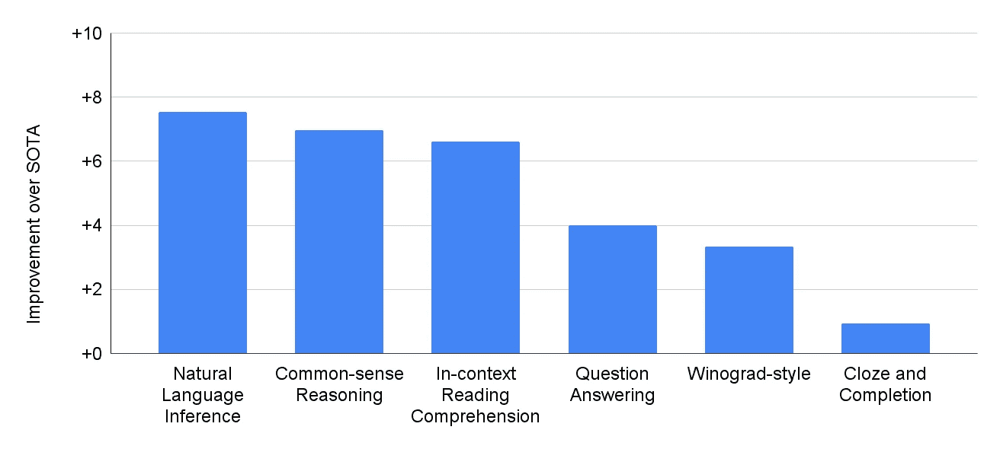
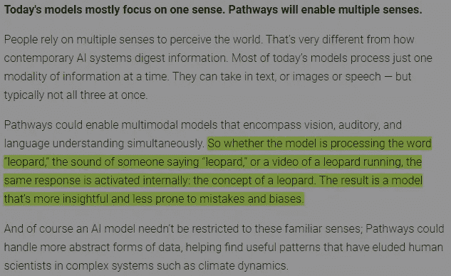
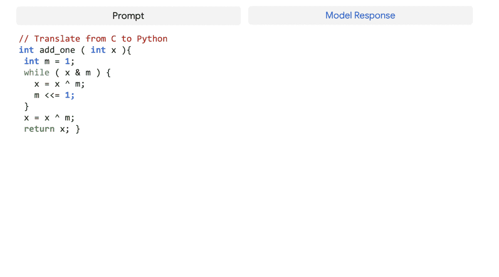

# 谷歌人工智能引发了机器学习的革命。

> 原文：<https://medium.com/geekculture/google-ai-sparks-a-revolution-in-machine-learning-403f4dbf3e70?source=collection_archive---------0----------------------->

## 他们的新方法以部分激活和多任务训练为特色。你不想错过这个。

除非你生活在岩石下，否则你一定知道谷歌的通路语言模型(PaLM)，“*一个 5400 亿参数、密集的解码器——只有* [*变压器*](https://ai.googleblog.com/2017/08/transformer-novel-neural-network.html) *模型和* [*通路系统*](https://arxiv.org/abs/2203.12533) ”。人们对团队能够开发的功能感到疯狂。在网上广为人知的一个例子是 PaLMs 解释笑话的能力

This was something I even mentioned in my article [The Truth Behind Google’s Machine Learning Research](https://medium.datadriveninvestor.com/the-truth-behind-googles-machine-learning-research-9892021d24f2)

这种解释笑话的能力表明，手掌模型对意思和句子结构以及单词之间的关系有更深的理解。如果我不得不猜测，这是由注意力机制和模型本身的规模造成的。然而，我想把重点放在一些没有得到太多关注的东西上- **路径**，**使这成为可能的底层架构。**

这不会是一篇标准的文章，讨论模型的细节。相反，我将介绍使这个架构如此有趣的设计选择。其中一些非常独特，可能会在未来几十年的人工智能领域产生巨大影响。为了理解这一点，让我们了解一下令人惊讶的 Pathways 系统，它在文章[介绍 Pathways:下一代人工智能架构](https://blog.google/technology/ai/introducing-pathways-next-generation-ai-architecture/)中首次亮相。

# 为什么路径是一场革命。

在围绕 PaLM 的所有宣传中，人们没有花足够的时间来理解谷歌的途径。但是，当你深入了解它的时候，你会发现它不亚于一场革命。我没有夸张。

Regular readers know that I don’t use clickbait or hype. The article referred to, [Machine Learning for the Metaverse. Why Meta’s AI Lab is so random.](/geekculture/machine-learning-for-the-metaverse-why-metas-ai-lab-is-so-random-42975ab28a26)

基础设施的灵感来自我们的大脑。我知道每个神经网络都这么说，但这个比其他的更接近。怎么会？回想一下我们的大脑是如何工作的。我们有一吨的神经元，有几万亿条潜在的线路。当我们学习某些技能时，神经元一起放电并建立某些通路。这些途径随着我们的练习而固化。下一次我们使用这种技能时，我们的路径会启动，让我们记住这种技能。

谷歌的研究人员做了类似的事情。他们建立了一个巨大的模型，里面有大量的神经元和连接。他们训练一个模特完成多项任务。他们实现了稀疏激活以节省资源。很难对结果提出异议。

Keep in mind, that the y-axis is improvement over SOTA (State of the Art). This is all one model. Insane

与现在进行机器学习的方式相比，这些实施决策并不常见。谷歌的研究人员提出了许多观点，说明为什么他们的方法比现在正在做的更好。让我们涵盖这些，并谈论它们如何为当前围绕深度学习的话语添加另一个维度。要做到这一点，让我们首先列出是什么让路径更接近我们自己的学习方式。

# 路径如何从神经科学中获得灵感

有几个设计选择，使路径基础设施更接近我们自己的想法。大的包括

1.  多任务训练——Pathways 不是为一个任务训练一个模型，而是训练一个模型做多件事情。不转移到多个任务。直接做。比如我们如何学会在同一时间内做多件事。
2.  使用多种感官-你的输入是什么？视频，文字，声音，二进制…？为什么不是以上所有的。想想我们的大脑每天是如何结合多种感官的。
3.  稀疏激活-训练大型模型是昂贵的，因为你必须传播通过所有这些参数。如果对于一个特定的任务，你只使用了网络的一小部分来训练和运行。我们不会把所有的心思都用在所有的任务上。写作和跳舞使用不同的神经元。

让我们更详细地探讨这一点。

# 多任务训练

在正常的机器学习中，我们采用一种模型架构，并从头开始训练它，以教会它我们的特定任务。但谷歌的研究人员就像急躁的青少年，害怕被视为正常人。他们努力表现自己的个性。

> 路径将使我们能够训练一个单一的模型去做成千上万的事情

-来自路径介绍文章。

相反，他们在许多不同的任务上训练同一个模型。同样的型号。不一样的架构。一模一样的型号。想象一下，如果我训练我正在研究的模型来检测帕金森病，同时预测供应商风险得分(我在 ForeOptics 的工作)。

这背后的逻辑是什么？我们举个简单的例子。我们知道克里斯蒂亚诺罗纳尔多踢足球。作为一个天生的怪胎，他非常重视自己的身体状况。因此，当涉及到像跑和跳这样的活动时，他会比你的普通乔好得多，尽管这不是他的重点。在我的高级读者中，这可能会敲响一些警钟。你有一个问题-

# 路径培训与迁移学习有何不同

[迁移学习](https://www.youtube.com/watch?v=XJYUBY0QBOI&ab_channel=Devansh%3AMachineLearningMadeSimple)是这样一种实践，即采用在一般任务上训练过的大型模型，然后使用从中获得的见解在相关示例上训练相关模型。这个想法是来自相关任务的知识将“延续”到我们的新任务中。在我们之前的例子中，罗纳尔多的足球训练使他也成为一名优秀的跑步运动员。

A visualization of the Pathways architecture. We have a many tasks all being taught to the same model.

Pathways 是不同的，因为他们把这个带到了下一个层次。当他们说成千上万的事情时，他们是认真的。Pathways 是针对几乎完全互不相关的任务进行训练的。这就像在罗纳尔多准备踢足球的时候，教他微分方程，同时也训练他成为一名考古学家。这更接近于 AGI，也是让手掌模型对意义和语言有了更深刻理解的原因。它也更接近我们学习的方式。

Examples that showcase PaLM 540B 1-shot performance on BIG-bench tasks: labeling cause and effect, conceptual understanding, guessing movies from emoji, and finding synonyms and counterfactuals.

# 多重感官

感官是我们感知世界的方式。这在机器学习中经常被忽略(特别是如果你像我一样主要是一个统计分析师)，但是感觉确实决定了你的输入。将机器学习研究转化为工作解决方案的最大挑战之一是将输入数据转化为可以分析的有价值的信息。预处理是一件大事。[这就是为什么人们说 ML 大多是数据清洗和预处理](https://www.youtube.com/watch?v=O187gv9rwzQ&t=721s&ab_channel=Devansh%3AMachineLearningMadeSimple)的原因。

出于人工智能的目的，每个数据源都可以被视为一种感觉。大多数 ML 应用程序使用有限的资源，通常只处理一种数据(NLP、计算机视觉、行为等)。正如你在下面的文章中看到的，路径不会这样做。

Adding in more sources to reduce error is something I’ve been saying for a long time. Way before it was fashionable. I’m glad to see that people are finally acknowledging it.

这模仿了我们与世界互动的方式。我们通过使用我们的身体(触觉、味觉、嗅觉等)与物体互动来学习。)和精神(创造模型、理论、抽象)感官。整合更多的感官要困难得多，但回报是值得的。正如论文“ [**在机器学习基准测试中考虑方差**](https://arxiv.org/abs/2103.03098) ”向我们展示的那样，增加更多的方差来源可以提高估计量。你可以在这里阅读[我的论文分解](/mlearning-ai/why-you-need-to-spend-more-time-evaluating-your-machine-learning-models-e1e3258fe7d)，或者观看 YouTube 视频下面的[快速解释](https://www.youtube.com/watch?v=S9lLdSUyKbc&ab_channel=Devansh%3AMachineLearningMadeSimple)。不管怎样，不要错过这篇论文。

# 稀疏激活

这可能是整篇论文中我最感兴趣的想法。要理解这为什么如此酷，回想一下神经网络是如何工作的。当我们训练它们时，输入流过所有的神经元，向前和向后都是如此。这就是为什么给神经网络增加更多的参数会成倍地增加成本。

Watch the [Neural Networks series by 3Blue1Brown](https://www.youtube.com/watch?v=aircAruvnKk&ab_channel=3Blue1Brown) for a more thorough explanation.

如果你不知道神经网络是如何工作的，可以看看 2022 年的文章[如何学习机器学习。它深入介绍了如何以正确的方式学习机器学习的一步一步的计划。课程计划使用免费资源，不用倾家荡产就能学会。现在让我们来看看为什么稀疏激活是一个潜在的游戏规则改变者。](/geekculture/how-to-learn-machine-learning-in-2022-9ef2ea904986)

向我们的网络中添加更多的神经元允许我们的模型从更复杂的数据中学习(如来自多项任务的数据和来自多种感官的数据)。然而，这增加了大量的计算开销。

PaLM also translates code. They really made their model do everything.

稀疏激活允许一个两全其美的场景。添加大量参数考虑到了我们的计算能力。PaLM 确实有 5400 亿个参数。然而，对于任何给定的任务，只有一部分网络被激活。这使得网络能够学习并擅长多种任务，而不需要花费太多成本。

Turns out that Millions of Years of Evolutionary Algorithms are much better at learning than minute algorithms created 20 years ago. Who would have thought?

这个概念让我想起了一个更现代的 T2 专家混合学习协议。我们不是破译哪个专家能最好地处理任务，而是将任务路由到处理它最好的神经网络部分。这类似于我们的大脑，大脑的不同部分擅长不同的事情。

稀疏激活是这样一个欺骗代码，它提供了更便宜的训练，同时给出了相同的性能。看看这段引自 Pathways 的文章-

> 例如，GShard 和 Switch Transformer 是我们有史以来创建的两个最大的机器学习模型，但因为它们都使用稀疏激活，所以它们的[消耗的能量不到你对类似大小的密集模型的预期的 1/10](https://blog.google/technology/ai/minimizing-carbon-footprint/)——同时与密集模型一样准确。

这一点在 PaLM 模型中得到了体现。添加更多的参数可以在应对挑战时获得更大的能力。推断给定任务的性质，训练它，并准备好处理它都是昂贵的程序。稀疏激活允许模型更好地处理这一切。

A pretty nifty visualization of the increase in capabilities upon adding more parameters for the PaLM model.

显然，你现在可以看到 Pathways 将如何在未来十年改变人工智能研究的游戏规则。它将神经科学、机器学习和软件工程的思想与大型语言模型的规模相结合，创造出一些特殊的东西。训练协议将是划时代的，即使人们创造了其他更好的 ML 模型。

本文到此为止。我将以一个有趣的观察来结束。我们可以看到，与逻辑推理相比，PaLM 需要更少的参数来完成代码。大多数 ML 课程/大师教你前者而不解释后者。这是在为失败做准备。看看我收到的以下信息-

The reason I stress the basics is that they will never be replaced. Subscribe to my newsletter, to make sure you don’t miss out on the foundational skills. Details below.

为了帮助我写更好的文章和了解你[填写这份调查(匿名)](https://forms.gle/7MfQmKhEhyBTMDUD7)。最多花 3 分钟，让我提高工作质量。请务必使用我的社交媒体链接来获得更多反馈。所有反馈都有助于我提高。

对于机器学习来说，软件工程的基础至关重要。它将帮助你概念化，建立和优化你的 ML。我的每日时事通讯，[编码采访变得简单](https://codinginterviewsmadesimple.substack.com/)涵盖了算法设计、数学、最近的科技事件、软件工程等主题，让你成为更好的开发者。 [**我目前正在进行全年八折优惠，所以一定要去看看。**](https://codinginterviewsmadesimple.substack.com/subscribe?coupon=1e0532f2)

我创建了[编码面试，使用通过指导多人进入顶级科技公司而发现的新技术，使面试变得简单](https://codinginterviewsmadesimple.substack.com/p/faqs-and-about-this-newsletter?r=4tnbw&s=w&utm_campaign=post&utm_medium=web)。时事通讯旨在帮助你成功，避免你在 Leetcode 上浪费时间。[您可以阅读常见问题解答并在此了解更多信息](https://codinginterviewsmadesimple.substack.com/p/faqs-and-about-this-newsletter?r=4tnbw&s=w&utm_campaign=post&utm_medium=web)

如果你也有任何有趣的工作/项目/想法给我，请随时联系我。总是很乐意听你说完。

以下是我的 Venmo 和 Paypal 对我工作的金钱支持。任何数额都值得赞赏，并有很大帮助。捐赠解锁独家内容，如论文分析、特殊代码、咨询和特定辅导:

https://account.venmo.com/u/FNU-Devansh

贝宝:[paypal.me/ISeeThings](https://www.paypal.com/paypalme/ISeeThings)

# 向我伸出手

使用下面的链接查看我的其他内容，了解更多关于辅导的信息，或者只是打个招呼。另外，查看免费的罗宾汉推荐链接。我们都得到一个免费的股票(你不用放任何钱)，对你没有任何风险。所以不使用它就等于失去了免费的钱。

机器学习领域重要更新的免费每周总结(赞助)-【https://lnkd.in/gCFTuivn 

查看我在 Medium 上的其他文章。:【https://rb.gy/zn1aiu 

我的 YouTube:[https://rb.gy/88iwdd](https://rb.gy/88iwdd)

在 LinkedIn 上联系我。我们来连线:[https://rb.gy/m5ok2y](https://rb.gy/f7ltuj)

我的 insta gram:[https://rb.gy/gmvuy9](https://rb.gy/gmvuy9)

我的推特:[https://twitter.com/Machine01776819](https://twitter.com/Machine01776819)

如果你正在准备编码/技术面试:[https://codinginterviewsmadesimple.substack.com/](https://codinginterviewsmadesimple.substack.com/)

获得罗宾汉的免费股票:[https://join.robinhood.com/fnud75](https://join.robinhood.com/fnud75/)