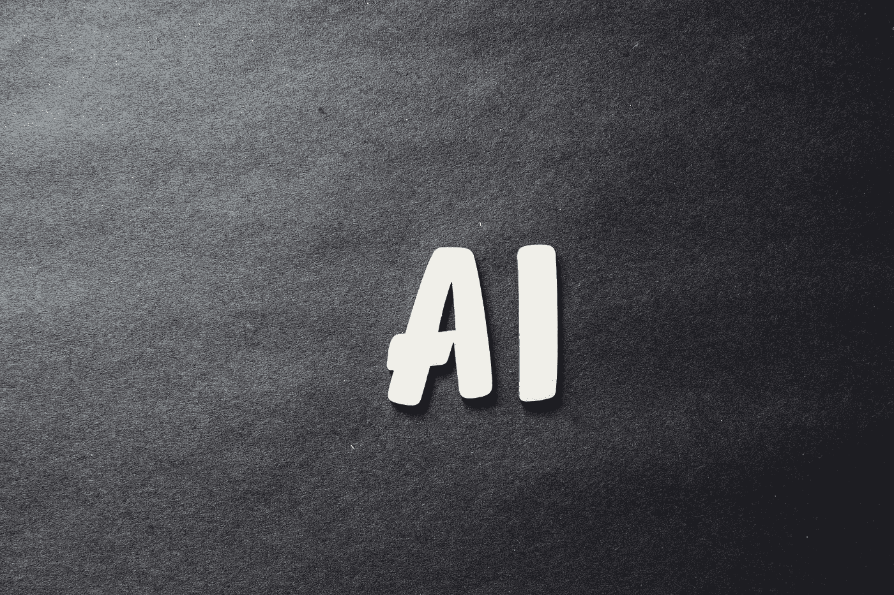

# 《人工智能博士》中 GPT J 对 GPT 3

> 原文：<https://medium.com/geekculture/gpt-j-vs-gpt-3-in-doctor-ai-f4cea26743a4?source=collection_archive---------4----------------------->

## 对我来说，GPT-3 仍然是唯一

Photo by [Markus Spiske](https://unsplash.com/@markusspiske?utm_source=unsplash&utm_medium=referral&utm_content=creditCopyText) on [Unsplash](https://unsplash.com/s/photos/ai?utm_source=unsplash&utm_medium=referral&utm_content=creditCopyText)

在我以前的文章中，我对 OpenAI 的文本生成器 [GPT-3](https://openai.com/api/) 给予了很多赞扬。在我的[医疗聊天机器人 Doctor.ai](/p/8c09af65aabb) 中，我用 GPT-3[将英文转换成 Neo4j 的密码](https://towardsdatascience.com/gpt-3-for-doctor-ai-1396d1cd6fa5)，[将德文、中文、日文翻译成英文](https://javascript.plainenglish.io/can-doctor-ai-understand-german-chinese-and-japanese-gpt-3-answers-ja-%E5%8F%AF%E4%BB%A5-and-%E3%81%84%E3%81%84%E3%82%88-b63b10d67bf4)，从原始文本中提取主谓宾( [1](/geekculture/relationship-extraction-with-gpt-3-bb019dcf41e5) & [2](/p/17a9f7f48b9a) )，以及 [ELI5 复杂的医学概念](/p/a5c2c4580977)。GPT-3 通过统一的 API 擅长于所有这些任务…