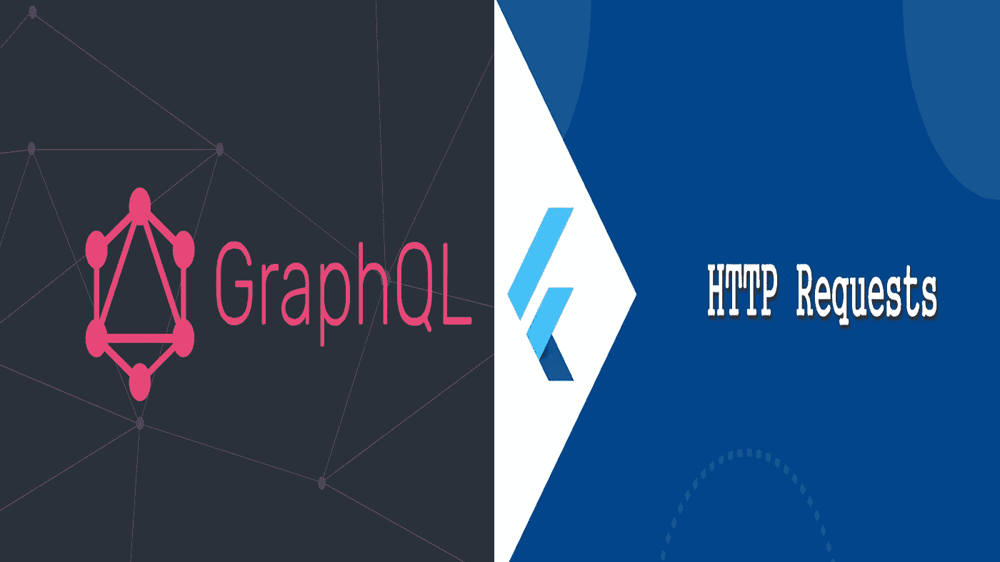

# Flutter 中的 Graphql 和 Http 请求

> 原文：<https://medium.com/geekculture/graphql-http-request-in-flutter-efd634d63d32?source=collection_archive---------18----------------------->



嘿，flutter 开发者们，你们都知道如何在 flutter 中处理 http 请求以将 app 连接到服务器端。但是 10 个 flutter 开发者中只有 **5 个了解 graphql，知道如何在 flutter 中处理 graphql api。因此，本文通过给出如何处理类似 http 请求的 graphql 的简单提示，将对他们有所帮助。**

我将根据子主题讲述 http request(rest)和 graphql，这样您就可以看到 http request 和 graphql 之间的共同点，从而能够在 flutter 中进一步使用 graphql。

> **简介**

**在 http(REST)** 中，资源的形状和大小由服务器决定。**在 GraphQL 中，**服务器声明哪些资源可用，客户端询问当时需要什么。

> **开发工具**

对于 http: [邮递员](https://www.postman.com/)
对于 graphql: [Graphql 游乐场](https://www.electronjs.org/apps/graphql-playground)，[哈苏拉](https://hasura.io/)

> **套餐**

对于 http: [http](https://pub.dev/packages/http)
对于 graph QL:[graph QL _ flutter](https://pub.dev/packages/graphql_flutter)

> **我们如何向服务器发送数据，或者我们用什么来发送数据**

对于 http:我们主要使用 GET & POST
对于 graphql:我们使用查询和变异

http 中的 **Get** 和 graphql 中的 **Query** 作用相同(用于从服务器/api 获取数据)
http 中的 **Post** 和 graphql 中的**变异**作用相同(用于向服务器/api 发送数据)

> **获取和查询(从服务器获取数据)**

我们在 http 中像这样使用 Get:

```
http.get(uri,headers)
```

我们在 graphql 中使用查询，比如:

```
r'''query query_name(parameters){
...
}'''
```

> **添加标题/令牌**

在 http:

```
http.get/post(headers:<token>);
```

在 Graphql 中:

```
**final** AuthLink authLink = AuthLink(
    getToken: () **async** => 'Bearer <YOUR_PERSONAL_ACCESS_TOKEN>'
  );

**final** Link link = authLink.concat(<url>);
```

> **发布和突变(向服务器发送数据)**

我们在 http 中使用 Post，比如:

```
http.post(uri,headers,body)
```

我们在 graphql 中使用突变，比如:

```
r'''mutation mutation_name(parameters){
...
}'''
```

> **发送数据的类型或我们发送数据的方式**

在 http.post()中:

我们以地图的形式发送数据，比如:

```
body:{
  "keys":"values",
  "keys2":"values2",
}
```

在突变(graphql):
它接受 documentnode。所以对于这个，

```
String body=r'''
mutation mutation_name(parameters){
action:...
}''';documnent:gql(body)//gql converts string to documentnode
variables:{
  "parameters_key":"value"
}
```

> **缓存**

在 http 中:我们使用 http 缓存
在 graphql 中:我们使用 graphql 缓存

> **来自 api 的结果**

在 http 中:我们使用 graphql 中的*json . decode(response)* 对 JSON 格式的结果(response)进行解码:我们将结果存储为 *Queryresult*

> **向服务器发送文件**

在 http:我们使用 MultipartRequest
*你可以在这里了解这个*[](https://lakshydeep-14.medium.com/multipartrequest-in-http-for-sending-images-videos-via-post-request-in-flutter-e689a46471ab)*在 graphql:我们使用 MultipartFile*

*这些都是在 flutter 中设置 graphql 概念的常见而简单的方法。这些都只是在我们的概念中设置 graphql 的技巧。稍后我会写一篇关于 flutter 中的 graphql 以及如何在 flutter 中使用 graphql 的文章。但是现在，请接受这里的[的帮助。](https://zino-app.github.io/graphql-flutter/packages/graphql/#graphql-upload)*

*欲了解更多信息，请购买书籍"**让自己成为软件开发人员:让我们深入了解 Flutter & MNCs** " [购买](https://www.amazon.com/dp/B09NNXNT6X/ref=sr_1_1?keywords=make+yourself+the+software&qid=1639582180&sr=8-1)。*

*希望这对你有帮助。
继续编码，继续前进:)
谢谢*