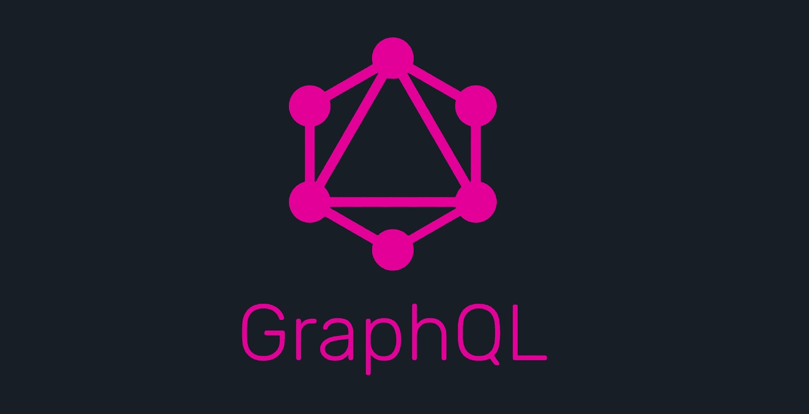

# GraphQL 分页

> 原文：<https://medium.com/geekculture/graphql-pagination-5ef3c46f1836?source=collection_archive---------21----------------------->



# 介绍

GraphQL 中的一个常见用例是覆盖对象集之间的关系。在 GraphQL 中有许多不同的方式可以暴露这些连接，为客户发明者提供一组不断变化的功能。在这篇文章中，我们将深入学习 [GraphQL](https://www.technologiesinindustry4.com/2021/11/graphql-schema.html) 分页。

# 描述

假设我们在 GitHub 协会中有一个托管列表。尽管如此，我们只是想收回其中的许多来显示在我们的 UI 中。从一个大的协会获得一份存管机构的名单可能需要花费一些时间。在 GraphQL 中，我们可以通过向列表字段提供参数来请求分页数据，举例来说，一个参数表示我们正在等待列表中的多少细节。

```
GitHub GraphQL Explorer
query OrganizationForLearningReact {
organization(login: "the-road-to-learn-react") {
name
url
repositories(first: 2) {
edges {
node {
name
}
}
}
}
}
```

第一个参数被传递给 depositories list 字段，该字段指定结果中预期有多少来自列表的细节。查询形状不支持边缘和纽结结构，但它是用 [GraphQL 定义分页数据结构和列表的众多结果之一。](https://www.technologiesinindustry4.com/2021/11/graphql-schema.html)

实际上，它遵循了脸书的 GraphQL 客户 Relay 的接口描述。GitHub 遵循了这种方法，并将其用于自己的 GraphQL 分页 API。稍后，我们将在练习中学习使用 GraphQL 实现分页的其他策略。

在执行查询之后，我们应该在 depositories 字段的列表中看到两个细节。我们仍然需要找出如何计算列表中未来两个存储库的成本。查询的第一个结果是分页列表的第一个运行者，备选查询结果应该是备选运行者。在下文中，我们将观察分页数据的查询结构如何允许我们回收元信息来执行连续的查询。举例来说，每条边都有自己的光标字段来标识它在列表中的位置。

```
GitHub [GraphQL](https://www.technologiesinindustry4.com/2021/11/graphql-schema.html) Explorer
query OrganizationForLearningReact {
organization(login: "the-road-to-learn-react") {
name
url
repositories(first: 2) {
edges {
node {
name
}
cursor
}
}
}
}
```

结果应该和下面的一样:

```
GitHub [GraphQL](https://www.technologiesinindustry4.com/2021/11/graphql-schema.html) Explorer
{
"data": {
"organization": {
"name": "The Road to learn React",
"url": "https://github.com/the-road-to-learn-react",
"repositories": {
"edges": [
{
"node": {
"name": "the-road-to-learn-react"
},
"cursor": "Y3Vyc29yOnYyOpHOA8awSw=="
},
{
"node": {
"name": "hackernews-client"
},
"cursor": "Y3Vyc29yOnYyOpHOBGhimw=="
}
]
}
}
```

分页和边缘

我们可以用多种方式进行分页

*   我们可以像火枪手(第一组第二组)这样的商品来要求列表中的下两个。
*   我们可以做像火枪手[(在$ friendId 之后的前两个)，](https://www.technologiesinindustry4.com/)这样的商品，在我们带来的最后一个朋友之后请求未来的两个。
*   我们可以做像火枪手这样的商品(在$ friendCursor 之后的 first2)，我们从最后一个项目获得一个光标，并使用它来分页。
*   一般来说，我们有一个工厂，基于光标的分页是最重要的设计。尤其是在游标不透明的情况下，可以使用基于游标的分页(通过使游标不透明或基于 ID)来强制执行基于中立或基于 ID 的分页，如果将来分页模型发生变化，使用游标会带来新的不灵活性。作为一个纪念，光标是不透明的，它们的格式不应该被考虑，我们建议 base64 乱码。
*   这给我们带来了一个问题。然而；我们如何从对象中获取光标？我们不希望光标停留在 Stoner 类型上；这是连接的属性，而不是对象的属性。
*   所以我们可能想引入一种新的间接方式；我们的火枪手领域应该给我们一个边的列表，一个边既有光标又有支撑结。

```
{ hero { name friends(first:2) { edges { node { name} cursor}}}}
```

如果有特定于边的信息，而不是特定于某个对象的信息，那么边的概念也被证明是有用的。举例来说，如果我们想在 API 中公开" [fellowship time](https://www.technologiesinindustry4.com/) "，那么将它放在边缘是一个很自然的位置。

更多详情请访问:[https://www . technologiesinindustry 4 . com/2021/12/graph QL-pagination . html](https://www.technologiesinindustry4.com/2021/12/graphql-pagination.html)