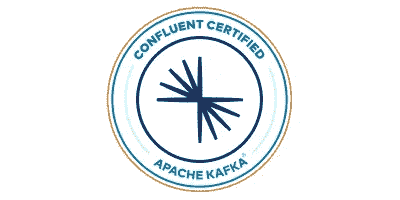

# Apache Kafka 考试融合认证开发者指南

> 原文：<https://medium.com/geekculture/guide-to-confluent-certified-developer-for-apache-kafka-exam-5b38d1bfe007?source=collection_archive---------13----------------------->

我最近通过了 Apache Kafka 认证开发者考试。在这篇文章中，我将分享我的旅程，并为那些有兴趣追求这一认证的人提供指导。

> **你为什么要追求这一认证？**

Apache Kafka 是数据工程领域中使用最广泛的消息传递系统之一。它是由 LinkedIn 开发的，支持设计大规模可扩展的消息系统。如今，它被数千家公司用于高性能数据管道、分析和数据集成。

合流是 LinkedIn 上发明卡夫卡的人组建的。在写这篇文章的时候，对于卡夫卡来说，没有其他的证明像《合流》那样可信。

学习 Kafka 这样的分布式事件流平台的内部结构不仅可以增加个人资料的价值，还可以提供对复杂但功能强大且坚实的平台基础的设计见解。

> **考试考你哪些方面？**

卡夫卡内部

*   经纪人
*   消费者
*   生产者
*   监视
*   交付保证、集群内部、复制概念。

卡夫卡溪流

KSQL 和 ksqlDB

融合模式注册表

融合的卡夫卡连接器

> **你需要以前的经验吗？**

我已经为阿帕奇卡夫卡工作了 3 年多了。在这三年中，我在设置消费者和生产者的同时，密切关注复杂的场景。我对 Spring Kafka、Spring Cloud streams 和 Kafka Streams 等库有着深刻的理解，并使用这些库解决了一些非常复杂的设计挑战。我亲眼目睹了 Kafka 集群是如何设置企业级安全性的。我还解决了我们一些团队面临的一些最棘手的问题。我还在融合模式注册中心和 KSQL 上试用了 POCs。由于我的工作经验，几乎一半的问题，如果不是更多的话，对我来说是小菜一碟。尽管该证书永远无法与你在现实世界的设计和问题上获得的知识相匹配，但你肯定可以获得必要的知识，并通过该证书开始你的卡夫卡之旅，潜在地开启巨大的机会。

> **考题的难易程度如何？**

该考试测试你在概念和情景问题上的知识。基于场景的问题是故意骗人的。例如，我得到了相同的场景(一组代理、一组消费者、一组消费者团体、一组生产者等)，有 10 个不同的问题，需要回答 10 个不同的问题或设计考虑。如果没有亲身经历，这些问题很难猜测。

> 我需要实践多少次？光凭理论知识能过吗？

就我个人而言，至少我会建议尝试以下方法:

*   理解 Kafka 消费者是如何处理提交偏移的。尝试自动提交和手动提交。当尝试手动提交时，尝试并理解同步和异步提交之间的区别。
*   理解消费者群体再平衡在理论上是如何运作的。
*   深入理解消费者属性，尤其是那些规定超时设置的属性，如会话超时和心跳间隔。
*   了解卡夫卡制作人是如何工作的。尝试异步和同步的主题生成模式。
*   了解不同的生产者属性(如 linger.ms、请求超时、最大字节大小等)如何影响低负载和高负载下的异步生产者行为。
*   试用阻塞(同步)生成器。用异步生产者尝试回调。

除了以上所述，请彻底理解以下概念:

*   理解有状态和无状态的流处理。考试抛出了业务场景示例，并要求您识别无状态和有状态案例。
*   理解 Kafka 流中跳跃、滑动、翻滚和会话窗口的区别。围绕这些肯定有一个基本问题。
*   理解一个人可以在 KStreams、KTables 和 GlobalKtables 上做的不同连接，以及产生的输出是什么。
*   非常了解代理内部，如领导者选举、故障转移等。
*   对 Kafka 连接器、融合模式注册表和 KSQL 有很好的理解。关于这些话题的问题较少，大多数问题都可以根据理论知识来回答。
*   理解卡夫卡是如何被调整以实现精确一次语义的。
*   理解关于主题分区数量增加和减少的排序保证。

> 你可以使用哪些资源来涵盖考试主题？

*   **【参考】**阿帕奇卡夫卡和合流的官方文档和合流的博客。这两个网站绝对是信息的金矿，但是从头到尾的研究可能会让人望而生畏。我经常查阅和阅读官方网站/博客的不同部分。为了考试的目的，我把这些当作更多的参考资料。
*   **【书】**《卡夫卡权威指南》，第 2 版。这本书昨天才发行。我很早就从我的奥雷利账户上拿到了这个。可能是学习 Kakfa 内部知识的最好地方。在这上面花足够的时间。
*   **【书】**掌握卡夫卡流和 ksqlDB。在写这篇博客的时候，这本书是由合流免费提供的。我浏览了这本。但是我喜欢对 Kafka streams 和 ksqlDB 的报道。我对 Kafka streams 的处理器 API 和流 DSL 相当熟悉。但是对于对这两个主题没有太多经验的人来说，花点时间在本书讨论的概念上会是个好主意。
*   **【课程】**夏羽·马瑞克的课程《卡夫卡连接与融合图式注册表的 Udemy》。除了很好地理解概念之外，我没有在这两个主题上花太多时间。但是 Udemy 课程涵盖了考试所需的内容。
*   **【模拟考试】**夏羽·马瑞克在 Udemy 上的练习题是一个很好的资源。他在模拟考试中的问题与我在真实考试中遇到的问题非常接近。

> **如何备考，一个看法。**

我一次就通过了考试。我的实践经验和我利用上面的资源准备考试的时间绝对有助于通过考试。但是，造成这种差异的是我在考试前最后 10 天的准备策略。在那几天里，我查阅了大部分文献和课程材料。我开始参加考试，花很多时间在我做错的问题上。然后我只修改那些地方，重复整个循环。这种模拟测试到模拟测试修改的反馈循环，极大地帮助我非常自信地回答了考试中的所有问题。

总之，一个人需要准备考试所涉及的主题，以及如何战胜考试。