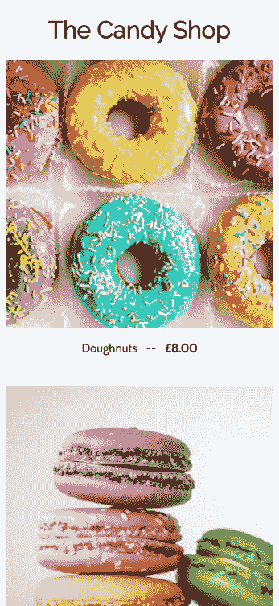
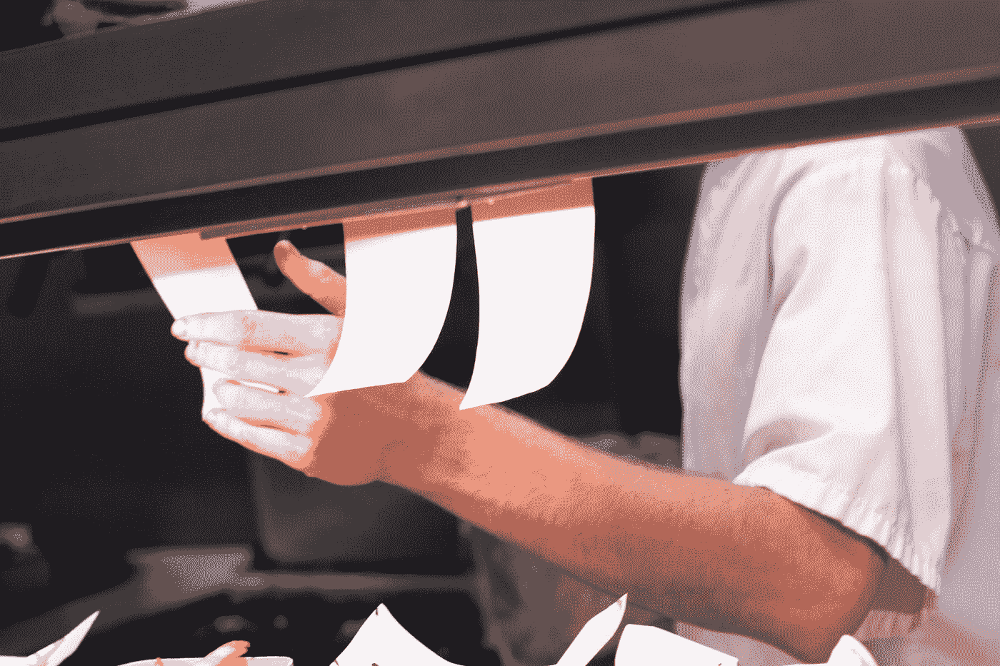

# Headless WooCommerce & Next.js:展示产品和创建订单

> 原文：<https://medium.com/geekculture/headless-woocommerce-next-js-display-products-and-create-orders-593a6c5aee86?source=collection_archive---------4----------------------->


Photo by [Martin Adams](https://unsplash.com/@martinadams?utm_source=medium&utm_medium=referral) on [Unsplash](https://unsplash.com?utm_source=medium&utm_medium=referral)

到目前为止，我们已经从 WooCommerce 获取了我们的产品，并设置了样式组件。接下来是展示这些产品，并向您展示如何创建订单的基础知识。

# 展示您的产品

我们已经获得了一系列产品，我们可以用我们的创造性思维喜欢的任何方式来操纵它们。对于这个项目，主页将是一个简单的菜单页面，您可以在其中滚动浏览可用的产品。

菜单最重要的部分是指出用户想要选择什么产品，所以你需要提取 WooCommerce 产品 ID。

我创建了一个非常简单的、移动优先的显示，方法是创建一个产品卡组件，并使用 CSS Grid 来布局产品。我想包括断点和媒体查询，以创建一个响应应用程序，但我想保持事情简单。

Example of the Product Card component

现在我们有了一个产品卡组件来显示我们的产品，我们可以映射已经获取的产品数组，并使用我们的产品卡组件。

```
{ products.map((product) => { return <ProductCard product={product} key={product.id} />;})}
```

记住，当使用 map 函数时，我们需要传递一个键，我选择了`product.id`作为惟一标识符。

我使用 CSS Grid layout 来管理新返回的数组`ProductCard`，但是你可以做任何你想做的事情！



Screenshot of ProductCards in a CSS Grid. Images were taken from pexels.com

**简单说说图像优化**

在我们继续之前，你们中的一些人可能已经注意到我使用了 Next.js 中的`<Image />` [组件，而不是标准的`` HTML 标签。之所以这样，是因为从 v.10.0.0 开始，](https://nextjs.org/docs/api-reference/next/image) [Next.js 内置了自动图像优化](https://nextjs.org/docs/basic-features/image-optimization)。图片通常占网站权重的很大一部分，所以优化图片会提高页面加载速度和性能。js 默认情况下也延迟加载图像，所以图像只在滚动到视窗中时才加载。



Photo by [Daniel Bradley](https://unsplash.com/@_danbrad?utm_source=medium&utm_medium=referral) on [Unsplash](https://unsplash.com?utm_source=medium&utm_medium=referral)

# 创建订单

你可能想知道为什么我们在用户界面和 UX 几乎没有接触的情况下直接创建订单。现在这样做的原因是向您展示我们可以用最少的数据创建订单。对你们中的一些人来说，这意味着你可以放弃这些教程，用 WooCommerce 开发者文档武装自己，然后自己上路。

电子商务的目标是向人们展示你的产品，让他们向你下订单。有许多脚手架到位，以确保订单到位(例如，浏览产品系列、展示特定产品详情、跟踪和管理购物车商品、轻松结账流程的好方法)。

我们中的许多人本质上都熟悉已经就位的脚手架，有很多东西需要考虑和构建。然而，并不是所有的技术都是必要的。通过一路剥离，您可以看到下订单是多么容易，然后我们可以一层一层地添加，直到您拥有您正在寻找的电子商务体验。

**使用 WooCommerceRestApi**

当我们从 WooCommerce 获取产品时，我们使用了来自他们官方 Javascript SDK 的`WooCommerceRestApi`。我们想再次使用这个客户端向`/orders`端点发出一个`POST`请求。在 [WooCommerce 开发人员文档](https://woocommerce.github.io/woocommerce-rest-api-docs/?javascript#create-an-order)中，您可以看到一个可以传递给端点的`data`对象的例子——它是 WooCommerce 订单对象的子集。

检查文档以查看订单的所有属性，您可能会注意到它们都不是必填字段。没错，您可以传递一个空的 JSON 对象，并且您将能够创建一个新的订单。

毫无信息的新订单显然没有多大意义，但至少你知道你可以根据自己的需要包含尽可能多的信息。如果你不需要帐单地址或送货地址——也许你只需要一个电子邮件地址——那么就不要创建一个获取这些信息的表单。我们很习惯在收银台看到地址表格，但是如果你不需要，那就把它删掉。

在我的例子中，我想向您展示如何向订单中添加一些产品。为了做到这一点，WooCommerce 期待着一系列的`Line Items`。再次检查 [WooCommerce 开发者文档](https://woocommerce.github.io/woocommerce-rest-api-docs/?javascript#order-line-items-properties)中的`Line Items`属性，您会注意到有许多只读字段，但我们可以传递关键字段，如`product_id`、`quantity`和`subtotal`。实际上，当添加一个新的行项目时，你需要做的就是通过`product_id`和`quantity`，WooCommerce 将计算出剩余的数据。

当您更新行项目时，事情会变得有点棘手，但我们可以稍后再回到这一点——如果您正在更新现有行项目的数量，只需在更新后再次检查`subtotal`、`total`和`price`。

Example of a data object to pass into creating WooCommerce order

在我上面的例子中，我还添加了一些额外的字段来显示关于支付方式的信息，以及订单是否已支付。如果您将`set_paid`指定为`true`，那么 WooCommerce 订单状态将被设置为`Processing`。如果您将`set_paid`指定为`false`，那么订单状态将被设置为`Pending payment`。

有了硬编码的数据对象(出于开发目的)，我们现在可以在`/orders`端点上使用带有`POST`方法的`WooCommerceRestApi`客户端。

我已经包含了我们用来初始化`WooCommerceRestApi`的代码。我喜欢把它放在文件的顶部，这样我就可以在`wooCommerceApi.ts`的所有后续函数中访问`api`客户端。

请注意代码中的注释，它提醒我们这些 API 调用必须在服务器端进行，以便访问环境变量。我通过[在 Next.js 中创建一个调用服务器端`createWooCommerceOrder`的自定义 API 端点](https://nextjs.org/docs/api-routes/introduction)来实现这一点。如果出于测试和开发的目的，您宁愿跳过这一步，那么尝试将您的`consumerKey`和`consumerSecret`直接放入`WooCommerceRestApi`配置中，并从前端调用它。(如果您希望我涵盖自定义 API 端点，请告诉我。)

在这个例子中，我将硬编码的`data`对象传递给`createWooCommerceOrder`，并使用临时 dev 按钮调用该函数。

现在，如果你在 Wordpress 站点的 WooCommerce 仪表板上查看订单，你应该会看到你的新订单。你会注意到你可以在 WooCommerce 的仪表盘上手动改变订单状态，同时还有一大堆其他功能。如果您需要在不深入代码的情况下进行任何更改，这是非常有用的。

我们希望建立一个更复杂的电子商务平台，它有一个允许信用卡支付的收银台和一个允许用户查看和管理他们想要的商品的购物车。为了有助于未来的营销，我们希望至少获得客户的姓名、电子邮件和/或电话，以便我们日后联系他们。

第一部分:用 WooCommerce 创建一个本地 WordPress】

[第 2 部分:设置 WooCommerce &测试与邮递员](https://leojbchan.medium.com/headless-woocommerce-next-js-set-up-woocommerce-test-with-postman-5e7859c65626)

[第三部分:设置 Next.js](https://leojbchan.medium.com/headless-woocommerce-next-js-set-up-next-js-b8d2193b2688)

[第 4 部分:用 TypeScript 和 Next.js 设置样式组件](https://leojbchan.medium.com/headless-woocommerce-next-js-set-up-styled-components-with-typescript-and-next-js-18cc047ccd79)

[第 5 部分:展示产品并创建订单](https://leojbchan.medium.com/headless-woocommerce-next-js-display-products-and-create-orders-593a6c5aee86)

[第 6 部分:为状态管理建立 Redux 工具包](https://leojbchan.medium.com/headless-woocommerce-next-js-set-up-redux-toolkit-for-state-management-c605adda58fe)

[第 7 部分:创建购物车](https://leojbchan.medium.com/headless-woocommerce-next-js-create-a-cart-8a3e49b90076)

[第 8 部分:设置条带并创建检验](https://leojbchan.medium.com/headless-woocommerce-next-js-set-up-stripe-and-create-checkout-d01333607a66)