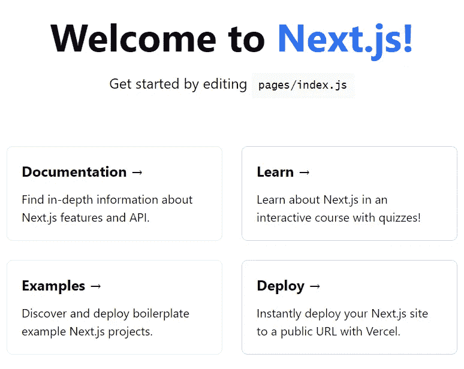

# Headless WooCommerce & Next.js:设置 Next.js

> 原文：<https://medium.com/geekculture/headless-woocommerce-next-js-set-up-next-js-b8d2193b2688?source=collection_archive---------0----------------------->


Photo by [Denys Nevozhai](https://unsplash.com/@dnevozhai?utm_source=medium&utm_medium=referral) on [Unsplash](https://unsplash.com?utm_source=medium&utm_medium=referral)

我选择在这个项目中使用 Next.js，因为它是一个静态站点生成器，也使得处理后端功能变得容易。

默认情况下，Next.js 会预先渲染每个页面以生成 HTML，从而获得更好的性能和 SEO。Next.js 建议在预渲染时使用静态生成，以便在构建时生成 HTML，并在每个请求中重用。

当获取数据时，我们可以使用`getStaticProps`,它在构建时获取数据，如果数据在用户请求之前可用，可以提高性能。我的产品*在构建时就有*可用，但是如果我以后更改了任何细节，该怎么办？`getStaticProps`的巧妙之处在于它不是完全静态的——它有一个`revalidate`特性，允许在预定的时间后重新生成页面。重新生成在后台进行，一旦可用，将提供包含新数据的新页面。

# 设置您的 Next.js 项目

在创建我的 Next.js 项目时，我选择了使用 TypeScript，但是你可以选择你喜欢的。我也使用纱线，但你同样可以使用 npm。

```
yarn create next-app woocommerce-nextjs --typescriptnpx create-next-app woocommerce-nextjs --ts
```

我最近学习了 TypeScript，并试图在我的项目中使用它来熟悉它。有一个由 Academind 制作的很好的 [YouTube 视频，从初学者的角度给出了一个很好的概述。TypeScript 有助于您在开发代码时避免大多数运行时错误，这在您与团队合作时尤其有用，这样其他开发人员就可以明确地了解他们需要使用什么类型，并依靠他们的 IDE 来标记出现的错误。](https://www.youtube.com/watch?v=BwuLxPH8IDs)

一旦设置好，你就可以运行`yarn dev`或`npm run start`来启动你的本地开发服务器，并在`localhost:3000`看到你的网站。您将看到默认的 Next.js 欢迎屏幕。



Screenshot of default Next.js welcome screen

# 从 WooCommerce 获取产品

我们可以也可能应该用虚拟数据设计一些前端组件，然后用动态数据替换。但是，我将直接开始获取数据，这样您就可以看到它是如何完成的，然后在自己实现数据获取之前，可以尽情地进行自己的前端设计。

**创建一个获取函数**

在上一篇文章中，我指出了 WooCommerce REST API 认证对于 HTTP (OAuth 1.0a)和 HTTP **S** (Bearer Auth)是不同的。我们在本地 Wordpress 站点使用 HTTP，所以我们需要 OAuth 1.0a 认证。

最初，我使用`oauth-1.0a`、`crypto`和`axios`库进行 API 调用，但是 WooCommerce 有一个官方的 JavaScript 库[所以我想尝试使用这个。](https://www.npmjs.com/package/@woocommerce/woocommerce-rest-api)

```
yarn add @woocommerce/woocommerce-rest-api --devnpm install --save @woocommerce/woocommerce-rest-api
```

这个包没有自己的类型定义——您可以从 DefinitelyTyped 资源中获得社区创建的类型。

```
yarn add @types/woocommerce__woocommerce-rest-api --devnpm install --save @types/woocommerce__woocommerce-rest-api
```

我们需要做的第一件事是创建一个从 WooCommerce 获取产品的函数。我在根结构中创建了一个`utils`文件夹，并在那里创建了一个文件`wooCommerceApi.ts`来保存我的函数。

你会看到我们需要用密钥凭证初始化`WooCommerceRestApi`。如果你记得的话，你已经从 WooCommerce 设置中获得了消费者密钥和秘密。我想保持密钥和秘密的私密性，避免被人窥探，所以我使用了环境变量。

注意:对于 Next.js，除非添加前缀`NEXT_PUBLIC_`，否则环境变量只在服务器端可用。添加`NEXT_PUBLIC_`(例如`NEXT_PUBLIC_WOOCOMMERCE_KEY`)会将这个环境变量暴露给浏览器，这样您就可以在客户端使用它。然而，暴露给浏览器的环境变量仍然可以被知道如何将秘密留给环境更安全的服务器端的人检索到。

注意:在上面的要点中，我在环境变量的末尾使用了感叹号，只是为了解决一个类型错误，即当必须传递一个字符串时，可能会出现空值。感叹号表示肯定会有值。

**取产品**

现在我们有了一个函数来获取我们需要使用的产品！对于这个例子，我们可以使用`index.tsx`页面，我们现在只想看到产品的控制台日志。

我在介绍中提到了`getStaticProps`，这正是我们将要使用的。我们在`getStaticProps`函数(Next.js 特有的)中进行数据提取，这样提取在构建时进行，结果是一个更快的网站，因为它是预渲染的。

看一下 [Next.js 开发人员文档](https://nextjs.org/docs/basic-features/data-fetching)，了解更多关于它如何处理数据获取的信息。我不会深究它，但您会在下面的要点中看到，我们的数据获取的响应是作为一个对象返回的，这在功能组件本身的 props 中变得可用。

`return ()`中的一切都只是 Next.js 附带的样板代码，是欢迎屏幕。现在这些都没有必要。我们对`getStaticProps`感兴趣。

如果你使用的是普通的 JavaScript 而不是 TypeScript，那么你应该能够看到你在 WooCommerce 中添加的产品的控制台日志。

那些关注我的教程的人会注意到，我已经为 Props 声明了类型接口，并在那里传递了产品的自定义类型定义。你可以通过`any[]`，那会工作得很好，但我想我会试着正确地做它，我在 rrrhys 的这个 [GitHub repo 中找到了 WooCommerce 产品对象的类型定义，我使用了它，并通过与](https://github.com/rrrhys/wootoapp-rewrite/blob/master/app/types/woocommerce.d.ts) [WooCommerce 开发人员文档](https://woocommerce.github.io/woocommerce-rest-api-docs/?javascript#product-properties)的交叉引用对它进行了轻微的更新。

我把它放在我在`utils`文件夹中创建的一个`wooCommerceTypes.ts`文件中。这些都在下面的要点里，但是它很长，可能会让人害怕。

现在并不是所有的都相关，但是大部分有用的类型都在那里，所以都在里面。如果你花点时间梳理每个界面，你会发现它们只是简单地描述了对象和我们所期望的(例如账单地址、订单)。

让我们把这篇文章留在这里，这样在这篇*长*要点之后就没有其他重要的东西了。

[第 1 部分:用 WooCommerce 创建一个本地 WordPress】](https://leojbchan.medium.com/headless-woocommerce-next-js-create-a-local-wordpress-with-woocommerce-4411b24a160e)

[第 2 部分:设置 WooCommerce &测试与邮递员](https://leojbchan.medium.com/headless-woocommerce-next-js-set-up-woocommerce-test-with-postman-5e7859c65626)

[第 3 部分:设置 Next.js](https://leojbchan.medium.com/headless-woocommerce-next-js-set-up-next-js-b8d2193b2688)

[第 4 部分:用 TypeScript 和 Next.js 设置样式组件](https://leojbchan.medium.com/headless-woocommerce-next-js-set-up-styled-components-with-typescript-and-next-js-18cc047ccd79)

[第五部分:展示产品并创建订单](https://leojbchan.medium.com/headless-woocommerce-next-js-display-products-and-create-orders-593a6c5aee86)

[第六部分:建立 Redux 状态管理工具包](https://leojbchan.medium.com/headless-woocommerce-next-js-set-up-redux-toolkit-for-state-management-c605adda58fe)

[第 7 部分:创建购物车](https://leojbchan.medium.com/headless-woocommerce-next-js-create-a-cart-8a3e49b90076)

[第 8 部分:设置条带并创建检验](https://leojbchan.medium.com/headless-woocommerce-next-js-set-up-stripe-and-create-checkout-d01333607a66)