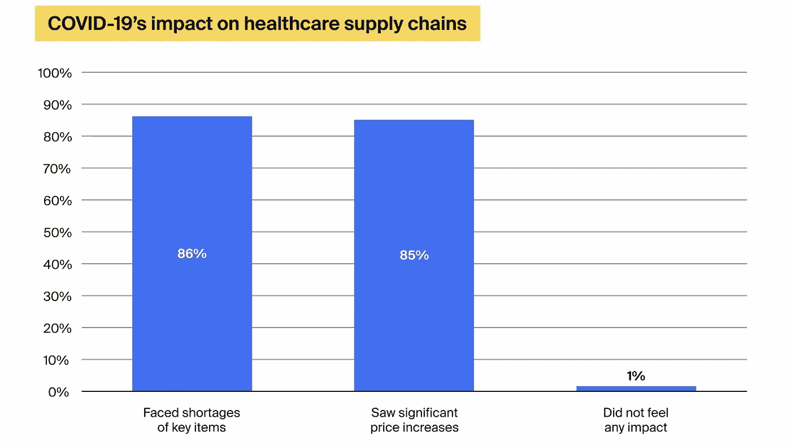
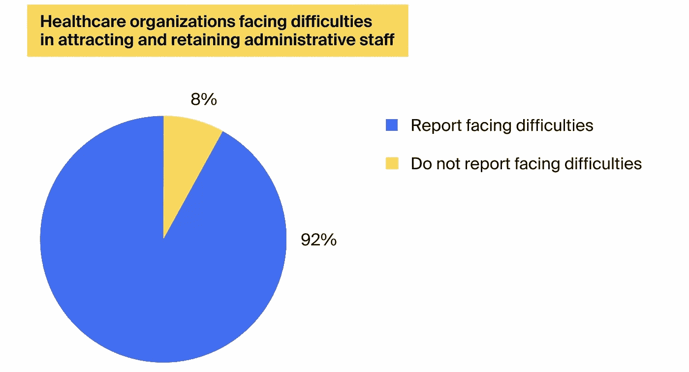
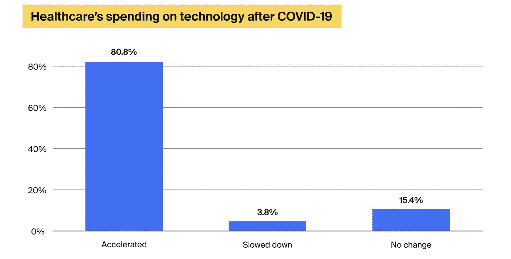

# 医疗供应链问题以及如何用技术解决这些问题

> 原文：<https://medium.com/geekculture/healthcare-supply-chain-issues-and-how-to-solve-them-with-technology-62fc8dc5def6?source=collection_archive---------14----------------------->

40 岁的克里斯托·埃文斯患有进行性神经肌肉疾病，她担心细菌会在硅管内生长，硅管连接着她的气管和将空气泵入肺部的呼吸机。正如她告诉《华盛顿邮报》的记者，在疫情之前，她会进行一次彻底的例行检查。它包括每月更换几次塑料电路以保持无菌。

现在，疫情导致油管所需的硅和塑料短缺，使这些材料更难供应，埃文斯女士每个月只能去一次新的赛道。这意味着，严格来说，她和许多像她一样的病人已经成为供应链中断的牺牲品。估计受影响的人数以千万计。

破坏的规模非常大。根据医疗咨询公司 Kaufman Hall 的数据，自疫情开始以来，86%的美国医院[报告了](https://www.kaufmanhall.com/sites/default/files/2021-10/kh-report-2021-state-of-healthcare-pi.pdf)诸如复杂的供应来源等医疗供应链问题，85%的医院抱怨价格飙升。

虽然在 2022 年，医疗保健行业似乎已经稳步战胜了这种病毒，但新冠肺炎对医疗保健供应链的重大影响(现在因俄罗斯入侵乌克兰而加剧)仍有待解决。需要解决的关键医疗供应链问题包括:

*   关键药品(尤其是治疗急性呼吸道疾病的药品)和个人防护设备的供应有限
*   在采购用于制造药物的材料时遇到的麻烦
*   用于制造医疗设备的贱金属和原材料供应有限
*   由于难以获得氖气和 C4F6 化学物质等稀有物质，导致生产和供应半导体(用于核磁共振成像仪、血压计和其他医疗设备)困难重重
*   原油、天然气、塑料和能源价格上涨导致采购和运营成本激增
*   对全球供应链和作为其中一部分的医疗供应链的了解有限
*   失败的离岸采购和重新设计近岸采购策略的需要

作为经验丰富的[医疗保健解决方案开发供应商](https://itrexgroup.com/services/healthcare-software-development/)，我们 ITRex 认为，现在是医疗保健供应链领导者重新思考其管理战略并开始应对新冠肺炎强调的医疗供应链问题的时候了。我们还相信，技术可以成为那些准备踏上转型之旅的人的强大盟友。

为了帮助您应对变化，我们指出了关键的医疗供应链问题，并重点介绍了有助于克服这些挑战的技术解决方案。

# 2022 年需要解决的关键医疗供应链问题

# 问题 1。不必要的支出主要归因于库存管理不善

医疗供应链中的一个关键问题是不断上升的不必要支出。事实上， [Navigant 对 2127 家美国医院的研究](https://guidehouse.com/news/corporate-news/2019/supply-chain-analysis-2019)发现，供应链运作上的不必要支出已经达到每年约 257 亿美元。这些支出中的很大一部分[【每个设施每年 1100 万美元](https://www.gethealthie.com/blog/guide-to-healthcare-inventory-management-systems)】可以通过优化库存管理来节省。

医院库存管理是一个复杂的过程，涉及预测最佳库存量、跟踪交货、设计适当的存储策略、管理召回和过期产品等。供应链员工通常很难简单地将所需产品提供给患者和医生，更不用说优化流程了。然而，随着最新技术进步的应用，供应链管理人员可以克服医疗供应链中严重的库存管理问题，实现潜在的节约，并阻止运营成本的飙升。

## 解决方案:优化库存管理

技术可以以多种方式解决医疗供应链中的库存管理问题。我们认为，以下两个因素会产生最大的影响:增加库存的可见性，以及引入来自历史库存数据的新见解。

***提高库存可见性***

统计数据和我们客户的经验证明，对于医院工作人员来说，留意库存并确保他们手头有所有需要的物品并不总是容易的。此外，85%的医务工作者声称他们在记录供应品方面有困难，25%的人说他们不总是检查产品过期或召回信息。

有助于解决与库存相关的医疗供应链问题的是，转向更透明、技术支持的库存管理。通过安全的基于云的平台跟踪库存，并引入物联网元素(如信标或传感器)进行实时跟踪，大大提高了库存可见性。它还使供应链员工更容易计算最佳库存量，处理供应商，跟踪交货，并及时将所需物品送到患者和医务人员手中。实时查看库存有助于跟踪交付物品的质量，从而促进合规性以及过期或召回产品的管理。

通过提高库存的可见性，医院可以弥补因库存数据丢失和有缺陷的库存管理实践而造成的部分收入损失。每年，这种收入损失高达 70 亿美元。

***挖掘预测洞察***

通过将技术，特别是人工智能(AI)引入供应链管理组合，医疗保健组织可以使用预测分析产生的见解来克服医疗保健供应链问题，如不明智的决策和有限的库存知识。

例如，人工智能算法可以根据历史需求数据和影响需求的外部因素信息来改善需求预测，优化多个存储位置的库存分配，简化过期和召回产品的管理，等等。

因此，医院可以通过合理确定库存规模和改进采购和存储策略来节省资金。

# 问题 2。供应链人才危机加上单调的手工操作

医疗保健供应链中的另一个严峻挑战是人才危机，医疗保健组织正在努力招聘、培养和留住供应链管理人员。

据麦肯锡公司称，这场危机可以追溯到自疫情开始以来，超过 1590 万人在美国境内搬迁，170 万人提前退休。此外，净移民率下降 1.3%对劳动力供应产生了影响，这种影响将持续下去。

供应链管理专业人员的缺乏因大部分医疗供应链管理仍由人工执行而加剧。根据最近对 100 家医院供应链负责人的调查，将近一半的受访者依赖一些手工工具，比如 Excel 电子表格。

虽然很适合管理较小规模的供应链，但当应用于更复杂的操作时，手动工具速度慢、成本高且容易出错。技术进步所能做的是数字化甚至自动化更大份额的供应链管理操作，从而弥补人才的缺乏，将工人从完成日常任务中解放出来。

## 解决方案:自动化手动操作

除了通过具有跟踪和分析功能的基于云的平台实现供应链管理的基本数字化之外，技术还可以帮助实现部分操作的自动化，让供应链能够以更少的人力运作。正在讨论的技术跨越了区块链、机器人过程自动化(RPA)和[智能过程自动化(IPA)](https://itrexgroup.com/services/intelligent-process-automation/) 。

例如，区块链有可能从根本上改变医疗保健处理合同、价格和交易管理的方式。

反过来，涉及创建、部署和管理模拟某些人类动作的机器人的 RPA 可以接管以下任务:

*   处理订单
*   处理发票和付款
*   监督库存数量
*   阅读和比较供应商报价
*   传达装运状态等

虽然 RPA 用于执行变化最小的重复性任务，但智能流程自动化(结合了 RPA 和人工智能)可以处理更复杂的端到端流程，例如:

*   入围供应商名单
*   评估库存水平
*   解决延期交货和管理召回
*   审查供应商合同

# 问题 3。复杂的供应保证和预测供应短缺的困难

另一个关键的医疗供应链挑战预计将持续到 2022 年，那就是复杂的供应保证。

该行业正在应对医疗商品、设备和基本药物的原发性和继发性短缺。

每当与中断直接相关的产品需求激增时，就会出现初级短缺，如通风相关产品或 COVID 时代的测试用品。

当产品与中断间接相关时，就会发生二次短缺。原材料工厂关闭并影响手术室产品的生产是二次供应短缺的一个例子。

虽然供应链管理工具允许在一定程度上预测初级短缺，但它们不提供次级短缺的可见性。先进技术可以帮助医疗机构更好地理解疫情、地缘政治、运输、劳动力、金融、网络安全和其他因素如何动态影响供应链。

## 解决方案:预测所有层级的供应中断

技术进步可以帮助供应链工作人员更好地理解二级供应层及其以外的风险，并预测供应短缺。

有前途的技术创新跨越基于人工智能的医疗解决方案，这些解决方案可以精确定位在各种中断场景中变得至关重要的产品，然后在广泛的供应商网络中交叉引用同等产品，而没有竞争偏见。其他越来越受欢迎的解决方案是先进的分析和事件监控系统，有助于预测初级和次级供应短缺。

需求感应工具和连接贸易伙伴的工具也有助于解决供应短缺的问题。

应用上述解决方案，供应链专家可以显著提高所有供应层级的可见性，更好地了解潜在风险，并权衡替代供应来源。

# 问题 4:供应链整体缺乏弹性

医疗保健专家指出，当前的医疗保健供应链本质上是被动的。疫情强调了医疗保健组织重新考虑其战略规划和风险预防方法的必要性。

技术可以做的是在战略规划中支持供应链高管，并提供以前无法获得的洞察力。

## 解决方案:考虑风险的前瞻性规划

技术可以改变管理医疗保健产品流动的方式，促进弹性供应链的三个关键方面:

*   **可靠的供应商关系**人工智能算法集成到供应链管理解决方案中，可以帮助确定供应商名单，运行自动化供应商评估，筛选供应商合同，以及通过权衡成本和交付周期来优化供应商管理。
*   **工作流程的透明性**技术有助于实现工作流程的透明性，产品在供应链中被实时跟踪，以及通信的透明性——供应链中的所有节点都可以访问相同的实时信息。
*   **准时制、精益库存管理**利用物联网、人工智能和 RPA 的机会，医疗保健组织可以预测完美的库存量以满足需求，而没有库存过多或缺货的风险，管理交付物品的质量，并设置自动补货以更快更轻松地重新进货。

因此，医疗保健供应链经理可能会制定更加平衡的管理策略并预防风险，而不是对中断做出反应。

# 对医疗供应链进行数字化改造时要记住的事情

在疫情的推动下，医疗保健组织正在加大技术投资。根据最近的一项研究，近 81%的医疗保健机构表示他们将在 2021 年增加技术投资。

然而，为了确保巨额投资获得回报，重要的是要记住采用先进技术——包括人工智能、物联网和 RPA——有其特殊性。我们建议记住以下几个方面:

*   **全公司范围的扩展技术解决方案**

医疗保健供应链是由多个工作流程和人员连接起来的复杂节点组合，推出涵盖所有节点的技术几乎是不可行的。因此，当数字化你的供应链时，我们建议走迭代开发的道路。

比方说，您选择[推出 RPA 解决方案](https://itrexgroup.com/blog/top-rpa-challenges-and-ways-to-overcome-them/)来自动化部分日常运营。首先对您组织的工作流程进行全面分析，确定哪些可以自动化，哪些不可以自动化，并对供应链各环节和工作流程中创造价值的可能性进行优先排序。开始将 RPA 推广到那些具有最高价值创造潜力的细分市场，并加快投资回报。一旦初始解决方案启动并运行，您就可以开始在此基础上构建并进一步发展技术——无论是纵向还是横向。

*   **确保符合相关医疗 IT 法规和标准**

在像医疗保健这样受监管的领域推广技术并不容易。这样做时，确保您的技术合作伙伴对医疗保健系统的复杂性和特殊性有深刻的理解。在实际设计解决方案之前，他们必须彻底研究技术的使用环境，包括组织环境和相关的利益相关群体。

在开发过程中，确保你的技术供应商完整地记录了整个过程——从构思到设计，再到工程和测试你的软件解决方案。这将使与监管机构的沟通变得更加容易。

最后，在公司范围内推广技术之前，考虑进行外部审计，将潜在的合规风险降至最低。

*   **维护 IT 基础设施安全**采用医疗供应链管理技术时，您必须警惕威胁。因此，在开发过程的开始阶段就必须设计一个深思熟虑的网络安全策略，并在整个开发过程中引用它来实现内置安全性。确保为预防、检测和减轻安全风险制定一个行动计划，并考虑运行外部安全审计以获得额外的安全性。

> *如果您想通过对供应链进行数字化改造来解决医疗供应链问题，* [*请联系我们的专家*](https://itrexgroup.com/contact-us/) *。我们将回答您的问题，并计划进一步的步骤。*

*原载于 2022 年 7 月 14 日 https://itrexgroup.com***。**