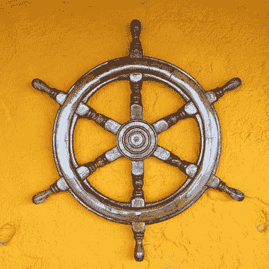

# 舵-海图钩和测试

> 原文：<https://medium.com/geekculture/helm-chart-hooks-and-test-c914ee439341?source=collection_archive---------3----------------------->

## 舵钩配置和舵释放测试


Photo by [Andrew Ridley](https://unsplash.com/@aridley88?utm_source=medium&utm_medium=referral) on [Unsplash](https://unsplash.com?utm_source=medium&utm_medium=referral)

**上一篇:** [**赫尔姆—父子图表间的数据共享**](/gitconnected/helm-data-sharing-between-parent-and-child-chart-c4487a452d4e)

Helm 为我们提供了一个图表机制，允许我们在一个版本的生命周期中的某些点进行干预。例如，我们可以使用钩子来:

●在安装过程中确定任务的优先顺序。例如，在加载图表的任何其他组件之前加载配置映射或秘密。

●在安装/升级新图表或在升级后恢复数据库之前，备份数据库。

钩子文件看起来类似于帮助我们生成 kubernetes 清单的模板文件。除了一些特殊的注释。假设我们想在进行任何其他安装之前加载一个 kubernetes ConfigMap。带有挂钩的模板将如下所示:

```
# mychart/template/hookConfigMap.yamlapiVersion: v1
kind: ConfigMap
metadata:
  creationTimestamp: null
  name: test
  labels:
    app: webserver
    app.kubernetes.io/managed-by: Helm
 **annotations: 
   "helm.sh/hook": pre-install
   "helm.sh/hook-weight": "5"
   "helm.sh/hook-delete-policy": before-hook-creation**
data:
  name: nginx
```

在上面的演示中，定义了一些**注释**。这些注释用于配置舵钩。

让我们在接下来的部分中讨论每个注释的作用:

## helm.sh/hook

`**helm.sh/hook**`注释定义了钩子。在上面的演示中，我们使用了`**pre-install**` 钩子，这意味着 ConfigMap 将在其他安装发生之前加载。

有多种挂钩可供选择:

```
**pre-install** **post-install** **pre-delete** **post-delete****pre-upgrade****post-upgrade** **pre-rollback** **post-rollback****test**
```

上面定义的钩子实际上描述了它的作用。欲了解更多详情，请阅读 helm 官方文档中的本部分[](https://helm.sh/docs/topics/charts_hooks/#the-available-hooks)**。在所有钩子中，我们将在最后部分讨论**【测试】**钩子。**

**如果需要，我们也可以将多个挂钩结合使用:**

```
annotations: 
   "helm.sh/hook": **pre-install, pre-delete, post-rollback**
```

## ****helm.sh/hook-weight****

**可以为一个钩子定义一个权重，这将有助于建立一个确定的执行顺序。使用以下注释定义权重:**

```
**annotations**:
  **"helm.sh/hook-weight":** "5"
```

****吊钩重量可以是正数或负数，但必须用字符串**表示。当 Helm 启动一个特定类型钩子的执行周期时，它会将这些钩子按升序排序。**

**假设我们有两个指定了“预安装”挂钩的不同模板。它们中的每一个都配置有不同的“**钩重”。****

```
# templates/hooks1.yamlannotations:
  "helm.sh/hook": **pre-install**
  "helm.sh/hook-weight": **"-1"** ---
# templates/hooks2.yamlannotations:
  "helm.sh/hook": **pre-install**
  "helm.sh/hook-weight": **"-5"**
```

**在上面的演示中，带'- **5'** 的吊钩重量将首先执行，因为舵将按升序对所有吊钩进行排序。**

## ****helm.sh/hook-delete-policy****

**有三种类型的删除策略。**

> **`**before-hook-creation**` *—在一个新的挂钩启动之前删除以前的资源(默认)。* `**hook-succeeded**` *—钩子执行成功后删除资源。* `***hook-failed***` *—如果钩子执行失败，删除资源。***

## **舵试验**

**有一种舵钩叫“测试”。使用“test”钩子，我们可以测试我们的发布。舵测试命令将释放作为输入。因此，为了测试我们的图表，我们必须事先安装图表。然后我们可以运行 **helm test** 命令来测试我们的发布。**

**所有的测试文件都位于**“图表名/模板/测试”**目录下。让我们看一个测试模板文件:**

```
**# chartName/templates/tests/test-connection.yaml**apiVersion: v1
kind: Pod
metadata:
  name: "{{ include "webserver.fullname" . }}-test-connection"
  labels:
    {{- include "webserver.labels" . | nindent 4 }}
 **annotations:
    "helm.sh/hook": test**
spec:
  containers:
    - name: wget
      image: busybox
      command: ['wget']
      args: ['{{ include "webserver.fullname" . }}:{{ .Values.service.port }}']
  restartPolicy: Never
```

**在上面的演示中，我们可以看到定义了一个" t **est"** 类型的钩子。尽管它是一个 pod，但它不会在图表的安装阶段安装。只有当我们使用**舵测试**命令触发它时，它才会被安装。此 pod 将测试 pod 和上述模板文件中指定的特定服务之间的连接。还有其他一些用例，例如，在部署数据库时，我们可以检查数据库密码设置是否正确。**

**上面的测试模板文件来自 nginx 图表。让我们安装它，看看会发生什么:**

```
**>>**  helm install webserver webserver/
```

**现在我们将使用**舵测试**命令测试我们的发布:**

```
 helm test **[ RELEASE ]**
>> helm test  webserver--------------------------------------------------------------------
**NAME: webserver**
LAST DEPLOYED: Mon Oct 31 07:29:44 2022
NAMESPACE: default
STATUS: deployed
REVISION: 1
TEST SUITE:     webserver-test-connection
Last Started:   Mon Oct 31 07:30:08 2022
Last Completed: Mon Oct 31 07:30:15 2022
**Phase:          Succeeded**
```

**在上面的演示中，我们可以看到我们的测试成功了。为了进行测试，部署了一个名为“**web server-test-connection**”的 pod。并且处于**完成**状态。**

```
**>>** kubectl get pods NAME                         READY   STATUS      RESTARTS
webserver-test-connection    0/1    ** Completed  ** 0 
```

**现在，重要的是要注意。如果我们卸载我们的版本，除了为测试部署的 pod(**web server-test-connection**)之外，所有与该版本相关的资源都将被删除。要在测试成功后删除相应的测试 pod，我们可以在测试模板文件中添加另一个注释`**helm.sh/hook-delete-policy: hook-succeeded**` 。**

> ***如果你觉得这篇文章很有帮助，请不要忘记***去点击* ***跟随*** *👉* *和* ***拍手*** *👏* *按钮帮助我写更多这样的文章。
> 谢谢🖤****

## ****👉*所有关于头盔的文章—***

***

[Md 沙米姆](/@shamimice03?source=post_page-----c914ee439341--------------------------------)*** 

## ***HelmーSeries***

***[View list](/@shamimice03/list/helmseries-6e2076d48ba8?source=post_page-----c914ee439341--------------------------------)******11 stories*********************