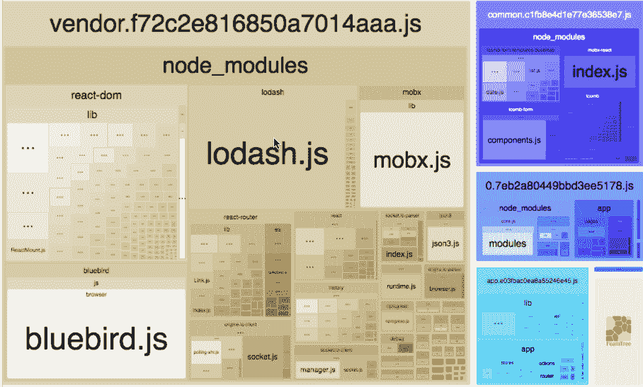

# 高度可扩展和优化的角度应用

> 原文：<https://medium.com/geekculture/highly-scalable-optimized-angular-applications-70b9150c5ffd?source=collection_archive---------17----------------------->


Photo by [Tatiana Fet](https://www.pexels.com/@tatiana-fet-420381?utm_content=attributionCopyText&utm_medium=referral&utm_source=pexels) from [Pexels](https://www.pexels.com/photo/aerial-view-and-grayscale-photography-of-high-rise-buildings-1105766/?utm_content=attributionCopyText&utm_medium=referral&utm_source=pexels)

大家好，我是 Nelli Venkatesh，过去 3 年我一直是一名专业的 web 开发人员，过去 8 年我一直在各种平台上编程，从 windows 应用程序到电子硬件板。在编写代码时，我们需要尝试许多最佳实践，以使代码可读、可维护、可重用。在这里，我提到了在开发高度可伸缩的 angular 应用程序时需要考虑的主要问题，以便代码库易于维护和重用。当 web 应用程序变得很大时，不会有任何问题，并且仍然可以在最短的加载时间内加载。

**模块化:**

模块化是一个概念，我们将整个角度应用程序分成小块，并根据需求加载这些小块。尽管 angular 是一个单页面应用程序(SPA ),但模块化提供了在页面加载时只加载所需块的功能。例如，我们的网站有两种登录方式，一种是零售商登录，一种是消费者登录。当用户登录后，只有与用户相关的块才会被服务器请求。通过使用这种模块化，我们可以减少包的大小，也减少了网络带宽。对于高度可伸缩的应用程序，以块的形式维护整个代码可以提高网站的性能，还可以减少初始页面加载时间。

**缓存:**

缓存是减少客户端对服务器调用的最重要的事情之一。您应该为不同类型的资源维护不同类型的缓存机制，以提供最佳性能。例如，资产和静态文件(JS、CSS、images)可以被给予最大到期时间，因为这些文件从不经常改变。angular 生产文件(main.js、runtime.js 和其他精简代码)也给出了最大到期时间，在服务器的缓存控制标题中带有必须重新验证标志。典型的标题如下所示。

[请点击这里了解更多关于缓存控制的信息](https://developer.mozilla.org/en-US/docs/Web/HTTP/Headers/Cache-Control)

**对于角度代码:**

```
Cache-Control :no-cache, must-revalidate, pre-check=0, post-check=0, max-age=0, s-maxage=0
```

**对于资产:**

```
Access-Control-Max-Age: 1000Cache-Control: public, max-age=604800, immutable
```

**共享服务:**

当 Angular 应用程序增长时，我们需要将冗余代码维护到一个单独的服务中，以便它可以被所需的组件使用。例如，有一个被许多组件使用的加密功能，我们将把它作为一个单独的服务，以便它可以在任何需要加密逻辑的地方使用。当我们维护数据时，共享服务充当了真实的单一来源。我们可以实现**主题**在一个地方显示和编辑数据。对于需要存储和维护大量值的大型应用程序，最好使用 ngrx/store 这样的状态管理库，否则共享服务也可以很好地维护数据。

**A-sync API 调用:**

在角码中有两种从服务器请求数据的类型。一个是**订阅**，另一个是**承诺**。这里我们讨论的是使用承诺从服务器请求数据。Promise with async-await 函数提供了编写干净代码的灵活性，并避免了 **then** 函数阻塞，当有两个以上的嵌套订阅时，这会使代码难以理解。与每个 then 块都有自己的 catch 块的嵌套订阅相比，async-await 提供了单个 try-catch 块。更容易理解和维护异步等待，因为它消除了维护嵌套代码的需要。

**广泛使用部件的指令:**

将广泛使用的组件(如自定义日期选择器、图表和其他特殊输入字段)放入一个单独的指令中，可以减少包的大小，还可以提供更大的灵活性，您可以在该指令中编写复杂的逻辑和配置，并且只将最少的参数暴露在指令之外，这样可以大大降低项目工作人员的复杂性，还可以减少冗余代码。

**使用 cdn:**

使用 cdn 将大大减轻我们服务器的负担，因为这些文件将从其他服务器加载，如 cloud flare 等。CDN 提供了很高的服务器正常运行时间，也有助于非常有效地维护缓存机制，假设如果您打开一些网站，使用相同的 CDN 作为您的网站，那么浏览器会自动缓存 CDN 文件，并将相同的缓存文件用于您的网站，这将减少页面加载时间。

**PWA :**

渐进式网络应用程序是一个伟大的工具，使您的网站功能丰富，其离线网页加载，并提供移动兼容性，通过在移动设备中添加主屏幕图标，并通过注册服务人员向设备发送推送通知，也可以与服务器同步文件后台。Angular 在 **@angular/pwa** 有一个包提供 pwa 支持。

[在角度项目中实施 PWA](https://angular.io/guide/service-worker-getting-started)

**错误处理:**

Angular 提供了全局错误处理机制，可以用来处理客户端错误和服务器错误。当处理像“服务器不可用”、“找不到页面”、“会话过期”这样的服务器错误时，错误处理程序非常方便。当出现服务器错误时，我们可以简单地根据收到的错误重定向到特定页面，并显示自定义消息。像未捕获的异常和其他逻辑异常这样的客户端错误可以在一个地方处理，以避免应用程序中断。您可以编写自己的错误处理程序来捕捉特定的错误。

[角度误差处理器](https://angular.io/api/core/ErrorHandler#description)

**网络包分析器:**

Web Pack Analyzer 通过一个交互式的可缩放树状图，以可视化的方式提供了整个 angular 应用程序的整体视图。在这里，我们可以看到组件大小、库大小以及各种捆绑包。它提供了一个平台来分析包中真正的内容，找出哪些包占用了大部分内存，哪些是项目中使用的不必要的库，并优化代码。您可以通过 npm 库将 webpack-bundle-analyzer 包含到现有代码中。



NPM:[web pack-bundle-analyzer](https://www.npmjs.com/package/webpack-bundle-analyzer)

如果我忘了说什么，请在评论中提到。