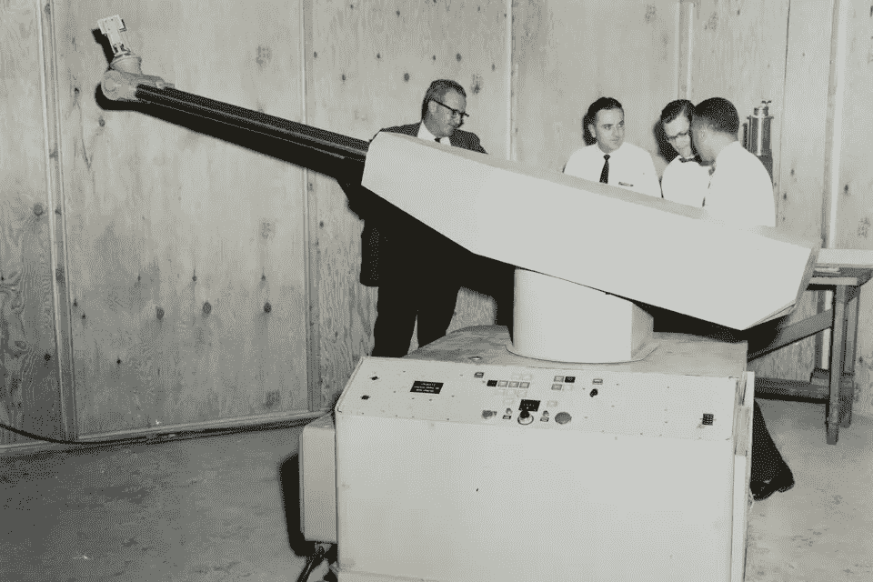
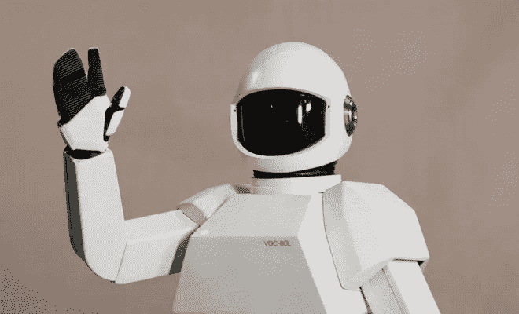
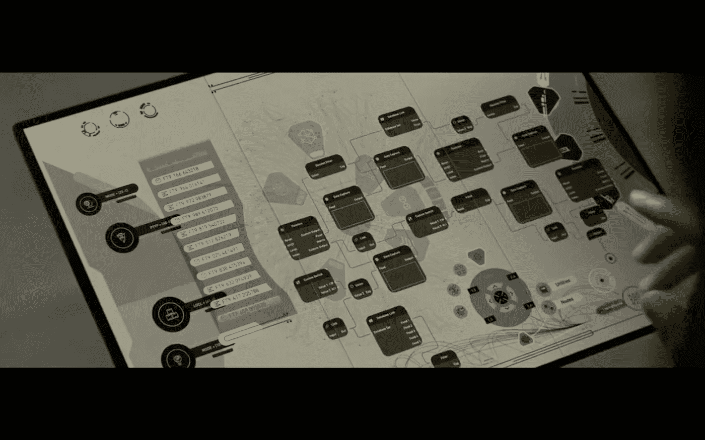

# 家庭服务机器人

> 原文：<https://medium.com/geekculture/home-service-robotics-2c76856419cc?source=collection_archive---------58----------------------->

1954 年，美国发明家和商人乔治·德沃尔设计了第一个工业机械臂“Unimate”并获得专利。由约瑟夫·恩格尔伯格开发，它标志着自动化历史上的一个突破，并为机器人领域的蓬勃发展奠定了基础。

从那以后，在专家和爱好者的手里，无数早期机器人的努力已经看到了曙光，变得更加复杂，并带来了新的进步，使生活更容易，更快，更精确。在这一进步时期，大约在 1995 年，约瑟夫·恩格尔伯格开始启发领先的大学、工业和机器人专家设计一种“老年助手”。这是一个多任务机器人的愿景，能够自动完成日常任务，减轻老龄人口的负担。假设，家庭服务机器人可以取东西、搬运、在室内认路、识别物体、烹饪、清洁、护理，并与市民交谈，尽管是以有限的方式。

然而，经过反思，人们首先认识到，抛开硬件开发限制，这些预想的能力中的每一个都需要明显不同的专业知识和昂贵的计算需求。同样的，一旦在一个系统中被编组，它们的组合揭示了由于机器人系统的组成性质而出现的难以处理的复杂性。因此，尽管这一愿景可能令人印象深刻，但可以理解的是，它意味着一项具有挑战性的任务，需要在几个抽象层上创造性地整理和开发一系列有效的技术和过程。换句话说，它需要大量的科学努力来满足预期的实际能力。

幸运的是，过去和现在的努力，尽管可能完全不同，但已经让研究界专注于各种感兴趣的理论领域，人工智能是其中的一个重要部分。在这一点上，如果未来可靠的同伴要帮助人类，执行指令，并有效地保护居住地，他们最好精通新环境的导航和所学知识的重用。这是移动实体的一项基本能力。

因此，为了指导这项工作，很明显，开发有效的计算学习框架对于未来多功能机器人助手的成功是不可或缺的。特别是一个学习框架，它允许自然语言处理、熟练的视觉导航和对所获得的常识的有用重用。