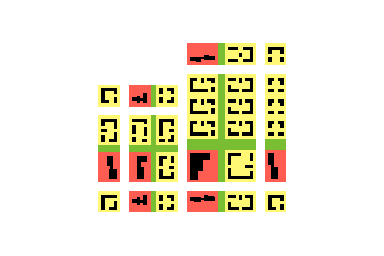
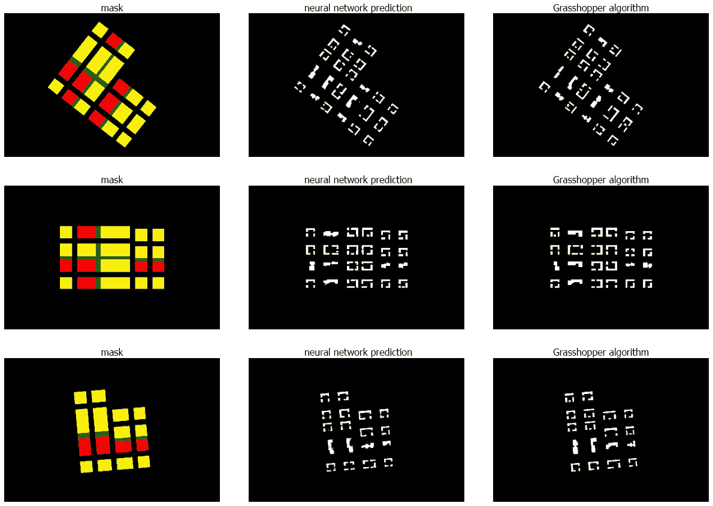
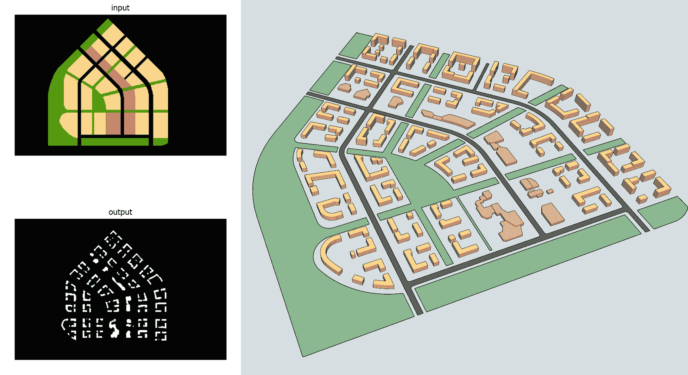

# 人工智能如何帮助城市规划者创造城市概念

> 原文：<https://medium.com/geekculture/how-ai-can-help-urban-planners-to-create-city-concepts-c3ce7e7b063e?source=collection_archive---------18----------------------->

作为一名城市规划师，工作任务可以按日常(手工)工作来划分，包括一些分析、绘图、计算和创新，包括对一个新的区域、地区、城市的概念进行构思。想象一下如何编写一个程序来处理日常事务是很容易的，但是为需要创造性工作的任务编写一个程序是很难的，比如制作概念。

在这篇文章中，我将展示我是如何实现人工智能来完成城市规划创意方面的任务的，它可以让城市规划者更轻松地创建概念。

在我开始之前，让我们花点时间谈谈人工智能是如何工作的。像任何大脑一样，人工智能是一个巨大的神经网络，神经元相互连接。我们需要用一些数据来教授人工神经网络，就像我们在学习新东西时对我们的生物神经网络(又名大脑)所做的那样。

通常，当我们需要学习任何东西时(作为人类)，我们会根据任务搜索大量不同类型的数据，如文本、图像、视频、音频等。如果我们要学习如何绘制平面图，我们必须搜索成百上千的平面图图像作为参考。

同样的方式也适用于 AI——如果我们需要让 AI 绘制场地平面图——我们需要用成千上万的图像“喂养”AI，以期待他绘制。

对于这个项目，目标是给城市规划者机会，仅用不同的颜色绘制某些类型的建筑物所在的区域(地带)。建筑物本身应该由神经网络绘制。

在搜索了一些学习数据的图片后，可以非常清楚地说，我正面临着极度缺乏例子的情况。我不想让神经网络在 50 年以上的项目上学习，因为大部分都不符合现代城市规划标准的要求。但是，城市发展的速度并不快，无法提供数以千计的学习数据图像，即使考虑到世界各地的所有图像。我们不要忘记——场地规划可能因位置不同而不同:适合一个国家或城市，不适合另一个国家或城市。还有，不同的风格可能会造成学习数据的大混乱。

这给了我在 Rhinoceros Grasshopper 中编写一个大算法的想法，该算法生成包含住宅、公共建筑、学校和幼儿园的住宅区。

**Example of a generated area in Grasshopper** | Source: Author

以下是算法中实现的一些关键原则:所有街区都应该旋转，这样它们的庭院就可以停车，除了旁边没有公园的街区。他们应该轮流去南方；除了朝南的街区之外，所有街区都应封闭道路；街区应该在马路对面，因此神经网络将学习如何对齐它们；所有建筑物与道路的偏移也应相同，以便对齐。

创建算法的一些巨大优势是能够根据你的经验和视觉设置你自己的条件，能够生成成千上万的图像，这些图像已经被标记(不同的颜色意味着不同类型的建筑物)。请记住，算法是用 idea 编写的，只是为了向神经网络“输入”学习数据。这些绝对不荒谬，但不是住的地方。

在图像标记上节省的大量时间很容易覆盖编写该算法所花费的时间。

> 请记住，算法是用 idea 编写的，只是为了向神经网络“输入”学习数据。

**Samples of gererated images** | Source: Author

利用这个算法，我从 Grasshopper 导出了 10000 张图像，用于训练神经网络(我只能想象找到这么多图像，给它们贴上标签，并使它们具有相等的比例，需要多少时间)。然后我设法把每张图片分成两张——一张是 X 的，没有任何建筑，只有区域；另一张是 Y 的，只有建筑。

**Samples of training data** | Source: Author

这个项目使用的神经网络模型叫做 Pix2pix 生成对抗网络(GAN)。它允许发送一个图像作为输入，接收另一个图像作为输出。提醒任务，我们的目标是发送不同功能区的图像并接收建筑布局。也就是说，Pix2pix 是最好的选择。

在这篇文章中，我不打算深入解释神经网络模型，包括这个项目中使用的层和函数，因为它是关于过程和结果本身。让我们看看训练进展如何。

**Results of training on first epoch** | Source:Author

正如我们所看到的，它在一个时期后很快就明白了这个想法(每个时期，来自训练集的每个图像都被“馈送”)。当前模型花费大约 120 个历元来训练(这对于训练 GAN 来说不是一个大数目)，每个历元大约 14.5 分钟。

训练好模型后，让我们检查它能提供给我们的结果。首先，让我们看看基于来自测试数据集的图像的结果，该数据集也是从 Grasshopper 生成的(在训练过程中没有使用来自测试数据集的单个图像)。

**Testing neural network** | Source: Author

神经网络很好地处理了它的工作。打赌如果不是写了哪个图像是 Grasshopper 里生成的，哪个是神经网络画出来的，你得仔细看才能分辨出来。我们可以清楚地看到它是如何检测到我在 Grasshopper 中创建算法时制定的关键原则的:它绘制建筑物，因此庭院总是向公园或南方开放，庭院大多与道路隔离，建筑物完全对齐。但是这些类型的区域，正如我之前提到的，仅仅是为了给神经网络提供训练数据而创建的。规划的质量很差，所以让我们看看它如何处理更可能是区域的一部分的东西。

**Fictional area** | Source: Author

再来看看我们用神经网络生成的区域经过后期处理后会是什么样子。

**3D representation of an area created using neural network** | Source: Author

轻松生成几个选项的机会为尝试创建各种概念打开了许多大门。考虑到这一点，我们可以自由地改变道路、公园、功能区的方向，并几乎立即获得一个新的概念。

**Various sketches can be done in seconds** | Source: Author

目前，输出与任何软件都没有联系，建筑物应该从输出图片手动重画。但是将一个输出与一个软件联系起来，不仅可以给我们一个三维的表现，还可以立即提供一些技术信息。

我们目前生活在一个非常令人兴奋的时代，人工智能开始覆盖不同的领域，并提供人类以前不可能提供的机会。这只是对人工智能如何绘制住宅区的一次尝试，尽管有些解决方案值得怀疑，但我希望你明白了这个想法。迟早，人工智能将成为城市规划者的强大工具，不仅可以创建住宅区，还可以在世界各地创建整个城市。我绝对相信，设计和工程中的人工智能将使未来的人回顾我们，就像我们回顾 CAD 不存在的时代一样。