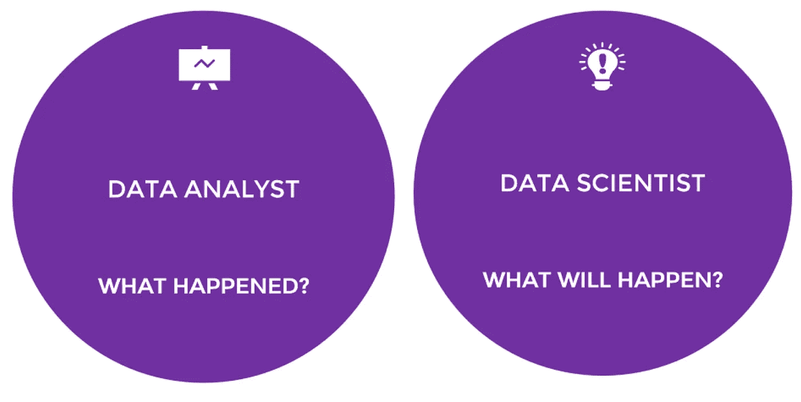
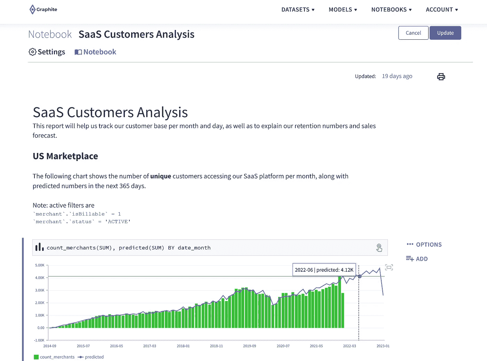

# 机器学习和数据讲故事的自动化如何克服数据科学家的短缺

> 原文：<https://medium.com/geekculture/how-automation-in-machine-learning-and-data-storytelling-can-overcome-the-shortage-of-data-e42c11c62414?source=collection_archive---------16----------------------->

## 世界正面临数据科学家的严重短缺。统计显示，2016 年，Glassdoor 上有超过 1700 个数据科学家职位空缺，2020 年有超过 6500 个。这种明显的差距只会进一步扩大。IBM 分析师和美国劳工统计局预测未来五年将增长 28%。

如果你想知道为什么有如此巨大的未满足的需求，答案一点也不简单。

让我们更深入地了解一下，在一个越来越依赖数据的世界里，寻找数据科学家为何如此困难。

# 2022 年数据科学家的短缺

Quanthub 的研究总结称，市场上没有足够的数据科学家——职位发布数量是求职数量的三倍。

Image by the author

根据 Quant Crunch 的数据，2021 年数据科学家的职位空缺为 10 万多个。公司为应用数据科学家提供了 14%的加薪等激励措施，但大数据项目的数量远远超过了拥有处理数据所需技能的个人的数量。

2022 年也有类似的趋势和发现。大量数据科学工作表明对大数据和分析专业人员的需求不断增加，进一步推动了对独特技能组合的需求。数据正被用于为许多行业带来巨大变化，包括医疗保健、金融、营销、商业、零售、电子商务和 SaaS。

虽然这并不意味着数据科学家的可用性不会有所改善，但数据科学家的数量与大数据结构之间的比例总是不公平的。

为什么？首先，随着公司努力改善大数据方面的工作并试图简化数字领域的商业模式和收入机会，对熟练数据专业人员的需求持续增长。

较小的企业开始雇用专家，因为他们也开始理解数据分析在帮助他们的品牌发展方面有多么重要。还有其他因素，如缺乏适当的教育和指导。随着技术的快速进步，这种情况变得更加复杂，需要新的技能组合，包括理解 ML、数据可视化和高级统计工具的知识。

> 问题是，虽然数据分析师相对容易找到，但他们缺乏与数据科学家相当的技能。

# 数据科学家与数据分析师

数据分析师和数据科学家之间的最大区别在于，前者将可用数据翻译成通用语言，并提供清晰简洁的见解。

另一方面，数据科学家可能需要分析可操作的见解，并使用机器学习和高级 SQL 创建模型。

数据科学家通常需要具备以下技能:

*   Python 编程/ R 编程
*   高级 SQL
*   机器学习和人工智能

这些技能在数据分析师中相当罕见。他们已经被要求做许多繁琐的工作，包括:

*   检查和清理数据以揭示关键的见解
*   识别相关性或模式，并统计分析或挖掘数据
*   可视化数据，以全面的方式解释和呈现调查结果

因此，数据分析师更专注于研究大量数据，解释数据，回答问题或解决问题。

Image by the author — Data analysts vs Data scientists

虽然拥有与编码和编程相关的技能可能会使他们的工作变得更容易，但它们不是必需的，因此经常被忽视。

虽然经常互换使用，但这两种工作有着截然不同的角色。数据科学家的缺乏可能会影响数据分析师的工作。

避免这种情况的方法是让数据科学家自动处理特定工作的数据。

让我们看看自动化和无代码 ML 如何解决数据科学家短缺的问题。

# 数据分析师变成了数据科学家

随着公司开始转向收集和挖掘数据，机器学习和人工智能已经成为数据分析领域的基本期望。然而，大多数数据分析师缺乏数据科学家所具备的技术技能。这意味着，虽然 BI 正在迅速崛起，但数据分析师可能难以跟上，企业将继续拼命寻找数据科学家。

虽然这可能看起来令人沮丧，但对于数据分析师来说，这是一个不可思议的机会，可以在没有经过数据科学家的正式培训的情况下恢复他们的地位。

这是一个独特的情况，因为作为数据分析师的经验将你置于一个新的位置，以有效地融合 BI 和 ML。通过使用正确的软件，您可以利用现有的知识从任何给定的数据中提取信息。这并不复杂，因为自动化机器学习将为你提供工具来弥补你技术知识的不足。

> *本质上，您可以使用现成的工具进行高级诊断分析以及其他预测和说明性计算，而无需承担数据科学家的所有责任。这可能是弥合市场对数据科学家的需求与你所能提供的技能之间差距的一次成功尝试。*

# 解决缺乏数据科学家的问题

当讨论如何克服数据科学家的缺乏时，自动化和无代码机器学习(ML)是最明显的答案。

下面我们来仔细分析一下原因。

一篇[文章](https://towardsdatascience.com/is-the-job-of-data-scientist-at-risk-of-being-automated-60583e96670f)研究自动化可能如何取代需要重复动作、缺乏创造力或高社交智商、不需要太多培训的工作，展示了自动化工作的有趣统计数据。

*此外，第四时代:智能机器人、有意识的计算机和人类的未来*，[拜伦·里斯](https://byronreese.com/author/)展示了自动化高风险工作的特点。

这些是:

*   重复的:身体上或精神上的
*   低创造力:不需要即兴创作和新颖的思维方式
*   低社交智商:不需要沟通、说服或魅力
*   有限的培训:自动化工作的容易程度与完整描述该工作的“手册”的长度成反比

# 自动化和无代码机器学习

掌握如何编写足够好的代码，以精通机器学习和人工智能所需的技术方面，可能需要数年时间。即使是最有经验的程序员也难以适应这个过程，所以数据分析师缺乏这方面的技能也就不足为奇了。

毕竟，学习如何有效地编程和编码的时间和精力是非常高的。即使这样，也可能需要几个月的时间来制作一个有效且实用的自动化模型。

因此，无代码机器学习是解决各种自动化问题的答案。想知道为什么吗？简单。它们允许分析师以快得多的速度做出预测并处理可用数据，而不需要为雇佣数据科学家所需的资源增加预算。

因此，数据分析师可以发挥创造力和主动性，并利用手头的无代码机器学习更好地利用他们的技能。

为了更好地理解这一点，我们可以看看传统的机器学习以及它与无代码机器学习的不同之处。

# 传统机器学习

这张图片给出了传统机器学习的基本概念。

Image by the author — the traditional machine learning process

本质上，这种类型的人工智能(AI)使应用程序能够准确预测结果，即使它们可能没有被明确编程来这样做。

机器学习中采用的算法使用历史数据输入来产生输出值。

机器学习的四种基本方法是:

*   监督学习——其中算法的输入和输出变量都被指定。
*   无监督学习-这种类型的机器中的算法是在未标记的数据上训练的，数据输入和预测输出是预先确定的。
*   半监督学习-这是监督和非监督模型的混合，训练数据可能会被标记，但模型可以自行自由探索数据。
*   强化学习——这种模型教会机器用明确定义的规则完成多步过程。

传统的机器学习常用于:

*   客户关系管理(CRM)软件
*   商业智能和分析
*   人力资源信息系统
*   无人驾驶汽车
*   虚拟助手

# 无代码机器学习

image by the author — no code machine learning processes

如上图所示，无代码机器学习显然是一个简单得多的过程。

在自动化 ML 中，所有重复的流程都是自动化的:

1.  输入数据
2.  预处理

*   特征工程
*   特征选择
*   特征转换
*   缺少值
*   异常值处理
*   无数的支票

3.型号选择

*   基于数据集的模型评分选择最佳模型
*   模型评估

4.调整模型超参数

5.模型部署，以便团队成员可以使用它

6.模型维护

因此，无代码机器学习是一个非常简单的数据预测过程，不需要太多的技术技能。

无代码机器学习使数据分析师能够构建应用程序和系统，而不需要任何传统的编程知识或软件。它可以通过视觉干扰和引导动作以及预先构建的集成来访问，允许用户根据需要交换信息。

在谈到无代码机器学习时，Alphabet 的增长基金 CapitalG 的亚历克斯·尼古拉斯(Alex Nicholas)说:*“没有任何代码能够通过抽象复杂性和以可视化工作流为中心，让业务用户接管以前由技术用户拥有的功能。这种深刻的代际转变有能力触及整个企业的每个软件市场和每个用户。”*

一些最好的无代码机器学习平台允许简单的拖放预测，这使得编辑查询变得极其简单。因此，用户必须只替换标识符和预测列，而忽略那些他们不希望使用的列。

这也将创建预测的时间减少到了几分钟！

显然，取消技术计算程序有某些不可否认的好处:

●数据驱动的风气，没有为数据科学团队分配资源

●创造和扩展机器学习驱动的产品更加可行

●根据事实和预测改进决策

●降低成本，提高利润率

通过 Graphite 的无代码机器学习生成的见解，数据分析师可以获得对关键业务驱动因素的更深入的见解，这些见解使用经过验证的模型模板。

该软件还可以帮助扩展数据分析团队的增强和预测分析技能，并挖掘他们的全部潜力，以根据可用数据进行预测。

此外，Graphite 使分析师使用 AI 和 ML 工具进行商业分析变得极其简单。它还允许用户在没有编码或编程知识的情况下生成机器学习模型。

Graphite 通过选择 ML 算法自动构建模型，像数据科学家一样产生和解释结果。

这还不是全部。它还具有某些关键的数据叙事功能。为什么这是如此重要的产品？

大家讨论一下！

# 数据叙事的重要性

数据故事将复杂的数据转换成易于理解的故事，便于阅读和分享。它本质上是以一种清晰、简洁、易读的方式呈现信息，让您了解与您的业务相关的关键细节和见解。

image by the author — Graphite Note data story

一个数据讲故事的程序非常有利于让数据分析师的工作变得更简单、更有效。

以下是数据叙事作为解决大数据集所导致的复杂性的一些关键方面:

●将指标转化为见解

●协助加强参与和沟通

●帮助形象化叙述

●为复杂的解释提供简单的基础

认知科学家 Roger C Schank 指出"*人类并没有理想地被建立来理解逻辑；它们是为了理解故事而设立的。”*

这就是数据讲故事的本质含义——**让数据更容易理解**。

以下是 Graphite 采用的有效数据故事解决方案的一些基本特性:

●易于理解和领会的人性化视觉效果

●文本和视觉的轻松整合

●信息和数据的叙述性流程

●连接和保存重要数据位的能力

●数据集共享和协作工具

> *因此，数据叙事将数据库公正领域的数据转化为观点、论点和见解。借助所需的工具，数据分析师可以执行更有吸引力和更有意义的数据讲述，因此，如果数据文化得到提升，数字素养教育得到全面改善，他们的投资将获得更高的回报。*

这正是 Graphite Note 的目标！

# 结论

数据科学家在数据分析中发挥着重要作用。然而，随着熟练数据科学家的短缺，自动化技术进步到足以弥合这一差距只是时间问题。

Graphite Note 等软件平台是无代码机器学习可以自动化数据科学家工作的理想选择。

为什么？因为无代码机器学习是最简单的方法，可以让各行各业、各种背景的数据分析师使用机器学习。

虽然 BI 和分析平台的存在是为了帮助组织了解某些事情发生背后的原因，但 Graphite 帮助用户了解预期会发生什么，以及他们如何准备和处理它。

Graphite 还有助于简化 AI 和机器学习在商业分析中的使用，从而帮助用户在没有编码或编程相关技能的情况下生成机器学习模型。其可解释的人工智能使日常商业用户能够有效地处理他们的数据。

除了其优化的 ML 算法，其数据讲故事的功能也在改变游戏。简而言之— [“如何花更少的时间一遍又一遍地向你的同事解释发生了什么。”](https://graphite-note.com/why-dashboards-are-failing-and-why-data-storytelling-is-the-answer)

*原载于 2022 年 2 月 22 日*[*【https://graphite-note.com】*](https://graphite-note.com/how-automation-in-machine-learning-and-data-storytelling-can-overcome-the-shortage-of-data-scientists)*。*