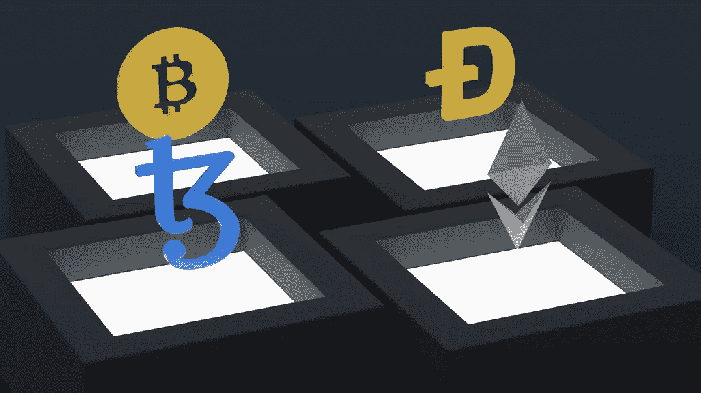

# 区块链如何参与互联网去中心化

> 原文：<https://medium.com/geekculture/how-blockchain-is-involved-in-internet-decentralization-82376a4495ec?source=collection_archive---------15----------------------->

如今，你看到的任何人都拿着电话，每当你向某人询问新事物时，他们会直接在互联网上搜索该术语。因此，简而言之，我们可以说，从搜索附近的商店，网上购物到获得正确的目的地方向，我们都依赖于互联网。

因为互联网已经成为我们的日常必需品，所以有必要将它和我们的搜索历史从控制的科技巨头那里解放出来。许多互联网用户开始意识到组织在监视他们的搜索，收集敏感信息，并将其出售给恶意方，他们可以通过滥用我们的私人数据来伤害我们。

随着这种意识在用户之间传播，以及看到处理这个问题的重要性，一个全新的概念被引入，被称为去中心化互联网。但要理解对分散式互联网的需求，让我们先了解一下集中式互联网的问题。

# 为什么我们需要一个去中心化的互联网？

我们日常使用的传统互联网基础设施由集中式服务控制，并处于持续的监控之下，可以获取任何人都不应该知道的您的私人信息。谈到当前的互联网治理和监管方，大型科技公司、开发商和政府开始行动了。

还记得脸书的剑桥分析丑闻吗？是的，如果你的互联网服务托管在一个中央服务器上，那么服务开发者或者任何可以访问你的数据的人都可以利用它们来操纵人口、选举结果或者其他一些个人动机。

我们早些时候推出的一个新的互联网概念称为去中心化互联网，这是一个基于区块链技术的产品，它有能力通过用一个点对点的提供商网络来取代那些互联网监管方来阻止他们跟踪我们的互联网冲浪。

在这里，该网络的成员将拥有并访问用于其存储和处理用途的基础设施。通过这种方式，今天的互联网机构的控制权将被剥夺，并被中和。

这种新的互联网去中心化概念不仅使你的互联网摆脱了管理机构的束缚，而且确保了终端数据的安全。

在看到这个概念的戒律后，许多技术爱好者正在致力于开发分散的、基于区块链的互联网服务，以取代传统服务。与其他项目相比，这些项目面临许多障碍，如无法吸引用户和服务提供商的注意力，以建立理想的竞争性分散网络。

我们不能说去中心化的互联网已经完全建立。不，一点也不！它仍在发展中，或者说，正处于改进之中。有一点我们可以说的是，这种去中心化的互联网不关注任何单点故障，而是看到了广泛的范围。

# 现有分散式互联网项目的亮点:

在互联网上，你会发现许多正在运行的分散项目的数据，这些项目旨在用区块链技术的力量取代现有的互联网服务。如果你对区块链感兴趣，并且是个书呆子，那么你一定听说过 Foilcoin。因此，这个项目旨在用分散存储网络取代集中式云存储系统，在分散存储网络中，云提供商无权管理您存储的文件。

Foilcoin 是一个用户平台，他们希望通过加密货币将自己的空存储空间出租给另一个用户。

你可能会想，如果我们向第三方用户提供我们的空闲空间，这也意味着我们将我们的数据安全委托给另一个用户。如果他们访问我们的敏感信息并利用它为自己谋利怎么办？好吧，深呼吸，不会有什么事发生，因为你的文件会被加密。简而言之，该设施的更高加密标准将保护您的私人数据，防止第三方使用您的租赁存储。

现在，让我们转到另一个名为 Blockstack 的分散项目，该项目试图建立一个上层，将应用程序从集中式网络提取到分散式网络。换句话说，在现有的互联网服务上添加一个新的层，使应用程序分散化。从这些项目中，用户可以通过个人拥有的或基于本地服务器的应用程序共享文本、图像、文件和其他所有类型的数据，而不是被集中的中介所捕获。

看到这样的承诺，许多区块链专家试图检查 Blockstack 项目的能力。最后，一家公司做了一个声明，比如“平台的设计是这样的，即使应用程序开发人员也不能访问用户数据，用户将有完全的权力向其他方授予读取、写入和存储数据的权限。

还有另一个分散的项目，称为 Andrena，旨在使用对等网络来取代集中式路由网络。

嗯，看到这种去中心化互联网项目的出现，许多区块链专家都在说，这个概念有可能带来高端安全的成本优势。然而，优势的百分比将取决于市场条件。此类项目还使用户能够通过互联网连接促进类似云的服务，即使不依赖于互联网服务提供商。

# 区块链正在接管传统技术:

我们可以看到，这种基于区块链技术的去中心化互联网概念，也只是在区块链专家中讨论；尽管如此，它还是得到了很多关注。现实检查，这个概念还需要发展，需要一个务实和平衡的方法来把假设变成现实。不要忘记，虽然有这么多好处和很好的设施，但它也有不好的一面，比如开发的复杂性。

在分散式开发过程中，开发商将面临许多难以解决的障碍，以使其能够替代大规模的集中式互联网服务，并吸引其用户转向分散式用户。随着时间的推移，去中心化的概念将会发展并取得成功，但会经历一个充满不确定性的漫长过程。

所以，看完这一整篇博客，你一定有很多关于[区块链](https://www.readinbrief.com/blockchain-technology-poised-for-big-growth-in-months-ahead/)和去中心化互联网及其进展的疑问。继续阅读我们的博客，在下面的评论区让我们知道你的想法，并开始一场书呆子式的技术讨论。