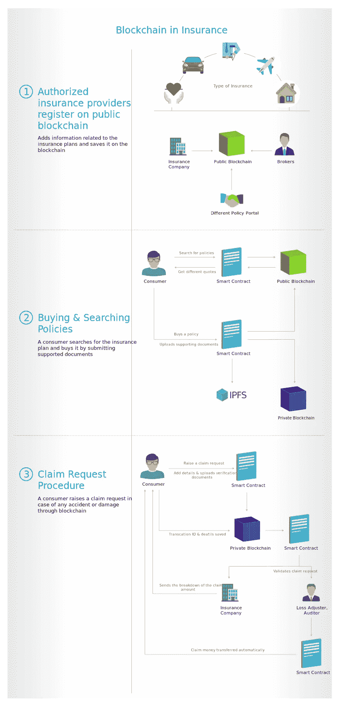

# 区块链如何给保险领域带来变革？

> 原文：<https://medium.com/geekculture/how-can-blockchain-bring-transformation-to-insurance-sector-c4bfb0debaf6?source=collection_archive---------14----------------------->

Image on [Unsplash](https://unsplash.com/photos/5fNmWej4tAA)

技术革命的到来彻底改变了商业模式的标准。随着技术的发展，传统的保险生态系统已经开始经历区块链等新兴技术带来的数字效应。它极大地改变了消费者与企业互动的方式和提供服务的效率。全球保险业落后于其他金融部门，特别是在提高成本节约和简化业务运营方面，因为欺诈活动、人为错误和网络犯罪日益受到关注。

面对传统保险业日益增长的担忧和挑战，区块链技术已经为发展和保持竞争力铺平了道路，以满足精通数字技术的消费者的需求。采用区块链驱动的解决方案和服务可以帮助保险公司彻底转型，通过公共账目和强化的网络安全协议以最高的效率、安全性和透明度克服传统挑战。

根据麦肯锡公司(McKinsey & Company)的一份报告，所有保险中有 5%到 10%是欺诈性的，因此保护数据对保险公司来说更为重要。为了全面了解保险行业的当前形势，这里概括介绍了组织面临的一些主要挑战，以及区块链如何通过高效简化运营来缓解这些挑战。

# 保险业面临哪些挑战？

随着互联设备的出现和信息量的不断增加，需要筛选数据以提供定制的产品和服务。保险公司需要从财务损失补偿发展到物理风险预防模式。只有当发行者能够访问数据可见性时，这才是可能的。随着金融行业的数字化转型，以数字化方式转移资金的绝对成本和安全性成为一个重大问题。

传统的保险公司遇到了许多挑战。其中一些包括:

*   复杂的合规问题
*   成熟市场的有限增长
*   欺诈索赔活动
*   第三方支付交易
*   处理大量数据

所有这些挑战凸显了区块链技术在简化流程和保护保险行业敏感信息方面的必要性、重要性和采用。

# 为什么是区块链？

尽管区块链有能力终结保险公司面临的所有问题，但它确保了信任、透明和安全。保险公司可以通过多种方式利用区块链技术来克服上述挑战。以下是一些有影响力的因素，显示了区块链是如何颠覆和革新保险业的。

*   **安全** 区块链是一种分布式账本技术，可以大幅去除可疑和重复交易。区块链的分散式数字存储库通过提供历史记录来验证客户的真实性、保单和交易。因此，黑客破坏和篡改区块链上的机密数据变得非常不可能。
*   **海量数据** 大量互联设备的使用导致保险公司需要处理的数据量激增。区块链可以有效地处理大量数据的管理、共享和货币化。区块链最重要的好处是，它可以存储静态记录和数据，无需中央协调，网络中的所有参与者都可以查看数据。数据通过使用日期和时间戳的数字指纹登记在区块链上，从而提高了安全性和透明度。
*   **第三方交易** 通过个人数字设备进行的第三方交易和索赔的增加，可以通过基于区块链的解决方案轻松处理。区块链通过自动验证第三方的索赔和支付数据，有助于最大限度地降低管理成本。区块链使得保险公司可以快速查看过去在区块链注册的索赔交易，以便于参考。它在更大程度上促进了保险公司和客户之间信任和忠诚的建立。
*   **智能合约** 这些是可编程合约，在满足预定义条件时执行交易。智能合同将来自多个系统的实时数据跨物理文档和细节连接起来。它们可以更快、更准确地触发索赔、支付和报销等流程。它减少了保险公司的文书工作，节省了大量时间和金钱，同时为客户提供了更好的体验。
*   **提供可互操作的健康/人寿保险记录** 在多个实体之间建立信任的安全特性和能力使该技术能够有效解决维护和共享健康记录的互操作性问题，从而改善患者的治疗效果。
*   **战略功能** 区块链解决方案收集协议、交易和其他有价值信息集的记录。这种整体信息被链接并存储在块中，并使用智能合约进一步执行功能。
*   **欺诈检测** 在通过虚假索赔向人寿或健康保险公司提交任何欺诈信息时，智能合同可以帮助识别和检测提交的索赔是否有效，并保护信息免受篡改、网络犯罪和欺诈。
*   **建立动态的保险公司和客户关系** 当健康或人寿保险记录安全地存储在区块链上时，智能合同就成为形成和维护客户和保险公司之间信任关系的基础。
*   **提高提供商目录准确性** 区块链技术的分散共识协议允许提供商和保险公司更灵活地快速更新列表。
*   **提高效率和信任度** 区块链通过简化保险合同的文书工作和对账，消除了对人工处理的需求。区块链的加密技术保持了交易的安全性、真实性和可验证性，确保了客户隐私。

# 区块链在保险行业有哪些可能的使用案例？

区块链技术在整个保险价值链中具有巨大的潜力。从产品的承保和定价、销售和分销到产品管理和索赔处理。[区块链在保险](https://www.leewayhertz.com/blockchain-insurance-streamlining-insurance-process/)中的应用非常详尽。以下是一些重要的使用案例，在这些案例中，区块链在加速数字化和转变思维以促进保险业创新和转型方面发挥了催化剂的作用。

# 1.索赔处理和结算

在区块链支持的保险中，条款写在智能合同中。一旦收到正确的参数，智能合约就会支付索赔。它通常适用于参数保险产品，其中索赔触发事件由可靠的可用数据验证，如航班延误、自然灾害或死亡案例。区块链允许记录索赔的可审计性，通过删除同一事件的多个索赔来防止保险欺诈。

Infographic: Blockchain in Insurance by [LeewayHertz](https://www.leewayhertz.com/blockchain-insurance-streamlining-insurance-process/)

# 2.再保险和互换

再保险协议和掉期条款被写入智能合同，用于执行支付，包括索赔和保费。与交易相关的整体数据保持不被篡改和可审计。网络中的每个参与者，如保险公司、再保险人、资产管理公司、第三方数据提供商和顾问，都可以访问区块链上记录的数据。区块链中记录的所有交易对未来的交易参与者仍然可见。在大宗年金交易的情况下，区块链网络中的所有参与者也可以看到所做的更改。

**3。数字身份管理**

遵守 KYC 和数据保护法规既繁重又昂贵。私人信息在本地拥有和存储，其中区块链充当从客户到保险公司的安全可信的数据管道。使用区块链，KYC 凭证被编入智能合同并实现自动化。

# 4.共享经济保险

基于共享经济的各种平台在向在这些平台上预订的租房者提供实时保险覆盖方面效率很高。当通过区块链技术提供动态保险时，可以有效地实时利用它，降低运营成本，并维护交易的总体历史以供将来参考。

# 5.工人补偿

大多数保险公司面临着大量的索赔欺诈。区块链技术实现了多方之间的信息共享。保险公司可以访问数字维护的健康和就业记录，以确定受保人遭受的实际损失。它最大限度地减少了工人赔偿欺诈活动的机会，并迅速解决索赔。

# 6.团体人寿保险

在团体人寿保险中，雇主是所有者，雇员是受益人。因此，雇主有责任促进和更新所有必要的变化。目前的流程是以人力为导向的，但可以通过在区块链上执行的智能合同集成第三方系统来快速实时自动化。

# 7.物联网——区块链驱动的互联设备

智能家居和互联设备是使用物联网和区块链集成构建的。传感器检测事故或任何灾难的发生。然后，这些设备使用区块链触发指令，从保险公司转移现金进行维修。物联网中的区块链可以解决企业在构建可以自动通信和操作的智能设备时面临的信任问题。

显而易见，区块链可以从各个角度改善保险业。分布式账本技术在处理分散信任、索赔处理、身份管理、欺诈预防、可观的成本节约、消费者数据隐私和增强的效率方面具有巨大的潜力。

虽然区块链可以提高该行业的准确性、效率、隐私等，但必须明白，每家接受区块链的保险公司都必须坚持在道德标准下运作。区块链应该统一标准和流程，为保险公司提供更好的协作、数据共享工具，并简化保险流程。一旦这些标准得到满足，区块链将通过采用这些标准来利用长期收益，从而提升保险业的未来。