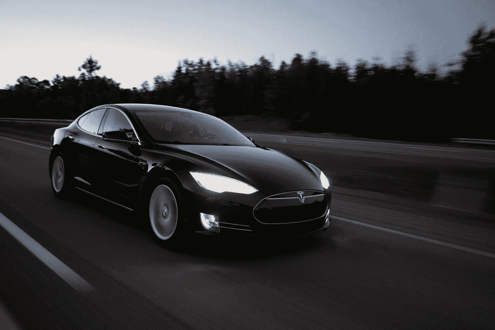

# 如何才能保证深度学习系统的准确性？

> 原文：<https://medium.com/geekculture/how-can-we-ensure-the-accuracy-of-deep-learning-systems-b30d80134625?source=collection_archive---------27----------------------->

神经元覆盖率的简单解释。

Photo by [Solen Feyissa](https://unsplash.com/@solenfeyissa?utm_source=medium&utm_medium=referral) on [Unsplash](https://unsplash.com?utm_source=medium&utm_medium=referral)

除非你一直生活在岩石下，否则你可能知道世界各地的工程师是如何不断开发人工智能系统的。它们是对人类最好的吗？我将让你来决定。

Photo by [Jp Valery](https://unsplash.com/@jpvalery?utm_source=medium&utm_medium=referral) on [Unsplash](https://unsplash.com?utm_source=medium&utm_medium=referral)

然而，随着人工智能系统变得越来越先进，我们能够确保其准确性变得越来越重要。我们不能让自动驾驶汽车等人工智能系统做出错误的决定。如果自动驾驶汽车做出错误的决定，可能会导致一些伤亡。例如，2017 年“约书亚·布朗(Joshua Brown)在他以自动驾驶模式运行的特斯拉 Model S 撞上一辆牵引拖车时丧生”(Boudette，2017)。虽然特斯拉没有发现任何“导致事故的系统缺陷”(Boudette，2017)，但有理由感到担忧。根据特斯拉的说法，发生如此致命的事故是因为“其摄像头未能识别明亮天空下的白色卡车[事故的拖车](Boudette，2017)。这种失败是不可接受的。如果人工智能系统没有经过最充分的测试，我们怎么能相信它们呢？如果我们知道人工智能系统会做出错误的决定，我们怎么能相信它们呢？作为人类，我们也容易做出错误的决定；然而，人工智能系统在决策方面应该比我们先进得多。

我想从这次事件中，你可以清楚地看到为什么需要大力测试 A.I systems。然而，与传统的软件测试不同，人工智能系统测试要复杂得多。原因是因为很大一部分人工智能系统实际上是深度学习系统，它们利用了一种称为神经网络的黑盒方法(既然你正在阅读这篇文章，我假设你理解什么是神经网络，但如果你不理解，这里有一篇我写的文章，它给出了一个很好的介绍:[什么是神经网络？](/geekculture/deep-learning-with-pytorch-part-2-what-are-neural-networks-14aa939fd197))。由于神经网络的黑盒性质，测试这样的系统变得越来越困难。如果你感到困惑，不要担心，我将在文章的后面详细阐述这一点。为了理解这个困难，让我们来看一下传统软件是如何测试的。

# 传统软件的测试

虽然我不会深入传统软件测试的细节，但我一定会给你一个充分的理解。通过多年的研究和理解，软件工程师已经明白简单地开发测试用例对于彻底的系统测试是不够的。你如何知道你的测试用例已经允许你识别所有可能的 bug？如果你测试一个 bug，你就不能识别它。如果你不能识别错误，你的客户就不会高兴。

虽然存在各种软件测试方法，但一种常见的技术是通过最大化分支/代码覆盖来探索“程序逻辑的不同部分”(田等，2018)。什么是代码和分支覆盖率？让我解释一下。

## 代码覆盖率

形式上，代码覆盖率是测试套件覆盖的代码的百分比。迷茫？请允许我解释。假设你为一个系统写了 100 行代码。让我们也假设您已经为所述系统构建了一个测试套件(测试用例的集合)。在对测试套件运行系统之后，假设只运行了 50 个独特的行。那么，我们的代码覆盖率将是 50%(运行的唯一行的数量/行的总数* 100)。50%的代码覆盖率是非常糟糕的，因为这意味着我们一半的代码没有经过测试，因此，我们的软件中可能有 bug。正如你可能猜到的，代码覆盖率越高，系统测试越好，这意味着我们的软件出现错误的几率很低。

虽然代码覆盖在帮助我们彻底测试软件方面有很大的优势和能力，但它也有一些缺点。代码覆盖的最大缺点是它没有测试所有可能的代码分支。例如，当您在代码中应用 if-else 语句时，您正在为代码创建另一个可能的分支或路径。代码覆盖率可能会将这些条件标记为已测试的行，因为您的系统可能已经触及了这些行。但是，它不会彻底测试其他条件。简单来说，代码覆盖率不能帮助你测试软件所有可能的条件或路线。这就是分行覆盖率的来源。

## 分支覆盖

与代码覆盖率不同，分支覆盖率关注的是给定测试套件所采用的可能分支的百分比。所谓分支，我指的是系统到达一个输出的可能路径。当您创建像 if-else 这样的条件语句时，您创建了两个分支:一个用于 if 条件是否满足，另一个用于 else 条件是否满足。

分支覆盖的工作方式与代码覆盖类似，它计算测试套件测试的唯一分支的数量/可能分支的数量。这使得工程师们可以确信他们的软件在大多数情况下都能很好地工作。因此，我们确保通往输出的道路基本上没有错误。我们不希望客户对我们有缺陷的软件感到不安，不是吗？

## 结束传统的软件测试

我想澄清一件事:除了我列出的方法之外，还有很多很多测试传统软件的方法。此外，根据我的经验，对于一个经过充分测试的系统，最好是结合多种方法。此外，没有一种方法真的比另一种好。这要看你的具体情况。然而，我想让你记住的是，对于传统的软件测试，我们注意的是测试我们逻辑的物理代码行。我们可以通过按顺序遍历每一行来遵循代码的逻辑。正如我们将在下面看到的，这与理解人工智能系统的逻辑形成对比。

# A.一、系统测试

## 有什么不同？

正如我们在上面看到的，传统的软件测试依赖于物理代码行作为有效测试软件逻辑的手段。同样的测试方法**不能**应用于人工智能/深度学习系统。大多数深度学习系统的逻辑驻留在一个或多个神经网络中。作为一种黑箱技术，神经网络使得解释甚至遵循逻辑变得极其困难。我有一个在投行工作的朋友说，他们去的 A.I 算法最高级别是随机森林(随机森林是一种利用多个决策树的监督学习算法)。当我问他为什么他们不考虑使用深度神经网络时，他说神经网络太难向做商业决策的高管解释了。

解释神经网络逻辑的困难导致了测试它们的更大困难，因为特定的代码不能作为系统有效性的适当度量。我们如何解决这个问题？别害怕，科学就在这里。研究人员开发了一种新方法:神经元覆盖。

## 介绍新成员:神经元覆盖率

什么是神经元覆盖率？简单来说，神经元覆盖率是“所有测试输入的唯一激活神经元的数量与 DNN[深度神经网络]中神经元总数的比率”(Pei et al. 2017)。换句话说，它是由给定测试套件激活的独特神经元的数量/DNN 的神经元总数。

我们如何确定神经元激活？毕竟，神经元输出的是数字而不是布尔。“如果神经元的输出高于阈值(例如，0)，则我们认为神经元被激活”(Pei et al. 2017)。

这种方法使我们能够确保我们已经彻底测试了我们的 DNN。这是因为我们正在检查，以确保我们的测试用例允许 DNN 中的大多数到所有神经元在输出中“有一些发言权”。使用神经元覆盖，我们可以最小化我们的系统在现实世界中可能面临的极限情况的数量。此外，神经元覆盖让我们作为工程师能够识别我们网络的错误行为，从而允许我们通过更多的数据或更多的超参数调整来修复它。事实上，使用这种神经元覆盖方法(以及其他一些定制方法)，研究人员能够识别“Udacity 自动驾驶汽车挑战赛中三个表现最佳的 dnn 中的数千个错误行为[……]”(田，2018)。

虽然它类似于代码覆盖率，但神经元覆盖率允许我们测试我们的 DNN 的逻辑，而不依赖于用于构建 DNN 的代码行数。这种方法允许更安全和有效的测试方法。

# 总结

在一个慢慢被人工智能增强的世界里，我们有一个有效的方法来测试我们的系统变得非常非常重要。正如我们所看到的，与传统的软件系统不同，人工智能系统不能有效地通过检查每一行是否被访问来测试，因为物理代码行不是理解逻辑的有效手段。很大一部分人工智能系统是深度学习系统，因此它们非常依赖于神经网络，这是一种黑盒算法。因此，像代码覆盖和分支覆盖这样的方法无法有效地测试 DNN。

另一方面，神经元覆盖将能够通过检查神经元激活来有效地测试网络。这样，我们可以最大限度地减少未测试神经元的数量，从而最大限度地减少系统中出现错误的可能性。

Photo by [Priscilla Du Preez](https://unsplash.com/@priscilladupreez?utm_source=medium&utm_medium=referral) on [Unsplash](https://unsplash.com?utm_source=medium&utm_medium=referral)

# 谢谢你

如果您能一直阅读这篇文章，我感谢您。你的支持对我来说意味着一切，并帮助我提供更有意义的内容。我希望我的文章能够阐明一个不常讨论的话题。如果你有任何问题或意见，请在下面的评论中告诉我。下次见！

# 参考

*   Boudette，N.E. (2017，1 月 19 日)*特斯拉的自动驾驶系统在致命的碰撞中清除。*纽约时报。[https://www . nytimes . com/2017/01/19/business/Tesla-model-s-auto pilot-fatal-crash . html](https://www.nytimes.com/2017/01/19/business/tesla-model-s-autopilot-fatal-crash.html)
*   Pei，k .，Cao，y .，Junfeng，y .，& Jana，s .，(2017，9 月 24 日) *DeepXplore:深度学习系统的自动化白盒测试。*arXiv.org。[https://arxiv.org/abs/1705.06640](https://arxiv.org/abs/1705.06640)
*   田 y，裴 k，，j .，& Ray，B. (2018，3 月 20 日) *DeepTest:深度神经网络驱动的自动驾驶汽车的自动化测试。*arXiv.org。https://arxiv.org/pdf/1708.08559.pdf