# 机器人如何学习行走——使用粒子滤波器定位

> 原文：<https://medium.com/geekculture/how-do-robots-learn-to-walk-localization-using-particle-filters-38bc4fa2bf43?source=collection_archive---------2----------------------->

## 让机器人走路并不难，让它们朝正确的方向走才难。

人类如何解决这样的问题？

假设你和几个朋友一起徒步旅行，发现自己和团队走散了。你以前在这个地区徒步旅行过，所以你对下一步要去哪里有一个大致的概念。你寻找熟悉的地标(树木或小路)，很快找到你的朋友，享受美味的午餐！

现在想象一下，你正在一个新的国家徒步旅行，发现自己和团队走散了。该死的。你总是被分开。在这种情况下，你可能会等待有人来救你。是的，你也错过了那顿美味的午餐。

你在一个有些熟悉的世界中使用的策略有一个专业术语，本地化。自动驾驶汽车将使用与你相似的步骤来定位自己(在地图上)。全球定位系统在这里没有太大帮助——它们有大约 10 厘米的误差，这足以发生碰撞。建筑物中试图找到其位置的机器人也将使用类似的策略来找到其位置。它有一个建筑的地图，并有一个窗口，门，地板，人等的一般表示。看起来像。

在人工智能中，有多种方法解决这类问题——根据领域的不同，解决问题的步骤可能会有所不同。今天，我们将研究这样一种算法——粒子滤波器。

一般来说，我们总是试图模仿自然来解决问题，人工智能也不例外。

# **我们的机器人在哪？**

让我们试着帮助我们的机器人找到它的位置，这样它就可以朝着正确的方向行走。想象机器人处于下图所示的位置，但它还不知道。

The actual position of the robot, with heading direction

如果你能和机器人说话并问，“嘿，机器人，你在哪里？”。它很可能会回答:“我不知道”。我知道，这没多大帮助。无论如何，让我们把那个“任何地方”的位置放在我们的地图上。

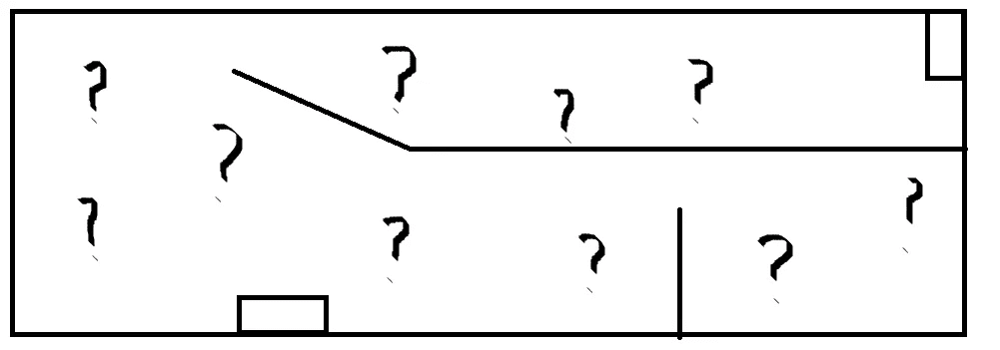

The robot could be at any one of these positions (and many more)

在文献中，机器人的这些可能位置通常被表示为小点(粒子),即粒子过滤器。从多少粒子开始？越多越好，但是我们的算法会计算缓慢。因此，一个合理的数字通常是一个不错的选择。价值取决于我们试图解决的问题。

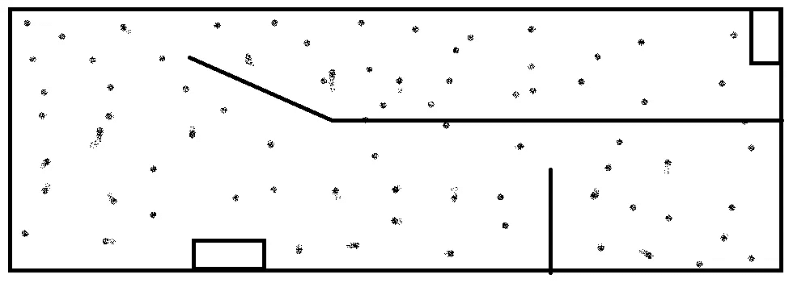

Particle Filters representing a probable position of the robot

记住每一个粒子实际上代表了机器人的一个可能的位置，因此它们中的每一个，就像机器人一样，也有一个前进的方向。

我试着在下图中画出一些粒子的方向。请注意，实际上，所有这些粒子都有一个方向。

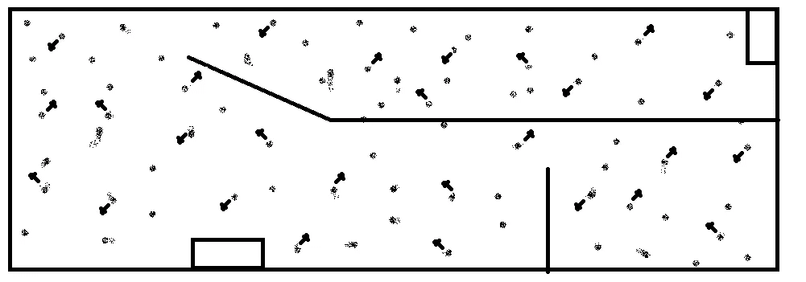

Particles represented with heading direction.

技术提示:从数学上讲，这些位置中的每一个都是同等可能的。这是一种极度混乱的状态。如果你有 30 个粒子，每个位置的概率是 1/33，也就是 0.03，即 3%

我们生成这些初始位置的方法是使用机器人位置的均匀分布，即 x 和 y 坐标以及航向方向(θ)

# 让我们的机器人动起来！

人类有多种感知事物的方式——眼睛、耳朵、鼻子等等。这就是你如何在徒步旅行区域观察周围环境并帮助你定位自己的方法。机器人没有这些，但让我们试着给它一种能力来测量到一个物体的距离，以及它能感知哪种物体。对象类型的定义是它所拥有的地图的一部分——类似于人类知道门或墙可能看起来像什么。在人工智能中，我们使用[激光雷达](https://www.geospatialworld.net/blogs/why-lidar-is-important-for-autonomous-vehicle/#:~:text=LiDAR%20%E2%80%93%20eyes%20of%20autonomous%20vehicles&text=This%20device%20is%20LiDAR%20that,them%20to%20drive%20themselves%20safely.&text=When%20the%20road%20ahead%20is,the%20vehicle%20to%20speed%20up.)进行这样的工作。

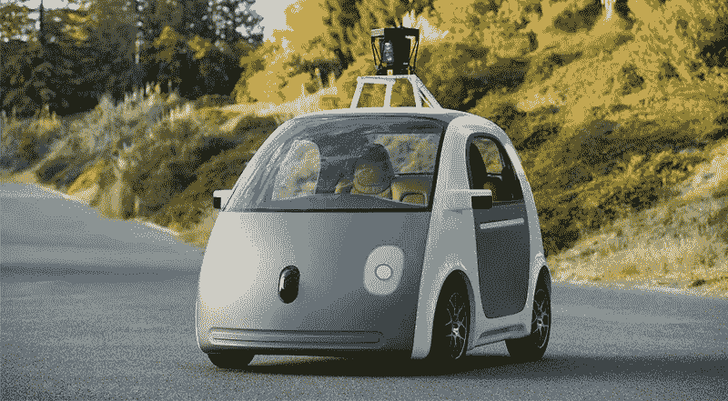

The thing on the top of this self-driving car is Lidar — car’s eyes

让我们为我们的机器人买一个吧。

Yay! Your robot has a Lidar now

现在，我们的机器人有一种感知事物的方法(以及到物体的距离)，让我们让它移动并进行测量，这意味着使用激光雷达来感知它在运动一步后感知到的东西。

**第一步之后会发生什么？**

1.  在机器人运动的第一次迭代之后，我们对机器人看到的东西进行了测量(由于我们的机器人并不完美，所以有噪声)
2.  现在对于每一个粒子，我们发现如果那个位置是机器人的话，激光雷达会返回什么
3.  接下来，基于步骤 1 和 2，我们确定粒子与机器人运动的一致性

假设我们的机器人能感知墙壁。

注意:假设第一次测量是一面墙，那么它的表现形式将与机器人自己对墙的表现形式相匹配。机器人将尝试将其测量值与所有可能的表示进行匹配，并选择最佳匹配。在我们的例子中，它是一堵墙。

让我们想象一下，我们的机器人只走了一步就感觉到了一堵墙。使用上面分享的步骤，所有面向墙壁的粒子将有很大概率是机器人的实际位置。因此，所有不面向墙壁、面向门/窗或靠近角落的粒子将具有低概率。

这一步的输出如下图所示。具有大概率的粒子被放大，而其他粒子的尺寸被减小。在数学上，这是通过将大概率分配给可能的位置，而将小概率分配给其他粒子来实现的。

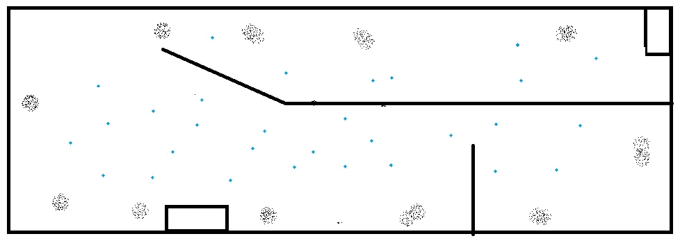

Particle filters after 1st move

技术说明:这种位置分布不是高斯分布。因此，像卡尔曼滤波器这样的滤波器在这里没有用。

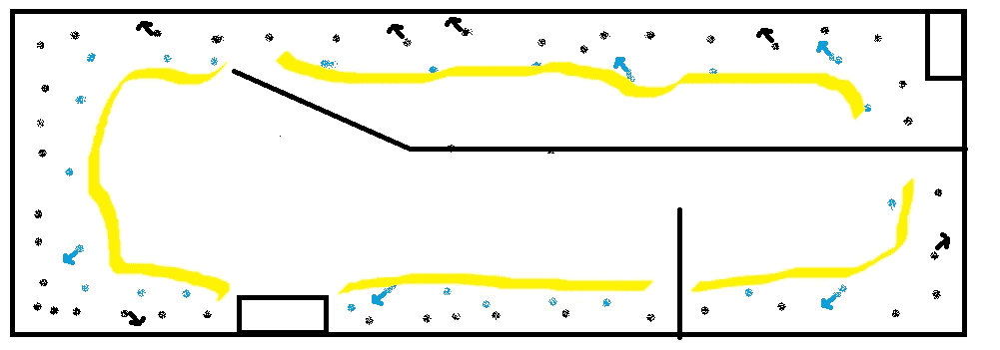

Non-Gaussian distribution represented using yellow markings

接下来，让我们去掉低置信度的粒子。这样，粒子的总数会显著减少。为了确保粒子不会消失，我们将像以前一样对相同数量的粒子进行重新采样，但现在所有的粒子都在可能的位置附近(这是一堵墙)。这种选择高置信度粒子的策略被称为**适者生存**。

输出如下所示

Particles after resampling (not all directions are marked)

让我们的机器人再走一步，假设它这次感觉到了一个角落。使用适者生存的规则，我们将最终只有几个位置，因为角落是一个独特的位置

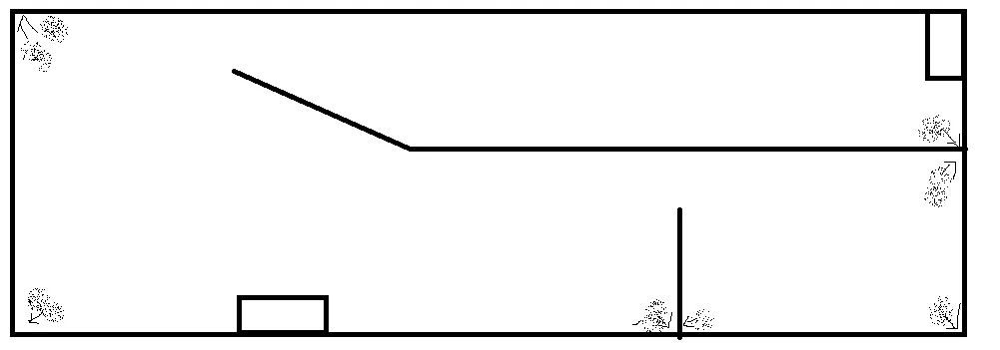

Particles after sensing corner

让我们重新取样

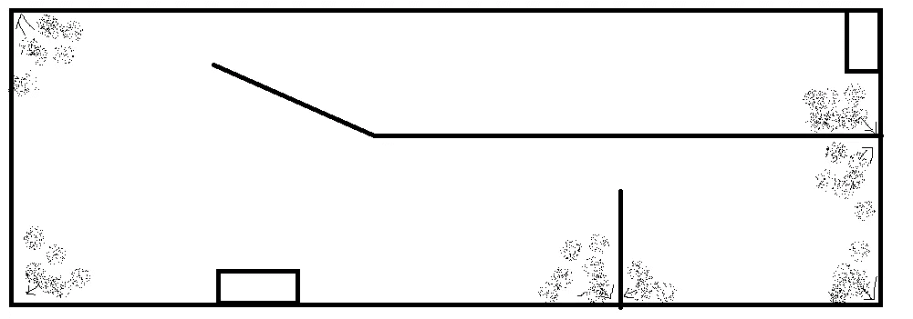

Resampled particles

让我们再做几个动作，想象机器人感觉到另一个角落，如下图所示

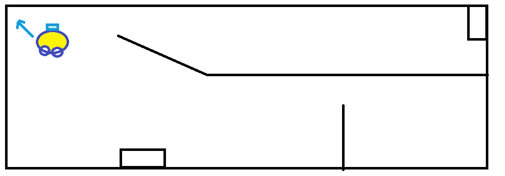

The robot senses another corner after a couple of more moves

该步骤仅产生一个可能的位置，如下所示

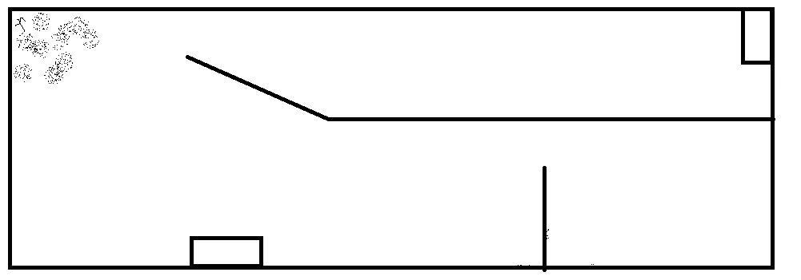

Possible position of the robot

在这一步，你的过滤器有一个机器人在哪里的公平想法。这就解决了机器人的定位问题。现在你的机器人知道了它的位置，并且有了建筑物的地图，它可以开始行走了！

技术提示:重新采样的最佳方式是什么？

每一个粒子都有一个与之相关的重量，这个重量与它与我们的机器人运动的一致性成正比。一种常见的权重重采样技术称为“重采样轮”。

在[重采样轮](https://www.youtube.com/watch?v=wNQVo6uOgYA)中，权重以饼图的形式显示如下。重量越大，它所覆盖的部分就越多。

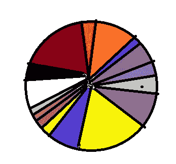

Particles represented based on their weight

重新采样的步骤:

1.  在轮子上随机选择一个位置
2.  找到一个重量值，其最大值可以是最大重量的两倍。这个值被称为β
3.  如果在步骤 1 中选取的位置权重小于β，则选取该粒子并将其添加到重采样列表中
4.  如果不是，从β中减去步骤 1 中粒子的重量值，然后移动到下一个粒子。这将是馅饼中的下一个粒子。如果这个粒子的重量也小于β，那就选它。否则，继续寻找下一个粒子，除非满足权重条件
5.  重复步骤 2–4n 次，这是重采样的大小

请注意，重采样轮是一种基于概率的算法，因此选择权重较高的粒子的机会更多。这允许粒子被多次拾取。虽然总有可能选不到好的粒子。

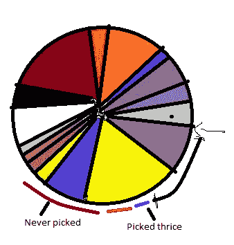

用于车轮重采样的 Python 代码:

Python code for Wheel Resampling

代码摘自[这篇博客](https://calebmadrigal.com/resampling-wheel-algorithm/#:~:text=So%20to%20accomplish%20this%20task,likelihood%20of%20it%20being%20picked.)

何时使用粒子过滤器？

1.  粒子过滤器有利于跟踪这类问题
2.  对于某些领域(通常超过 4 维)，粒子滤波器的复杂性呈指数增长，因此使它们不是一个好的选择

我希望这篇文章能帮助你理解粒子过滤器是如何工作的。以及如何利用它们，机器人可以学会朝正确的方向行走