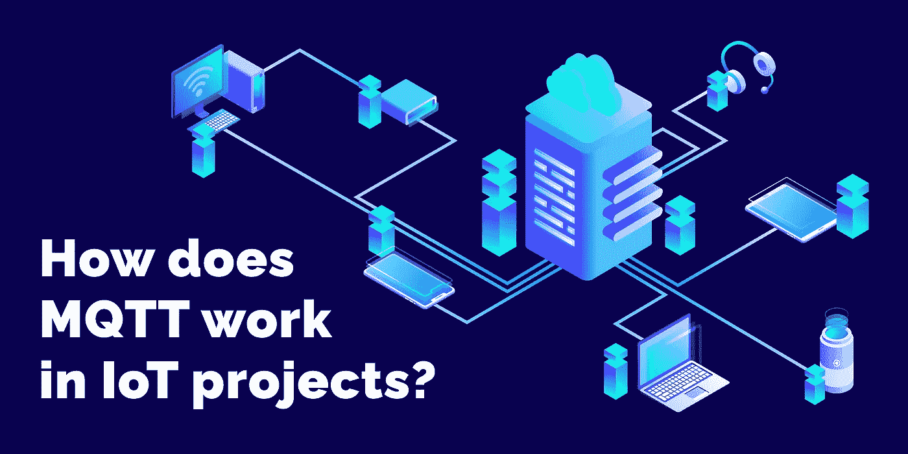
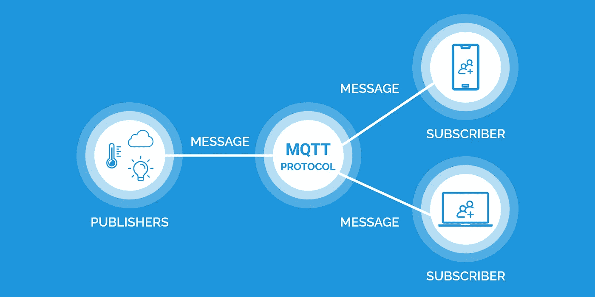
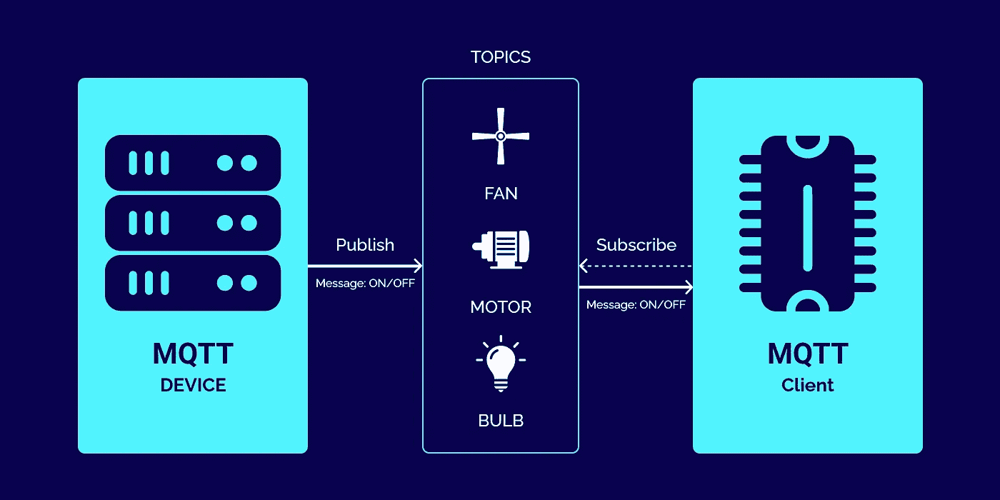
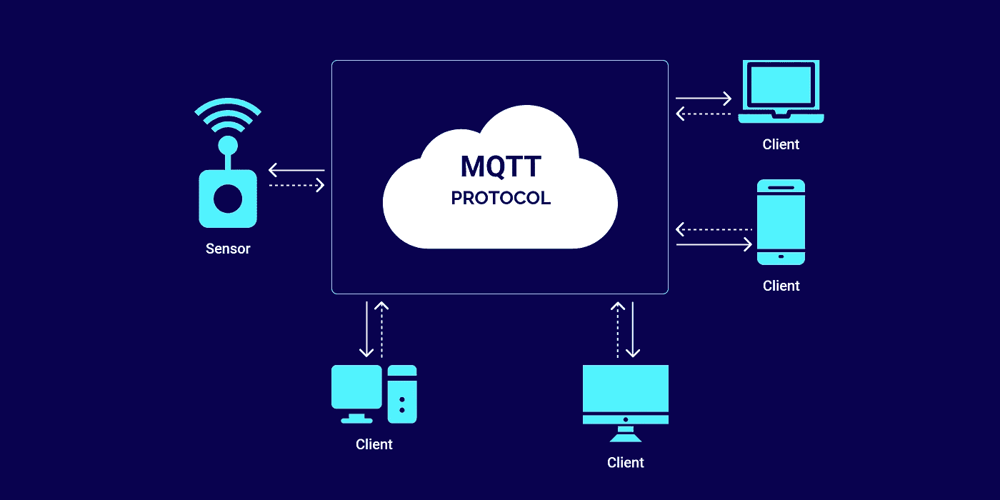

# MQTT 在物联网项目中是如何工作的？

> 原文：<https://medium.com/geekculture/how-does-mqtt-work-in-iot-projects-a32f38383472?source=collection_archive---------19----------------------->

如果你认为互联网改变了你的生活，请三思。物联网将再次改变这一切！

**IoT 是什么？**

[物联网](https://en.wikipedia.org/wiki/Internet_of_things)或物联网，指的是全球数十亿台物理设备通过互联网相互连接。收集和共享数据。将所有这些不同的对象连接起来，并为它们添加传感器，为这些设备增加了一个智能级别，使它们能够在没有人类参与的情况下交流实时数据。这些设备从普通的家用物品如灯泡、恒温器到复杂的工业工具、计算机等等。以前蓝牙和射频(射频)用于控制物联网应用，但仅限于短距离。添加 MQTT 功能有助于通过安全地自动化物联网设备来克服内部通信问题。

**什么是 MQTT？**

MQTT 是物联网项目中最常用的协议之一。[MQTT(**M**message**Q**ueuing**T**elemetry**T**transport)](https://en.wikipedia.org/wiki/MQTT)是一个工作在 TCP/IP 协议之上的消息协议。MQTT 也可以在 SSL/TLS 上运行。SSL/TLS 是建立在 TCP/IP 基础上的安全协议，用于确保设备之间的所有数据通信都是加密和安全的。MQTT 是一种轻量级协议，它使用发布/订阅操作在客户机和服务器之间交换数据。此外，它的小尺寸、低功耗、最小化的数据包和易于实现使该协议成为“机器对机器”或“物联网”世界的理想选择。

与 HTTP 的请求/响应范式不同，MQTT 是事件驱动的，客户端接收发布的消息。这种类型的体系结构将客户端彼此分离，以实现高度可伸缩的解决方案，而不依赖于数据生产者和数据消费者。

**MQTT 是如何工作的？**

MQTT 使用您现有的互联网家庭网络向您的物联网设备发送消息，并对消息做出响应。

MQTT 的核心是 **MQTT 代理**和 **MQTT 客户**。代理负责在发送者和合法接收者之间发送消息。MQTT 客户机向代理发布消息，其他客户机可以订阅代理来接收消息。每条 MQTT 消息都包含一个主题。客户机发布特定主题的消息，MQTT 客户机订阅它们想要接收的主题。MQTT 代理使用主题和订阅者列表将消息发送给适当的客户机。如果从订阅客户端到代理的连接中断，那么代理将缓冲消息，并在订阅者重新联机时将消息发送给订阅者。如果从发布客户端到代理的连接在没有通知的情况下被断开，那么代理可以关闭该连接，并向订阅者发送一条缓存的消息，其中包含来自发布者的指令。

# MQTT 组件:

在 MQTT 中，您需要理解一些基本概念:

1.  **代理** —代理是将信息分发给与服务器相连的感兴趣的客户端的服务器。这是发布/订阅协议的核心。MQTT 代理经过优化设计，可以处理成千上万个并发连接的 MQTT 客户机。
2.  **客户端** —连接到代理以发送或接收信息的设备。MQTT 客户机，无论是订阅者还是发布者(或者两者都在一个设备中),都可以是从小的微控制器到成熟的服务器的任何设备，它们运行 MQTT 库，并通过任何类型的网络连接到 MQTT 代理。
3.  **主题** —消息通过代理从发布者到达一个或多个使用主题的订阅者。主题是分层的 UTF-8 字符串。客户端发布、订阅或同时发布和订阅主题。换句话说，主题是您注册对收到的消息感兴趣的方式，或者是您指定要将消息发布到哪里的方式。
4.  **发布** —客户端根据主题名称向代理发送信息，以分发给感兴趣的客户端。
5.  **订阅** —客户告诉经纪人他们感兴趣的话题。当客户端订阅一个主题时，发布到代理的任何消息都会被分发给该主题的订阅者。客户还可以**取消订阅**以停止接收来自经纪人的关于该主题的消息。
6.  [**QoS** —服务质量](https://en.wikipedia.org/wiki/Quality_of_service)。每个连接可以为代理指定一个服务质量，其整数值范围为 0-2。QoS 不影响 TCP 数据传输的处理，只影响 MQTT 客户机之间的传输。

> **1** 指定最多一次，或一次且仅一次，无需确认交付。这通常被称为一了百了。
> 
> **2** 指定至少一次。消息被发送多次，直到收到确认，也称为确认传递。
> 
> **3** 指定正好一次。发送方和接收方客户端使用两级握手来确保只接收到消息的一个副本，这被称为可靠传递。

# 如何在家庭自动化中使用 MQTT？

在当今世界，自动化已经变得非常重要，并且正在我们日常生活中的许多应用中使用。家庭自动化系统(HAS)是在没有太多人类参与的情况下控制家用电器或环境的系统。它省电、省时、省力，比传统系统更高效。家庭环境监控是一个主要的物联网应用，它涉及对家庭内外环境的监控。通过使用物联网技术，用户可以创建先进的家庭自动化系统，从而提高生活质量。让我们举一个这样的例子。

**举例:**

假设我们的家庭自动化系统由一个可以在移动设备的帮助下控制的电灯泡组成。用户将使用[移动应用程序](https://www.codecrafttech.com/mobile-app-development-usa.html)来切换灯开关，该状态将被发送到 mqtt 代理。另一方面，电灯泡在微控制器的帮助下接收用户发送的状态。为此，移动设备将首先定义它想要发布的主题，然后只有它才会发布消息。与此同时，连接在灯泡上的微控制器也支持同样的主题。然后，一旦它接收到设备发布的消息，它就会根据状态切换灯光。它可能还希望发布到另一个主题，以便其他客户端可以监控该灯的状态。同样，这里的代理角色是接收消息并将其传递给订阅的客户端。

主题是您注册对收到的消息感兴趣的方式，或者是您指定要将消息发布到哪里的方式。主题用正斜杠分隔的字符串表示。每个正斜杠表示一个主题级别。还要记住主题是区分大小写的。如果你想控制多个房间的多盏灯，你需要为这些灯想出独特的主题。假设我们想打开卧室灯，主题将是**家/卧室/灯。**

现在我们有了两个客户端，第一个移动应用程序将发布到主题“**家/卧室/灯**”，每次我们按下应用程序中的按钮时，都会显示“**开**”或“**关**”的消息。在我们的演示中，我们使用的是来自 google play 商店的“MyMqtt”应用程序。第二个客户端将订阅“**家/卧室/灯**”，并通过打开或关闭灯泡来响应该消息。随后，它将发布“**开**”或“**关**”的消息到另一个主题，如“**卧室/灯/状态**”，以便其他客户端可以监控该灯的状态。

# MQTT 经纪人的云？

对于任何项目来说，MQTT 本地代理都是一个相当耗时且要求很高的解决方案。如果我们谈论的是物联网解决方案的快速启动，那么使用 MQTT 代理的服务器启动您自己的数据中心将需要资源来进行初始启动和安装。此外，在迁移到新服务器时，扩展和伸缩内部代理会产生许多问题。

现在让我们将这个解决方案与云服务进行比较，在云服务中，您可以以最小的成本将您的项目快速连接到高质量的服务，并开始使用 MQTT 协议。借助[云服务](https://www.codecrafttech.com/cloud-solutions-usa.html)，您还可以获得项目支持和服务器上已配置的安全系统，以及几乎无限制地增加容量的能力。将 MQTT 代理放在云中对于小型项目和公司级项目来说都是一个成功的策略。基于云的 MQTT 代理有很多，比如:

> 亚马孙
> 
> 云 MQTT
> 
> 谷歌云物联网核心
> 
> 赫罗库
> 
> 国际商用机器公司
> 
> 微软 Azure 物联网

# 结论

MQTT 是基于发布和订阅系统的通信协议。它使用简单，非常适合物联网和家庭自动化项目。另一方面，选择合适的云提供商来服务 MQTT 也为您提供了很多选择，您可以在现有的云中使用消息代理，或者选择最适合您的任务的。

原始资料:[MQTT 如何在物联网项目中工作](https://www.codecrafttech.com/resources/blogs/how-does-mqtt-work-in-iot-projects.html)