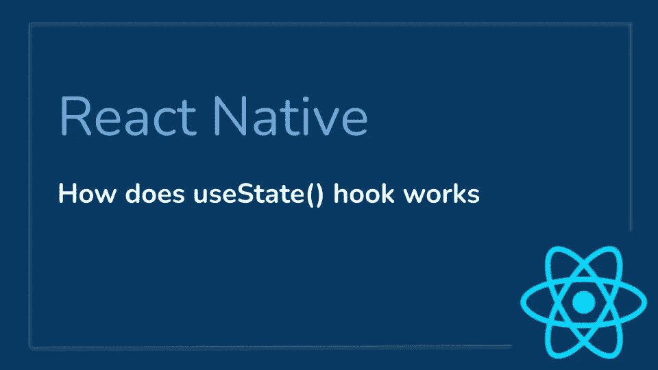

# useState() hook 是如何工作的(React Native Example)？

> 原文：<https://medium.com/geekculture/how-does-usestate-hook-works-react-native-example-c601e81a6611?source=collection_archive---------5----------------------->

人们通常说“一切都是为了完成工作”。这句话非常适合一些初露头角的软件工程师，他们只想通过比预期时间更早交付任务来给客户或经理留下深刻印象。在这种情况下，我们只关注输出，而不是关注概念的正确实现。在我看来，用软件工作就像弹吉他或钢琴。你敲击几根弦或按下一个键，你仍然能听到声音。类似地，您以变通的方式或调整的方式编写代码，软件仍然可以工作。然后有一天(主要是演示日😁)那个不速之客出现了。不是别人，正是我们可爱的虫子。然后，我们将成为那些毫无头绪的工程师，他们将成为夜猫子，不惜任何代价试图修复那个 bug。在这个过程中，有些人会发明自己的模式和反模式什么的。因此，这将形成一个循环。为了避免所有这些戏剧性的副作用，我们在写任何一行代码之前只需要做一件事——理解。那么这将是一个美丽的旅程，你会爱上编码。



React 是一个棘手但奇妙的框架，一旦我们正确理解它，我们就可以用它创造奇迹。在他们引入钩子之后，它也变得更有趣了。当你写类组件时，你面对的每一个问题或困惑都有钩子。下面我试图解释我所知道的关于 useState() hook 的所有概念。我使用了一个 React 本地应用程序作为示例应用程序来解释日志。我希望你会喜欢这本书！！

# Case:- 1 在 useState()挂钩后面

`useState` hook 帮助我们在函数组件中拥有状态变量。因此，功能组件不再是无状态的。由于这个原因，React 建议称它们为“功能组件”。`useState`是一个函数，它接受初始状态作为参数，并返回一个状态值和一个更新该值的函数。这可以确保 React 保留重新渲染之间的状态。`useState`钩子可以用来跟踪字符串、数字、布尔值、数组、对象以及它们的任意组合。想象够了吧..？！！现实中来看看这个吧。尝试执行下面的代码。


我们现在知道 useState 返回一个数组，我们可以使用数组析构来减少上面的代码。

```
const [message, setMessage] = useState('Hello React')console.log(`State value is ${message}`)
```

因此，这里变量*消息*可用于获取状态值，而*设置消息*可用于更新状态。在下一节中，我们将看到当我们调用 *setMessage()* 并尝试更新状态值时会发生什么。

# 情况:- 2 useState()是异步的

在上面的代码中，我们从用户那里获取一条输入消息，单击“保存”按钮，我们调用 setMessage()来更新状态值。此外，我们试图在调用 setMessage()函数后立即访问状态值。我们来分析一下日志。


是的，你注意到了..！！！React 没有在 setMessage()函数调用后立即更新状态值。它对该操作进行排队，并且在组件重新呈现后，用最近的状态值更新状态值。因此，如果我们试图在组件重新渲染之前使用状态值来存储到 DB 或传递到其他函数，那么我们将使用以前的值。这解释了 useState 的异步行为，即使它不返回承诺。

# 案例:- 3 次多次调用来设置状态

在本节中，我们将看到当我们一起调用多个 setState 时会发生什么。这里单击一个按钮，我调用 3 个 setState 函数来更新状态值。


如果您预期三个 setState 将导致组件的三次重新呈现，那么您必须继续阅读下面几行。当多次调用 setState 函数时，React 批处理这些调用，并且当调用代码在基于 React 的事件处理程序中时，触发器仅重新呈现一次。但是如果 setState 是异步触发的，React 不会批量调用 setState，而是每次调用都会触发一次重新呈现。尝试将以下代码添加到*handleButtonClickListener*中，并检查日志。

```
setTimeout(()=>{setCount(val => val+1)setCountTen(val => val+1)setCountHund(val => val + 1)}, 1000)
```

在这种情况下，让我们再尝试一种变化。我们将多次调用同一个状态更新函数调用，并查看结果。将以下代码添加到*handleButtonClickListener*函数中，并验证日志。在这种情况下，React 也将批处理这些多个调用，并用最新更新的值更新状态值(这里 count = 4)。

```
const handleButtonClickListener = () => {console.log('Click Me Button Clicked')setCount(val => val+1)setCount(val => val+1)setCount(val => val+1)setCount(val => val+1)}
```

# 情况:- 4 获取更新的状态值

如果我们只想在状态值更新后触发一些 API 调用，该怎么办？如果我们把它直接写在 render 函数中，每次组件被重新渲染时，它都会被调用。为此，我们可以将状态值作为依赖项来使用 useEffect 钩子。因此，只有当状态值发生变化时，才会触发 useEffect。您可以执行下面的代码并验证日志。点击“保存”按钮后，消息的状态值将在重新呈现后更新。同样，使用效果也会被触发。然后你点击“点击我”按钮。现在您可以看到组件被重新呈现，但是 useEffect 没有被触发，因为 message 的 state 值没有变化。


useState 使组件中的状态管理变得非常精简和简单。一旦你理解了它的不同行为，你可以毫不犹豫地在任何地方使用它。我建议你们所有人都尝试一下上面的例子，而不是仅仅为了修复错误或重新开始而阅读它们。通过自己尝试，你可以有更深入的理解，你将永远不会忘记这些概念。通过这篇文章，我相信我可以消除你们很多人对 useState hook 的疑虑。

如果你觉得这篇文章是有帮助的，请留下一些掌声并跟随我，这样它就可以到达所有需要的人。同时，这也是我分享更多类似话题的巨大动力。#永不停止学习