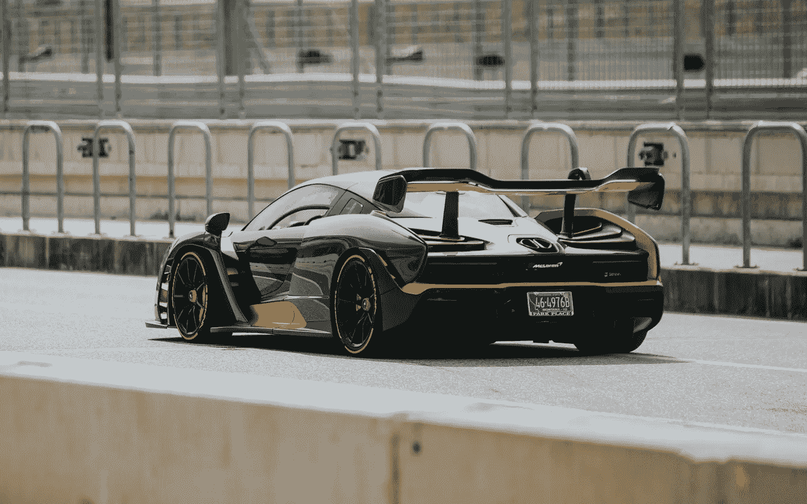

# 无人驾驶汽车会是汽车爱好者的梦想吗？

> 原文：<https://medium.com/geekculture/how-driverless-cars-could-become-a-car-lover-s-dream-e4cdf6e0ccdb?source=collection_archive---------25----------------------->

Photo by [Spencer Davis](https://unsplash.com/@spencerdavis?utm_source=unsplash&utm_medium=referral&utm_content=creditCopyText) on [Unsplash](https://unsplash.com/s/photos/senna?utm_source=unsplash&utm_medium=referral&utm_content=creditCopyText)

我从事广告创意工作已经十多年了，在此期间，我策划了几个获奖的汽车广告。我职业生涯的很大一部分都是在识别和挤压我们与汽车之间微妙的情感联系。在接下来的十年里，汽车将会比历史上任何时候都发生更彻底的变化，而我们的情感需求将会保持不变。这就引出了一个问题，对于任何喜欢驾驶的人来说，我们到底怎么会爱上“无人驾驶”汽车呢？

让我们回顾一下。就在十年前，我们都对电动汽车持同样的怀疑态度。第一批特斯拉从生产中出现，就像小海龟从沙子里探出头来一样；他们似乎没有机会。十年过去了，埃隆·马斯克已经证明反对者是错误的，随着汽油被吸入历史书，插件充斥着我们的街道。

事实证明，埃隆并没有喝特斯拉的库尔 aid，现在主要汽车品牌都致力于过时他们的耗油传统；[捷豹](https://www.motortrend.com/news/jaguar-land-rover-electrification-plans-2025/)承诺到 2025 年实现全电动化，一半的[宝马](https://www.reuters.com/article/us-bmw-results/bmw-expects-at-least-half-of-sales-to-be-electric-cars-by-2030-idUSKBN2B90S7)到 2030 年实现全电动化，这一切正在快速发生。随着社会全面转向电动，早期采用者将开始转向[【无人驾驶】](https://www.bbc.com/news/technology-56906145)汽车。这不是科幻小说。某种形式的自动化是一个非常成熟的概念。自 1968 年大众汽车引入电子燃油喷射系统以来，计算机就已经出现在量产汽车中。半个多世纪以来，他们一直在幕后工作，就像一种提高成绩的药物，改善我们的一举一动。

然而，特斯拉的成功对制造商和消费者来说是一剂强心针。现在，在一个紧凑的时间空间里，一切似乎都有可能。我们离自动化成为现实已经很近了，但是要想让它成功，还有一个巨大的情感和心理障碍需要克服。

# 汽车公司需要让我们相信，我们所有的汽车没有我们会开得更好，如果我们退居二线，我们会更喜欢它们。

特斯拉通过理解和拥抱我们喜欢的汽车、好看的外观、酷的小玩意、速度和更多的速度，战胜了困难。对于自动驾驶，也就是司机，坚持这个公式，事情会变得非常令人兴奋。

我们有数以吨计的数据，这些数据来自我们星球上最受喜爱的车手，最早可以追溯到 1978 年。那一年，Tyrrell F1 开创了遥测技术，即安装传感器来收集汽车数据的过程。从那以后，遥测技术一直记录着史诗般的比赛、标志性的赛季，甚至是 F1 整个职业生涯中的每一次曲折和颠簸。这些数据可以被回收，并用于对无人驾驶汽车的自动驾驶进行编程。

这并不是一个全新的想法。2016 年，本田使用了艾尔顿·塞纳 1989 年铃鹿赛道的遥测数据，并用灯光和声音重现了它。

所以这是可能的，但这是否意味着我们未来的道路会类似圣保罗大道或银石赛道？这不太可能，但不难想象一辆[迈凯轮塞纳](https://www.automobilemag.com/news/mclaren-reveals-sensational-senna/) type 2 或 type 3 可能不仅仅是一种敬意。在车内的某个地方，可能会有一个显示着“塞纳”这个显赫名字的按钮，按下它就会召唤出“有史以来最伟大的车手”之一。