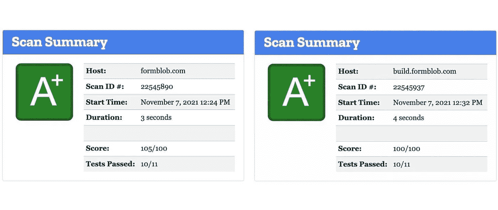

# 如何让你的网站在 Mozilla Observatory 上获得 A+安全等级(第 2 部分——Nginx)

> 原文：<https://medium.com/geekculture/how-i-got-an-a-security-grade-on-mozilla-observatory-part-2-nginx-d80d8ad07568?source=collection_archive---------18----------------------->



FormBlob’s Mozilla Observatory Grades

在用 Hugo 重写了 FormBlob 网站之后，我想确保该网站遵守安全最佳实践，并且不容易受到任何已知问题的攻击。我开始寻找一种网站安全措施，并找到了 Mozilla Observatory。在我的第一次扫描中，我得到了 C 级。虽然不是特别糟糕，但我想纠正发现的任何缺陷，以尽可能取得最好的成绩。这也是一个学习更多网站安全知识的机会。

# 那么什么是 Mozilla 天文台呢？

以下引文直接摘自 https://observatory.mozilla.org/faq 的常见问题。

> 观察站测试针对跨站点脚本攻击、中间人攻击、跨域信息泄漏、cookie 泄露、内容传递网络泄露和不正确颁发证书的预防措施。
> 
> 但是，它不会测试过时的软件版本、SQL 注入漏洞、易受攻击的内容管理系统插件、不正确的密码创建策略或存储程序等。这些和天文台测试的内容一样重要，网站运营商不应该仅仅因为它们在天文台的得分高而忽视它们。

虽然听起来可能有点拗口，但这些测试在很大程度上衡量了您的网站对于一些最常见的恶意攻击的脆弱性，这些攻击利用了网站开发人员在设置安全网络配置方面的疏忽。

# FormBlob 设置

我将这篇文章中的讨论分成两部分——一部分针对 https://formblob.com 的，另一部分针对 https://build.formblob.com 的。这是因为主站点是一个使用 Hugo 构建并部署在 Netlify 上的静态站点，而表单构建器站点是一个部署在 AWS ECS 上的 React 应用程序，位于弹性负载平衡器(ELB)之后。

这是文章的第二部分，讨论如何设置 Nginx 以获得 A+的成绩。第一部分讨论如何建立网络生活，点击这里。

# 入门指南

为了提高 Mozilla Observatory 扫描的分数，您需要添加 HTTP 响应头。要向 Nginx 添加 HTTP 响应头，您需要在“nginx.conf”文件中编辑服务器上下文。这里，我假设您对 Nginx 足够熟悉，可以设置配置文件。下面我列出了为获得 A+等级而添加的标题和配置的完整列表。

```
server {
  listen 80; ... return 301 [https://$host$request_uri;](https://$host$request_uri;)
} server {
  listen 443: ... # Only connect to this site and subdomains via HTTPS for the next two years
  add_header Strict-Transport-Security "max-age=63072000; includeSubDomains; preload"; # Only allow my site to frame itself
  add_header X-Frame-Options "SAMEORIGIN"; # Prevent browsers from incorrectly detecting non-scripts as scripts
  add_header X-Content-Type-Options "nosniff"; # Block pages from loading when they detect reflected XSS attacks
  add_header X-Xss-Protection "1; mode=block"; # Only send the shortened referrer to a foreign origin, full referrer to a local host
  add_header Referrer-Policy "strict-origin-when-cross-origin"; # Configue CSP
  add_header Content-Security-Policy "default-src 'self' formblob.com *.formblob.com fblob.me *.fblob.me; connect-src 'self' formblob.com *.formblob.com wss://*.formblob.com fblob.me *.fblob.me https://sockjs-mt1.pusher.com firebase.googleapis.com firebaseinstallations.googleapis.com https://www.googleapis.com/webfonts/ www.google-analytics.com; font-src 'self' https://fonts.gstatic.com; img-src https: data: blob: www.googletagmanager.com https://ssl.gstatic.com https://www.gstatic.com; media-src https: data: blob:; script-src 'self' 'unsafe-eval' js.stripe.com https://www.googletagmanager.com https://www.google.com/recaptcha/ https://www.gstatic.com/recaptcha/ 'sha256-TQ+edvHvrQ4+h8G+tZQdFsQSrUAeSfwE/D8KjAzDnT0='; style-src 'self' 'unsafe-inline' fonts.googleapis.com; frame-src 'self' formblob.com *.formblob.com fblob.me *.fblob.me js.stripe.com https://www.google.com/recaptcha/ https://recaptcha.google.com/recaptcha/; frame-ancestors 'self' formblob.com *.formblob.com fblob.me *.fblob.me;";...}
```

# 考试成绩

Mozilla Observatory 根据一组预定义的测试对您的网站进行评分。让我们逐个检查每个测试。


Mozilla Observatory Test Scores

## 内容安全政策

内容安全策略(CSP)使您能够精确控制哪些资源可以加载到您的网站上，以及允许从哪里加载这些资源。它旨在保护您的网站免受跨站脚本(XSS)漏洞。XSS 漏洞源于不安全的内嵌 Javascript，禁用该漏洞可有效消除大多数 XSS 攻击。然而，禁用不安全的内联也意味着所有的 Javascript 都必须从`<script src="">`标签加载。在`<script>`标签中但没有通过`src`加载的 Javascript 将无法执行。

配置 CSP 是一个繁琐的过程，需要您评估网站上加载的所有脚本和样式的来源。在我们深入研究每个策略之前，先看一下我在 FormBlob 上部署的完整 CSP。请注意，为了便于阅读，我将每个指令都拆分到了单独的一行。部署时，整个 CSP 必须在一行中。

```
# Configure CSPadd_header Content-Security-Policy "default-src 'self' formblob.com *.formblob.com fblob.me *.fblob.me;connect-src 'self' formblob.com *.formblob.com wss://*.formblob.com fblob.me *.fblob.me https://sockjs-mt1.pusher.com firebase.googleapis.com firebaseinstallations.googleapis.com https://www.googleapis.com/webfonts/ www.google-analytics.com;font-src 'self' https://fonts.gstatic.com;img-src https: data: blob: www.googletagmanager.com https://ssl.gstatic.com https://www.gstatic.com;media-src https: data: blob:;script-src 'self' 'unsafe-eval' js.stripe.com https://www.googletagmanager.com https://www.google.com/recaptcha/ https://www.gstatic.com/recaptcha/ 'sha256-TQ+edvHvrQ4+h8G+tZQdFsQSrUAeSfwE/D8KjAzDnT0=';style-src 'self' 'unsafe-inline' fonts.googleapis.com;frame-src 'self' formblob.com *.formblob.com fblob.me *.fblob.me js.stripe.com https://www.google.com/recaptcha/ https://recaptcha.google.com/recaptcha/;frame-ancestors 'self' formblob.com *.formblob.com fblob.me *.fblob.me;";
```

我使用了与 FormBlob 相关的完整指令列表的子集。在这里，我将只讨论这些指令和其他一些常见的指令。你可以在这里阅读更多关于[指令的完整列表。此外，作为开始，我建议使用标题`Content-Security-Policy-Report-Only`而不是`Content-Security-Policy`来获得所有违规的报告，而不会破坏您的网站。](https://developers.google.com/web/fundamentals/security/csp)

- `[default-src](https://developer.mozilla.org/en-US/docs/Web/HTTP/Headers/Content-Security-Policy/default-src)`是其他获取指令的回退指令。被指定的指令没有继承，而没有被指定的指令将回退到`default-src`的值。这里，您想要包含`'self’`(具有相同方案和端口的源站点)和其他受信任的域。我包括 cloudfront.net，因为这是 Netlify 提供资源的 CDN。对此的推荐设置是`none`，这将要求您几乎每隔一个指令设置一次。

- `[connect-src](https://developer.mozilla.org/en-US/docs/Web/HTTP/Headers/Content-Security-Policy/connect-src)`提供对获取请求、XHR、事件源、信标和 websockets 连接的控制。这定义了您需要连接的任何资源。对于 websocket 连接，您必须设置相关的方案。比如 wss://\*.formblob.com。

- `[font-src](https://developer.mozilla.org/en-US/docs/Web/HTTP/Headers/Content-Security-Policy/font-src)`指定从哪个 URL 加载字体。如果你使用谷歌字体，这个指令应该包括`[https://fonts.gstatic.com](https://fonts.gstatic.com)数据:`。

- `[img-src](https://developer.mozilla.org/en-US/docs/Web/HTTP/Headers/Content-Security-Policy/img-src)`指定可以从中加载图像的 URL。如果你使用谷歌标签管理器，这个指令应该包括[www.googletagmanager.com](http://www.googletagmanager.com)https://ssl.gstatic.comhttps://www.gstatic.com。

- `[media-src](https://developer.mozilla.org/en-US/docs/Web/HTTP/Headers/Content-Security-Policy/media-src)`指定视频、音频和文本轨道资源可以加载的 URL。

- `[manifest-src](https://developer.mozilla.org/en-US/docs/Web/HTTP/Headers/Content-Security-Policy/manifest-src)`指定可以从中加载应用程序清单的 URL。

- `[script-src](https://developer.mozilla.org/en-US/docs/Web/HTTP/Headers/Content-Security-Policy/script-src)`指定可以执行脚本的位置。如果您使用 Google Tag Manager，推荐的方法是对 GTM 脚本使用 [nonce 方法](https://developers.google.com/tag-manager/web/csp)。我在这里包含了`'unsafe-eval'`关键字，因为 FormBlob 使用了一种高度净化的`Function()`方法来评估先前设置的字段，以个性化用户完成表单的体验。这是所有表单构建者的典型特征。

-在这个指令中，我还包含了一个散列关键字`'sha256-TQ+edvHvrQ4+h8G+tZQdFsQSrUAeSfwE/D8KjAzDnT0=’`。您可以使用散列脚本作为关键字，以允许加载任何脚本。对于任何违反指令的脚本，控制台中的报告都会自动生成该哈希。您可以将散列和单引号一起直接复制到指令中，以允许脚本。

- `[style-src](https://developer.mozilla.org/en-US/docs/Web/HTTP/Headers/Content-Security-Policy/style-src)`控制样式应用于文档的位置。这包括`<link>`元素、`@import`规则和来自`Link` HTTP 响应头字段的请求。你可能注意到我包含了`'unsafe-inline'`关键词。这是因为我使用材质 UI 直接改变了内嵌样式。同样，这是您应该尽可能避免的潜在漏洞。如果使用谷歌字体和/或谷歌标签管理器，你应该包括 fonts.googleapis.com[https://tagmanager.google.com](https://tagmanager.google.com`)。

- `[frame-src](https://developer.mozilla.org/en-US/docs/Web/HTTP/Headers/Content-Security-Policy/frame-src)`限制可以嵌入网站的 URL。

- `[form-action](https://developer.mozilla.org/en-US/docs/Web/HTTP/Headers/Content-Security-Policy/form-action)`限制表单可以提交到的 URL。

- `[frame-ancestors](https://developer.mozilla.org/en-US/docs/Web/HTTP/Headers/Content-Security-Policy/frame-ancestors)`限制可以在`<frame>`、`<iframe>`、`<object>`、`<embed>`或`<applet>`元素中嵌入所请求资源的 URL。该指令不能回退到 default-src 指令。如果设置了此选项，用户代理将忽略 X-Frame-Options。

- `[upgrade-insecure-requests](https://developer.mozilla.org/en-US/docs/Web/HTTP/Headers/Content-Security-Policy/upgrade-insecure-requests)`指示用户代理重写 URL 方案，将 HTTP 更改为 HTTPS。该指令适用于有大量旧网址需要重写的网站。

## 饼干

对于 FormBlob，所有使用的 cookie 都是在 API 服务器上创建的，用于会话跟踪，我没有在托管网站的前端服务器上设置任何 cookie。但是，如果您确实需要使用 Nginx 设置 cookie，请确保您的 cookie 使用了`Secure`标志并设置了适当的`SameSite`属性。会话 cookies 也应该有`HttpOnly`标志。Cookies 也应该在必要时尽快过期。

对于`SameSite`属性，这是对[https://developer . Mozilla . org/en-US/docs/Web/HTTP/Headers/Set-Cookie](https://developer.mozilla.org/en-US/docs/Web/HTTP/Headers/Set-Cookie)的直接引用。

> 严格意味着浏览器只为相同站点的请求发送 cookie，即来自设置 cookie 的相同站点的请求。如果请求来自不同于当前 URL 的 URL，则不会发送具有 SameSite=Strict 属性的 cookies。
> 
> Lax 表示 cookie 不会在跨站点请求(例如加载图像或框架的请求)时发送，而是在用户从外部站点导航到源站点时发送(例如，当跟踪一个链接时)。如果未指定 SameSite 属性，这是默认行为。

```
# Add a cookie with [name] and [value] that expires in 1 day (86400 seconds)
# and restricted to formblob.com and its subdomains
add_header Set-Cookie "[name]=[value]; Max-Age=86400; Path=/; Domain=formblob.com HttpOnly; Secure";
```

## 跨产地资源共享

大多数网站不需要跨源资源共享(CORS ), FormBlob 也不例外。除非特别需要，否则不应设置此值。

## HTTP 公钥锁定

只有最大风险站点才需要 HTTP 公钥锁定。大多数网站不推荐使用它，你可能也不需要它。

## HTTP 严格的传输安全性

HTTP 严格传输安全(HSTS)通知用户代理只能通过 HTTPS 连接到给定的站点，即使选择的方案是 HTTP。它与 HTTP 到 HTTPS 重定向协同工作，应该设置在来自 HTTPS 请求的响应头上。建议设置为“严格传输安全:最大年龄=63072000 ”;includeSubdomains `如果“includeSubdomains”标志存在，所有对子域的请求也将升级到 HTTPS。在包含此标志之前，请确保所有子域都可以处理 HTTPS 流量。

```
# Only connect to this site and subdomains via HTTPS for the next two years
add_header Strict-Transport-Security "max-age=63072000; includeSubDomains; preload";
```

## HTTPS 重定向

侦听端口 80 的站点应该重定向到 HTTPS 上的相同资源。一旦发生重定向，HSTS 确保所有将来的 HTTP 请求都直接发送到安全站点。下面的设置将所有 HTTP 流量重定向到 HTTPS 上完全相同的资源。

```
server {
  listen 80; ... return 301 [https://$host$request_uri;](https://$host$request_uri;)
}
```

## 推荐策略

为此有四个选项:

- `no-referrer`:从不发送引用标头
- `same-origin`:发送引用，但仅针对相同来源的请求
- `strict-origin`:向所有来源发送引用，但仅发送 URL sans 路径(例如[【https://example.com/】](https://example.com/))
-`strict-origin-when-cross-origin`:发送相同来源的完整引用，外部来源的 URL sans 路径

默认情况下，您可能希望使用“严格起源时交叉起源”。这保护了跨来源请求的用户隐私，但允许您在自己的网站内使用分析来跟踪用户。

```
# Only send the shortened referrer to a foreign origin, full referrer to a local host
add_header Referrer-Policy "strict-origin-when-cross-origin";
```

## 子资源完整性

子资源完整性(SRI)可防止攻击者修改内容交付网络(cdn)上托管的 Javascript 库的内容，从而在利用该托管库的网站中制造漏洞。SRI 使用库内容的散列来验证库没有被改变。如果有，网站将拒绝加载该库。[这里有一个生成 SRI 散列的好资源]([https://www.srihash.org/](https://www.srihash.org/))。下面是一个使用 SRI 从 FormBlob 嵌入表单的例子。

```
<script
 src=”[https://unpkg.com/@jeremyling/form-renderer@0.4.16/dist/web.min.js](https://unpkg.com/@jeremyling/form-renderer@0.4.16/dist/web.min.js)"
 integrity=”sha512–27spyugyD2KOU0tPev6hnJ2bCeKPh5WpMzEWna4uXXCSlSQcFRDxAKZDfBhJ21lF0hyBbTD1KoOXmXJwKU5NHQ==”
 crossorigin=”anonymous”
></script>
```

## x-内容-类型-选项

X-Content-Type-Options 是一个由 Internet Explorer、Chrome 和 Firefox 50+支持的头，它告诉用户代理不要加载脚本和样式表，除非服务器指示正确的 MIME 类型。如果没有这个标题，这些浏览器可能会错误地将文件检测为脚本和样式表，从而导致 XSS 攻击。

```
# Prevent browsers from incorrectly detecting non-scripts as scripts
add_header X-Content-Type-Options "nosniff";
```

## x-框架-选项

X-Frame-Options 控制您的站点在 iframe 中的框架位置。这有助于防止点击劫持，在点击劫持中，攻击者将您的站点框在恶意平台内，诱骗用户点击攻击者控制的链接。

```
# Only allow my site to frame itself
add_header X-Frame-Options "SAMEORIGIN";
```

## x-XSS-保护

X-XSS 保护是 Internet Explorer 和 Chrome 的一项功能，当它们检测到反射的 XSS 攻击时，会阻止页面加载。虽然强大的 CSP 可能会使该标头变得多余，但它可以保护不支持 CSP 的旧浏览器上的用户。

```
# Block pages from loading when they detect reflected XSS attacks
add_header X-Xss-Protection "1; mode=block";
```

# 完成 nginx.conf 配置

我们已经成功通过了每一项测试，并设置了帮助我们通过测试的配置。如果你一直跟着做，你应该得到这个设置至少一个 A 级。这里是完整配置的回顾。

```
server {
  listen 80;...return 301 [https://$host$request_uri;](https://$host$request_uri;)
}server {
  listen 443:...# Only connect to this site and subdomains via HTTPS for the next two years
  add_header Strict-Transport-Security "max-age=63072000; includeSubDomains; preload";# Only allow my site to frame itself
  add_header X-Frame-Options "SAMEORIGIN";# Prevent browsers from incorrectly detecting non-scripts as scripts
  add_header X-Content-Type-Options "nosniff";# Block pages from loading when they detect reflected XSS attacks
  add_header X-Xss-Protection "1; mode=block";# Only send the shortened referrer to a foreign origin, full referrer to a local host
  add_header Referrer-Policy "strict-origin-when-cross-origin";# Configue CSP
  add_header Content-Security-Policy "default-src 'self' formblob.com *.formblob.com fblob.me *.fblob.me; connect-src 'self' formblob.com *.formblob.com wss://*.formblob.com fblob.me *.fblob.me https://sockjs-mt1.pusher.com firebase.googleapis.com firebaseinstallations.googleapis.com https://www.googleapis.com/webfonts/ www.google-analytics.com; font-src 'self' https://fonts.gstatic.com; img-src https: data: blob: www.googletagmanager.com https://ssl.gstatic.com https://www.gstatic.com; media-src https: data: blob:; script-src 'self' 'unsafe-eval' js.stripe.com https://www.googletagmanager.com https://www.google.com/recaptcha/ https://www.gstatic.com/recaptcha/ 'sha256-TQ+edvHvrQ4+h8G+tZQdFsQSrUAeSfwE/D8KjAzDnT0='; style-src 'self' 'unsafe-inline' fonts.googleapis.com; frame-src 'self' formblob.com *.formblob.com fblob.me *.fblob.me js.stripe.com https://www.google.com/recaptcha/ https://recaptcha.google.com/recaptcha/; frame-ancestors 'self' formblob.com *.formblob.com fblob.me *.fblob.me;";...}
```

# 结束语

凭借 A+安全等级， [FormBlob](https://formblob.com) 成为市场上最安全的表单构建平台。FormBlob 尊重数据隐私，旨在确保所有数据免受恶意攻击。我们努力满足并超越所有既定的安全要求。虽然由于我们目前还不成熟，还没有获得 HIPAA 或 NIST 的正式认证，但我们的基础设施和安全设置符合这些要求，从长远来看，我们有信心获得认证。以下是 Mozilla Observatory 对其他流行的表单构建器进行基准测试的结果。

