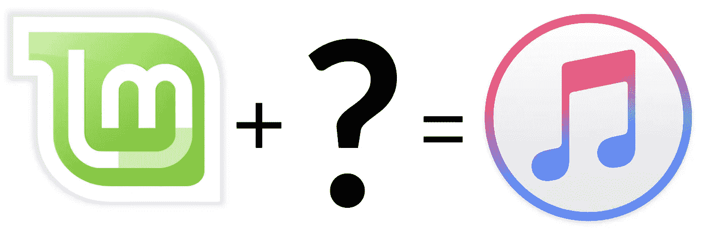

# 我如何让 iTunes 在 Linux Mint 20.1 上运行

> 原文：<https://medium.com/geekculture/how-i-got-itunes-running-on-linux-mint-20-1-79cdcab023f7?source=collection_archive---------1----------------------->

经过多次失败的尝试后，这个过程实际上成功了。

如果你已经阅读了我之前的 Linux 相关指南:[如何在 Linux 上使用 Wine 玩 RPG Maker 游戏](https://jonathan-hawkins.medium.com/how-to-play-rpg-maker-games-on-linux-using-wine-1573cc6c7e03)，你将会熟悉我已经尝试让 iTunes 在 Linux Mint 上运行的那些东西。剧透:没有一个管用。

我设法得到的最接近的结果反映了 [Wine HQ 的 iTunes](https://appdb.winehq.org/objectManager.php?sClass=application&iId=1347)12 . x 版本的数据库页面上显示的报告。也就是说，软件本身可以正确安装，但当你试图运行它时，界面和绝大多数 UI 元素和文本都是相同的黑色。这使得它几乎不可能在功能上使用和操作，因为文本是不可读的，并且界面的元素不能在视觉上区分。

但是在今天写这篇文章之前，我实际上设法找到了一个让它工作的方法。在【Wine 的 PlayOnLinux 前端软件的帮助下，按照下面的步骤，我能够让 iTunes 在 Linux Mint 20 上运行。希望你也能取得一些成功。

为了清楚起见，在我开始说明之前，先简单说一下。我在 Cinnamon 桌面环境下使用 Linux Mint，所以这些说明会反映这一点。如果您使用的是 MATE 或其他 DE，该指南总体上仍然适用，但步骤和位置可能会有所不同。Ubuntu Linux 用户也一样。这种方法可能也很适合你，尽管位置和步骤可能与这里描述的有些不同。

# 第一步:首先，从软件管理器安装 PlayOnLinux

在 Linux Mint 中，首先打开菜单，进入“管理”，然后选择“软件管理器”

在软件管理器窗口中，搜索“在 linux 上播放”,并单击搜索结果中出现的“play on linux”包以了解更多详细信息。要安装它，只需点击详细信息页面右上角的“安装”按钮。在撰写本文时，我安装的版本是*4 . 3 . 4–1 Ubuntu 1*。

当 PlayOnLinux 安装完成后，你可以很容易地在 Linux Mint 菜单中的“附件”类别下找到它，或者在“所有应用程序”下的最顶端找到它

# 步骤 1.5:如果您之前尝试过安装 iTunes，请移除任何现有安装，否则继续下一步

如果你和我一样，以前尝试过用 Wine 或其他方法手动安装 iTunes，但没有成功，我发现你会想先删除那些早期的安装，否则 PlayOnLinux 的安装会遇到问题，无法正常工作。

要卸载已经安装了 Wine 的程序，只需打开终端(键盘上的 *Ctrl+Alt+T* 是默认的快捷键)，在终端窗口中输入: *wine uninstaller* ，然后按回车键。这将打开一个窗口，看起来像一个旧的 Windows 卸载窗口，并确保在开始之前从苹果公司删除所有内容(我不确定是否有必要删除 iTunes 以外的内容，但我也从列表中删除了 Bonjour 和苹果软件更新程序。)

当我第一次尝试用 PlayOnLinux 安装 iTunes 时，我的系统上仍然有一个早期的手动安装 iTunes，PlayOnLinux 在安装过程中出现了一些错误，似乎遇到了问题。当我试图运行 iTunes 12 时，它出现了一条错误信息，内容是:“文件“iTunes Library.itl”无法读取，因为它是由较新版本的 iTunes 创建的。”它不能正常加载。

起初，它让我相信这只是让 iTunes 在 Linux 上工作的又一个失败的方法，所以我删除了我尝试过的 PlayOnLinux 安装。但是当我返回并删除早期的安装并重新启动我的计算机，并尝试用 PlayOnLinux 再次安装 iTunes 时，它没有遇到任何错误，并且我在启动 iTunes 时不再收到之前的消息。

# 第二步:下载 32 位版本的 iTunes Windows 版

当你进入 PlayOnLinux 的安装过程时，它会特别提到你需要 32 位版本的 iTunes。我用的是 2015 年的旧版本 iTunes，[版本 12.1.3 在这里找到](https://support.apple.com/kb/dl1614?locale=en_US)。

撰写时最新的 32 位版本其实是[版本 12.10.11](https://support.apple.com/kb/DL2064?locale=en_US) ，2020 年底发布。虽然一般不建议安装像我这样的旧版本的软件，而且我可能会在这之后回去，亲自用 12.10.11 版本再次尝试，如果你尝试用最新的版本，无论出于什么原因，它都无法工作，我在这里使用的是 12.1.3 版本，它确实对我有用。

请确保将“iTunesSetup.exe”安装文件保存在一个容易记住和访问的位置，因为在下一步中，PlayOnLinux 会要求您找到它。

# 第三步:使用 PlayOnLinux 安装 iTunes

启动 PlayOnLinux 软件，然后单击主窗口顶部的+Install 按钮。应该会出现一个新的更小的窗口，名为“PlayOnLinux 安装菜单”,您应该会看到一个搜索框。只需在搜索框中输入“iTunes ”,你应该会看到两个结果，一个是 iTunes 10，另一个是 iTunes 12。

假设你下载了 iTunes 12 的某个版本，点击 iTunes 12 条目，你会在右边看到一个警告。上面写着“警告:与 iDevices 同步不起作用！(2019)."你可能已经猜到了，我现在没有任何设备可以在 2021 年进行测试，看看是否有什么变化。如果你希望使用 iTunes 的这个特殊安装来达到这个目的，你可能会有一些困难或失望。

要开始安装过程，请点击屏幕右下角的“安装”按钮。PlayOnLinux 将引导您完成必要的步骤，包括获取自己的 Wine 版本，并在您的系统上进行设置。它会提醒您确保取消选中“安装完成后打开”复选框，还会建议您不要更改默认安装位置，因此请确保在继续之前阅读 PlayOnLinux 提供的警告消息。

您将到达中途点，它会要求您提供 iTunes 32 位安装程序文件，因此您只需单击出现在该文件下方的按钮，导航到您保存 iTunesSetup.exe 文件的位置，选择该文件，然后安装过程将继续。

你会看到实际 iTunes 安装程序的熟悉窗口，包括使用协议条款和与默认设置相关的选择。同样，确保您在这些步骤中遵循了 PlayOnLinux 的建议。安装过程完成后，窗口将关闭，现在您将在 iTunes 12 的 PlayOnLinux 中有一个条目。

# 第四步:运行你新安装的 PlayOnLinux iTunes 12

回到 PlayOnLinux 主窗口，点击 iTunes 12 条目，然后点击顶部带有播放符号的运行按钮。运气好的话，你会看到实际的 iTunes 窗口出现，并且是正常的颜色和一切。

从这里开始，在 iTunes for Windows 或 MacOS 安装上，大多数事情都会像您所期望的那样工作。大多数事情。如果你有任何困难，请看下一部分我遇到的一些事情。

# 排除一些困难，找到解决方法，也找不到解决方法

现在简单解释一下，我已经很久没有登录我的苹果账户了。距离我上一部 iPhone 已经过去了大约 4 年，距离我上一次使用 Windows 电脑也已经过去了很长时间，我根本就没有接触过我所知道的 iTunes，也没有真正需要登录我的账户。我期待着一些电子邮件或提示“这真的是你吗？”或诸如此类的事情，但令人惊讶的是，我能够登录没有太多麻烦。不过，我遇到的问题是如何通过新安装的 iTunes 访问内容。

## 授权您的 Linux 电脑

你可能知道，iTunes 让你“授权”你登录的每台设备或电脑。如果您不是在授权的设备上，那么您实际上不能使用您购买的歌曲、电视节目或电影。我第一次尝试通过“帐户”图标(iTunes 右上角的头像)来完成这项操作，但在尝试时遇到了一条错误消息。

上面写着这样的话:“需要软件更新:要更改你的支付信息，你需要将你的电脑升级到最新版本的 Windows。”啊哦。我不确定在这里该做什么。我试图访问我过去的购买，它希望我再次登录确认，这是正常的。然而，它不让我以这种方式授权我的计算机，我开始担心授权在 Linux 上是不可能的。

幸运的是，不管出于什么原因，它确实允许我在一个不同的菜单中授权计算机。如果你点击 iTunes 窗口左上角有两个小方块的图标，一个是灰色的，另一个是白色的，你会看到一个菜单出现，上面有软件中的一些附加选项和设置。从这个菜单中，我可以选择“iTunes Store”选项，并在出现的子菜单中，选择“授权这台电脑…”以实际上正确地授权它，并获得我过去购买的内容。

如果你有这个问题，并且一直存在，请看这里的信息:[https://discussions.apple.com/thread/8529410](https://discussions.apple.com/thread/8529410)。它的主旨本质上是“使用 iTunes 的新版本”，我不得不大体上同意这一点。

如果你能运行 12.10.11，或者当你将来读到这篇文章时，无论是什么 32 位 iTunes for Windows 的最新版本，那么没有理由不使用最新版本，也有足够的理由不要用一个 5 年多的旧版本冒险。除非使用 12.1.3 版本是它在 Linux 上工作的唯一方式。有总比没有好！

## 视频播放期间的音频问题

老实说，我很惊讶地看到视频播放竟然还能工作。我预计音乐播放会起作用，但视频是那种我在酒后跑步时觉得不确定的东西。我可以确认它对标清和高清内容都有效，但对我来说，我的音频有问题，我还没有解决。

请记住，我使用的是 12.1.3 版本，软件的老版本，这些问题很可能会随着新的 12.10.11 版本或介于两者之间的其他版本而消失。但音频开始有模糊/噼啪声的问题，你可能知道。听起来好像人们在一边漱口一边念台词，或者好像你的扬声器受到了严重的电子干扰。这是一个奇怪但清晰的迹象，表明音频情况有问题。

我进入左上方的菜单到偏好设置，然后从那里到“播放”从播放偏好设置屏幕调整音频设置，这至少有助于消除当我改变“音频播放的比特率”并退出 iTunes 时的噼啪声，然后从 PlayOnLinux 再次启动它。至少现在音频是清晰的，但是当我播放视频时，在我下载的所有视频中，音频与视频有几秒钟的不同步。

这不是最理想的体验，但比起噼啪声/乱码/失真的音频，我可以更轻松地接受它。我第一次尝试播放标清内容时，音频真的加速很快并消失了，但摆弄设置并再次重新启动也消除了这一点，但不同步仍然像以前一样存在。

我尝试从“直接声音”改为“Windows 音频会话”，看看是否有帮助，但它似乎没有改变什么。我尝试了各种频率设置，以及将音频的每样本 16 位更改为 24 位，似乎没有对音频与视频不同步产生影响。

# 在评论中分享你的发现

现在澄清一下，我不是真的抱怨音频问题。这比我以前在 Linux 上用 iTunes 得到的要多得多，坦率地说，我会接受它。我很高兴看到它可以通过软件播放视频内容，完全预计它不会这样做，特别是高清视频。

如果我碰巧找到了这个问题的解决方案，无论是安装 12.10.11 版本，还是找到其他一些修复音频的设置，我一定会在下面为你们发布更新的评论。如果您遇到这个问题，请在我之前找到解决方案，也请这样做。

我主要是想分享我所遇到的，以及我在整个过程中能走多远，因为直到现在我甚至没有运气让 iTunes 正常运行。相比之下，我认为这是一个巨大的成功，我现在可以在 Linux 上再次访问我的 iTunes 内容，即使还有一些小问题需要解决。

感谢阅读！请在评论中告诉我这是否帮到了你，或者你的发现！