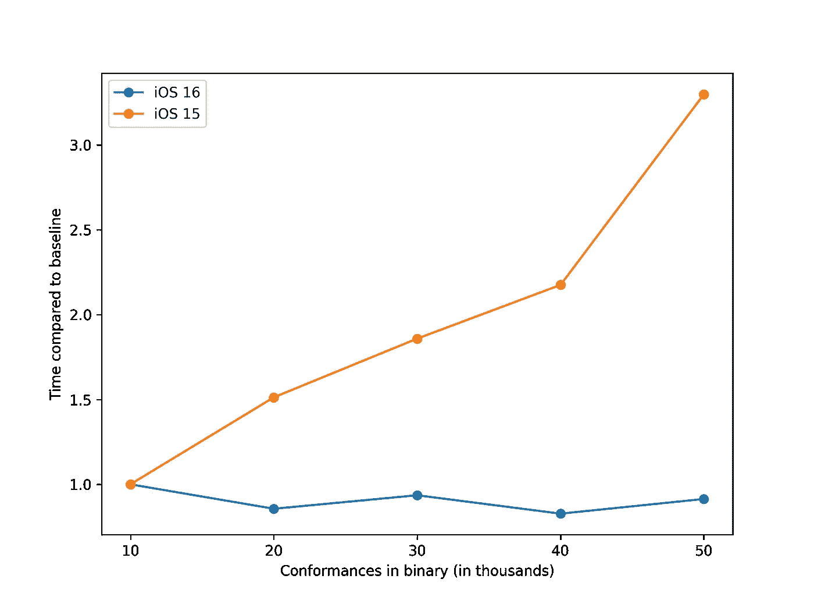

# iOS 16 如何让你的应用启动更快

> 原文：<https://medium.com/geekculture/how-ios-16-makes-your-app-launch-faster-1c27fd442738?source=collection_archive---------1----------------------->

[WWDC22 的国情咨文](https://developer.apple.com/videos/play/wwdc2022/102/)承诺带来一些重大的发射时间改进:

> 由于动态链接器的改进，Lyft 或 Airbnb 等应用程序的启动速度几乎提高了一倍。

这种改进来自于加速协议检查，我在之前的一篇博客文章中已经证明了这一点。此外，iOS 16 通过减少从磁盘加载的数据量，缩短了加载二进制文件的时间。这也是前一篇文章的主题。

这些改进归结于 dyld 的变化，dyld 是负责引导应用程序并开始执行您自己的代码的程序。他们还采用了两种相反(但很常见)的方法来提高性能——**急切加载**和**懒惰评估**。

在这篇文章中，我们将看看 iOS 16 有什么变化，它到底快了多少，以及你如何才能最好地利用你的应用程序中的这些新功能。

# 协议检查

协议一致性检查发生在 Swift 运行时，以确定代码的结果，如`myVar as? MyProtocol`。每当一个类型符合一个协议，二进制文件就会包含一个“一致性记录”。当检查一致性时，运行时循环遍历每个一致性记录，以查看是否有与当前操作匹配的记录。这个循环是 O(n ),其中 n 是应用程序中一致性记录的数量。对于大型应用程序，可能有超过十万个，使得每个一致性检查非常慢。

协议一致性检查在 Swift 应用中广泛存在，即使您没有编写它们，因为它们也是从像`String(describing:)`或`AnyHashable`这样的常见操作中调用的。对于一些大型 Swift 应用程序，如 Lyft 和 Airbnb，近一半的启动时间用于协议一致性检查。

最大的变化来自“dyld 闭包”，这是一个基于应用的缓存，用于在应用启动期间加速各种 dyld 操作。**闭包现在包含预先计算的一致性**，允许每次查找更快。注意，dyld 闭包并不总是被使用，例如，因为它已经过时，或者因为它是从 Xcode 启动的，这使得事情变得复杂。这一变化在 Swift 开源项目中实现，作为[迈克·阿什的 PR](https://github.com/apple/swift/pull/41185) 的一部分，增加了 dyld API 调用:`_dyld_find_protocol_conformance_on_disk`。如果在这个缓存中发现一致性，O(n)操作将被完全跳过，因此我们应该会看到应用程序在大量一致性方面的巨大改进。

## 测试它

在 Emerge，我们进行了大量性能测试，以确定 PRs 如何影响应用发布。因此，自然地，我们想要准确地测量这些预先计算的一致性检查将如何影响发布时间。

因为我们处理的是两个不同的操作系统版本，所以我们不能在同一个设备上测试。相反，我选择用二进制代码中 10k、20k、30k、40k 和 50k 的一致性对整个应用程序的一致性检查时间进行微基准测试。每个版本都在 iOS 16 和 iOS 15 设备上启动，10k 一致性被视为基线，只比较相对于基线的时间。

很明显，随着更多兼容性的增加，iOS 15 变慢了，而 iOS 16 没有，问题解决了！在实践中，这种封闭并不总是可用的，所以我们必须等到几个月后 iOS 16 登陆用户设备，才能确切知道这将在多大程度上改变生产中的数字。这一改进适用于所有应用，即使它们的最低部署目标在 iOS 16 以下。

# 页面错误

第二大改进来自于减少了启动时必须从磁盘加载的数据量。第一次执行一段代码时，内核在一个叫做**页面错误**的过程中加载周围的内存块，称为页面。在应用程序启动时，二进制文件的某些部分需要在代码运行之前修复(在之前的博客文章[中对此有深入的解释)。在 iOS 15 上，所有的修复都是在应用程序启动时完成的，这意味着二进制文件中任何需要修复的位置都必须分页。现在，一个名为](https://www.emergetools.com/blog/posts/SwiftReferenceTypes)[页面调入链接](https://developer.apple.com/wwdc22/110362)的新特性可以缓慢地解决修复问题，只在页面第一次被访问的时候。

去年的 WWDC 为用于执行这些修正的元数据引入了一种重要的新格式，我当时曾深入讨论过这个问题。这种格式是修复的惰性评估所必需的，因此 iOS 16 用户只有在您针对 iOS 13.4 或更高版本时才能获得它。

# 测试它

在 iOS 15 上，二进制文件的所有 __DATA 和 __DATA_CONST 段都包含修正，所以在代码运行之前页面错误的总数就是这些段的大小。使用 Emerge 的工具，我们还可以测量你的代码需要运行多少页，这一差异让我们知道你在 iOS 16 中少了多少页错误。

# 获得全部利益

这是一个很大的改进，可以立即减少页面错误，但是还有更大的减少。Emerge 提供订购文件服务——Launch Booster——自动订购二进制文件，以最大限度地减少页面错误。我们**在 iOS 15 上向应用商店部署订单文件时，平均将启动时间缩短了 18%** 。现在 iOS 16 不会自动加载每个页面，订购二进制文件可以让你的应用程序启动时间更快。如果你想了解更多关于如何自动减少启动时间和利用 iOS 16 改进的信息，[与 Emerge 团队联系](mailto:team@emergetools.com)。