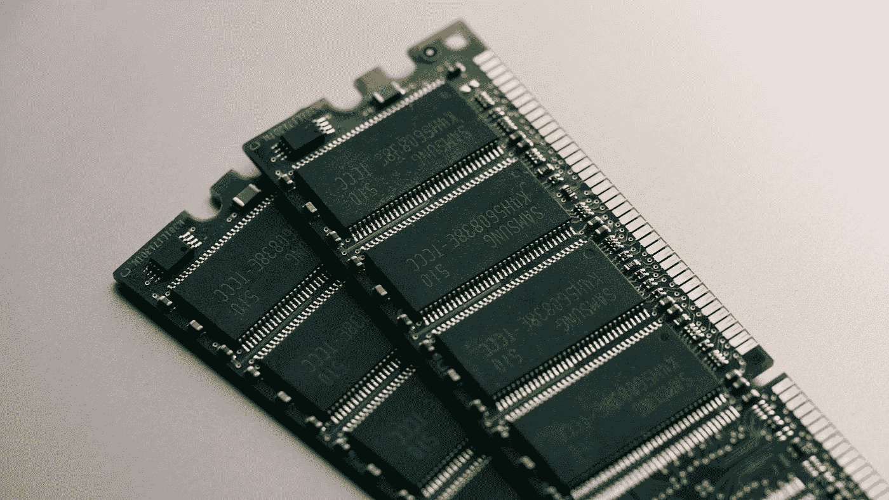
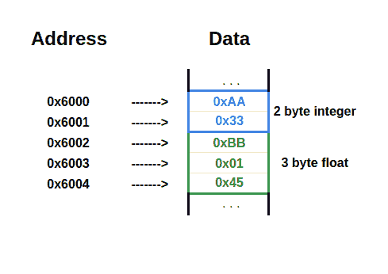
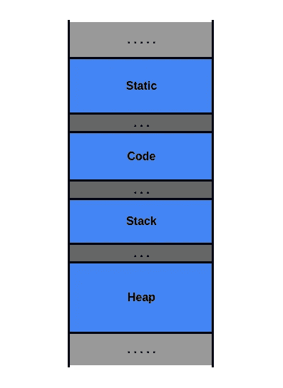
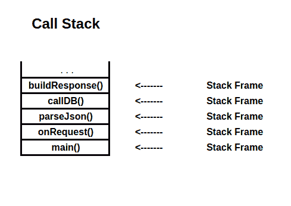
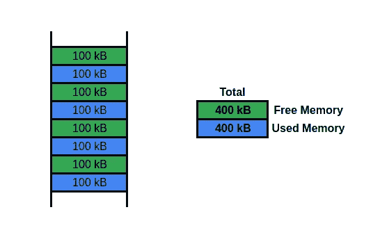
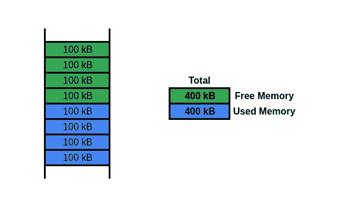

# [工作原理]内存和性能。第一部分。

> 原文：<https://medium.com/geekculture/how-it-works-memory-and-performance-part-1-83cf3bc167a7?source=collection_archive---------3----------------------->

Photo by [Michael Dziedzic](https://unsplash.com/@lazycreekimages?utm_source=medium&utm_medium=referral) on [Unsplash](https://unsplash.com?utm_source=medium&utm_medium=referral)

如果您是一名软件工程师，并且关心性能，那么本文适合您。你更喜欢哪种语言并不重要，C、C++、Java、Python、GO 等等。我在这里尝试介绍的内容应该会让你对你的计算机内存有所了解。因为基本上每个程序都与内存交互，所以很好地了解它是至关重要。

我将尝试深入讨论它，并提供一些真实世界中的例子，但是不要期望这是“最佳实践”和建议的集合。看完这个你会是给建议的人:)。力量在于知识，而不在于盲目的遵守规则。

如果你是一个初学者，不要担心，我会确保我们正在覆盖的基础。

好，我们从基础开始。电脑内存意味着很多东西，我们先按易失性分类。

现在我们有两种类型，易失性和非易失性(别烦了，请忽略半易失性)。

**非易失性存储器**

非易失性存储器是即使不通电也能保留存储信息的计算机存储器。在本文中，我们将简要介绍 HDD 和 SSD。

HDD. Hard Disk Drive.

**硬盘**。你很可能听说过 HDD(硬盘驱动器),它是一种“磁盘”,旋转速度非常快，可以读取/写入你的宝贵信息。与其他非易失性存储类型相比，其主要优势在于容量和成本之间的平衡。

要读一些东西，你需要用磁头在磁盘表面寻找你的文件，并开始把磁场转换成字节。你可能会问，如果我的文件很大，并且遍布磁盘表面(也称为**碎片**)怎么办？嗯，你会花更多的时间。因为我们等待磁盘旋转到下一个文件碎片的时间是浪费时间。

On left. High fragmentation, 5 spins required. | On Right. No fragmentation, less than 1 spin required.

由于这种设计，我们具有以下特点:

**快速顺序操作** —查找文件会浪费时间，但如果文件不是分散的，你可以一口气读完！

**缓慢的随机操作** —在磁盘表面的随机位置读/写文件会增加很大的开销，因为磁头通常需要多次旋转才能到达每个位置。

顺便说一下，磁头移动到所需位置所需的时间也称为**访问时间**。其他类型的内存没有磁头，但仍然有访问时间的惩罚，记住这一点。

SSD**.** Solid State Drive.

**SSD** (固态硬盘)。这一款没有任何物理旋转磁盘或移动部件，因此您可以期待更好的**访问时间**，从而实现卓越的随机读/写操作。一般来说，固态硬盘通常比硬盘快 10 倍左右。当然，这个速度有点昂贵，同样的钱，你将有更少的容量相比，硬盘。

你知道吗，有些电脑游戏必须复制数据(通常是纹理)，以确保硬盘能够连续读取数据？了解这件小事有助于开发人员显著提高性能。然而，这种技术对于 SSD 来说并不是最佳的，因为访问时间的开销很小。

**易失性记忆**

易失性存储器是需要电力来维持存储信息的计算机存储器。我们会经常谈到 RAM。

RAM. Random Access Memory.

**撞锤**。(随机存取存储器)顾名思义，这种存储器允许在几乎相同的时间内读取或写入信息，而不管数据在存储器中的物理位置。通常，它比 SSD/HDD 快 1000 倍。如果与 HDD/SSD 相比，它也非常昂贵，并且容量会少一百倍。

让我们回顾一下记忆特征:

**容量** —关于我们可以存储多少数据。

**易失性** —没电时内存如何表现。

**访问时间** —我们需要多少时间来找到数据的物理位置。

**碎片化** —我们的数据有多少被分解成许多物理上并不靠近的碎片。

为了更进一步，我们将需要在视觉上表示记忆的方法上达成一致。**平面内存模型**或**线性内存模型**是最常见的内存寻址模式，我们在此基础上构建了许多抽象层，但是请耐心等待，我们将在后面介绍。在现代计算机体系结构中，一个内存地址指向一个字节的数据。这是它的样子:

Linear memory model.

等一下！如果一个字节的信息与一个地址相关联，那么地址本身应该会占用你的内存空间，对吗？如果我们用 1 个字节存储地址，然后用 1 个字节存储信息本身，那么我们将浪费 50%的内存来跟踪地址。简直是疯了！

是的，它是！这就是为什么没人这么做的原因:)。与之相反，现代计算机只是“计数”每次“记忆细胞”。内存地址只是 CPU 从内存开始处跳过的字节数，以到达它所寻找的位置。例如:

*   要访问第一个字节，它必须跳过 0 个字节，所以第一个字节的地址是 0。
*   为了访问第二个字节，它必须跳过 1 个字节，所以它的地址是 1。
*   (以此类推……)

你明白了，对吧？

好的，但是我听说了一些限制，比如 32 位 CPU 不能有超过 4GB 的内存，为什么？

哦，我喜欢你的问题。事情是这样的，当你指示你的 CPU 做某事时，你将不得不调用一个带有参数的特殊函数。假设我们正在调用“goto 1000”，这意味着转到内存地址 1000。CPU 必须将这个数字存储在某个地方，然后获取指令并执行。这个存储单元被称为 CPU 寄存器，并且该寄存器的容量被限制为 32 位。32 位中可以存储的最高数字是 2 (或 4294967296)，也就是 4Gb。这意味着你不能告诉你的 CPU 去一个高于这个数字的内存地址。你可以有更多的内存，但是 CPU 将不能读/写超过这个限制的任何东西。幸运的是，大多数现代计算机现在都有 64 位架构(但并不总是 64 位寄存器)，这意味着它将能够与 16 艾字节(2 **⁶⁴** 字节)的 RAM 一起工作(遗憾的是，这将花费很多，不要指望在你的普通家用电脑中有这种东西)。

*知道就好。从 CPU 的角度来看，对 RAM 的内存访问相对较慢，可能需要几个时钟周期才能完成。存储器对寄存器的访问非常快(通常是一个时钟周期)。为了克服这个问题，现代 CPU 将使用内存缓存。*

但是如果我的程序需要使用大于 255 (1 字节)的数字呢？这将如何存储在内存中？

没问题！你只需要知道你的整数开始的内存地址和需要多少字节。在下图中，你可以看到一个 2 字节的整数是如何存储在内存中的。我们将从地址 0x6000 开始读取数据，并在地址 0x6001 处停止。

太好了！现在我们知道了基本知识。我们知道不同的记忆类型和记忆的主要特征。此外，我们学习了一些关于线性内存模型和 CPU 如何访问它。让我们转到程序上。

让我们从程序的基本工作流程开始，从内存的角度来看它是如何工作的。但在此之前，我们如何制作这些程序？一般来说，你有简单的文本文件，我们称之为**源文件**，然后使用你的特定语言编译器把它编译成**可执行文件**。

哎，我是程序员，我明明知道！

好的，好的……可执行文件包含你的操作系统和 CPU 可读的指令。可执行文件中主要有两块:**数据**(包含全局变量、常量、其他静态数据)，和**代码**(包含你编译的函数)。

好了，明白了…但是我的程序怎么会在内存里呢？

我很高兴你问了！这部分工作由操作系统**加载器**处理。当用户执行可执行文件时，“加载器”会确保为你的程序分配内存，然后将它复制到你的*操作内存* (RAM)中。但这一切都没那么简单！我们需要更深入！通常，操作系统加载程序会将分配的内存分成几个**内存段**。

我们将涵盖四个内存段:**代码**(显然是您编译的函数)**静态**(来自可执行文件的数据部分)**堆栈**和**堆**。

Program Memory Segments.

*   **代码段**:通常被加载程序标记为只读(该特性依赖于操作系统)，这样 CPU 将无法覆盖该地址范围。如果试图改变这个程序段，操作系统可能会检测到并立即中止程序。
*   **静态段**:这个段的大小是固定的，当程序运行时，它会一直存在内存中。不管你是否使用它。与上一段不同，这一段可以在执行过程中更改。
*   **栈段**(又名调用栈):如果静态段包含全局变量和常量，这个包含局部变量。该段被分成许多**堆栈帧。**堆栈帧在函数运行前加入堆栈，执行后移除。

Call stack/Stack segment

堆栈帧包含一个函数调用所需的所有信息。

Stack frame contains function arguments, local variables and return address

函数调用被分成几条指令:

*   为堆栈帧分配内存
*   将堆栈帧推入调用堆栈
*   运行堆栈框架中声明的函数
*   弹出已执行的堆栈帧

如你所见，程序员对此不会太在意。内存将被自动释放和分配。请注意，帧的大小是固定的！

嗯，这是不是意味着调用函数比把所有东西写成一个单独的指令流更昂贵？

是的，它有一点开销，但是不要害怕把你的逻辑分解成小函数，现代编译器很聪明，通常会“内联”函数。开销可能为零或最小。但是要意识到“抽象”对于性能来说是不可忽视的。(*也许有一天，我会写一篇文章，介绍如何设计您的代码来利用 CPU 缓存和其他高级技术，如无分支编程，但现在，我们正在讨论内存*

*   堆段(Heap segment):这部分是为程序员需要分配大的、可动态调整大小的数据结构的情况而设计的。在堆栈或静态段中不可能实现的东西。我们可以控制数据的生命周期，并决定何时释放和分配内存。堆管理是一个非常复杂的话题。编程语言将实现不同的**内存管理器。**这些通常试图分配一个连续的内存块，当你请求内存预留时，这个内存块会被分割成更小的块。简而言之，它跟踪哪些块被使用，哪些没有被使用。如果在程序执行过程中，内存管理器以一种不恰当的顺序分配和释放内存块，那么您可能会得到一个非常零碎的堆段。

嘿，碎片不应该是一个问题，我们有快速访问内存的时间，对不对？

嗯……是的，也不尽然。下面是一个 RAM 碎片可能成为问题的例子。

High memory fragmentation

我们总共有 400 kB 的已用内存和 400 kB 的未用内存。现在，假设你的程序需要一个 200kB 的数组。即使你总共有 400 kB 的空闲内存，你也找不到 200kB 或更大的块，你会得到一个内存分配失败。解决这个问题的方法是**内存压缩。**记忆什么？**内存压缩！**这个是为了最大化可用空闲空间而对主存储器中的信息块进行重定位的过程。但是请记住，要做到这一点，您必须执行一些 malloc()和 free()操作。你的程序必须停止执行并重组内存块。显然，从性能的角度来看，这是相当昂贵的。

Memory after compaction.

如您所见，您的程序可能会遭受严重的**堆碎片**问题，导致内存利用率低、性能下降，以及由于内存耗尽而导致的应用程序故障。

这是否意味着“不可变性”会导致非常高的碎片化，并且会给内存管理人员带来很大的压力？

很可能是的，所以试着合理地使用它，它是多线程的一个很好的解决方案，原因有很多，但是过多的内存分配会有很大的影响。

*还记得之前提到的 CPU 内存缓存吗？从 CPU 的角度来看，内存查找是很昂贵的，可以从缓存中进行，但是缓存本身的容量有限。RAM 碎片过多可能会耗尽高速缓存。当我们学习内存页面的时候，我们会再讨论这个问题。*

像 Java、Go 和 Python 这样的语言都有垃圾收集器，它们循环压缩内存。像 C/C++这样的语言有不同的内存分配器/管理器来解决相同的问题。即使看起来问题被内存管理器和垃圾收集器神奇地解决了，您也需要记住压缩内存涉及到额外的复制操作、扫描和长时间的暂停！

第一部分到此为止。在接下来的部分中，我们将学习内存对齐、内存分页、内存映射、缓存和一些性能技巧。如果你对第二部分感兴趣，请在评论中告诉我。你认为细节的层次如何？是太肤浅还是太复杂难懂？我会考虑你对第二部分的反馈。另外，如果你对某样东西感兴趣，可以随意提出下一个话题。

感谢您阅读本文！