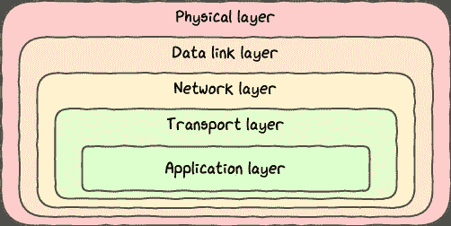
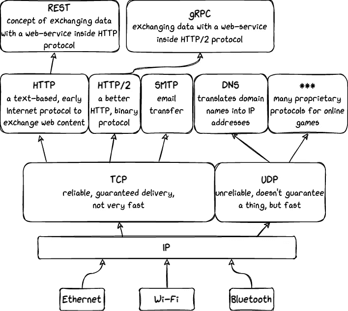

# 网络协议是如何工作的？

> 原文：<https://medium.com/geekculture/how-network-protocols-really-work-99a31d623c15?source=collection_archive---------12----------------------->

Photo by [Taylor Vick](https://unsplash.com/photos/M5tzZtFCOfs) on [Unsplash](https://unsplash.com/)

互联网网络协议入门。

# 介绍

当弹出 gRPC、DNS 或 TCP/IP 这样的名字时，你是否感到害怕？你希望你能自由地浏览这些东西，知道这封信是如何相互关联的，并就这个主题提出适当的问题吗？

这个故事将让你对网络协议是如何真正工作的有一个坚实的理解。

# OSI 模型

每一项关于网络协议的研究都会让你进入 **OSI** 模型。简而言之，OSI 是一个概念性的**分层**模型，由国际标准化组织在 20 世纪 80 年代开发。OSI 试图标准化当时不同的网络方法，为网络(最终成为互联网)的未来发展提供坚实的基础。

OSI 还提供了多个协议的实际实现，支持每个概念层，这套协议也被称为 [OSI 协议](https://en.wikipedia.org/wiki/OSI_protocols)。但是 OSI 的实现并没有使它成为互联网，输掉了与 TCP/IP 协议栈的战斗。

尽管如此，OSI 的分层网络的概念是如此成功，以至于它仍然被用作描述互联网网络的参考模型。

虽然 [OSI 理论](https://en.wikipedia.org/wiki/OSI_model)描述了 7 层网络模型，但其中 2 层有些过于理论化和冗余，因此我们将使用 OSI 的 5 层子集，因为它更简单且与现实世界的协议更相关。

5 layers of OSI model

OSI 层可以被视为抽象层，其中一层使用较低层提供的方法来实现其功能，而底层完全不知道那些较高层的字节到底代表什么。

## 物理层

[物理层](https://en.wikipedia.org/wiki/Physical_layer)负责设备和物理[传输介质](https://en.wikipedia.org/wiki/Transmission_medium)之间非结构化原始数据的传输和接收。如何在某种介质中表示 1 和 0 的每一个巧妙的概念都是在这一层上规定的，因此它将数字比特转换成电、无线电或光信号(反之亦然)。例如，物理层规范包含在无处不在的[蓝牙](https://en.wikipedia.org/wiki/Bluetooth)、[以太网](https://en.wikipedia.org/wiki/Ethernet_physical_layer)和 [USB](https://en.wikipedia.org/wiki/USB) 标准的规范中。

## 数据链路层

[数据链路层](https://en.wikipedia.org/wiki/Data_link_layer)在两个**直接连接的**节点之间提供传输链路。它检测并可能纠正物理层中可能出现的错误。它定义了在两个物理连接的设备之间建立和终止连接的协议。在这一层， **MAC 地址**开始识别网络中的节点。由于这一层只负责直接连接的节点之间的通信，它不足以建立一个像互联网这样的全球网络，因此我们需要下一个抽象层次，网络层。

## 网路层

[网络层](https://en.wikipedia.org/wiki/Network_layer)允许在“不同网络”(可能在地球的不同一端)中的实体之间传输数据。这个过程被称为[路由](https://en.wikipedia.org/wiki/Routing)，由寻址和识别系统支持。简而言之，网络层允许通过任意长的路由器序列路由数据包，以到达其最终目的地。这个范围内的主要协议是**互联网协议** (IP)，它确实是互联网的主干！在这一层，全球网络的实体可以通过其 **IP 地址**到达。

## 传输层

好了，现在我们有能力向任何连接到互联网的 IP 地址发送原始字节包，这要感谢 IP 协议。但是，如果一台机器需要同时接收多个只有一个 IP 地址的数据流，它如何区分数据包并将其路由到正确的应用程序呢？这个问题的解决方案是[复用](https://en.wikipedia.org/wiki/Multiplexing)，它是一种通用的方法，通过[共享介质](https://en.wikipedia.org/wiki/Shared_medium)将多个模拟或数字信号组合成一个信号。在 IP 之上的传输层实现了两种主要的互联网协议，即 **TCP** 和 **UDP** ，在指定连接地址时，这两种协议都使用了**port**(0–65535)的概念来实现复用。

UDP 只是 IP 之上的一个轻量级抽象，它只是引入了端口的概念，并提供一些错误检查功能。如果数据包丢失，UDP 将不会做任何事情，甚至也不会试图找出数据包是否已送达接收方。它没有[握手](https://en.wikipedia.org/wiki/Handshaking)对话，因此将用户的程序暴露给底层网络的任何不可靠性；不保证交付、订购或重复保护。对时间敏感的应用程序(如在线游戏或视频通话)经常使用 UDP，因为丢失数据包比等待因[重传](https://en.wikipedia.org/wiki/Retransmission_(data_networks))而延迟的数据包更可取，这在[实时系统](https://en.wikipedia.org/wiki/Real-time_system)中可能不是一个选项。

**TCP，**另一方面，检测任何类型的连接问题，请求重新传输丢失的数据，重新排列无序的数据，甚至帮助最小化网络拥塞，以减少其他问题的发生。如果数据仍未送达，则通知源系统此故障。一旦 TCP 接收器重组了最初传输的八位字节序列，它就将它们传递给接收应用程序。因此，TCP 从底层网络细节中抽象出应用程序的通信。

我希望现在您已经看到了这种模式:每一个下一层的协议都只是一个使用底层协议所提供的方法的概念。这个概念被称为协议封装，下层协议封装上层协议提供的数据。

例如，IP 协议允许您将数据发送到指定的 IP 地址，然后 TCP 和 UDP 协议都使用 IP 数据包的某个预定义部分来指定端口值。*端口*只是传输层的一个概念，旨在复用数据，而不是物理上存在于网络设备中的东西。

## 应用层

在深入这一层之前，让我们回顾一下(或者说向下看)，看看我们从底层得到了什么:

*   在物理层*上通过各种媒介(有线、无线)连接设备*
*   使用*链路层*将直接连接的设备聚集成小型网络
*   由于*网络层*特别是 IP 协议，具有在小型网络之间路由数据的能力，有效地呈现具有寻址方案的全球网络
*   多路传输流量的能力，使用*端口、*和的概念选择我们是需要一个可靠的自动错误恢复(TCP)传输协议，还是仅仅需要一个基于 IP (UDP)的快速轻量级包装器

如您所见，我们已经具备了通过互联网以对等方式进行可靠数据通信所需的一切。

因此，留给应用层的任务是指定应用程序数据的格式。数据格式规范本质上是*应用层* *协议*。有时它是预定义的结构化规范(例如 DNS)，有时协议只是描述它所期望的文本数据的解析规则(例如 HTTP)。

# 协议图

我画了一张地图，上面有一些流行的网络协议。既然您已经理解了协议封装的概念，这将非常有意义。

# 摘要

在本文中，我们探讨了网络协议是如何工作的，并展示了分层和协议封装的概念。理解了这些基本概念，您就有了坚实的基础来分析您可能会遇到的任何新协议。