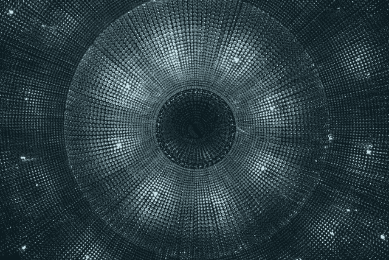
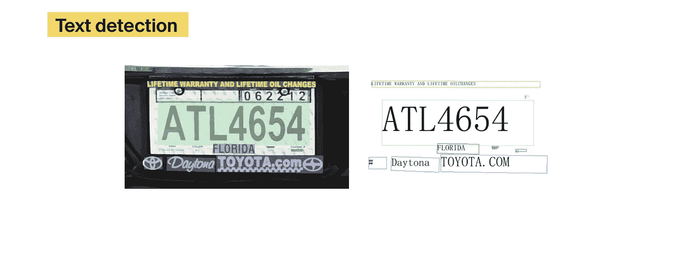
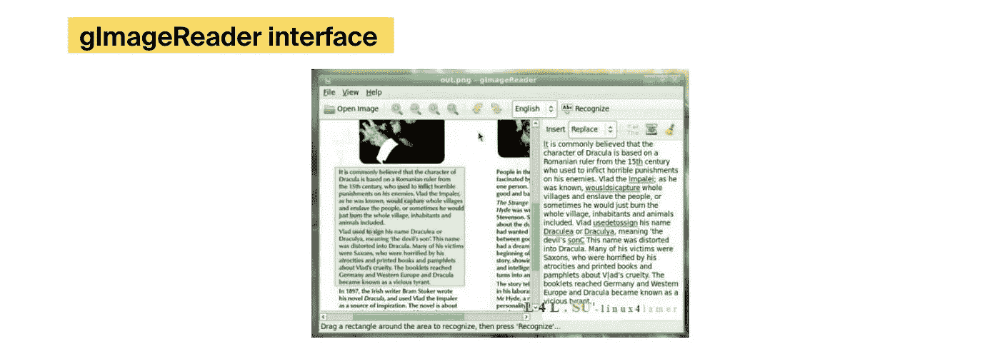
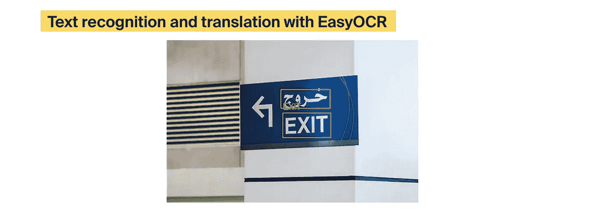
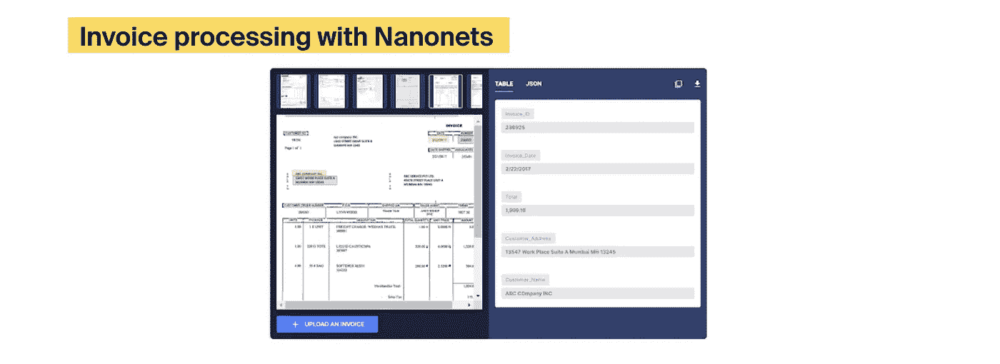

# 光学字符识别算法如何重新定义业务流程？

> 原文：<https://medium.com/geekculture/how-optical-character-recognition-algorithms-redefine-business-processes-cf8bb2657aed?source=collection_archive---------14----------------------->

输入数据并将其从一个地方移动到另一个地方是一项耗时、重复的任务。一名员工每天花[三个小时](https://zapier.com/blog/report-how-office-workers-spend-time/)移动数据。除了消耗员工的时间，手动数据处理还容易出错，从而导致收入损失。

Dun & Bradstreet 的一份调查数据过去和未来的报告显示，五分之一的企业因数据不完整而亏损。光学字符识别(OCR)技术可以帮助企业解决这些问题。OCR 算法可以将纸质文档转换为可编辑的可搜索文本。

他们还可以从文件中提取信息，并将其输入到公司 it 系统的相应字段中。那么，OCR 是如何工作的呢？这项技术如何帮助您实现业务目标？你是否应该联系一家[人工智能解决方案提供商](https://itrexgroup.com/services/artificial-intelligence/)来帮助你构建和设置 OCR 软件？

# 什么是光学字符识别，它是如何工作的

# OCR 定义

光学字符识别是一种将键入或手写文本以及包含文本的打印图像转换为机器可读数字数据格式的技术。OCR 算法有助于将大量纸质文档转换为数字文件，从而方便文本存储、处理和搜索。

[Source](https://www.v7labs.com/blog/ocr-guide)

OCR 系统由硬件和软件组成。硬件部分可以是光学扫描仪或类似的可以将纸质文档转换成数字格式的设备。软件部分是 OCR 算法本身。

# OCR 是如何工作的？

计算机很难识别字符，因为一个字母有不同的字体和书写方式。手写信件使事情变得更加复杂。然而，光学字符识别算法接受了这一挑战。每个 OCR 解决方案都有四个主要步骤:

## 图象采集

该过程包括使用光学扫描仪捕获纸质文档的数字副本。文档必须正确对齐和调整大小。

## 预处理

这个阶段的目标是使 OCR 算法可以使用输入文件。噪声和背景被消除。预处理包括以下步骤:

*   布局分析:将标题、列和图形识别为块
*   去歪斜:如果在扫描过程中没有正确对齐，倾斜数字文档以使线条水平

[Source](https://theailearner.com/tag/image-preprocessing/)

*   图像优化:平滑边缘，去除灰尘颗粒，增加文本和背景之间的对比度
*   文本检测:一些算法检测单独的单词并将它们分成字母，而另一些算法直接处理文本而不将其分成字符。

[Source](https://github.com/PaddlePaddle/PaddleOCR)

*   二值化:将扫描的文档转换为黑白格式，其中深色区域表示字符(字母或数字)，白色区域被识别为背景。这一步有助于识别不同的字体。

## 字符检测

在这个阶段，光学字符识别算法执行不同的操作来识别字母和数字。有两种主要方法:

*   模式识别:OCR 算法在多种字体、文本格式和手写风格上接受训练，以将输入文件中的不同字符与它们所学习的内容进行比较。

*   特征识别:一些算法受益于已知的字符属性，例如十字和曲线，来识别输入文件中的字符。例如，字母“H”被识别为两条垂直线和一条交叉水平线。由神经网络(NN)支持的 OCR 算法使用不同的逻辑，其中第一个 NN 层聚集来自输入文件的像素，以创建图像的低级特征图。

在检测到字符后，程序将它们转换成美国信息交换标准码(ASCII ),以便于进一步操作。

## 后处理

输出可以是基本的，如字符串或文件。更高级的 OCR 解决方案可以保留原始页面结构，并创建包含可搜索文本的 PDF 文件。尽管到目前为止还没有工具可以保证对不同的输入文件有 100%的准确率，但是一些光学字符识别算法可以对熟悉的文本达到令人印象深刻的 99.8%的准确率。使用手写会严重影响结果。此外，重要的是要明白，由于缺乏训练或不熟悉的文本，错误率可能[高达 20%](https://link.springer.com/chapter/10.1007/978-3-030-45442-5_13) 。因此，用户有必要不断地监控、校对和纠正 OCR 算法的输出，尤其是当一种新类型的文档进入管道时。

后处理阶段还可以涉及自然语言处理(NLP)和其他人工智能技术，用于数据验证。人工智能不仅能纠正文本，还能捕捉计算中的错误。假设在处理发票时，OCR 算法识别出总金额为 500 美元。人工智能可以通过将所有费用相加并计算出它们不到 500 美元来验证这一点。人工智能可以通知人类雇员来检查这个特殊的案例。

如果你想提高算法的质量，你可以尝试开源的 OCR 库，比如 Tesseract，它们使用自己的字典进行字符分割。另一种方法是创建一个在您的领域中重复出现的专门术语表。此外，评审者可以使用他们的反馈作为另一个光学字符识别算法培训会话的输入。

# OCR 算法如何让您的企业受益？

以下是光学字符识别解决方案可以为您做的事情:

*   降低成本:将文件转换为数字格式和自动化数据输入降低了员工工时成本
*   提高客户满意度:这项技术将使人们能够通过扫描身份证件远程更新他们的个人信息，而不是亲自去银行或任何其他机构
*   提供更便宜的备份选项:无需将纸质文档与其副本和三副本存储在一起，这将消耗昂贵的物理存储单元
*   促进不同语言之间的翻译:一些 OCR 工具能够将文档从一种语言翻译成另一种语言
*   自动化工作流程:使用良好的管理系统搜索数字文件比处理纸质文档更快。在寻找丢失的物理文件时，搁置的进程会减少。如果您对更全面的自动化解决方案感兴趣，您可以利用包含 OCR 和其他高级功能的[智能过程自动化服务](https://itrexgroup.com/services/intelligent-process-automation/)。

# 市场上可用的 OCR 解决方案

如果您正在考虑将 OCR 功能整合到您的 IT 系统中，您有几个选项可供选择。

# 开源光学字符识别算法

有几种开源的 OCR 算法，企业可以根据自己的需要进行调整。这些解决方案更容易定制，因为它们的源代码是普遍可访问的。然而，没有中央权威。开源解决方案的开发者不承担责任，也不提供进一步的支持。因此，代码的质量是有问题的。该选项更适合拥有强大 IT 部门、能够修复任何故障的公司。或者，你可以联系[机器学习顾问](https://itrexgroup.com/services/machine-learning-development/)，他们可以为你定制和重新培训这个软件。

以下是一些常用的开源 OCR 解决方案:

## 宇宙魔方

[宇宙魔方](https://github.com/tesseract-ocr/tesseract)开源引擎是最受欢迎的 OCR 工具之一，它被认为是最准确的免费工具中的[。它是由惠普公司在 1985 年至 1994 年间开发的。从 2006 年开始，这个平台由 Google 管理和进一步开发。Tesseract 是用 C++编写的，但它提供了 Java、Python、Swift、Ruby 和 R 以及一些更常见的编程语言的包装器。](https://www.hitechnectar.com/blogs/open-source-ocr-tools/)

该工具使用命令行操作，没有图形用户界面。但是，您可以部署几个 GUI 选项来使该解决方案对用户友好。glmageReader 就是一个例子。这个接口是使用 Python 开发的，支持不同的图像格式，包括 PNG、GIF 和 PNM。

[Source](https://mintguide.org/office/240-gimagereader-graphical-interface-for-system-tesseract-ocr-in-linux-mint.html)

Tesseract 不提供页面布局分析，不格式化输出，其命令行界面要求所有图像以 TIFF 格式提交。此外，这种 OCR 解决方案没有针对 GPU 进行优化，并且不允许批处理。

[Tesseract’s command line interface](https://alchetron.com/Tesseract-(software))

## OCRopus

OCRopus 最初是用 Python 编写的，现在有了单独的 C++版本。它得到了 Google 的支持，并被用作 Google ReCaptcha 算法的 OCR 引擎。

[Source](https://www.researchgate.net/publication/221253776_The_OCRopus_open_source_OCR_system)

OCRopus 有三个主要特点:

*   物理布局分析:识别文本块、列和行，并确定阅读顺序。例如，为了检测列，它使用最大空白矩形算法来检测列之间的空白。
*   行识别:识别每个块或列中的行，无论它们是垂直线还是从左到右的行。
*   统计语言建模:使用字典和随机语法来解决丢失和未识别字母的问题。

## EasyOCR

[光学字符识别公司 Jaided AI](https://jaided.ai/) ，利用其深度学习模型，使用 Python 和 PyTorch 库构建了 [EasyOCR](https://github.com/JaidedAI/EasyOCR) 包。它支持 80 多种语言，包括西里尔文字、中文和阿拉伯语，而且这个基础还在不断扩大。作为实现路线图的一部分，计划添加用于识别手写文本的可配置选项。

[Source](https://pyimagesearch.com/2020/09/14/getting-started-with-easyocr-for-optical-character-recognition/)

# 商业 OCR 解决方案

软件即服务(SaaS)解决方案允许您从高质量的算法中获益，并获得全面的供应商支持。根据所选的平台，您可能能够在数据集上重新训练 OCR 算法，甚至进一步使其适应您的独特需求。

## 亚马逊文本摘要

[亚马逊 Textract](https://aws.amazon.com/textract/) 是一项基于机器学习的服务，可以从扫描文档中提取打印和手写文本。它可以处理非结构化数据和格式化文本，如表单和表格。该解决方案使用人工智能，不需要任何额外的配置步骤或模板。这项服务是安全的，符合数据保护法规，如 HIPAA 和 GDPR。亚马逊 Textract [提供了四个 API](https://aws.amazon.com/textract/pricing/)，客户可以相应地使用和付费:

*   检测文档文本 API:从扫描中提取非结构化的打印文本和手写内容。前 100 万页每页收费 0.0015 美元；之后，价格下降。
*   分析文档 API:处理结构化数据。从表单和表格中提取文本。处理表格时，客户将支付每页 0.015 美元，处理表单时，每页 0.05 美元。价格在第一个一百万页之后下降。
*   分析费用 API:使用发票。该服务有一个通用的收据相关字段分类。例如，它可以识别发票号码。用户将为前 100 万页支付每页 0.01 美元。
*   分析 ID API:理解身份文档的上下文，例如驾照和护照，并可以从特定字段中提取文本。您可以从这项服务中获益，前 100，000 页只需支付 0.025 美元。

## 谷歌云愿景

谷歌提供 [Vision API](https://cloud.google.com/vision/docs/ocr) ，可以从文档和图像中提取打印和手写文本。它包含两个光学字符识别功能:

*   Text_detection:从图像中提取文本，比如交通标志的照片
*   Document_text_detection:捕获文档和图像中的文本。它与之前的功能不同，因为它的响应针对密集文本进行了优化。

这两项功能都允许用户每月免费加工第一批[1000 件](https://cloud.google.com/vision/pricing)。之后，每 1000 件你要付 1.5 美元。这个价格会随着你每月提交更多的单位而降低。

## 微软 Azure 计算机视觉

微软提供 OCR 服务，作为其通用计算机视觉 API 的一部分，而不是作为一个独立的功能。因此，[你支付整个套餐](https://azure.microsoft.com/en-us/pricing/details/cognitive-services/computer-vision/#pricing)，除了光学字符识别，还包括名人、地标、品牌和一般物体检测的识别。对于第一个 100 万个单位，该 API 的每 1000 笔交易费用为 1 美元。之后，价格下降到每 1000 笔交易 0.65 美元，并且随着您提交更多内容，价格将继续下降。

# 不同行业中的顶级 OCR 用例

光学字符识别算法正在不同的行业中获得牵引力。以下是一些最著名的 OCR 应用程序。

# 银行业中的 OCR

银行机构在其工作流程中使用大量纸质文档。这些包括支票、客户记录、贷款申请、银行对账单等。采用 OCR 识别算法允许员工以数字方式存储和访问所有这些文档，并防止文书工作丢失和损坏。

**检查处理**

该领域 OCR 的一个例子是使用银行应用程序以数字方式存放纸质支票。这些解决方案采用光学字符识别算法来识别支票中的相关字段，并相应地执行操作，而无需员工手动传输所有这些数据。此外，此类应用程序可以针对现有数据库执行签名验证，并立即清除检查。

**客户入职**

OCR 解决方案可以从个人的护照和其他身份证件中提取并验证所有相关信息，而不是让员工手动验证客户的身份。这允许即时验证并改善客户体验。

**客户信息更新**

在 OCR 的帮助下，客户可以扫描他们的文档以自动更新信息，而不必去拜访或打电话给银行。例如，[阿尔法银行与智能引擎](https://www.biometricupdate.com/202202/alfa-bank-integrates-smart-engines-ocr-into-banking-app)合作，通过光学字符识别功能增强其银行应用。通过这项新功能，客户可以将身份证件放在智能手机的摄像头前，确认提取的数据，并更新他们在银行系统中的信息。

# 医疗保健中的 OCR

与银行业类似，医疗保健组织积累了许多纸面文档，如 X 射线扫描、测试结果、治疗计划等。OCR 算法有助于将这些文件数字化，以防止物理文档丢失，并减少手动处理纸质文件所浪费的精力。此外，一些识别手写文本的 OCR 解决方案可以处理患者登记文件和处方。

**医疗索赔系统**

有些软件供应商专门从事支持 OCR 的医疗索赔处理。一家这样的公司是 [OCR 解决方案](https://ocrsolutions.com/software/document-capture/medical-claim/)。它开发了一种产品，可以扫描、验证和正确传递医疗索赔，以便进一步处理。该程序经过培训和配置，可处理常见格式，如牙科索赔表和 CMS-1500 等。

**传真**

许多医疗机构仍然依赖传真。光学字符识别解决方案可以将输入材料转换成可访问的数字存储格式。

**开票**

OCR 支持的解决方案帮助医疗机构将发票数字化并正确归档。一个 OCR 的例子来自总部位于旧金山的 [Nanonets](https://nanonets.com/invoice-ocr) ，它提供了一个基于 OCR 的解决方案，专门处理发票。该公司声称，其软件将把发票数据输入时间从每张发票 3 分钟减少到 30 秒。

[Source](https://nanonets.com/invoice-ocr)

# 零售业中的 OCR

光学字符识别算法使零售员工能够节省处理采购订单、发票、装箱单和其他文档的时间。这些解决方案还可以从产品的条形码中提取序列号，使客户能够扫描他们的凭证并提取序列号。

**ID 扫描**

商店员工可能出于多种原因需要扫描个人信息，例如年龄验证、为客户忠诚度填写信息等等。OCR 供应商利用了这个机会。

例如，总部位于佛罗里达州[的 OCR Solutions 开发了 idMax](https://ocrsolutions.com/retail-ocr-solutions/#:~:text=OCR%20systems%20have%20been%20a,various%20invoices%20without%20user%20interaction.) ，这是一款基于 OCR 的软件，可以扫描 ID 文档，提取相关字段，并用相应的信息填充零售商的数据库。idMax 可以安装在本地，也可以通过云访问。

# 在您的企业中采用 OCR 解决方案的挑战

如果您决定部署 OCR 识别算法来改进操作，您需要考虑几个方面:

*   输入材料:确保所有输入文件都适合 OCR 算法。例如，文件需要没有损坏，以免干扰算法识别其内容的能力。对比度足够高，页面对齐正确等。一些算法具有强大的预处理功能，可以为您解决其中的一些问题。但如果不是这样，也许投资一台高质量的扫描仪并确保正确的页面对齐是一个好主意。
*   训练数据集:如果您决定训练或重新训练光学字符识别算法，您需要确保您计划使用的数据忠实地代表您的输入材料，并包含足够多的正确注释。如果您的训练数据集太小，或者没有包含足够的注释，该算法将不会产生预期的结果。还有，在训练的时候，需要特别注意类似的字符/符号。例如，数字 2 和 7 可能看起来非常相似，特别是如果该算法预期用于手写文本时。数据科学家需要在训练数据中涵盖这些区别。另一个例子是使用 OCR 算法来检测和捕捉汽车牌照。你需要确保你的算法不会将汽车背面的文字标签误认为是车牌。
*   手写文本:手写带来了许多额外的 OCR 挑战。不同的人之间存在大量不同的写作风格，甚至单个用户的写作也可能不一致。收集可靠的代表性训练数据集是一项挑战，因为您需要考虑所有不同的风格。草书尤其难以处理。此外，虽然印刷文本是直线，但手写往往会有可变的旋转，这使得事情更加复杂。
*   伸缩性:如果您增加用户数量或每个时隙的请求数量，系统可能会崩溃，尤其是在您使用开源解决方案并依赖自己的计算能力的情况下。如果是在云中运行的商业 OCR 产品，您可以安排并支付更多容量。
*   OCR 算法的性能监控:部署后，算法的性能可能会由于不同的因素而开始下降。一个例子是训练数据和实际生产数据之间分布的变化。当模型开始处理它没有准备好的数据集时，就会出现这种情况，例如不同的字体或具有异常倾斜度的字符。随着时间的推移，这些更改将影响模型的输出，您需要检测这些问题并相应地重新训练模型，以保持其初始的准确性水平。

# 综上

光学字符识别算法有可能加快您的业务流程。然而，还有相关的挑战需要考虑。所选的算法可能需要重新训练，正确注释大型数据集是一项繁琐的任务。您还需要考虑随着业务的扩展，潜在的扩展。

采用开源解决方案似乎在价格上很诱人，但它也有缺点，比如缺乏支持和更新，这可能会打开安全漏洞。商业解决方案在这方面更可靠，但可能成本高昂且难以定制。

如果您不确定如何进行，以及哪种 OCR 解决方案最适合您的业务，请不要犹豫。在 ITRex，我们很乐意对您的业务需求进行全面评估，以确定最佳的 OCR 选项。我们还可以帮助您重新培训选定的解决方案，并将其集成到您的系统中。如果需要，我们还可以构建一个自定义的 OCR 算法。

> 您想通过光学字符识别加快操作速度吗？[降 ITRex 一行](https://itrexgroup.com/contact-us/)！他们的人工智能专家将协助您进行 OCR 解决方案集成和培训。如果需要，他们还可以为您开发定制算法。

*原载于 2022 年 4 月 6 日*[*【https://itrexgroup.com】*](https://itrexgroup.com/blog/blockchain-use-cases-advantages-issues-implementation-tips/)*。*