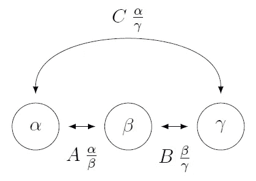
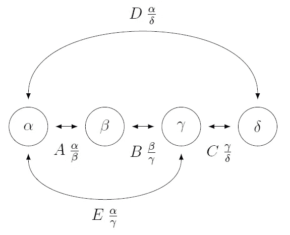

# 刷单和三角套利如何使货币市场保持套利均衡

> 原文：<https://medium.com/geekculture/how-scalping-and-triangular-arbitrage-keeps-the-currency-market-in-arbitrage-equilibrium-57466d8ff4df?source=collection_archive---------8----------------------->

外汇市场套利的程式化解释

(Image by [allfxbrokers](https://www.allfxbrokers.com/blog-articles/forex-triangular-arbitrage-strategy))

市场参与者需要兑换货币的原因有很多。公司可能有工人、供应商、客户和投资者，他们都在不同的国家，资金需要流入和流出。金融机构可能希望通过投资国际金融资产来分散其持有的资产。各国政府可能希望积累外汇储备，以备日后平衡国际收支或捍卫盯住汇率制度。游客可能想去另一个使用不同货币的国家旅游。移徙工人和移民可能在家乡有家人，他们向这些家人汇款。

当所有这些参与者都在外汇市场交易时，他们怎么能确定他们得到了最好的交易呢？如果报价与最优价格相差很大，该怎么办？这就是套利者介入的地方。通过观察货币对和货币三角，并迅速利用任何差异，他们使市场保持套利平衡。这意味着，在获利的同时，套利者为市场参与者提供了确定的最优价格。他们通常受雇于银行和外汇交易公司。

## 两种货币之间的交易

从最简单的情况开始，假设外汇市场上有两种货币，阿尔法和贝塔。此外，一些在贝塔世界的潜在游客希望用他们的贝塔世界来交换阿尔法世界，每贝塔世界有个阿尔法世界。另一方面，在阿尔法世界，一些游客希望以 1 比 1 的比率用他们的阿尔法换成贝塔。或者更简单地说，在 beta 市场中，买家愿意以 B alphas 的最高价格(买入价)买入，卖家愿意以 A alphas 的最低价格(卖出价)卖出。(在货币兑换中，这将在 B/A 中列为β/α。)

**Figure 1:** Exchanging between two currencies (Image by author)

出于某种原因，这些游客发现自己处于一种出价(最高买价，B)高于要价(最低卖价，A)的情况。也许他们还没有找到彼此来交易他们的货币。所以我们观察敏锐的套利者从贝塔世界的游客那里买了一些贝塔，然后卖给阿尔法世界的游客，赚取差价(B - A)。给定足够多的这些交易，买入价将向下移动，卖出价将向上移动，直到它们大致相等。

虽然我们的套利者可能是受利润驱使，但她通过充当中介来帮助我们的游客。最终，皆大欢喜。贝塔世界的游客在旅行时可以花阿尔法，阿尔法世界的游客可以花贝塔，未来的游客被保证一定的汇率——套利者获得了丰厚的利润。

## **三种货币之间的三角套利**

在听到这种利润可以无风险获得的消息后，套利者蜂拥至外汇市场，并利用这种差价。在一段时间内，货币对之间的所有套利机会都已经耗尽，达到了平衡状态。所以我们的套利者关注三种货币之间的汇率:阿尔法、贝塔和伽马。

**Figure 2:** Exchanging between three currencies (Image by author)

因为所有的货币对都是无套利的，所以将一种货币兑换成另一种货币的汇率和将它兑换回那种货币的汇率是一样的。所以阿尔法世界的游客想买贝塔世界的，会以和贝塔世界的游客想卖的价格 A 买。因此，六种可能的交易(买入和卖出每种货币对)只有三种汇率。这些兑换在图表中用三种货币的双箭头表示。

幸运的是，尽管所有其他套利者一直保持货币对汇率无套利，但我们的套利者发现了一个差异。她注意到，将α转换为γ有两条途径:要么直接用α购买γ(α→γ)，要么先购买β，然后用β购买γ(α→β→γ)。在前者中，a gamma 的价格是 C alphas，而在后者中是 A×B alpha。如果这两个价格不同，我们的套利者可以以较低的价格买入，以较高的价格卖出，将差价收入囊中。

在这种情况下，她发现 C 大于 A × B，于是她买入带有 alpha 的 beta，然后从这些 beta 中买入 gamma，每个 alpha 的总成本为 A × B，最后卖出这些 gamma，每个 alpha 的总收入和利润为 C。随着时间的推移，给定足够多的交易，供求定律开始起作用，A 和 B 向上移动，C 向下移动，直到 A × B = C。

## **四种货币之间的套利机会？**

所有其他套利者又一次听到了利用三角套利可以获得无风险利润的消息。因此，他们将监控范围从货币对扩大到了货币三角。很快，随着汇率保持平衡，三种货币之间的所有套利机会都会枯竭。

记住，即使两种货币之间的套利机会消失了，三种货币之间的套利机会仍然存在，我们的套利者想知道四种货币之间是否存在机会。或者五个或者六个。对她来说不幸的是——尽管对我们公众来说也许是幸运的——没有，一旦所有的成对和三角外汇都无套利，整个外汇市场就无套利了。

**Figure 3:** Exchanging between four currencies (Image by author)

为了证明这一点，考虑使用 alphas 的 delta 的价格。图中用四种货币描述了这一点。利用所有四种货币的路径是α → β → γ → δ，价格为 A×B×Cα。直接交换(α → δ)，一个 delta 有 D alphas 的价格。关键的洞见是，由于货币三角α-β-γ保持平衡，A × B = E。类似地，对于货币三角α-γ-δ，E × C = D。

应用这些来自货币三角形的等式，我们的套利者意识到使用所有四种货币的路径和直接兑换路径必须有相同的价格。这是因为α → β → γ → δ的价格等于α → γ → δ(因为α-β-γ三角形)的价格等于α → δ(因为α-γ-δ三角形)。有了这些知识，她了解到没有必要监控四种货币之间的套利机会，因为如果一种货币存在，那么三种货币之间也会存在。

同样的逻辑也适用于五种、六种、七种等等货币组合之间的套利。例如，考虑阿尔法、贝塔、伽马、德尔塔和埃普隆之间的外汇市场。

**Figure 4:** Exchanging between five currencies (Image by author)

使用相同的推理，我们的套利者知道路径α → β → γ → δ → ε等价于α → δ → ε，因为她刚刚了解到四种货币之间的一种交换是均衡的(假设没有黄牛或三角套利机会)。而且由于所有的货币三角形都处于均衡状态，所以α → δ → ε等价于α → ε。所以总体来说，就价格而言，α → β → γ → δ → ε相当于α → ε。

## **凌乱的现实世界**

当然，将这种简单化的理论应用到现实世界中会引发许多复杂问题。首先，我们假设特定货币对的供给和需求是固定的，因此每种货币对的汇率都有一个最优价格。然而，各种各样的事件都会影响供求，从而改变最优价格，带来新的套利机会。举一个例子，美国美联储可能提高利率，造成更多的美元需求，购买美国债券，从而提高投标价格。套利者可能会利用这一点买卖美元，从中赚取差价。货币三角也可能出现类似的情况。

让事情更复杂的是，套利者利用算法电子交易几乎瞬间利用货币对和货币三角的细微差异。这些算法速度如此之快，以至于一项研究发现，欧元-美元-瑞士法郎货币三角[中 95%的套利机会在五秒钟](https://doi.org/10.1142/S0219024909005609)内消失。因此，套利者只有在算法交易方面取得进步，能够解决交易费用、网络和计算问题时，才可能击败竞争对手。最后，虽然货币套利在理想情况下是无风险的，但也有轻微的风险，因为不能保证交易是确定的和即时的。

当公司、金融机构、政府、游客、移民和移民工人都参与外汇市场时，他们可以依赖某个最优报价。套利者潜伏在旁边，像老鹰一样观察差异。总而言之，类似的逻辑也适用于各种市场，比如股票、债券和大宗商品市场。也可以适用于法规差异:管辖权套利！(尽管司法仲裁是一种有害的法律规避形式。)