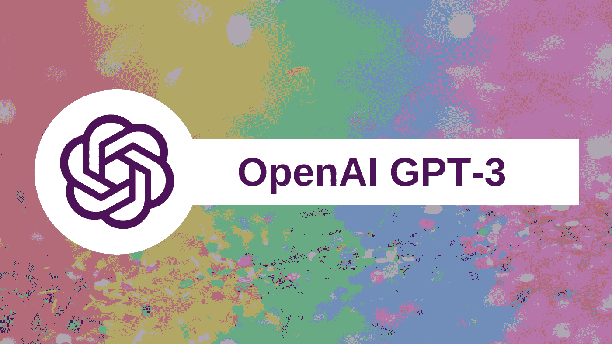

# 了解 GPT-3 的技术架构及其制造方法

> 原文：<https://medium.com/geekculture/how-the-best-english-professor-was-created-gpt-explained-23ac11df7503?source=collection_archive---------51----------------------->

深度学习正在彻底改变世界，无论是教计算机开车，还是甚至用它们来辅助医生！但是当谈到深度学习时，这一成功的最大因素是训练时大量的**标记数据**。

然而，这仍然限制了与自然语言处理(NLP——人工智能的语言学方面)相关的许多领域的适用性。这主要是因为未标记的数据比标记的数据多得多。现在，注释这些未标记的数据可以解决这个问题，但这非常耗时且昂贵。

能够从未标记的数据中学习也被称为**无监督学习，**并且能够以这种方式训练模型将会给它带来巨大的性能提升；然而，当试图通过这种方法创建模型时，存在许多挑战:

1.  目前还不清楚哪种类型的文本表示优化器可以转移到其他领域。
2.  对于转移学习表征的最有效方式，还没有达成共识。
3.  即使找到了实现这一点的方法，该模型仍然需要对其架构进行许多更改，这违背了整个目的。

所以我们不可能这么做，对吗？….**错了。**

# 介绍 GPT(生成性预培训)

GPT 解决这个问题的方法是使用半监督学习(监督和非监督学习的混合)来创建一个模型或语言理解。

这个过程有两个主要步骤:

第一步是使用无监督的预训练方法来创建更广泛的语言理解模型。相比之下，第二部分将使用监督微调来使模型适合特定的任务。

通过这样做，GPT 将学会一种通用的文本表示法，这种表示法既可以转移，又不需要太多的修改就能适应广泛的任务。

## 它将如何做到这一点？

# GPT 的框架——变形金刚

为了让 GPT 做到这一点，它将使用一个 transformer 模型架构来执行各种任务。变压器模型为长期依赖性创建了更多的结构记忆(与主要用于短期依赖性的递归神经网络相比)，从而在执行特定任务时允许架构的最小变化。

正如我之前提到的，我们都需要使用无监督的预训练和有监督的微调，所以让我们更深入地了解我们将如何做到这一点。

## 无监督预训练

该模型的无监督预训练部分使用多层变压器解码器，这是一种变压器。解码器有点像 NLP 中模型的输出部分。

我们将使用 BooksCorups 数据集来训练这个变形金刚，该数据集由 7000 多种不同类型的独特的**未出版的**书籍组成！这些数据将允许模型理解广泛的文本表示，然后可以应用于更具体的任务。

## 监督微调

在对模型进行预训练之后，我们将对模型的参数进行微调，使其适合特定的任务。

首先预训练模型是非常有用的，因为它将有助于提高监督模型的泛化能力，并加速更广泛的任务与特定任务之间的收敛！

# GPT 在行动！

好了，现在让我们看看他们是如何测试这种 GPT 方法的。它首先在 NLP 领域的 4 个特定领域进行了测试:

1.  自然语言推理(NLI)
2.  问题回答
3.  语义相似度
4.  文本分类

在为每个模型训练了 GPT 之后，它表现得非常好，并且与其他模型(没有预先训练的)相比，它几乎超过了所有模型。这显示了 GPT 是多么的强大，可以显著提高许多 NLP 任务的性能。

*本文基于一篇名为《通过生成性预训练提高语言理解》的研究论文*

*你可以在这里* 查看那篇论文 [*。*](https://s3-us-west-2.amazonaws.com/openai-assets/research-covers/language-unsupervised/language_understanding_paper.pdf)