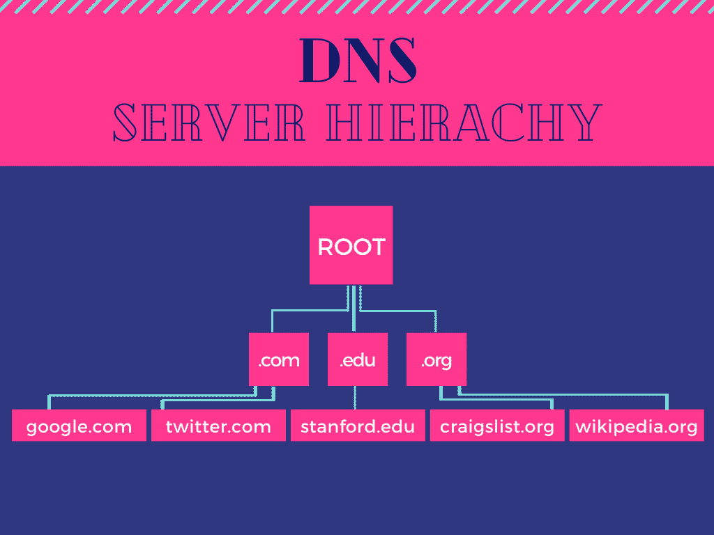
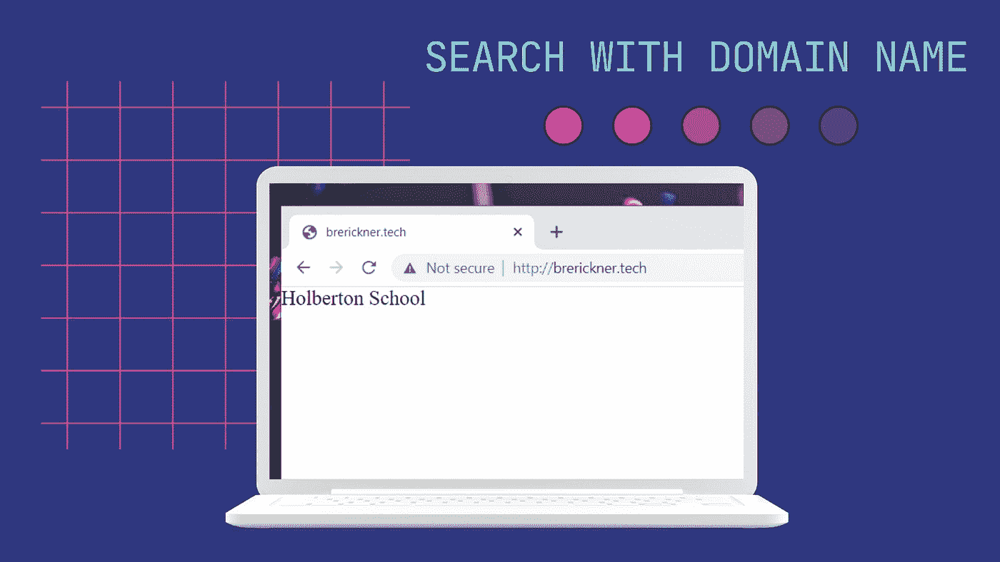
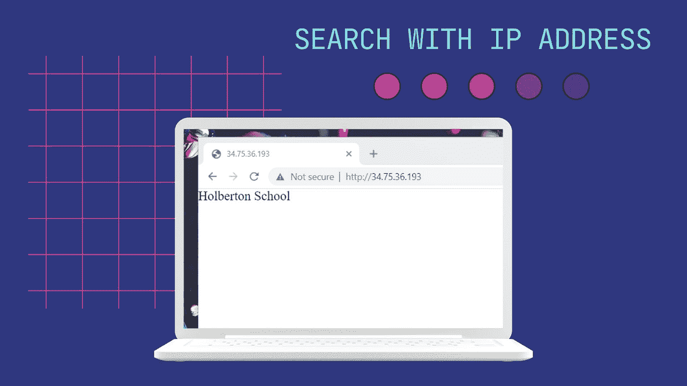
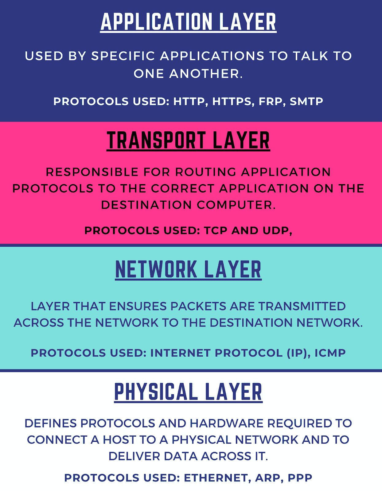

# 互联网是如何工作的

> 原文：<https://medium.com/geekculture/how-the-internet-works-f06e70c9cf44?source=collection_archive---------20----------------------->

## 在屏幕后面，看看在 web 浏览器中键入 URL 时会发生什么。

The Internet & What Happens When Typing a URL into a Web Browser Writing and Content By Bre Rickner

霍尔伯顿学校灌输全栈软件工程师理解栈如何工作的每个方面，包括栈如何在互联网上工作的知识。因此，让我们现在潜入*的网络世界*！！！

在研究这个话题的时候，我听一位来自 [LearnCode.academy](https://www.youtube.com/watch?v=e4S8zfLdLgQ) 的讲师承认，至少需要*五年*，如果不是**更久的话，在弄清楚*网络基础设施和互联网如何工作之前***。

现在，也就是说，我没有这些人所拥有的智慧和在职培训。我可以告诉你，我已经花了数小时进行研究、自学/实施，并向那些已经花了数年时间学习和做这些事情的人学习。从那以后，我现在能够向你们提供一个非常高级的再现，当我们在网络浏览器中输入[*【https://www.holbertonschool.com】*](https://www.holbertonschool.com)*时，在引擎盖下发生了什么！*

*整个帖子将提供链接，以帮助每个人更深入地了解和理解我在这篇帖子中可能无法深入的主题；)*

**

*What happens when typing holbertonschool.com into a web browser.*

*不过我们总得从某个地方开始，所以让我们从讨论我们如何处理我们所拥有的信息开始，这些信息是一个 [**URL**](https://developer.mozilla.org/en-US/docs/Learn/Common_questions/What_is_a_URL) ( **统一资源定位器)** …*

> *https://www.holbertonschool.com。*

*这个网址引导我们进入关于互联网地址的讨论。*

## *I P 地址*

*简单来说，如果你想在互联网上和其他人一起打滚，你需要有一个 **IP 地址**。请参见下面 IP 地址的正确形式:*

**

*The format of an IP address is four numbers separated by periods.*

*我可以提醒你，任何想在互联网上打滚的人都必须有一个 IP 地址。这意味着*用户的*计算机，以及*目的地*计算机(托管网站的 web 服务器)，必须有 IP 地址，以便建立连接和交换数据。*

**

*User making requests and server receiving requests must both have an IP address.*

*如果用户通过 [**ISP**](https://www.isp.com/) **(互联网服务提供商)**连接到互联网，他们将被分配一个临时 IP 地址，该地址将持续用户会话期间。如果用户通过 [**LAN**](https://www.cisco.com/c/en/us/products/switches/what-is-a-lan-local-area-network.html) **(局域网)**连接，则 IP 地址可以是永久地址，也可以是来自 [**DHCP**](https://www.networkworld.com/article/3299438/dhcp-defined-and-how-it-works.html) **(动态主机配置协议)**的临时地址。*

*所以真正的问题来了。我们如何使用在网络浏览器中输入的 URL 并打开一个网站呢？我的朋友们，这就是 **DNS** ( **域名服务)**接手的地方。*

## *DNS 请求*

*DNS 是一个分布式数据库，它记录计算机的名字和它们在互联网上相应的 IP 地址。*

*老派的类比喜欢把 DNS 比作一本巨大的电话簿。如今，它可能更像智能手机的联系人列表。这是将名字与电话号码和电子邮件相匹配，就像 DNS 将 IP 地址与域名相匹配一样，只不过它是为整个世界而做的。*

*每当一个域名被输入到浏览器中时，在 DNS 必须进行递归请求之前，它会检查本地和/或路由器中的一些缓存，在到达*权威 DNS 服务器*之前从根服务器开始，该服务器包含被搜索的域名所指向的适当 IP 地址。*

*下面是 DNS 服务器层次结构，它显示了 DNS 请求如何映射到它们的最终目标服务器，该服务器存储域名应该指向的正确 IP 地址:*

**

*DNS server hierarchy starts at root and lands at the authoritative DNS server with information about the domain name.*

> ***有趣的事实:**在 20 世纪 70 年代和 80 年代初，在 DNS 被发明之前，斯坦福大学有一个名叫 [Elizabeth Feinler、](https://www.internethalloffame.org/blog/2012/07/23/why-does-net-still-work-christmas-paul-mockapetris)的人在一个名为 [HOSTS 的文本文件中维护着一份所有联网计算机的主列表。TXT](https://tools.ietf.org/html/rfc608) 。但是因为伊丽莎白只处理下午 6 点(太平洋时间)之前的请求，圣诞节不工作，所以就构思了一个新的系统，也就是我们今天所指的 DNS 系统。*

*仍然可以在网络浏览器中输入特定的 IP 地址，并让它访问同一个网站。*

*下面我提供了一个例子，因为我碰巧知道我的域名注册指向的 IP 地址。如您所见，它们都提供了相同的静态 HTML 页面，显示“Holberton School”。*

****

*一旦确认了 IP 地址，我们的计算机现在就能与托管 https://holbertonschool.com[的网络服务器](https://holbertonschool.com)进行通信，这将通过 [***协议栈*** *来完成。*](http://web.stanford.edu/class/msande91si/www-spr04/readings/week1/InternetWhitepaper.htm)*

## *传输控制协议*

*就网络而言，[协议](https://codeburst.io/learning-tcp-ip-protocol-suite-6947b601ea11)对应于一组控制系统如何相互通信的规则。每台计算机都需要一个*协议栈*，以便在互联网上进行通信。通常，它们内置于计算机的操作系统中。*

*通信以字母文本开始，然后必须转换成电子信号，才能通过互联网传输。一旦到达目的地，这个电子信号必须被翻译回字母文本。这种通信已经在互联网上得到规范，并被称为 [TCP/IP](http://web.stanford.edu/class/msande91si/www-spr04/readings/week1/InternetWhitepaper.htm) ( **传输控制协议/互联网协议**)。*

*虽然在 TCP/IP 协议族下还有其他通信协议，但 TCP 和 IP 是两种主要的协议，因此得名。TCP/IP 是非专有的，容易修改；它与所有操作系统硬件和网络兼容，并且高度可扩展。*

*想象一下 TCP/IP 的作用可能类似于看着一个完整的文档作为一个整体开始，被分解成几个看起来不完整的数据包，以电信号的形式在网络中传播，然后重新编译自己，以便完全恢复到原来的形式。TCP/IP 的全部功能被分解成四个不同的层，每一层都有自己的一套协议。*

*下面你可以看到不同的层是如何分解 TCP/IP 的功能并强加它们自己的一套协议的。*

**

*TCP/IP Protocol layers broken up and explained*

*连接必须是相互的，需要一个 [**TCP 握手**](/0xcode/the-tcp-handshake-protocol-9c0b54c99f1c) 。这涉及到一个客户端通过一个指定的端口发出请求，使用 **HTTP 协议**提供一个网站。公共服务器将为客户端打开连接，一旦连接建立，内容将提供给客户端下载到他们的浏览器。 *keep-alive* 报头值指示在超时或连接被服务器终止之前，连接将保持打开多长时间。当请求通过互联网连接到其他设备时，有一个重要的因素需要考虑，那就是安全性。*

## *HTTPS/SSL*

*早些时候，当我讨论 TCP 握手时，我提到了客户端通过指定的端口请求访问。我将更深入地探讨这一点，以及它与安全和不安全讨论的相关性。当发出 HTTP 连接请求时，如果没有指定端口，则使用默认端口**端口 80。**简单来说，这只是一个普通的 ole HTTP 请求。*

*祝你被黑得开心。*

*如果你想安全地通信，它是在端口 443 上完成的，这允许通过安全网络传输数据。这种安全性包括用绝密语言加密数据，这种语言只能通过访问连接方管理的私钥来翻译。TLS 握手[**去这里了解更多**](https://www.youtube.com/watch?v=cuR05y_2Gxc) **。***

*以下是不同的浏览器，以及它们如何处理安全和不安全的 URL 请求:*

**

*Google Chrome HTTP and HTTPS visual differences.*

**

*Safari HTTP and HTTPS visual differences.*

**

*Mozilla Firefox HTTP and HTTPS visual differences.*

*拥有一个安全的连接降低了被中间人攻击的风险，确保用户安全地分享他们的个人信息，而不用担心信息会被泄露。*

*[谷歌](https://blog.chromium.org/2018/05/evolving-chromes-security-indicators.html)实际上甚至说:*

> *“用户应该期望网络在默认情况下是安全的，当出现问题时，他们会得到警告。”*

*在 HTTPS 部署一个网站非常容易。事实上，这非常简单，不需要安装任何东西或者写一点代码就可以完成。只需做一个快速的谷歌搜索，甚至按照我在本段开头链接的资源中提供的说明去做！*

*在服务器端，程序员可以用不同的方法来保护 web 服务器提供的网站。然而，并不是所有的方法都是正确的。当开发人员能够战略性地决定在哪里和哪些服务器上实现 SSL 证书时，最大的好处就来了。这一决定有助于优化整个网络的安全性和效率。*

## *防火墙*

*防火墙已经成为网络安全的重要组成部分很长一段时间了，而且它们似乎不会很快出现在任何地方。然而，它们应该被认为仅仅是网络安全的最低/ [标准。简而言之，防火墙是一组预先配置好的规则，用于指明哪些请求将被允许通过网络服务器。如今，对照先前的网络流量模式来监控传入和传出的流量已经被用作裁定请求是被允许还是被拒绝的手段。](https://www.webopedia.com/definitions/firewall/)*

## *WEB 服务器*

*web 服务器可以是物理机，也可以是虚拟机，但是 web 服务器与普通服务器的不同之处在于安装的软件。至少，这个软件控制着网络用户如何访问任何托管的文件。另一个重要的特性是能够理解 URL 和 HTTP(浏览器用来浏览网页的协议)。*

*想象一下，为了让客户成功地从您的网站请求内容，您必须启动并运行您的计算机。呃。出于几个原因，在专用的 web 服务器上托管网站是最佳选择。首先，这些服务器专门为用户提供网络内容。这意味着每项设置都经过优化以执行此功能。这对用户来说意味着更快的响应时间，更好的网站性能和更全面的可靠性。*

*当有一个网站产生大量流量时，如脸书或 Twitter，并且在任何给定的时间都有大量的请求，web 服务器就变得更加重要了。事实上，这是一个网站从托管在 web 服务器上获益最大的主要例子。事实上，为什么只停留在一个呢？*

*如果由于对网站的大量请求而导致性能下降，这是一个最好的指标，表明多个 web 服务器是处理请求的最佳选择。尤其是当这些请求比较麻烦，并且在向发出请求的客户机发回定制的响应之前需要动态更新内容时。处理对一个网站的多个请求的最佳方式是通过负载平衡机制。*

## *应用服务器*

**

*脸书和 Twitter 等高流量网站的另一个共同点是它们都实现了应用服务器，允许响应客户端或应用程序请求提供动态内容。这意味着当一个请求通过时，它将使用 HTML 模板进行动态更新，这些模板使用存储的关于发出请求的客户机的数据来填充。当网站存储用户数据以便以后主动检索时，它必须存储在应用程序数据库中，而不是 web 服务器使用的静态数据库中。*

*尽管 web 服务器只能提供静态网页，但应用服务器却不行。它们不限于仅提供静态内容，也不限于仅提供动态内容。应用程序服务器被设置为在需要的任何时候和任何地方交替地为静态逻辑和业务逻辑提供服务。*

*应用服务器还配备了称为多线程的并行处理多个请求的功能，例如，允许保存用户名和密码，以便保持登录网站或应用程序。这对于其他 web 和移动应用程序之间的通信交换至关重要。*

## *负载平衡器*

*负载平衡器正如其所宣称的那样，是一种在可用于处理 HTTP 请求的 web 服务器之间分配工作负载(请求)的资源。以我的经验，通过 DNS 注册的域名关联的公有地址指向负载均衡器。这几乎切断了客户端请求与后端服务器的任何交互。*

*这提供了安全性，并提高了后端服务器的效率，因为负载平衡器捕获和分发请求节省了大量 CPU 资源，因此任何服务器都不会比其他服务器工作得更辛苦。这使得每个用户的性能质量保持一致，因为每个请求都将被重定向到最适合处理该请求的服务器。*

*负载平衡器是实现网络安全的好地方，因为它位于网络的最边缘，可以作为让请求通过的第一道防线。通过在负载平衡器上配置 SSL 证书，它允许请求在到达后端服务器之前在网络边缘被加密和解密。这提高了 web 服务器的效率，因为它允许 CPU 继续检索和响应请求。*