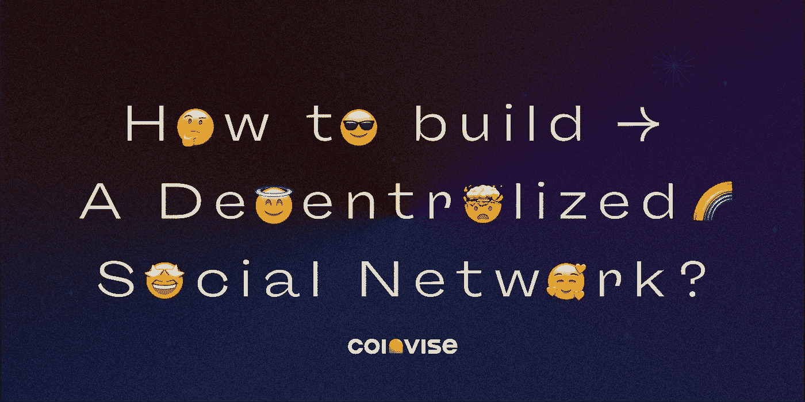
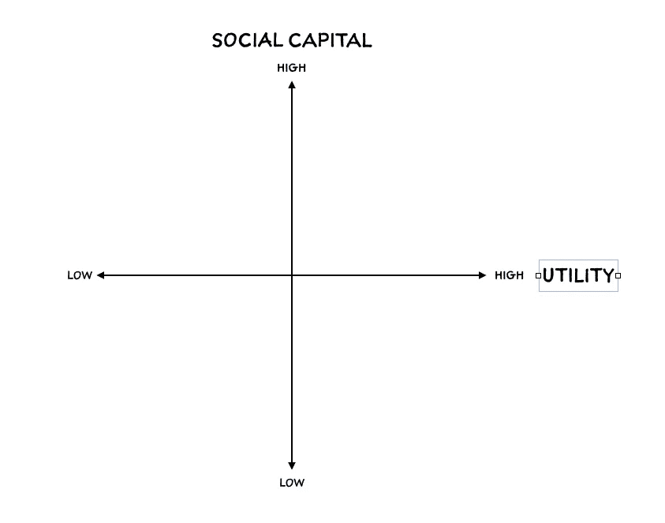
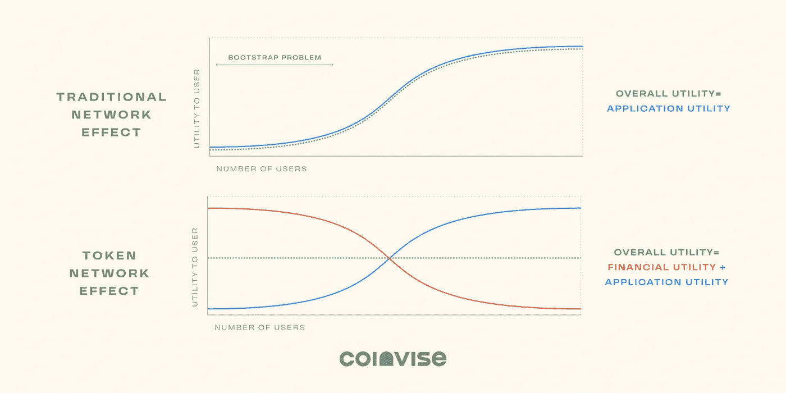

# 如何建立一个去中心化的社交网络？

> 原文：<https://medium.com/geekculture/how-to-build-a-decentralized-social-network-2bf9c3ccb804?source=collection_archive---------14----------------------->

嘿，你好！本文是与 [*Coinvise*](https://www.coinvise.co/) *合作撰写的，Coinvise 是一个 web3 平台，帮助创建者&社区建立和管理他们的社交令牌。你可以在这里加入他们的* [*不和*](https://discord.gg/GQNx6HpW) *。如果你觉得这篇文章有趣，一定要关注我的*[*Twitter*](https://twitter.com/CDTEliot)*。尽情享受吧！🔥*

在他最近的一篇文章中， [Crypto-Bezos](https://www.notboring.co/p/crypto-bezos) ， [Packy McCormick](https://twitter.com/packyM) 解释了亚马逊的创始人杰夫·贝索斯是如何意识到他要建造的东西必须是只能存在于互联网上的东西。

早在 1999 年，在一段采访视频中，贝佐斯解释说，“如果你能用更传统的方法做事，你可能就应该用更传统的方法。”早在这些天，杰夫·贝索斯已经知道他需要利用互联网。他知道亚马逊只能因为互联网而存在。

但是在互联网上并不是亚马逊的价值主张。上网络 3 也不会成为下一个十亿美元公司的价值主张。Web3 令人兴奋的地方在于它有能力创造前所未有的全新体验和使用案例。与亚马逊创始人杰夫·贝索斯 20 年前通过彻底改造人们购买书籍的方式所做的类似，我们将看到 Web3 公司改造我们今天正在做的事情，并将体验提高 10 倍。那么，在 Web3 中有哪些可以重新创造的体验呢？哪些领域真正需要利用这项新技术来提升 10 倍的体验？

社交网络可能是一个好的起点。事实上，在过去的一年里，我们看到了创作者经济的蓬勃发展，我们看到更多有才华的个人在网上分享内容，并聚集编织社区。越来越多的个人正在合作进行联合项目。去年向我们证明，Z 世代现在想要靠他们的热情生活，而不准备遵循过去 50 年形成的工作模式。工作的未来正在建立。大多数合作都是通过当前的社交网络(Discord、Twitter、Slack 等)进行的..).但是随着我们社会的发展，这些社交网络不再满足我们的需求。今天的创作者需要所有权和高效的协作方式。

Web2 社交平台不会解决这些问题，因为它们本质上不能。解决这些问题将意味着扼杀他们的业务。

这就是 Web3 即将到来的时候。去中心化的社交网络有能力解决这些问题。让我解释一下。

# Web2 社交网络的问题

从 00 '到 10 '，我们看到了社交网络和用户生成内容平台的兴起。我们看到了社交媒体的出现，它允许每个人在互联网上拥有发言权，并通过他们的内容表达他们的创造力。在接下来的十年里，一些用户积累了数百万的追随者，并开始将他们的内容货币化。创作者，此时也被称为“影响者”，发现他们可以通过这些平台将观众货币化，并有可能从他们的热情中谋生。他们在帮助其他人(品牌和企业)实现他们的目标。

但是互联网和我们的社会已经进化了。在为品牌工作了 10 年后，创作者发现他们现在可以成为品牌，成为产品，他们可以为他们做他们为别人做的事情。创作者有新的需求，目前的社交媒体无法解决。

事实上，当前的社交媒体有三个主要问题:锁定数据、权力集中和广告驱动的商业模式。

*   **锁定数据** —我们的现实生活和数字生活有着内在的联系，网络声誉比以往任何时候都更加重要。然而，对于互联网上 99%的人来说，他们的数字身份的价值被锁定在平台内。在 Instagram 上建立了 100 万粉丝的创作者不会在 Twitter 这样的另一个平台上建立 100 万粉丝。它们将从 0 开始。多年来建立声誉的亚马逊卖家不会在其他市场上获得五星好评。他们将在 0 开始。当离开一个平台时，用户不得不从头开始，所有的一切，因为平台之间没有互操作性。数据被锁定了。它没有激励用户尽最大努力或建立长期关系，因为他们知道离开平台后会失去它。此外，我们不能一直将我们的社会联系和记忆放在盈利公司控制的服务器中。人与人之间的联系应该由人来控制，而不是由公司来控制。去中心化的社交网络必须以新的方式重新获取我们的社交数据。
*   **集权**——如今，社交媒体高度集权。少数私营公司控制着公共话语，并从他们甚至没有创造的内容中获利。
*   **广告驱动的商业模式**——这种过时的商业模式迫使当前的社交网络保持围绕其内容的围墙花园。事实上，开放他们的数据意味着扼杀他们的商业模式。他们的主要盈利方式是将这些数据出售给盈利公司，以锁定特定的受众。这种商业模式阻止了外部开发者在其上创新或构建应用。这也让用户和创作者别无选择，只能继续使用这些应用程序，因为他们已经在这些平台上创造了观众。最重要的是，这种商业模式造成了这样一种情况，即实际制作内容的创作者报酬过低，货币化不足，并且没有充分捕捉到他们所创造的价值。

我们现在正进入社交媒体的第三阶段。今天的创作者不想向他们的观众推广产品。他们意识到他们可以和他们的粉丝一起建造大型项目，让他们参与其中，并与他们分享好处。这是粉丝/创作者关系的一次彻底的范式转变。今天，社交网络无法提供发展这种关系所需的工具。

那么，那些创作者的需求究竟是什么呢？我们如何建立去中心化的社交网络来真正赋予他们权力？这些平台上会出现哪些用例？

回答这些问题的第一步是从过去中学习，看看什么样的社会机制在 Web2 平台中起作用。

# 2 —当前社会网络的社会机制

在探索去中心化社交网络的可能用例之前，有必要了解什么是好的社交网络。通过分析当前社交网络的动态，我们将更好地理解人类的社交机制，并更好地理解如何利用加密机制来满足这些人类需求。

# 2.1-X 的证明

朱利安·莱尔在他著名的“[X 的证明](https://julian.digital/2020/08/06/proof-of-x/)”文章中发展了 X 的证明机制。在这篇文章中，他认为，在他们的核心，社会网络主要是关于一件事:通过信号建立社会资本。人们在 Instagram 上证明他们是有创造力的(创造性工作的证明)，在维基百科上证明他们是博学的(知识的证明)，在 Strava 上证明他们是运动的(身体活动的证明)。正如 Julian 在他的文章(谈到 Strava)中提到的那样，“*虽然最初让你进入应用程序的地位游戏可能是零和游戏，但你必须投入竞争的实际体育锻炼具有非常积极的复合效应。*

创建一个具有强大正反馈循环的社交网络，将确保人们会来到这个平台，因为这对他们其实是有好处的。他们会反复回来，因为这让他们感觉很好，因为这对他们确实有好处。而且你用的 app 越多，你越有可能去做原子行为。这就是正和博弈的意义所在。没有人需要为了别人的胜利而失败。我们可以创建分散的社交网络，这些网络是可行的，并且对人们有益。

问题是:什么样的社交网络会有类似的正反馈循环？一个令人兴奋的探索模式是游戏赚取模式，用户必须完成特定的任务才能获得奖励。

[https://twitter.com/dwr/status/1273307320911450112](https://twitter.com/dwr/status/1273307320911450112)

例如，我们可以想到一个社交网络，激励其用户设立挑战，并激励其他人进行“可持续生活黑客”(例如，每天吃一顿纯素食)。用户可以通过简短的视频记录下来，并获得与他们的应用内活动相关的分数:完成的行动/挑战的数量，他们激励了多少用户进行挑战等..Impactr 是一个已经在探索这些机制的社区。

# 2.2 —状态即服务

在他著名的文章“[地位即服务](https://www.eugenewei.com/blog/2019/2/19/status-as-a-service)”、[和](https://twitter.com/eugenewei)中，尤金·卫认为“*人是追求地位的猴子*、*人寻找最有效的途径来最大化社会资本*”

要创建一个成功的社交网络，必须考虑它的效用和它能为用户提供的社会资本。我能利用社交网络积累社会资本吗？如何衡量？我如何获得这种地位？可以实现什么样的功能来强化这种社会地位？

用户在 Snapchat 上与朋友讨论，但随后继续交谈，以免失去他们的“条纹”(你与某人交谈的连续天数)。人们在推特上发布他们的旅程，然后试图获得“官方”印章。

重要的是要明白地位必须通过艰苦的努力来获得。否则就一文不值了。价值是与稀缺性联系在一起的，社交网络上的稀缺性来自于证据。正如前面所解释的，Strava 上的证据证明活动奖励那些完成令人印象深刻的培训课程的用户。你骑的自行车越长，你获得的社会资本就越多。如果没有必要的技能和努力，地位就没有多大价值。

# 2.3 —社会渐近线

社会渐近线是我第一次听到这个术语是在帕奇·麦考密克的文章中。他解释说，不是每个人都可以在任何给定的社交网络上获得社会资本，这就产生了一个上限。你只能说服这么多人去做原子行为。事实上，现在很多人都有抖音账号，但只有少数人在这个平台上制作视频。这可以用一个事实来解释，那就是熟悉应用程序允许的所有工具并不容易。大多数用户不愿意投入工作去精通抖音算法所要求的任何东西。虽然不可能让一个平台的所有用户都真正发布内容并进行原子行为，但考虑一下可以鼓励任何人这样做的机制是很有趣的。

# 2.4 —为工具而来，为网络而留。

在他的著名文章“[为工具而来，为网络而留，](https://cdixon.org/2015/01/31/come-for-the-tool-stay-for-the-network)”[Chris Dixon](https://twitter.com/cdixon)中解释了他的想法，最初用[单人游戏工具](http://cdixon.org/2010/06/12/designing-products-for-single-and-multiplayer-modes/)吸引用户，然后，随着时间的推移，让他们加入网络。该工具有助于获得初始临界质量。网络为用户创造长期价值，为公司创造防御能力。

例如， [Strava](https://www.strava.com) 通过让用户轻松跟踪他们的体育活动(工具)来吸引用户，然后在用户的个人资料中自动发布活动，其他用户可以看到、喜欢和评论活动(网络)。

通过我们刚刚在本文第一部分看到的这四个例子，我们知道要创建一个成功的去中心化社交网络，我们需要创建一个平台来有效地:

*   让用户以艰难的方式赢得地位。
*   让用户反复回来，因为这让他们感觉很好，因为这实际上对他们有好处。
*   允许它的用户轻松地做原子行为，这实际上鼓励了任何人去做。
*   提供让用户的生活更加轻松的工具，从而吸引他们。
*   解决社交网络中存在的数据锁定、权力集中和广告驱动的商业模式等问题。

最好的社交网络已经成功地重塑了人们一起交流的方式，重塑了媒介，并有效地利用了人类的心理行为。人们最初迷上这些社交活动是因为它是新的，允许全新的行为。我认为，Web3 平台将通过创造一种全新的体验，提供一种共同交流和合作的方式，吸引下一批数十亿的社交媒体用户。Snapchat 允许人们通过短暂的照片交流，通过短视频交流抖音，通过音频交流俱乐部。那么，未来的 Web3 平台能提供什么样的新体验呢？

# 3.1 —解决锁定数据问题

去中心化的社交网络不同于传统的社交网络，因为它们是界面不可知的。事实上，去中心化社交网络的主要优势之一是它们允许的互操作性。在 Web3 中，每笔交易都是在链上进行的(意味着通过区块链发送并由其他人验证)，因此可以在开放的分类帐中访问(在区块链中发生的所有交易对其他任何人都是可见的)。凭借其开放的数据模型，Crypto 允许任何 Web3 平台使用这些可访问的数据，并因此从其他平台恢复用户的声誉。一个在分散平台上拥有 100 万粉丝的创作者，会把他们带到任何其他 Web3 平台上。他们被绑定到他们的加密钱包(在线身份)，而不是特定的平台配置文件。在一个 Web3 平台上拥有 100 万粉丝的创作者不会在另一个平台上拥有 0 个粉丝。他们将以 100 万英镑开始。多年来建立了声誉的亚马逊卖家不会在其他市场上开始零评论。他们将把他们的声誉带到各个平台，并检索他们所有的 5 星评价。这是一个完全的范式转变，我承认这可能是一个难以理解的概念。但类似地，你可以从世界上任何一台计算机访问你的电子邮件收件箱，因为它与登录和密码相关，而不是计算机本身，你可以从世界上任何一个平台访问你的追随者，因为它链接到你的加密钱包，而不是平台本身。

创作者不会将他们社区的注意力集中在一个平台上，而是分散在不同的界面上。所有界面的参与度总和将高于集中式平台。

要创建一个成功的去中心化的社交网络，允许互操作性是最基本的。

# 3.2 —符号化社区

社交网络的“圣杯”是创造一个同时具有社会资本和效用的平台。

如下图所示，平台上的用户越多，传统网络效应下的平台就越有用。如果没有朋友的照片发布在 Instagram 上，没有人会去那里；如果没有司机，没有人会去优步。在这种模式下，任何新平台都需要吸引大量用户，才能真正发挥效用…

另一方面，有一个具有令牌网络效应的新变量:金融效用。事实上，即使最初没有太多的“应用程序效用”，第一批用户也会通过社交令牌被激励使用该平台并使其增长。非常高的财务效用会驱使新用户到达应用效用将超过经济效用的拐点。

在去中心化的社交网络中，用户参与网络的经济利益。他们因投入时间构建产品和网络而获得回报。随着平台效用的增加，越来越多的人希望参与到数字经济中来。社交令牌将获得价值，奖励早期贡献者的辛勤工作。

分权是关于利润分享和收入象征化。它结合了功利(挣钱)和社会地位。用户会回来参与，因为参与开放经济对他们来说是好事。他们将获得财务自由，并将在他们的部落中获得社会地位。

去中心化的社交网络在创造代币的过程中，也会利用 X-Proof-X 机制。用户会做任务来赚取奖金(一个多人社交的单人游戏工具)，用户使用应用越多，他们就越有可能做原子行为(更多参与→更多责任→更多任务→财务自由)。

代币将允许任何人证明他们是社区的一部分，证明他们帮助了社区的发展，并证明他们从一开始就在那里。

# 3.3 —广告驱动的问题

要想成功，一个去中心化的社交网络也需要摆脱旧的广告驱动的商业模式。

说到底，品牌是创造者的企业版。如今，100 家广告商贡献了脸书 80%的收入。这些是像 P&G 或可口可乐这样的财富 500 强公司。他们这样做是因为这(几乎)是接触观众的唯一解决方案，但他们不喜欢他们必须做的事情。他们不喜欢脸书玩弄他们的数十亿美元，榨取他们的每一分钱。

这些主要品牌和个体创作者感受到同样的痛苦，下一个去中心化的社交平台需要解决这个问题。

一个伟大的广告活动是当你在人们所在的地方见到他们，并了解他们需要什么。年轻人已经不在脸书了。如果品牌想要接触到他们，他们必须上 Web3 并了解趋势。这就是为什么百威啤酒购买了域名“Beer.eth”，VISA 买了一个 NFT，亚利桑那冰茶买了一个[百无聊赖的猿](https://boredapeyachtclub.com/)。这是因为他们想成为这场运动的一部分，接触到“酷孩子”

像亚利桑那冰茶这样的大品牌已经明白这一点。他们不能就这么出现在派对上。他们必须受到邀请，并仔细考虑与谁结盟以及如何共同成长。必须有强有力的价值观一致。品牌发展自己的品牌和产品比以往任何时候都更重要，这样 Web3 社区才会邀请他们加入。否则，那些品牌就要成为局外人了。

在构建下一个去中心化的社交网络时，理解这些动态并协调用户和品牌的动机是至关重要的。似乎终于有了一个可行的商业模式，既适合用户又适合品牌。

# 3.4 —集中化问题

也许下一个去中心化的社交网络不会构成一个巨大的图(类似于脸书或 Twitter ),而是围绕共享主题构成许多子图。

我们已经看到许多社区和平台在合作，创建一个由许多子图组成的社交网络。这似乎是一个积极的方向。拥有、监管和控制一个庞大的分散式社交网络会困难得多。

权力下放也必须包含在这些子图中。随着这些社区的令牌化，投票权(持有令牌带来的)将在许多贡献者之间分配，因此限制了小团体为整个社区决策的风险。

# 4 —具体的使用案例

正如本文开头提到的，去中心化的社交网络只有允许做只能在区块链上做的事情，才会成功。它必须彻底改造用户体验。在“区块链”上建立一个照片和文本的 feed 是没有意义的它已经存在于集中式社交网络中。在我看来，即使允许用户“控制他们的数据”也不是一个足够强大的卖点，因为用户并没有真正看到他们日常使用的优势。Web3 社交网络要想成功，体验必须是只有在区块链上才有可能的魔力。

那么什么样的体验只有在区块链上才有可能呢？

我认为媒体应该利用 Web3 的功能。一本杂志可以创建自己的社交网络。的确，这对杂志和用户来说意味着很多好处。

*   **检查来源**——现在所有的内容都在链上，任何人都很容易检查来源，甚至在十年后，再次检查文章中提到的信息。
*   **不可能审查**——审查某人是不可能的，因为不可能从区块链上移除某些东西。
*   **轻松筹集资金**——杂志可以直接嵌入他们的平台 NFTs 来筹集资金。用户不用去另一个平台创建账户，只需点击“购买 NFT 支持我们的工作”按钮就可以轻松完成。
*   追踪最大的粉丝——杂志也可以很容易地追踪谁帮助了这个项目，并为他们提供特殊津贴。我们可以想象购买 NFT 的人获得了访问独家内容的能力。由于一切都在链上，NFT 持有者将不必做任何事情。通过注册他们的加密钱包，从而证明他们的身份，该平台将看到他们是 NFT 的所有者，并将为他们解锁内容。即使他们将私人链接发送给他们没有 NFT 的朋友，这些朋友也不能访问它，因为平台不会解锁内容。
*   **让社区参与**——杂志也可以让他们通过快照投票，让更多的社区参与民主决策。

## 用例 2:建立信任，为下一个十亿策展人赋能。

分散社交网络的另一个有趣的用例是构建社交图的能力。

同样，由于一切都在链上，并且与某人的身份相关，任何 web3 平台都很容易访问数据并创建社交图。这是我们在[共同投资公司一直努力的方向。](https://www.coinvise.co/)在每个 Coinvise 创建者个人资料上，您可以看到创建者拥有的社交令牌，以及他们相信和参与的社区。Coinvise 的创造者也有一个与他们的在线身份相关联的声誉得分，并根据他们在其他分散平台上的行为来创建。

现在想象一下，当成百上千的创造者和社区加入 Web3 的时候。任何合作用户都可以访问创作者、他们的社区、他们的工作、他们的朋友之间的关系的连锁社交图…

对于任何想要发现新利基的人来说，这是一个充满可能性的全新世界。每个人都将成为馆长。例如，假设你喜欢一个运动创造者。在这种情况下，你将能够直接看到他们相信哪个社区，他们参与哪个社区。所有的信息都将被自动管理。不需要手动操作。有了开放数据模型和链上发生的每一笔交易，监管工作将自动完成。

分散的社交网络也可以解决信任问题。如今，当在 Facebook Marketplace 上销售或在 Instagram 上接收来自人们的 DMs 时，知道这个人是否合法的唯一方法是相信微弱的社交信号，如粉丝数量、个人资料图片、帐户是否经过认证等..在 web3 中，将会有信誉评分。声誉得分将有助于建立创作者的信任，不是因为他们在 Twitter 上的高信号，而是因为他们可能已经建立并发展了一个高价值的社区。

# 结束语

我们已经看到成功的分散式社交网络利用了这篇文章中提到的心理机制，并解决了 Web2 平台的一些最紧迫的问题。我可以想到 [Showtime](https://tryshowtime.com/) 允许其用户通过 NFT(解决锁定数据问题)和利用 Proof-X 机制(通过收集稀有的 NFT，Showtime 的用户可以证明他们的良好品味(Proof-of-good-taste))来拥有他们的内容。该平台还利用了“投资即身份机制”它允许人们表明他们很早就投资了一个创造者，他们从一开始就在那里，他们是[的第一天粉丝](https://benjlaufer.medium.com/the-day-one-fan-ac331a6731ae)。

[Rabbithole](https://rabbithole.gg/) 也是一个有趣的 Web3 平台，它实现了一个“教育证明”机制，让用户证明他们很早就在 crypto 上投入了时间。它利用了“代币网络效应”,在用户完成任务时奖励他们代币。

我最近还发现了两个很有前途的去中心化社交网络:

*   XMPT —打破围墙花园的通信，实现钱包间的信息传递
*   [DeSo](https://www.deso.org/) — DeSo 是全新的第一层区块链，旨在将分散式社交应用扩展至 10 亿用户。

Web2 社交网络将慢慢失去他们所有的用户，因为他们不会从本质上解决他们目前面临的最紧迫的问题。

我认为下一个大型社交网络可能一开始看起来根本不像社交网络。不会有一个主要的社交网络。将会有几个社交网络，都是可组合的。事实上，可组合性是 crypto 的一个重要部分。

我们将每天使用几个 Web3 平台，并将我们的数据带给每一个平台。不会再有中央集权，也不会有锁定数据或广告驱动的商业模式。

Crypto 将成为这些平台中解锁体验的原生令牌，并可能成为伟大的在线游戏[的原生令牌。](https://www.notboring.co/p/the-great-online-game)

如果下一个去中心化的社交网络仅仅是元宇宙会怎么样？

**想要更多？**

你可以在 [Twitter](https://twitter.com/CDTEliot) 上关注我，订阅我的[时事通讯](https://eliotc.substack.com)。你还可以在“[社交令牌革命](https://www.amazon.com/Social-Token-Revolution-revolutionize-together/dp/B09NGTB395/ref=sr_1_1?crid=1TGBBFRY23FM4&keywords=Eliot+couvat&qid=1641919505&sprefix=eliot+couvat%2Caps%2C160&sr=8-1)”中找到你需要知道的关于社交令牌的一切。感谢来到这里！**🔥**