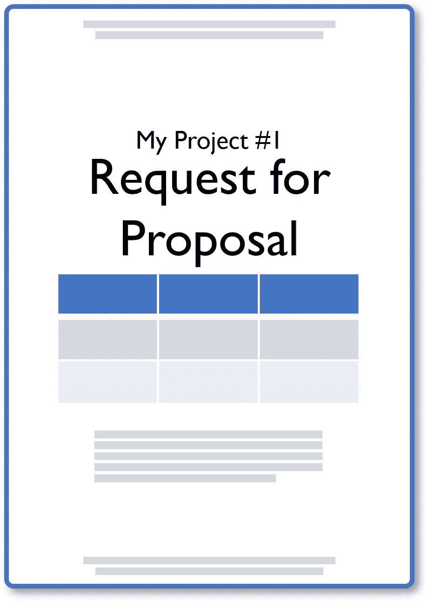

# 如何建立提案请求？

> 原文：<https://medium.com/geekculture/how-to-build-a-request-for-proposal-bf7c1ffc5943?source=collection_archive---------61----------------------->

这里有一个写提案请求的方法:放入哪些元素，如何安排内容的顺序和结构…这些最佳实践来自我们自己的工程项目管理经验和我们合作过的公司。

在继续之前，让我们检查一下本文中提到的一些概念的定义:

**供应商**
在本文中，我们称供应商为您委托实现您的建议书中描述的产品或服务的人。该供应商可以属于另一家公司或您自己公司的另一个部门。

在[之前的文章](/geekculture/how-to-organize-your-project-documentation-naming-convention-storage-location-order-no-3d4e59a16a20)中，我们看到了如何组织和归档所有的项目文档，例如提案请求。今天我们将讨论征求建议书的内容。我们将回顾所有有用的部分，以使其最完整，易于供应商理解，并在您的需求发生变化时易于更新。我们为每一项添加了个人重要性等级，从我们的角度告诉你，我们认为它们有多重要。

我们建议您下载[我们的开源模板](https://www.naept.com/en/products-templates/)来获得我们在这里解释的概念的图解。

# 文档参与者列表

The contributors list

重要性:1/5

这是对该文档的构建做出贡献的人员的列表。我们甚至可以添加他们的电子邮件地址和他们所扮演的角色，以帮助文档的读者获得他们问题的答案。

# 进化列表

The evolutions list

重要性:4/5

这是一条非常重要的信息，需要添加到您的文档中。随着时间的推移，根据与供应商的讨论，您的需求评估将会更加成熟。因此，您将使其保持最新，以方便和加快对文档新修订的审阅；这对于识别自上次修订以来发生变化的项目非常有帮助。

查看我们关于矩阵的文章[的专门章节](https://luc-dumont.medium.com/what-is-a-traceability-matrix-part-two-4e731da79fab)了解更多详情。

# 词汇

重要性:5/5

在你的文档中使用技术术语之前，定义你将使用的所有缩略语、概念和技术术语会很有帮助。

读者很可能会使用相同的措辞，但含义略有不同。这种差异可能会导致项目后期的误解。或者也许你有其他人难以理解的非常具体的概念。

因此，为了限制风险，最好是在文档的开头用一个表格解释每一个技术概念。

我们将在下面的文章中更深入地探讨这个问题:[编写规范文档的 4 个主要困难](https://luc-dumont.medium.com/4-major-difficulties-in-writing-a-specification-document-bac15183c239)

# 描述

这是写文档的另一个主要难点:描述文档所属项目的上下文非常重要。由于这些描述，您的供应商将为您提供更好的建议。这种语境化在几个级联描述中清晰地表达出来。

## 您的公司描述

重要性:3/5

描述你的公司:它的专业领域是什么？它的植入是什么:本地、全国、全球？谁是你的客户，你的市场？你的价值观是什么？等等。

当你在一个在线平台上发布你的提案请求时，告诉更多关于你的信息可能会带来新的供应商。您可以更好地评估这些供应商，这取决于他们是否在您的专业领域有丰富的经验…

## 项目描述

重要性:4/5

你在建议书中描述的需求属于一个更大的项目。

举个例子，我曾经雇佣过一个供应商来制造几台非常有技术规格的工业计算机。我不是计算机制造方面的专家，这就是为什么我雇用了一个供应商，所以除了我的需求描述之外，我还对那些计算机将用于的更大的项目说了几句话。根据这种情况，我的供应商能够给我一些建议，告诉我一些我没有意识到的风险。我们一起对这些计算机提出了更高的要求。

## 征求建议书主题描述

重要性:5/5

在通过列出需求来深入了解你的需求细节之前，你可以用两三句话来告诉你的供应商你的需求的目的，让他们了解“大局”。

在我之前的例子中，我所需要的计算机应该在测试台上测试一个飞机计算器。

这个具体的描述可以很容易地合并到项目的描述中。

## 文档的描述

重要性:2/5

最后，我们讨论文档本身的目的。在项目期间，您可能会有几种文档(提案请求、硬件规格、软件规格、验证计划……)。它们可以复制先前详述的相同描述，但是每个都将有给出文档本身目的的特定描述。

征求建议书的目的是向供应商候选人提供相对简短的需求说明。希望供应商将此请求与描述其解决方案的文件相匹配，以便在所有供应商中选择最佳方案。

以下是该项目的其他文件的简要说明:

*   硬件规范:从硬件的角度详细描述供应商的解决方案
*   软件规范:从软件的角度详细描述供应商的解决方案
*   验证计划:这些计划应描述所有要执行的测试，以检查提案请求中列出的客户需求交付覆盖的完整性。

# 文献学

Bibliography

重要性:5/5

在表达您的需求时，您可以参考外部文件。征求建议书的读者也应阅读这些外部文件，以了解您的要求。

这种外部文件可以是例如:

*   交付物应遵守的标准的描述
*   建筑计划
*   元件数据表
*   专业杂志上的一篇文章
*   …

在专门的表格中列出所有这些外部文档将非常有用。该表至少应包含标题、文件的修订版，如有可能，还应包含找到该文件的链接。

此外，为了避免在每次需要引用文档时重复完整的标题，我们可以给每个外部文档一个小的引用放在文本中。该参考文献可以由几个字母数字字符组成，参考文献和外部文件之间的链接由参考文献表给出，如下所示:

这种方法的一个好处是，如果一个外部文档版本发生变化，您不必在提到它的任何地方都更新您的文档，您只需更新文献目录表，小的参考文献可以保持不变。所以你的文档更容易维护！

# “待定义”元素表

The TBD list

重要性:4/5

出于以下几个原因，您可能必须在文档完全完成之前发布它:

*   你在等待一些信息细节
*   您的需求尚未完成，因为您需要一些专家意见
*   为了赶上最后期限，你需要尽快启动这个项目

考虑到这一点，在你的文档中仍然有一些细节需要定义，一些“球拍上的洞”。就像外部文件提到的那样，这些缺失的细节可能到处出现。因此，一个好的做法是将它们都列在各自的专用表格中，并给每个人提供自己的小参考:

1.  现在你有了一个清晰而精确的列表，列出了所有需要定义的东西。
2.  多亏了这个小引用，您只需按几个“Ctrl + F”键就可以更新所有丢失的细节！

# 需求列表

重要性:5/5

终于！这一部分代表了文档内容的 95%。在这里，你将尽可能详尽地描述你的所有需求。

把每一个需求都当成购物清单上的一项。它是对您的项目的特定需求的最短描述。努力使每个需求尽可能不依赖于另一个需求。试着让每一个都成为一个容易识别的段落。并且收集所有的需求，在一个独特的类别下谈论一个特定的主题(或者部分，或者章节，你命名的结构)。这些小技巧会让它们更容易更新。

更多细节，请查看本文[需求评估:一些好的实践](https://luc-dumont.medium.com/needs-assessment-some-good-practices-50c92034faee)。

在接下来的部分中，我们将向您展示构建一个需求的方法。这个结构应用了前面的技巧。

# 如何构建一个需求，使之有效

我们之前多次说过，需求是项目的一个小的、具体的和独立的需求的表达。在这里，我们将处理如何安排需求内容，以便在其他项目中更容易识别、更新和重用。我们将分解这个例子:

> *NPT _ PROJETX _ CDC _ AESTH _ 0038.2 车辆颜色
> 车辆应漆成红色。
> 结束*
> 
> *意图:红色是公司的标识色。*

## 参考文献和标题

> *NPT _ PROJETX _ CDC _ AESTH _ 0038.2 车辆颜色*

我们已经解释了使用唯一引用来识别需求的好处，以便在可追溯性矩阵、演进表或任何其他文档中提及它。

这里需求引用的根是文档引用(参见[如何组织你的项目文档](/geekculture/how-to-organize-your-project-documentation-naming-convention-storage-location-order-no-3d4e59a16a20))。对于这个根，我们添加一个短字符串来标识需求类别。在本例中，字符串是“AESTH ”,表示类别“审美”。我们将这一要求归入这一类别，因为它涉及车辆的颜色。

则引用包含由数字组成的字符串。该编号应识别要求。两个不同的要求在文件中不应有相同的编号。所以你知道要求“0038”是关于车辆颜色的。

最后，需求引用以一个点和另一个代表其版本的数字结束。修订是需求被更新的次数。在我们的示例中，这是第二次更新需求 0038。给每个需求一个修订号对于快速识别文档两次修订之间的更新需求非常有用。

在引用之后，我们给需求添加一个标题，用几句话告诉需求是关于什么的。这有助于快速阅读文件。

## 内容和结束标记

> *车辆应漆成红色。
> 结束*

在 reference 下，您现在可以描述您的需求的内容了。

以“END”标签结束需求描述允许框定什么是强制性的，并精确地定义项目边界。读者知道，从契约的角度来看，引用和结束标记之间包含的所有内容都是不可协商的。例如，这种约定可以在文档描述中确定。

我给内容加了页边空白，让它读起来更舒服。这是识别内容的另一种方式。

## 意图

> *意图:红色是公司的标识色。*

在我看来，这是添加到来自法律的文档中的一个好习惯。在一个强制性的项目之后，比如一个需求，我们添加一个可选的段落来解释为什么我们有这样的需求。有时需求内容很复杂，我们可能会试图用不那么强制性的指示来延长它，以使它更清晰。但是将强制内容和普及内容混在一起会有模糊界限的风险。

因此，当一个解释有助于理解一个需求时，只要把它加在一个“意图”段落之后，就不会干扰强制性的项目边界。

# 结论

那都是乡亲们！现在，您有了一组模块化内容来填充提案请求，以使其更清晰、更易于更新。此外，所有这些项目都是高度模块化的，所以您可以将它们(或不)放在文档中您想要的任何位置。因此它们可以被重复使用、增强和优化。你在一个项目中重用它们越多，它们就越有效，你的文档就越好！

# 你呢？

你如何组织你的文件？
你还加其他项目吗？
你的最佳实践是什么？

📝为我们的[商业项目文档研究](https://docs.google.com/forms/d/e/1FAIpQLSc_qdxv6Cmqtkk5SVe3SBOGktS4nX4vKe81DUQ_N_x0qrYVUA/viewform?usp=sf_link)做出贡献。