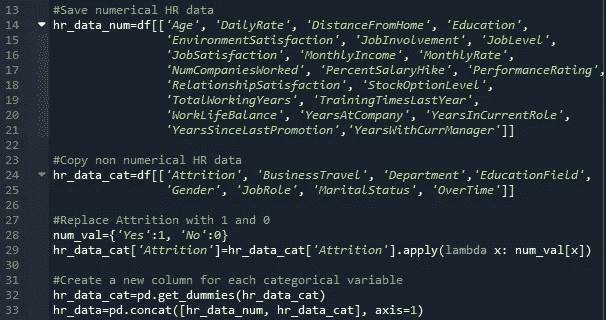
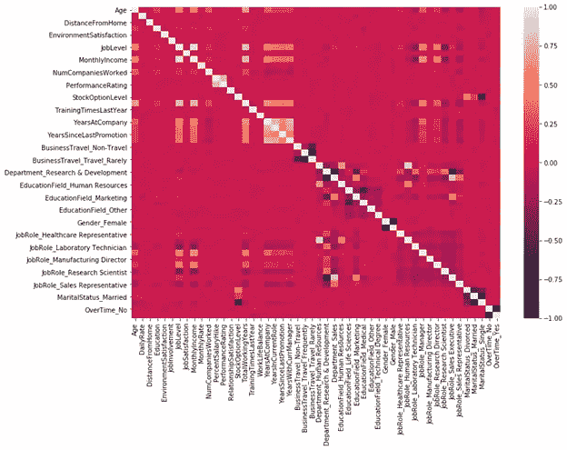
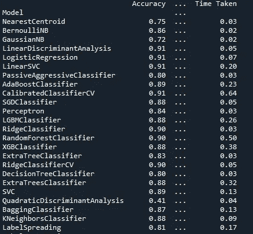
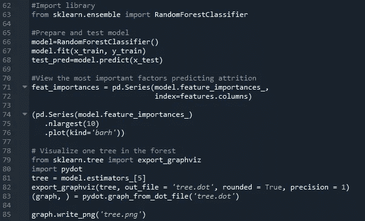
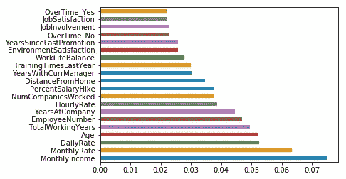

# 如何构建一个简单的机器学习模型来预测减员并揭示关键的运营风险

> 原文：<https://medium.com/geekculture/how-to-build-a-simple-machine-learning-model-to-predict-attrition-and-uncover-critical-operational-82d1af754ba8?source=collection_archive---------7----------------------->

## 这个机器学习模型预测了一个没有人预见到的危险结果

Image by SeventyFourImages

在我的上一篇文章讨论了监督学习在战略性劳动力规划中的应用之后，我被要求分享一个具体的例子，并说明机器学习模型是如何工作的。

本文提供了一个分步指南(带代码)来实现一个简单的监督学习模型来预测流失。你会看到最后的结果是令人惊讶的，并将为公司创造一种紧迫感，以快速响应预测的减员情况。

该模型是用 Python 编写的。Python 是最容易理解的编程语言之一。它可以用于多种目的，包括 web 开发、视频游戏开发、计算和科学操作…它在数据科学解决方案和机器学习框架方面非常受欢迎。与其他编程语言相比，它也相对容易学习。

## **第一步:访问数据**

出于这个练习的目的，我使用 IBM 提供的免费 HR 数据集，包含 1470 行和 35 列(在这里访问)。每一行代表一条员工记录，每一列代表员工特征，如职称、资历、加班、自上次晋升以来的年数、环境满意度等。它并不完美，因为一些重要的特征如时间戳(我们不知道就业日期，也不知道他们的离职日期)丢失了，但它将足以执行建立机器学习模型来预测减员的建议练习。

在现实生活中，这些数据的很大一部分可以在公司的人力资源系统中找到，一些属性如环境满意度可以通过员工参与度调查来衡量。

## **步骤 2:加载数据**

第二步是将数据加载到模型中。我不会深入解释 python 语法的细节，但是在我的代码中，每个以' # '开头的语句提供了代码试图实现的细节。

## **步骤 3:清除数据**

一旦我们加载了数据，检查是否有任何异常是很重要的(例如:空数据字段、无限值或没有任何意义的值)。如果您的公司跨多个人力资源系统运营，建议还执行健全性检查，以确保数据准确代表您的员工。

## **第四步:组织数据**

第四步是将我们的数据组织成一个可行的数据框架。

在我们的数据集中，我们有一些数字变量和一些文本变量，它们是分类的(职位、部门名称、性别等。)，这意味着它们不是“自由文本”，而是持有特定的值(例如:“性别”是“女性”或“男性”)。

我们需要将当前的数据框转换成一个纯数字的数据框。为了实现这一点，我们将通过为每个类别创建一个额外的列来将这些分类变量转换为数字变量。

下面是输出的一个片段。看看“随着时间”是如何从一个分类变量变成一个数字变量的。

**第五步:评估变量之间的相关性**

评估数据集中的一些变量是否相关是很重要的。例如，变量“月收入”和“周工资”可能是相关的。理想情况下，我们希望删除相关性非常强的变量，因为它们可能会无意中复制我们将输入到模型中的一些信息。

为了确定变量之间的相关性，我们将准备一个评估每个变量之间相关系数的相关矩阵。

下面是相关矩阵的一个片段。我们可以注意到“在公司的年数”和“自上次晋升以来的年数”之间有更大的相关性，但是我们知道这些变量不会复制相同的信息。一般来说，变量之间的相关性似乎相对较低，因此应该可以继续当前的设置。

## **步骤 6:在训练和测试之间分割数据**

构建机器学习模型时的一个重要组成部分是将我们的数据集分成 2 个子集:训练和测试。您的模型将使用训练子集来确定适当的校准。测试子集将用于尝试预测结果并评估其准确性。

目标比例通常为 80:20。我们希望使用 80%的数据集来训练模型，20%的数据集来测试输出。在大多数 python 包中，这个发行版经常被设置为缺省值，包括我们将使用的名为 scikit-learn 的包。

## **第七步:选择合适的机器学习模型**

如前所述，我们将实现一个分类，但是是哪一个呢？有了经验，选择合适的模型就变得更明显了。然而，麻省理工学院创建了一个名为“Lazy Predict”的包，允许我们运行多个机器学习模型，并根据你的数据评估最佳拟合。

以下是多个模型及其准确度得分:

我评估了准确性高的多个模型，其中最适合我们问题的是随机森林分类器。线性判别分析和其他排序略高(91%)的方法似乎不能有效预测流失情况，尽管它们在识别非流失情况方面更有效。在我们的例子中，由于预测流失比预测非流失更重要，所以最好选择一个较少犯这些类型 2 错误的模型(在我们的例子中，不预测流失)。

## **步骤 8:建立模型**

如上所述，我们将使用随机森林分类器构建模型。这个分类器由许多共同操作的决策树组成。随机森林中的每棵树都给出一个类别预测，投票最多的类别成为模型的预测(见下图)。

这种类型的分类器的优点是它非常适合处理大量数据，同时确保结果之间没有相关性(例如，一个员工的流失预测不会影响下一个员工的预测)。如果你有兴趣了解更多关于随机森林分类器的知识，这里的是一篇很棒的文章。

下面是用我们的数据集构建这个模型的代码。

这是我们的森林中的一棵树的可视化表示…

…以下是在我们的模型中预测流失的 10 个最重要的参数。

根据上图，我们看到，在预测这家虚构公司的流失时，与薪酬相关的因素比任何其他因素都重要。从人力资源的角度来看，这表明该公司需要审查其整体薪酬战略和整个组织的人力资源支出。这似乎不是一个非常令人惊讶的见解，但接下来会是什么！

## **第九步:预测未来减员**

既然模型已经建立，我们现在可以使用它来确定哪些留下的员工有离开公司的风险。我们将把剩余的员工列表输入到我们当前的模型中，以预测哪些人将会离开。

因此，我们能够确定 6 名有离职风险的员工。令人担忧的是，这些预期的离职中，绝大多数来自研发部门(6 人中有 5 人)。这可能会对运营产生非常不利的影响，并造成反应的紧迫感。我们现在知道了面临离职风险的员工，也知道了造成人员流失的最大因素。

这说明了机器学习的强大。我们可能没有预料到某个特定部门会面临更大的风险，因为它甚至不在人员流失的首要因素之列，但通过随机福里斯特分类器，我们能够识别这些人，因为它考虑了所有 35 个属性。

## **结论**

在这篇文章中，我们开发了一个机器学习模型来预测未来的员工流失。正如所展示的，开发一个利用现有数据的相对简单的机器学习模型不需要大量的开发专业知识，因为可以利用通过 Python 提供的预构建框架。然而，该模型的结果提供了对可能严重损害公司运营的流失风险的关键见解。机器学习可以帮助预测这些潜在的结果，并主动做出反应。想象一下隐藏在数据中的洞察力！

## 来源:

 [## Python 在商业中的 10 大应用| Xccelerate

### 这些天来，数据科学和机器学习领域所有最新最伟大的事件似乎都以…

xccelerate.co](https://xccelerate.co/en/blog/uses-of-python-in-business/)  [## IBM HR Analytics 员工流失和绩效

### 预测你有价值的员工的流失

www.kaggle.com](https://www.kaggle.com/pavansubhasht/ibm-hr-analytics-attrition-dataset?select=WA_Fn-UseC_-HR-Employee-Attrition.csv)  [## 了解随机森林

### 该算法如何工作以及为什么如此有效

towardsdatascience.com](https://towardsdatascience.com/understanding-random-forest-58381e0602d2)  [## 带有流失预测的人员分析

### 每年都有许多公司雇佣许多员工。这些公司投入时间和金钱来培训那些…

towardsdatascience.com](https://towardsdatascience.com/people-analytics-with-attrition-predictions-12adcce9573f)