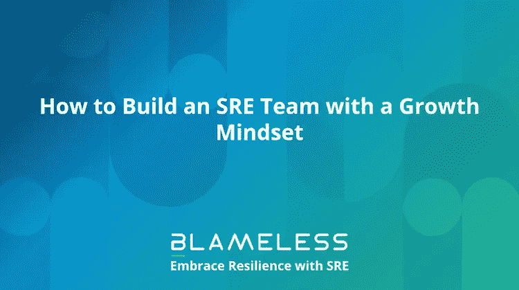
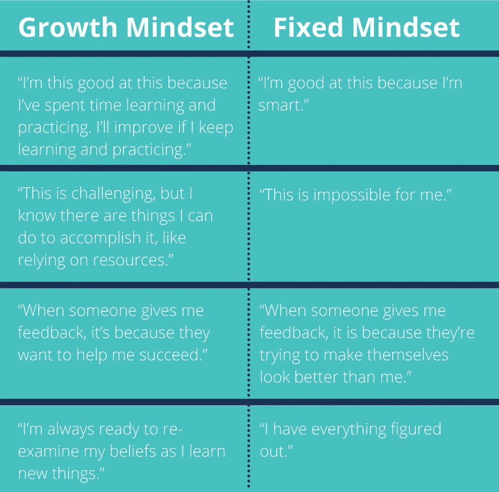

# 如何建立一个成长思维的 SRE 团队

> 原文：<https://medium.com/geekculture/how-to-build-an-sre-team-with-a-growth-mindset-a978f73d9e68?source=collection_archive---------28----------------------->

SRE 最大的好处并不总是流程或工具，而是文化的转变。建立一种无可指责的文化可以深刻地改变你的组织的运作方式。你们的 SRE 团队应该成为你们文化发展的捍卫者。为了推动变革，sre 需要体现一种增长的心态。他们需要相信他们自己的能力和观点可以不断发展，并在整个组织中鼓励这种心态。

在这篇博文中，我们将讨论:

*   什么是成长型思维，为什么它能帮助你的 SRE 团队
*   如何以成长的心态招聘员工
*   如何将员工培养成具有成长心态的 sre
*   一种无可指责的文化如何赋予一种成长的心态

# 什么是成长心态？

在[为《哈佛商业评论》撰写的一篇文章中，卡罗尔·德韦克对成长型思维的定义进行了分解。她总结了自己的发现:](https://hbr.org/2016/01/what-having-a-growth-mindset-actually-means)

“相信自己的才能可以发展(通过努力工作、良好的策略和他人的投入)的人有一种成长的心态。他们往往比那些心态更固定的人(那些认为自己的天赋是与生俱来的人)成就更大。”

为了说明这一点，我们来比较一些说法。

# 为什么有一个成长的心态会有帮助？

在你的组织中拥有一个成长的心态有助于友谊、承诺、冒险和创新。在[为《哈佛商业评论》进行的一项研究中，作者发现:](https://hbr.org/2014/11/how-companies-can-profit-from-a-growth-mindset)

“成长型公司的员工是:

*   47%的人认为他们的同事值得信任，
*   34%的人对公司有强烈的归属感和责任感，
*   65%的人认为公司支持冒险，并且
*   49%的人认为公司鼓励创新。"

如果你想提高团队的士气和生产力，成长的心态是必不可少的。

# 你的 SRE 团队:成长思维的捍卫者

在整个工程组织中灌输成长思维的最佳方式是有一个专门的团队来支持它。您的服务请求是帮助推动这一变化的最佳人选。以下是一些原因:

*   SRE 是一个整体实践，因此 sre 与整个组织的团队互动
*   sre 创建强调成长心态的过程，例如通过无可指责的回顾从事件中学习
*   sre 通过 SLO 和错误预算创建安全措施，以鼓励创新
*   SREs 推动审查和修订周期，强化反馈的重要性
*   sre 将所有失败视为学习和改进的机会，使团队和系统随着时间的推移更有弹性

等等，如果你现在没有 SRE 团队呢？如果你没有 SRE 团队，这些原则可以被每个工程师采纳。成长思维不是由 SRE 团队产生的，而是被拥护的。为了取得成功，所有团队成员都需要参与进来。但是，如果你想从头开始建立一个 SRE 团队，这里有一些建议。

# 雇佣具有成长心态的员工

为你的 SRE 团队招聘员工时，找到具有成长型思维的人是关键。在与无可指责的人的讨论中，新遗迹副总裁和通用 Nic Benders 讨论了他如何将心态置于经验之上。他说，对某人以前工作过的地方的预测能力“非常差”相反，他说“我总是寻找那些对不断挑战自我和学习新事物感兴趣的人。”

但是你如何在面试时确定一个人的成长心态呢？以下是一些可能具有启发性的问题示例:

**你能告诉我们你最近的一次成功吗？你为什么会成功？**

具有成长心态的候选人可能会将他们的一些成功归因于外部资源。这些可能是他们读过的书，他们做过的研究，或者他们交谈过的队友和大学。他们也可能指出以前的失败是最近成功的原因。毕竟，失败总应该教会你一些东西。

**你能告诉我们你最近经历的一次失败吗？为什么会出问题？**

失败可能是痛苦的。然而，它们给了我们成长的空间。具有成长心态的候选人仍然可能会注意到失败的痛苦。但是，他们也很有希望谈论他们从这次经历中学到了什么。他们会对这一事件睁一只眼闭一只眼，并寻找未来改进的方法。

在这里工作时，你最想了解什么？

寻找那些因为看到公司发展机会而申请的候选人。学习和尝试新事物是日常工作令人兴奋的原因。候选人可能想要学习一门新的编程语言，或者是你的堆栈中的一个新工具。或者他们可能对不同的团队如何跨职能合作感兴趣。好奇心总是受欢迎的。

**成长心态对你来说意味着什么？**

有时候直接的路线是最好的。当候选人对成长和学习充满热情时，这表明他们可能非常适合你在 SRE 的角色。

这些问题并不全面。它们是关于增长的对话的起点。考虑在面试前给候选人这些问题，这样他们在回答之前有时间思考。这也可以减轻面试过程中的压力，创造一个更加开放和友好的环境。

# 在内部培养一个具有成长思维的 SRE 团队

除了招聘，你还可以通过在内部提拔人员来壮大你的 SRE 团队。[在组建你的 SRE 团队](https://www.blameless.com/blog/how-to-build-an-sre-team)时，考虑以前的各种职位。仅仅因为某人没有“SRE”这个头衔并不意味着他们在这个角色上不会很棒。

在他与无可指责的 T3 的[讨论中，尼克·本德尔斯分享了他的想法。“我必须时刻提醒自己，我没有通过做我有资格做的事情来达到今天的位置。同样，作为一名领导者，我需要把工作交给其他人，这些人可能不具备或者看起来不具备做这项工作的资格，因为这是他们的成长之路。”](https://www.blameless.com/blog/modern-operations-best-practices-from-engineering-leaders-at-new-relic-and-tenable)

如果你给他们机会，有成长心态的人会迎接挑战。有人表示他们已经准备好学习新事物，这和技术专长一样令人鼓舞。请记住，这可能需要一些来自队友和领导的额外支持，同时羽翼未丰的 SRE 找到自己的立足点。

# 在整个组织中推广 SRE 实践

理想情况下，工程组织中的每个人都应该熟悉 SRE 最佳实践。即使他们没有直接使用 SLO 或者写回顾，他们也应该知道这些工具是如何工作的。最重要的是，他们应该理解*为什么这些实践很重要*。你的 SRE 团队应该成为这些课程的大使。

SRE 不仅仅是为了 SREs。无可指责的事件回顾对于所有负责在产品中运行代码的团队都很重要。事故响应程序对所有拥有服务或携带寻呼机的团队来说都很关键。这种心态有助于提高组织的整体弹性。它也提高了你潜在的 sre 池。如果每个人都了解最佳实践，你就能够基于心态专注于推广。

# 用无可指责的文化赋予成长心态

成长的核心是一种代理感。人们需要自由地挑战自己的极限。他们需要被赋予创新的能力。最重要的是，他们需要拥抱失败。如果害怕失败后会受到惩罚，即使是最注重成长的人也会感到窒息。

无可指责的文化是鼓励成长心态的关键。当出现问题时，不要把责任归咎于个人，而是要探究系统的原因。假设每个人都在尽最大努力真诚地工作。不要因为某人犯了错误而责备他，而是要调查他为什么会犯这个错误。试着庆祝你在每一次事故中改进了你的系统。

无可指责的态度补充了成长的心态:

*   两者都处理行为背后的原因，而不是行为者
*   两人都相信失败会带来成长和未来的成功
*   双方都将反馈视为一种支持形式

你准备好让你的团队拥有成长的心态了吗？无可指责可以帮忙！要了解如何操作，请看一个[演示](https://www.blameless.com/schedule-demo)。

如果你喜欢这篇博文，请查看以下资源:

*   [电子书:SRE 最佳实践基本指南](https://www.blameless.com/resources/the-essential-guide-to-sre)
*   [思想领袖小组:什么是“真正的”SRE？](https://www.blameless.com/resources/thought-leadership-panel-what-is-a-real-sre)
*   [播客:塔米·布莱恩特和埃里克·罗伯茨胶水工作的重要性](https://www.blameless.com/blog/resilience-in-action-episode-5)

*最初发表于*[*https://www.blameless.com*](https://www.blameless.com/blog/how-to-build-an-sre-team-with-a-growth-mindset)*。*