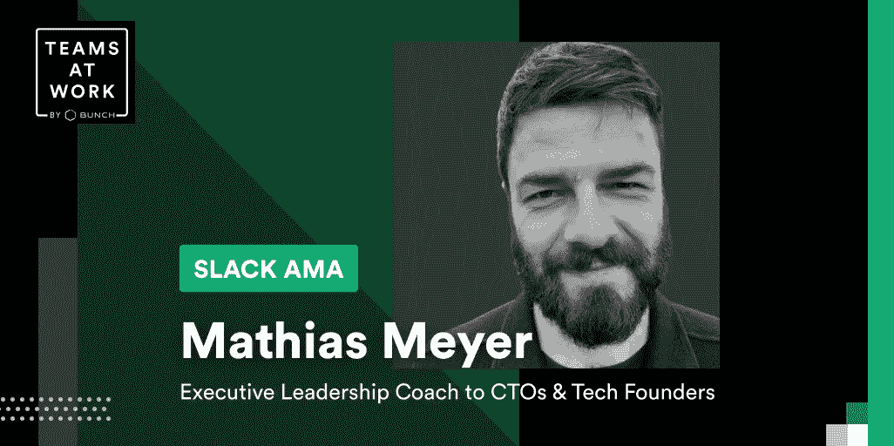
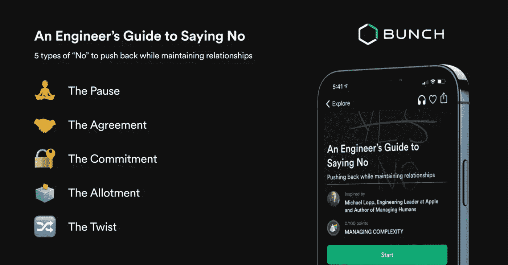

# 如何与 Travis CI 联合创始人 Mathias Meyer 一起建立高绩效的技术团队

> 原文：<https://medium.com/geekculture/how-to-build-high-performing-tech-teams-with-travis-ci-co-founder-mathias-meyer-f3a036d74509?source=collection_archive---------23----------------------->

我们的 Slack 社区“工作中的团队”( Teams in Work)最近有幸与马蒂亚斯·迈耶(Mathias Meyer)举办了一场异步 AMA。拥有领导高绩效技术团队的经验，曾担任联合创始人、首席执行官和首席技术官。他有过两次成功退出，是 Travis CI 的联合创始人之一！他刚刚成立了一个有意图的组织,帮助其他领导者在他们的团队中取得成功。

以下是马蒂亚斯在 AMA 的一些精彩片段:

# 🍎帮助你的团队发展技能和职业

**问:当每个人都专注于交付当前的路线图时，你如何为同事创造学习新技能的空间？**

我想你已经知道这个问题的答案了。如果每个人都一直很忙，你就无法创造空间。你需要及时安排让人们学习。否则这不会发生。是一周一天还是一个月一天，由你决定。但是如果信号是当前的路线图总是放在第一位，你就不能指望他们创造空间。那么这就是将要发生的事情，路线图总是放在第一位，这意味着没有什么是第二位的。

> 人们将交流的内容优化为最重要的关注点。

我发现这很有帮助，作为一名经理，不仅为团队创造空间(例如，周五作为学习/放松日，每周，每两周，无论什么最有效)，也为我自己创造空间。我过去常常在周五“不在办公室”,给自己一段很长的思考和反思时间，让我的思绪游荡，思考发生了什么，我看到了什么模式，什么可能需要调整，或者只是我脑海中的一个问题。

**问:如果首席技术官更多的是一个“处理代码”的人，而在管理团队和委派任务方面缺乏经验:你是更愿意建议从首席技术官的代码工作中去掉一些事情，让他们更多地发展成为一个“管理角色”,还是更愿意让一个经验丰富的项目/产品经理加入进来？**

我建议不要强迫一个人进入管理岗位，如果他们真的不喜欢。首席技术官有不同的级别，他们关注的焦点是什么，管理层可以但不一定是其中之一。对于一个成长中的团队来说，开始在工程团队中增加管理人员，或者寻找一个 VPE/总监级别的人来完全取代 CTO 的管理工作，这样他们就可以专注于他们最有价值的地方。

观察某人在哪里可以提供最大的价值(除了观察他们想做什么和业务需求是什么)是一种健康的方式，可以观察他们在哪里可以定位自己，反过来，他们需要在哪里招聘人才来填补其他缺口，如管理、产品或项目管理等。

此外，作为一个题外话，我建议不要等到你的团队接近 10 人时才招聘经理。到那时，你就把一个相当大的团队交给了一个新经理，很可能从一开始就让他们超负荷工作。在早期考虑这一点是值得的，那时你也可以首先专注于雇佣一个有经验的经理，而不是寻找一个高层或副总裁类型的人。

问:在疫情之后，你认为高管职业的下一个地平线是什么？

**Mathias:** 行政和管理职业生涯中最大的转变将是在你几乎没有控制力的环境中工作，有那么多人无法亲自接触。

> 信任将在未来的知识工作中发挥重要作用，谢天谢地，许多人不得不适应这样一个现实，即他们不能依赖旧的控制工具，这些工具仅仅是靠坐在一个人身边并直接接触到为你工作的每个人而存在的。

这适用于长期目标设定和战略，以及日常工作的进展。

这反过来又导致高管们不得不从根本上重塑他们的角色，更少地关注控制，而更多地关注影响力和支持角色，而不是拥有一个不言自明的庞大存在。所有这些对于那些有着不完全符合这些要求的特殊管理风格的人来说无疑是一个挑战。

我是根据我自己在全球建立和管理团队的经验来说这番话的，所以这基本上是我必须经历的转变。

**问:在你带领员工进入高层领导岗位的过程中，你有什么见解可以分享吗？职业发展是什么样的？**

Mathias: 没有一条通往领导角色的道路，我在教练和与周围人一起工作的经历反映了这一点。我曾与擅长管理的伟大工程师共事过，与擅长工程管理的人力运营经理共事过，与擅长客户支持和成功的流程工程师共事过，与善于与人相处的前咖啡师共事过。这些只是一些例子。一些人选择了这些道路，另一些人则是出于偶然或纯粹的需要，就像在快速增长的初创公司中发生的那样。

**问:你如何帮助工程师决定他们是愿意继续做 IC 还是承担更多的“标准”领导角色(即管理)？**

我认为这里的一个关键问题是你是否真的喜欢与人共事。如果你从指导他人、与他人交谈(在你的团队中和你周围)、在团队成员的支持下把自己的工作放在背景中、帮助他人克服障碍等等中获得快乐。

老实说，当我从一名工程师变成一名全职的 CEO 时，我并不知道我会如此喜欢这份工作。随着时间的推移，直接与人共事、帮助和指导他人已经成为我所从事的工作中最喜欢的事情。还涉及其他方面，如:

*   处理不确定性和向上管理。
*   说不。你必须对各种各样的事情说不，接下来的工作项目，升职或加薪的请求(理想情况下，你说不的时候要有一个清晰的计划，告诉他们如何实现，这是作为经理需要关注的另一件事)。
*   职业发展。

并不是所有这些你都会提前知道，有些你只会在工作中发现你是否喜欢和擅长它们。如果不是这样，那么总有选项(我希望！)移回 IC 角色。顺便说一句，我上面概述的技能和特质不仅适用于管理角色，它们也可以是其他领导角色的有用技能，这些领导角色不直接涉及人员管理，如产品、技术主管、高级工程师等。

# 🧠论建立学习(和接受失败)的文化

**问:你如何培养一种接受失败的文化？**

T4:这有两个方面。一个是关于失败的文化，另一个是关于你如何利用你学到的东西。

我会问自己和团队的问题是:

*   为什么我们的测试(不管有多频繁)会以失败告终？
*   我们哪里猜错了？
*   我们的假设有哪些被证明是错误的？
*   失败与成功的可能性有多大？

每个人都可以很自由地提前声明，这是一个令人沮丧的连续失败，在你进入下一个之前，你想一起回顾和改变这个过程，让你的猜测更有根据，让你的测试(希望)更成功。

然后使用这些数据来改进您的流程，而不仅仅是您所做的测试。在这个过程中你能改变什么来更好地猜测你的测试？在运行测试之前，您可以向谁咨询以收集更多数据？

> 人们确实需要战胜时间，这是肯定的。我不认为我在这里的工作是一个激励者，而是一个关注过程而不仅仅是结果的管理者。

如果还没有发生的话，公开承认这些会有所帮助。失败文化也始于承认你哪里做错了(作为领导者的你),并试图找出你如何能做得更好，所有这些都不要把责任推到团队身上。例如，也许你把团队逼得太紧了，需要放松一点，创造更多空间来进行更好的实验。失败的文化从高层开始，一点一点往下流。

# 🤲高绩效团队的多样性和包容性

**问:在不失去动力的情况下，增加包容性的最佳方法是什么？(也就是说，如果每个人的意见都包含在每个决策中，那么企业很可能会陷入停顿)**

**马蒂亚斯**:首先，我要说的是，大多数决定都没有大到应该停止整个企业的程度。企业日常生活中发生的大多数决策都有一小部分人会受到他们的影响。因此，需要做出的更大的决策有一个好处，那就是不需要匆忙做出决策。他们确实有时间去思考、理解和收集观点。

确保决策(无论范围如何)有边界的关键。如果你让重要的决定无限期地悬而未决，那么你的生意可能真的会陷入停顿。

那些界限是什么？

*   **时间:**我们对这个决策的反馈和讨论开放多长时间？根据受影响的人员、团队或部门的范围和数量，您可能需要几天、几周，有时甚至几个月。例如，一个大的战略转变可能不是你想匆忙离开的。
*   人们:我们需要听取谁的意见才能做出这个决定？在这种情况下，明确表达并接近对某件事有关键兴趣或观点的人是值得的，而不是说，发出一个普通的反馈电话，并希望正确的人会及时发现(因为每个人都在忙自己的事情，所以不要指望这种情况会发生)
*   **影响:**这个决策的范围是什么，谁会受到影响？范围越大，留给人们提供反馈和继续讨论的时间就越多。
*   **决策前提:**谁做最后的决定？在做出决定之前，谁必须权衡一下？在打最后一次电话之前，需要如何处理反馈意见(即，是否每个问题都有理由进行更改，或者是否也可以通过明确的原因来解决问题)？

这就是我喜欢使用的框架。重要的是，对于什么样的决策，什么是可接受的转变是清楚的，并且具有一定较大影响的决策需要考虑足够广泛的反馈来源。最后，我想指出决策只是包容的一个方面。很重要的一个，但只是其中一个。

问:对日益多样化的追求如何塑造了高管团队的体验？

**马蒂亚斯:**我想到了一些关键的事情:

*   高管需要自己努力，自我教育，寻求指导，寻求更广阔的视角，避免成为自上而下决策的孤岛，消除招聘中的伙伴制度(最简单的方法是让你在过去的工作中合作过的人加入，这些人往往更多像你一样，无论好坏)。
*   积极寻求反馈，而不是依赖小道消息。在场并与每个人交谈，而不仅仅是向你汇报的人。随着越往上，信息越少。
*   清楚事情的背景和原因。透明度是这里的一个关键原则，并允许下一点。
*   接受挑战，承认错误。此外，实际上改善，以减少再次发生这种情况的可能性。
*   对失败持开放态度，对你自己和你的团队都是如此(我想在另一个问题的答案中会有更多关于这一点的内容)。
*   学习，修补，调试，影响。找到许多小方法和小事情，告诉你如何改善一个组织，而不是随心所欲地发号施令和改变路线。可以说是一种实验文化。

# 💻关于远程工作和通信

**问:你推荐用什么产品/会议来传达公司当前的长期、中期和短期目标？**

这在一定程度上取决于一个组织如何设定目标。使用 OKRs，KPIs，Scrum，或者其他类似的过程，来决定你需要什么人工制品和你有什么会议。

总的来说，定期回顾目标和你的进度是个好主意，以诚实和坦率的方式，不要责备，这样你就可以了解发生了什么，你可以改进什么来更好地实现你的目标。总的来说，特别是对于那些刚刚开始设定目标的团队和组织，我建议准备好这些人工制品:

*   你想去的地方的愿景和使命。(长期)
*   为实现这些目标，你要做什么的简明策略。(12 至 18 个月)
*   一组关键的组织目标(3-5)，你正在努力推进这些目标。理想情况下，这些是可以衡量的，但我不认为 100%重要。你需要能够讨论你如何以及是否在与他们对抗。(3-6 个月)

那是它的简称。我喜欢简单，我反对在你使用的任何框架中使用确切的目标和目的，但是我想这是一个不同类型问题的主题。

# 🌱关于领导力战壕的教训

问:你需要学习哪些新技能？你还在学什么？

**马赛厄斯:**放下我自己的判断和想法，不管事情应该怎么做。无论他们参与的是哪家公司，都不介意拯救。我只是帮助他们面对现实，找到前进的方向。

我仍在学习作为一名教练，我在哪些方面最有帮助，以及我如何与客户中的不同个性打交道。每个人都需要不同的方法，提出这些框架并根据个人情况对其进行定制是我仍在努力的方向，我想永远都是这样。

**问:作为一名经理，你有什么希望知道的事情吗？**

Mathias: 我很幸运，在我成为全职首席执行官后，就开始和一位教练一起工作，所以我在管理生涯的早期就有机会一窥这份工作。所以我不确定我现在是否有很多东西可以回顾。我最喜欢的工具一直是提问，即使这可能会让人们感到沮丧，尤其是当他们向你汇报并希望得到快速的回答或决定时。问问题在当时对许多人来说似乎很奇怪，但他们已经开始欣赏它来帮助他们解开自己对世界的看法。

Mathias 是众多与 Bunch 分享两分钟建议的领导者之一。下载我们的 [***AI 领导力蔻驰***](https://apps.apple.com/app/apple-store/id1500872908?pt=121075759&ct=mathias%20meyer%20AMA%20medium&mt=8) ***app 每天 2 分钟成为更好的领导者。***

想和马蒂亚斯联系吗？加入我们在工作懈怠社区的团队，与他和成千上万的其他领导者交谈！

🐦[在 Twitter 上关注我](https://bit.ly/3qwwVNB)或[查看我们的 YouTube 频道](https://bit.ly/3uaB8ZH)了解更多关于技术领导力的内容。

💌你也可以订阅每周简报，这是我的周日领导时事通讯。