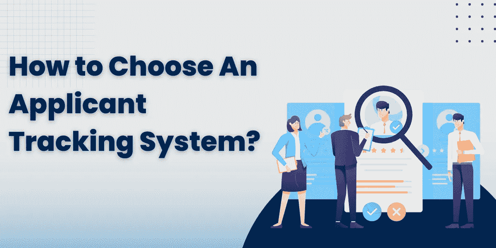

# 如何选择申请人跟踪系统？

> 原文：<https://medium.com/geekculture/how-to-choose-an-applicant-tracking-system-732e1fd48d88?source=collection_archive---------19----------------------->

招聘过程在一个组织中至关重要；除了合适的职位描述和强大的招聘团队，ATS 是为空缺职位寻找合适人选的最佳工具之一。

根据[报告](https://www.marketsandmarkets.com/Market-Reports/applicant-tracking-system-market-27004100.html)，申请人跟踪系统市场规模预计以 6.7%的 CAGR 增长，到 2026 年将达到 32 亿美元。

要为您的组织做出最佳决策，有必要了解什么是申请人跟踪系统(ATS)以及选择该系统时需要寻找哪些功能。ATS 是一个软件应用程序，通过简化招聘流程来帮助企业。它通过在整个招聘过程中组织和跟踪求职者来做到这一点。许多 ATS 还提供简历解析等功能，有助于加快寻找合格候选人的过程。选择 ATS 时，您应该记住几个关键要素。

# 定义您的需求——您希望 ATS 系统具备哪些特性？

一个全面的 ATS 系统应该为您的组织提供的不仅仅是一个发布职位信息和收集简历的平台。当考虑你需要什么样的功能时，关注最有价值的工具，以简化招聘流程，最大限度地减少体力劳动，并支持遵守相关法律。这些功能可能包括定制的工作模板，以简化角色的快速发布，自动筛选流程，以加快审查候选人，以及直观的分析工具，以跟踪招聘数据和申请人流程。正确配置的 ATS 可以在整个招聘周期中显著提高效率，同时提供积极的候选人体验。

# 列出利弊清单——这将帮助你缩小选择范围

缩小选择范围的一个好方法是列出利弊清单。一份精心制作的清单可以帮助你组织和量化不同选项的优缺点，让你更容易做出明智的决定。利弊列表也有助于了解哪些功能是关键的。采取这种全面的方法将会产生许多权衡每个选项的风险和收益的见解。写下您的想法有助于澄清任何困惑，同时让您能够看到更大的画面，以决定最适合您的组织的 ATS 系统。

[Source](https://www.freepik.com/)

# 尝试几个不同的系统——利用免费试用看看哪个最适合你

一家公司的 ATS(申请人跟踪系统)是一项巨大的投资，因为它可以让招聘人员更容易、更高效地管理申请。然而，由于 ATS 解决方案数量众多，可能需要一段时间来确定最适合贵公司的解决方案。为了帮助您做出决定，我们建议您充分利用 ATS 提供商提供的任何免费试用，这样您就可以在做出承诺之前测试一些不同的系统。这将有助于您深入了解每种 ATS 的特性和功能，以便您能够自信地选择适合您组织需求的 ATS。

# 实施选择的系统——培训您的员工如何使用它，并开始跟踪您的申请人！

成功的申请人跟踪系统(ATS)实施应遵循正确的步骤。最佳实践是对员工进行如何使用 ATS 的培训，确保每个人都了解 ATS 的功能和优势，并能轻松使用。这将有助于更好地跟踪申请人，提高效率并节省成本。一旦经过全面培训，您就可以启动 ATS 跟踪并开始记录工作申请，从而做出更明智的决定，聘用合适的候选人！一个实施良好的 ATS 将帮助您更有效地管理您的人才获取需求。

当你准备好开始寻找一个[申请人跟踪系统](https://gohire.io/applicant-tracking-system)时，记住这五个提示，确保你找到最适合你需求的。通过花时间进行研究，创建一个利弊列表，并通过免费试用尝试一些不同的选项，您可以确信您会找到一个适合您企业的 ATS 系统。一旦你选择了一个系统，实施它是很容易的——培训你的员工如何使用它，并开始跟踪你的申请人！