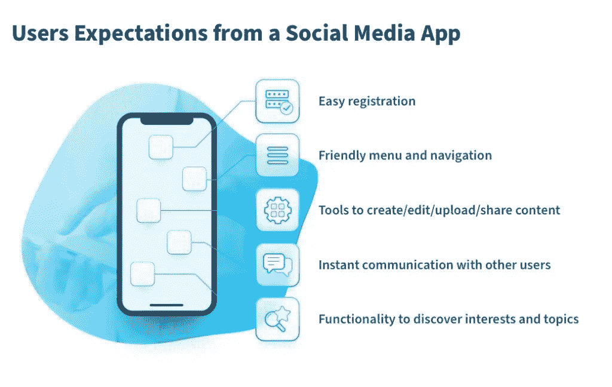

# 如何创建一个社交媒体应用程序来赢得更多潜在用户— NIX United

> 原文：<https://medium.com/geekculture/how-to-create-a-social-media-app-to-win-more-potential-users-nix-united-15092d3912a3?source=collection_archive---------25----------------------->

人是群居动物。每个人都需要一个社交圈，与志同道合的群体聊天，分享想法。这就是为什么社交媒体平台越来越受欢迎。

普通用户每天在社交媒体服务上花费两个半小时。近 40 亿人使用社交网络，每个人在不同的社交服务中有大约 8 个账户。很明显竞争相当激烈。那么，为什么你需要建立自己的社交媒体应用程序呢？

最近，社交网络从一个为具有相似兴趣的人提供的平台转变为一个满足营销需求的强大工具。像脸书、Instagram、抖音这样的巨头是提供给众多广告商的用户数据的主要来源。他们收集关于用户及其行为的各种信息，以帮助促销活动触及准确的目标受众。有时，这种数据的安全性会失控，我们会发现大量数据泄露，超过数百万用户的帐户被泄露。

此外，流行的社交网络不断改变活动源算法，使一些内容出现得更频繁，同时使其他内容从网格中消失。

通过创建自己的社交媒体应用程序，你可以获得更多关于受众的见解，制定与受众沟通的策略，并无限制地获得受众的关注。为有共同兴趣的用户建立直接互动的网络，没有任何限制和干扰。

让我们深入研究社交媒体应用程序开发，检查关键功能，并了解如何制作一个社交媒体应用程序，其功能将帮助您了解您有哪些解决方案可以从竞争对手中脱颖而出。

**目录:**

制作新社交媒体应用的想法应该包括如何从众多竞争对手中脱颖而出的概念。观众的兴趣是不稳定的，它昨天跳到的东西，明天就不会吸引它了。把握当前社交媒体趋势的脉搏。

# 市场

社交媒体应用是一个我们每天至少花费几个小时的地方。在那里购物而不需要离开另一个服务或应用程序的可能性似乎吸引了很多顾客。难怪，像脸书、Instagram 和 Pinterest 这样的社交应用程序会在它们的应用程序中实现购物车。用户只需点击他喜欢的产品图像，就会被提示将其添加到购物车并完成结账，一切仍在社交媒体应用程序界面中。

# 数据分析

从企业社交账户产生的大量数据中获得洞察力至关重要。对于社交客户经理来说，提取所有数据、找到最有用的指标并将其转化为有价值的报告是一个非常耗费人力的过程。这就是自动分析仪表板的[趋势在全球范围内兴起的原因](https://nix-united.com/blog/top-14-mobile-app-dev-trends-that-will-change-business/)。它可能不仅收集关于喜欢、观点和范围的信息。它还提供了一些提示，说明如何创建一个社交媒体应用程序，根据事实不断扩大其范围，即哪些内容最有吸引力，衡量与关注者内容最相关，降低跳出率和关注者流失率。

# 阿肯色州

AR 是 2021 年最大的移动 app 发展趋势之一。AR 利用通过手机摄像头上传的视频流，并实时覆盖另一张照片或视频内容，影响用户周围的环境。它被 Instagram 和 Snapchat 以及其他社交服务广泛使用，不仅作为娱乐手段，还用于推广品牌和更好地向客户介绍产品。这有助于他们更好地想象现实生活中的物体，例如，添加口红的面膜，不仅可以娱乐，还可以推广化妆品品牌，并展示产品的色调在顾客脸上的效果。在虚拟试穿取代店内试衣间的疫情时代，这种解决方案尤其有用。如今，70%的顾客对使用 AR 作为购物体验的一部分的品牌更加忠诚，这有助于他们更快地做出决定，并从整体上促进品牌的销售。

# 人工智能聊天机器人

企业越来越多地使用社交媒体应用中的聊天作为技术支持渠道。在我们生活的这个时代， [53%的顾客更愿意从他们可以在社交媒体聊天中发信息的商家那里购物，而不是打电话或发电子邮件。聊天机器人可以全天候工作，分析请求并找到所需的解决方案，可以在几分钟内解决客户的问题。聊天机器人是一种人工智能程序，可以通过自然语言处理和生成来自动回答客户的信息请求，仅从数据中做出响应，并使其听起来像是与支持技术人员的自然对话。](https://sproutsocial.com/chatbots/)

社交媒体类型反映了客户执行的常规任务以及他们想要实现的主要目标。了解你未来应用的类型将有助于你分析你的竞争对手。根据分析，你可以学习如何创建一个社交媒体应用程序，以及如何盈利。

# 网络社交

这是一种专注于联系人们的社交媒体。这是一个全球论坛，让全球各地的人们参与讨论。它从一个简单的网络成长为我们获取世界各地一切知识的主要来源，这个网络有能力创建个人资料、建立小组并与社会其他成员建立联系。社交网络允许通过付费广告活动提高应用用户的品牌知名度。这种盈利方式是近年来最流行的，尤其是在脸书和推特的追随者中。佣金取决于浏览量、目标受众和促销持续时间。通过这种货币化模式，社交网络出售其流量，因此这是拥有大量活跃用户的社交网络的一种工作模式。

# 媒体共享网络

Instagram 和 Pinterest 等分享照片和短视频的网络为企业向潜在客户提供了出色的视觉表现。它们与社交网络的不同之处在于，它们主要提供视觉体验分享，添加标题是可能的，但不是实质性的。YouTube 是一个巨大的视频平台，是世界上第二大访问量网站，也是第二大搜索引擎。在过去的几年里，视频内容的崛起已经成为一种趋势。媒体共享服务从社会动员转向货币化。除了横幅、叠加、弹出广告和其他在线和线下企业付费的传统营销活动，最近 YouTube、Vimeo 和 Flickr 已经转向免费增值模式。这意味着用户可以免费使用这项服务，尽管要像 YouTube 一样获得原创内容或音乐库，他们需要将帐户升级到 Premium。应用内购买也越来越受欢迎。例如，Instagram 对所有在 Instagram 购物上销售的产品收取 5%的费用，但[提高了 1416%的流量，产生了 20%以上的收入。](https://www.bigcommerce.com/blog/instagram-shopping/#why-instagram-shopping)

# 社区博客

社区博客允许用户通过撰写一致的叙述来分享他们对任何话题的想法。在 Quora 或 Reddit 上发布一个关于某个小众话题的帖子可能会引发围绕这个话题的讨论。帖子也可以包含对各种产品或服务的评论。它帮助其他用户决定与某些品牌打交道。这样的评论可以在 Yelp 或猫途鹰上看到。用户可以使用应用程序内的在线预订来预订最好的酒店或订购食品，为应用程序的所有者带来收入分成。如果你的博客是一个希望将他们的研究和评论货币化的专家社区，通常会实施订阅或付费模式。

我们希望与您分享 NIX United 的方法,即如何通过全周期社交媒体应用开发的逐步流程来构建社交媒体应用。

# 1.规划和分析阶段

策略阶段是移动应用程序开发的第一阶段。这是一个全面的阶段，包括产生想法，研究，审查和未来应用程序的详细原型。战略阶段的最初步骤是检测潜在的应用程序用户，建立主要的概念和目标，研究竞争对手，并设定独特的卖点。你的应用最终用户是谁？如何让社交媒体应用独一无二，为什么用户会访问你的社交网络而不是竞争对手？你的赌注是:出色的视觉界面，增强的用户体验，创新的功能，或盈利方式。此外，在这个阶段，开发团队在对客户需求和市场需求进行彻底分析后，建立技术文档并选择最小可行产品(MVP)特性。对于社交媒体应用程序，此类功能通常包括:

*   **报名**。除了传统的注册表格，它可能包括其他社交账户或电话号码的授权解决方案，以及带有短信或电子邮件个人验证的“忘记密码”屏幕。
*   **档案创建**。应该包括照片和视频文件添加的可能性。
*   **后期制作。**根据社交服务的类型，用户可能想要分享照片、视频、文本、实时流、评论或提出想法进行讨论。
*   **搜索。**要建立社交联系，用户需要有找到朋友的可能性。
*   **聊天。**用户需要能够通过发送可能包含媒体文件的消息来联系朋友。对于一些社交网络，创建群聊的能力。
*   **进给**。通过朋友和社区的最新消息吸引客户。
*   **推送通知。**通过用户的帖子、新消息或来自他们喜爱的社区的新闻来通知用户最近的活动。

在这个阶段，你还需要选择一个平台:iOS 或者 Android。考虑到更受欢迎的社交媒体应用程序开发系统是 iOS，它在北美、西欧国家和大洋洲等发达国家的使用也更广泛，这增加了社交应用程序货币化的机会。选择的系统也会影响应用的范围、团队的规模、开发、测试和部署的时间以及成本。

# 2.设计阶段

在构建社交媒体应用程序时，您需要特别注意应用程序的 [UI/UX 设计。创建全面的用户旅程和信息流架构。这种应用程序的直观和用户友好的设计是一个核心功能。很重要的一点是，很容易达到社会目标。简单的吸引力、布局的简洁和令人满意的功能将决定一个新应用的成败。设计社交媒体应用需要考虑的重要因素:](https://nix-united.com/blog/app-design-definitions-process-best-practices-and-tips/)

*   **直观导航。**保持简单，因为极简主义是创建应用导航的最佳方式。包含大量功能的复杂导航、难以识别的图标和隐藏的主要选项可能会让用户感到困惑和沮丧。
*   **适用于所有角色的综合工具。**为内容创作者、发布者和广告商设计简单直观的工具。

该阶段的主要重点是如何建立一个社交媒体应用程序风格指南和完整的 UI/UX 设计，这通过了从草图、线框和原型到我们的应用程序皮肤的所有设计阶段。这些设计皮肤将被分配给开发团队用于未来的编程。

# 3.发展阶段

最后，团队将计划和设计转化为 MVP，这是一个现成的应用程序，它应该确认应用程序满足所有要求，并从第一批用户那里收集信息，以确定它是否满足他们的期望。

发展的过程很大程度上取决于前两个阶段的可靠性。这一阶段可能是最耗时和最昂贵的，所以要耐心和精确。

开发可以分为两部分:客户端和服务器端。编程语言、软件开发工具包、软件架构模式和整个技术栈不仅取决于项目技术需求，还取决于项目思想。您需要定义您的目标受众和他们的需求，以将其转化为需求。基于这些，开发者可以为你提供满足你的用户需求的解决方案。

此外，每个系统都有自己应该考虑的优点和缺点。构建社交媒体应用重要的是实施增强的数据安全性和升级性能，以确保数据安全和高负载能力。如果没有适当的后端开发，包括安装允许软件与其他软件交互的服务器、数据库和 API，所有这些都是不可能的。后端技术栈通常包括 Ruby，。NET、Postgre DB 和 Redis。

要获得更多关于不同技术堆栈的效率和成本效益的详细信息[请联系 NIX 联合专家](https://nix-united.com/services/mobile-app-development/)。

# 4.检验阶段

测试应该在开发的每个阶段提供，从项目的最开始。执行自动化和手动测试不仅仅是为了克服缺陷，比如应用程序的错误和崩溃，而是为了防止它们，并确保设计和开发的每个关键阶段的高质量性能。

他们的不同之处在于他们在每个 SDLC 阶段定义项目需求和识别弱点的能力。

为什么这个阶段和之前的所有阶段一样重要？因为仅仅修复一个 bug 就可能导致许多其他 bug 的出现，造成灾难性的崩溃。测试有助于避免这种情况，而不是修复它，并为项目所有者节省预算和声誉。如何从一开始就让一个社交媒体 app 发挥作用？NIX United QA 工程师建立了一个社交媒体应用测试策略，可以精确地检测出需要多少性能、安全性和可用性测试。

安全测试对社交媒体应用非常重要，因为每年主要网络如[脸书](https://www.bbc.com/news/technology-56772772)和[谷歌](https://economictimes.indiatimes.com/tech/technology/tech-giants-are-plunged-into-political-firestorm/articleshow/83453463.cms)都会带来令人不安的数据泄露消息。与科技巨头不同，对于小型社交网络来说，丢失用户信息可能会让项目付出生命的代价。因此，测试团队应该检查所有可能的漏洞、数据溢出的机会，以及在恶意软件攻击的情况下继续进行的应用程序算法。此类测试还应检查您的应用程序是否符合当地限制，如欧洲议会的一般数据保护法规(GDPR)或年龄限制，如允许 13 岁以下用户访问社交媒体服务的儿童在线隐私保护法案(COPPA)。

# 5.应用发布和支持阶段

在开发和测试应用程序之后，是时候向应用程序商店发布第一个版本并发展用户社区了。正确的营销策略是必须的。团队应该准备好所有的宣传材料，让你的应用在众多应用中脱颖而出，吸引你的目标受众。在提交应用程序的第一个版本后，该团队使用各种分析工具来确定用户参与度，在设计或性能方面进行必要的修正，或者用附加功能升级应用程序，以提高用户获取率并增加应用程序的成本。

# 结论

现在，当你熟悉社交媒体应用程序开发的整个周期时，你可能会确信这是一个充满挑战、耗时且昂贵的过程。然而，市场上的领导者在不断变化，抖音和 Snapchat 正在紧追脸书和 YouTube，所以你的应用程序有机会获得广泛的流行，你只需要记住目标受众的需求。NIX 是一个可靠的技术合作伙伴，可以找到如何使开发成为无缝过程的最佳解决方案，并在从产生想法到维护已在使用的应用程序的每个步骤中为您提供帮助。

*原载于 2021 年 7 月 15 日*[*【https://nix-united.com】*](https://nix-united.com/blog/how-to-make-a-social-media-app/?fbclid=IwAR0FKMRzqWB9ROvVMDxVkZW45R4bQ93DeiNLiGpguwYwPzNV0KUhG0XZQTg)*。*