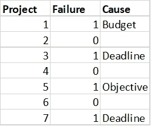

# 如何决定是否调查潜在的潜在问题

> 原文：<https://medium.com/geekculture/how-to-decide-whether-to-investigate-a-potentially-underlying-problem-d629248fc1aa?source=collection_archive---------25----------------------->

系统性问题[复杂](/geekculture/systemic-problems-in-software-development-are-as-complex-as-they-are-everywhere-else-60cc56e8500f)。它们由一个组织使用一套特殊的[技术](/geekculture/an-organization-must-manage-complicated-difficulties-in-software-engineering-the-way-it-handles-f0db94ecf80f)来解决。该机构应该将同样的一套[规则](https://content.expertechinsights.com/software/posts/id-underlying-soft-dev-probs-w-multi-factor/)应用到其他领域的软件开发中。不同领域的潜在问题在应用程序构建中具有相同的属性。然而，公司可能不知道是否应该调查其编程操作中的基本问题。那家企业不想参与徒劳无功的行动，所以避免调查这个问题。然而，一个组织可以使用一种简单的方法来识别一个系统性的困难。该机构不需要确定它有潜在的复杂性。相反，它只需要验证它没有浪费时间。通过使用一系列建立在通用原则基础上的简单技术，一个公司可以确信它没有花费时间在软件开发活动中轻率地寻找根本问题。

这些方法背后的一个概念是速度高于绝对信心。一个组织只需要一个保证，那就是花时间做搜索是有成效的。它受益于降低从事愚蠢探索的可能性。然而，保证考试一定会有结果并没有多大好处。每次狩猎都有风险。此外，如果意外收获的概率似乎很低，机构总是可以停止搜索。因此，一个公司不应该投资超过必要的，在其决定做一个探索。这种判断应该使用能让企业快速得出结论的技术来做出。

这个结论决定了一个组织是否会浪费时间。然而，它可能不知道如何识别滥用。一个误用的例子可以通过一个广泛相关的原则发现。对于一个机构来说，这个概念可能会违反直觉。它可能认为自己必须找到一个系统性的问题，因为它认为自己的搜索是不值得的。然而，如果一项调查能产生有用的知识，它可能是富有成效的。审计可能找不到潜在的问题，但可以发现有用的见解。如果一项检查产生了可识别的利益，那么公司就没有滥用其资源。当搜索没有产生可检测的收益时，误用可以被组织发现。如果一个机构运用了这一普遍原则，它就能认识到浪费。

广泛适用的概念，如速度和可识别的利益，并没有告诉一个机构使用什么数据或如何分析它。一家公司需要不同的指导方针来回答这些问题。答案在于遵循一个通用规则:使用一个用基本技术仔细检查过的简单数据集。有效地询问复杂的信息可能非常耗时。这些集合并不总是必要的。企业可以更快地分析准系统结构。一个组织可以得出与使用更复杂的数据和技术相同的结论。它所寻求的模式如此强大，以至于几乎任何结构都会出现这种趋势。可以更快地分析一组简单的数字，从而节省机构的时间。那家公司可以更快做出决定。复杂的统计数据和方法只会拖慢企业的发展。它们只有在模式微妙或需要绝对保证时才有帮助。一个组织前进并不需要严格的信心，也不是在寻找深藏的趋势。因此，一个机构应该使用用基本方法探测的简单数据集来做决定。

An example of a simple dataset

然而，这些方法并没有告诉公司应该首先检查结构中的哪些元素。企业可以从几个角度研究一个基本的集合。然而，它应该首先分析的方面遵循简单性原则。例如，一个组织可以计算其失败项目的频率。那个公式只需要长除法。它只需要两个数据:有多少努力失败，有多少冒险存在。这些数字可以用一种简单的方法来检验。如果溅射进行的比率是大的百分比(例如，3 比 1、4 比 1、5 比 1 等。)，那么一个组织就不太可能浪费时间去调查一个系统性的问题。它无需进一步努力就能做出决定。这个判断是正确的，它从关注一个简单的方面开始研究。

然而，基本的角度并不总是有效的。机构可能需要更复杂的方法。当一家公司面临一个更微妙的问题时，它应该使用一种渐进的更复杂的分析模式。例如，该业务仍然检查失败项目的总数，但是它用多个类别(例如，时间表、预算和目标)代替了单个类别。那些分类已经计算了比率，就像他们以前做的那样。如果组织发现一个组具有高频率(例如，3 比 1、4 比 1、5 比 1 等。)，那么它就不太可能轻率地把时间花在审计上。应该进行检查。该机构通过使用一种渐进的更复杂的方法做出了决定。

然而，这种技术可能不会产生结果。使用复杂统计工具的攻击需要做出判断。为了得出一个结论，一个组织需要一个由复杂性引导的方法。这种机制利用了一个机构在其定量工具包中所拥有的一切。在公司的软件开发活动中，这个功能带被用来检测集群或随机性。如果问题的根源表现出一致性，那么企业的问题就值得调查。然而，它也有一个需要研究的困难，如果其挑战的原因表现出反复无常的话。这些特征需要比一个人能够执行的更复杂的技术，使用基本的数学和基本的 Excel 函数。一个复杂的工具包是一个组织所需要的。在这种情况下，这个机构是由错综复杂，而不是简单。

An example of random data

然而，复杂可能不会导致一个决定。找到这种方法需要公司重新评估其数据。这些数字在很大程度上取决于企业将哪些项目归类为失败，以及它给出这些失误的确切原因。这些失败和它们的起源可能不是一个简单的决定。他们可以很容易地被归类为不同的，没有一个组织是不诚实的。如果它以不同的方式分配它们，那么它可能会作出另一个判断。因此，一个机构应该重新审查其名称，如果它不能作出裁决，它应该再次执行这一程序。如果该公司调整其数据并执行另一个周期，它可以做出决定。

可能需要多次迭代才能得出结论。几圈应该足以让企业做出判断。如果几次旅行还不够，那么该组织应决定不对其系统性问题进行调查。这种搜索很可能会浪费时间。审计机构找不到任何证据表明它可能会学到任何有用的东西。它找不到故障的高概率，原因的一致性，或完全缺乏起源的可预测性。这些因素是一家公司将从审查中受益的良好指标。如果一个企业在没有这些信号的情况下进行搜索，那么它就冒着浪费资源的风险。因此，如果一个组织没有在几个周期后作出判决，它应该作出放弃调查的决定。

每一圈都以简单开始，以复杂结束。每一轮中的步骤都遵循广泛适用的原则。某些阶段的相关概念会发生变化。后期阶段更多地关注于处理复杂性，而不是处理直白性。这种方法的目标是速度，而不是绝对的信心。只有在需要做出决定时，它才会采用复杂的技术。它只是试图得出结论，搜索可能会给一个组织带来有益的结果，而不是确定的。如果调查能产生有用的见解，那么这个机构就没有浪费时间。如果遵循此处描述的原则所指导的过程，It 可以确信审计是经济的。如何进行检查以及如何处理检查结果将在以后的文章中介绍。

在 Twitter 上关注 [ExperTech Insights](https://twitter.com/ExperTechInsght) 并订阅其[子栈简讯](https://expertechinsights.substack.com/)。

*本文* [*文章*](https://content.expertechinsights.com/software/posts/deciding-to-investigate-underlying-problem/) *原载于* [*软件开发杂志*](https://content.expertechinsights.com/software/)*[*ExperTech Insights*](https://expertechinsights.com)*。**