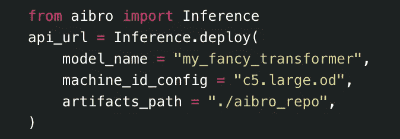
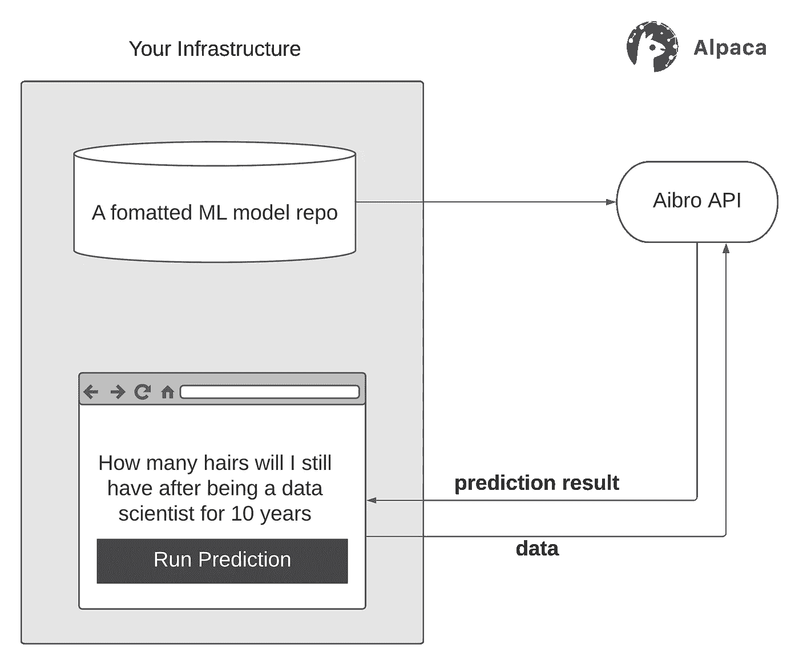

# 如何用一行代码将任何机器学习模型部署到云中

> 原文：<https://medium.com/geekculture/how-to-deploy-any-machine-learning-model-to-a-cloud-in-one-line-of-code-d38eff88a037?source=collection_archive---------8----------------------->



Deploy a Machine Learning Model on AWS

我仍然记得当我创建了一个机器学习模型，第一次解决了一个现实世界的问题时，我是多么兴奋。然而，真正让我气馁的是，工程团队花了两个多月的时间将其部署到应用程序中。减缓模型部署的因素不是工程师的技能，而是团队协作和迭代的能力。

如果有一种工具，只要模型做好了，就能让数据科学家自己部署模型，那会怎么样？从这个想法出发，我和我的团队开始了打造 Aibro 的征程。

[Colab 演示链接](https://colab.research.google.com/drive/1NH2Aj1bbCgqJXyNKK9TkzwlO4JDBkTQC?usp=sharing) & [我们的网站](https://aipaca.ai/) & [推理文档](https://doc.aipaca.ai/inference)

# 关于 Aibro

Aibro 是一个无服务器的 MLOps 工具，可以帮助数据科学家在 2 分钟内在云平台上训练和部署 AI 模型。与此同时，Aibro 采用了专为机器学习打造的成本节约战略，将云成本降低了 85%。稍后我会发表另一篇博客来解释关于成本节约策略的细节。

如果你对无服务器训练更感兴趣，这是我以前的一篇关于用一行代码在云上训练神经网络的文章

# 部署工作流程



An Aibro Inference Example

一般来说，你需要做的就是上传一个格式化的机器学习模型库，从 [Aibro marketplace](https://aipaca.ai/marketplace) 中选择一个托管服务器。Aibro 随后将创建一个推理 API，其计算能力和成本将根据工作负载自动调整。

这里有一个格式化的 ML 模型库的例子:[https://github.com/AIpaca-Inc/AIbro_model_repo](https://github.com/AIpaca-Inc/AIbro_model_repo)。

## 步骤 1:安装 aibro python 库

`pip install aibro`

## 步骤 2:准备格式化的模型库

回购应按照以下格式构建:

**回购
| _ _**| _ _[**预测. py**](https://github.com/AIpaca-Inc/AIbro_model_repo/blob/main/predict.py) **| _ _**| _ _[**模型**](https://github.com/AIpaca-Inc/AIbro_model_repo/tree/main/model) **| _ _**[**数据**](https://github.com/AIpaca-Inc/AIbro_model_repo/tree/main/data) **| _ _**[**需求. txt**](https://github.com/AIpaca-Inc/AIbro_model_repo/blob/main/requirements.txt) **|__ 其他工件**

**predict.py**

这是艾布罗入口。

`predict.py`应该包含两种方法:

**load_model():**

```
def load_model():
    # Portuguese to English translator
    translator = tf.saved_model.load('model')
    return translator
```

这个方法应该从`model`文件夹加载并返回你的机器学习模型。在示例报告中使用了一个基于 transformer 的葡萄牙语到英语的翻译器。

**运行():**

```
def run(model):
    fp = open("./data/data.json", "r")
    data = json.load(fp)
    sentence = data["data"]
    result = {"data": model(sentence).numpy().decode("utf-8")}
    return result
```

该方法使用模型作为输入，从“数据”文件夹中加载数据，预测并返回推理结果。

*本地测试提示* : `predict.py`应该能够通过以下方式返回一个推断结果:

```
run(load_model())
```

`**model**`**`**data**`**文件夹****

**只要`predict.py`结构正确，`model`和`data`文件夹没有格式限制。**

****requirement.txt****

**在部署模型之前，安装 requirement.txt 中的包来设置环境。**

****其他工件****

**`predict.py`可以使用的所有其他文件/文件夹。**

## **步骤 3:创建推理 API**

```
from aibro import Inference
api_url = Inference.deploy(
    model_name = "my_fancy_transformer",
    machine_id_config = "c5.large.od",
    artifacts_path = "./aibro_repo",
)
```

**假设格式化的模型回购保存在路径”。/aibro_repo”，我们现在可以用它来创建一个推理作业。在您的配置文件下，模型名称对于所有当前的[活动推理作业](https://aipaca.ai/inference_jobs)应该是唯一的。**

**在本例中，我们部署了来自“”的公共自定义模型。/aibro_repo”调用了计算机类型“c5.large.od”上的“my_fancy_transformer ”,并使用访问令牌进行身份验证。**

**部署完成后，将返回一个 API URL，语法如下:**

*   **[**https://API . ai paca . ai/v1/{用户名}/{客户端标识}/{模型名称}/预测**](https://api.aipaca.ai/v1/{username}/{client_id}/{model_name}/predict)**

****{client_id}** :如果您的推理作业是公共的，`{client_id}`由字符串`"public"`填充。否则，`{client_id}`将由您的[客户 ID](https://doc.aipaca.ai/inference#update_clients) 填写。**

## **步骤 4:完成推理工作**

```
from aibro import Inference
Inference.complete(job_id)
```

**一旦不再使用推理作业，为了避免不必要的开销，请记得在`Inference.complete()`前关闭 API。**

# **结束了**

**就这么简单！如果你觉得 Aibro 有帮助，请从 [aipaca.ai](https://aipaca.ai) 加入我们的社区。我们将分享 Aibro 的最新更新。我们欢迎您的任何反馈！**