# 如何将高度可伸缩的 MQTT 代理部署到 AWS (HiveMQ)

> 原文：<https://medium.com/geekculture/how-to-deploy-highly-scalable-mqtt-broker-to-aws-hivemq-2b88ce0c7f43?source=collection_archive---------10----------------------->

## **什么是 MQTT？**

MQTT(消息队列遥测传输)是为具有较低网络或带宽许可的实体创建的消息协议。它被广泛用于物联网设备通信，因为它非常轻量级，并使用具有双向功能的发布/订阅模式。对于由于带宽限制或网络可靠性问题而经历延迟的无线网络，此协议是一个极好的选择。它还通过将所有占用大量资源的逻辑推到服务器端来降低客户端的复杂性。

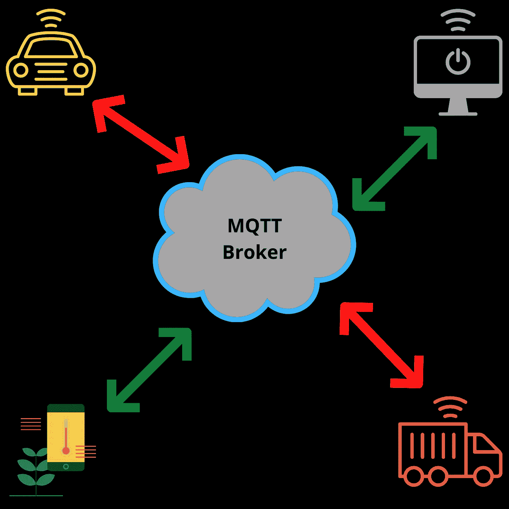

## **为什么是 MQTT？**

大多数开发人员已经意识到 web 服务的重要性，我们可以简单地构建一个服务于物联网用例的 web 服务。物联网设备可以简单地通过 API 调用与后端基础设施进行通信。但是它也有一些缺点，因为 HTTP 是一个同步协议，客户端需要等待服务器的响应，这种行为会影响服务的可伸缩性。物联网设备很可能处于不可靠的网络环境中。此外，HTTP 通信是单向通信，但在物联网世界中，双向通信将有助于设备被动接收命令，最后需要考虑的是，HTTP 是一种重量级协议，因为它不适合受限制的网络。

## **MQTT 的优势**

*   可量测性
*   可靠性
*   轻巧高效
*   双向通信
*   不可靠网络连接的主要支持
*   安全性
*   二元协议

## 它是如何工作的？

需要注意的最重要的事情是 MQTT 需要 TCP/IP(IMP)。它使用 TCP 持久连接，也支持 TLS 上的安全性。MQTT 协议基于发布/订阅模式工作。发布/订阅模式将客户端与后端服务分离开来。发送数据的实体被认为是发布者，而需要使用被发送的数据的实体被称为订阅者。发布者和订阅者并不直接连接，事实上，还有一个叫做 broker 的组件来处理所有的连接开销。为了进行通信，发布者/订阅者应该知道代理的主机名和端口。

> **潜水前要知道的事情……**

## **服务质量(QoS):**

QoS 将定义特定消息的交付保证。QoS 是 MQTT 中的一个关键特性，让客户机能够选择它需要的服务级别。有三种不同级别的 QoS。

**QoS 0(最多一次):**这是最低级别的服务。消息最多在无法保证送达的情况下送达收件人。发送方既不保留也不重新传输消息。

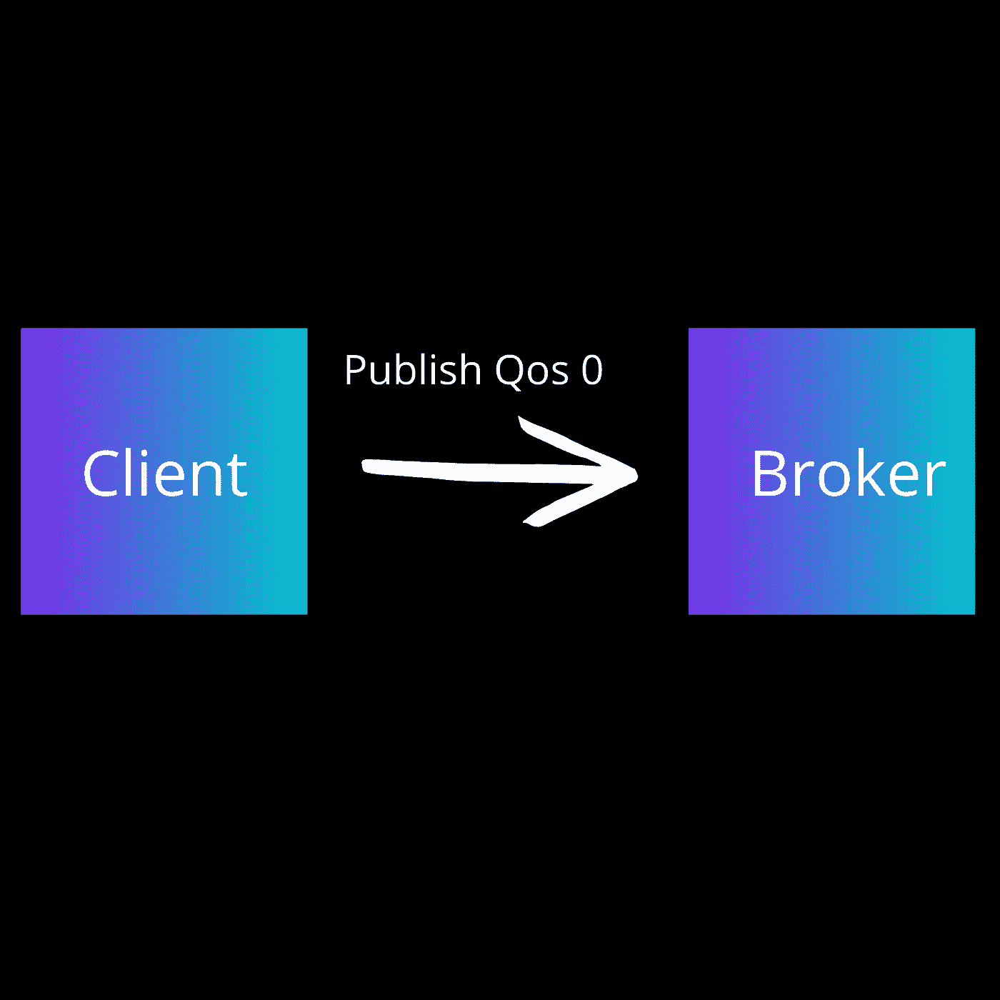

**QoS 1(至少一次):**消息至少被传递给接收者一次，这是传递消息的最低保证级别。消息由发送方保存，直到它从接收方获得 PUBACK 数据包。这种情况下可能发生的一种情况是消息复制(一条消息可以发送多次)。

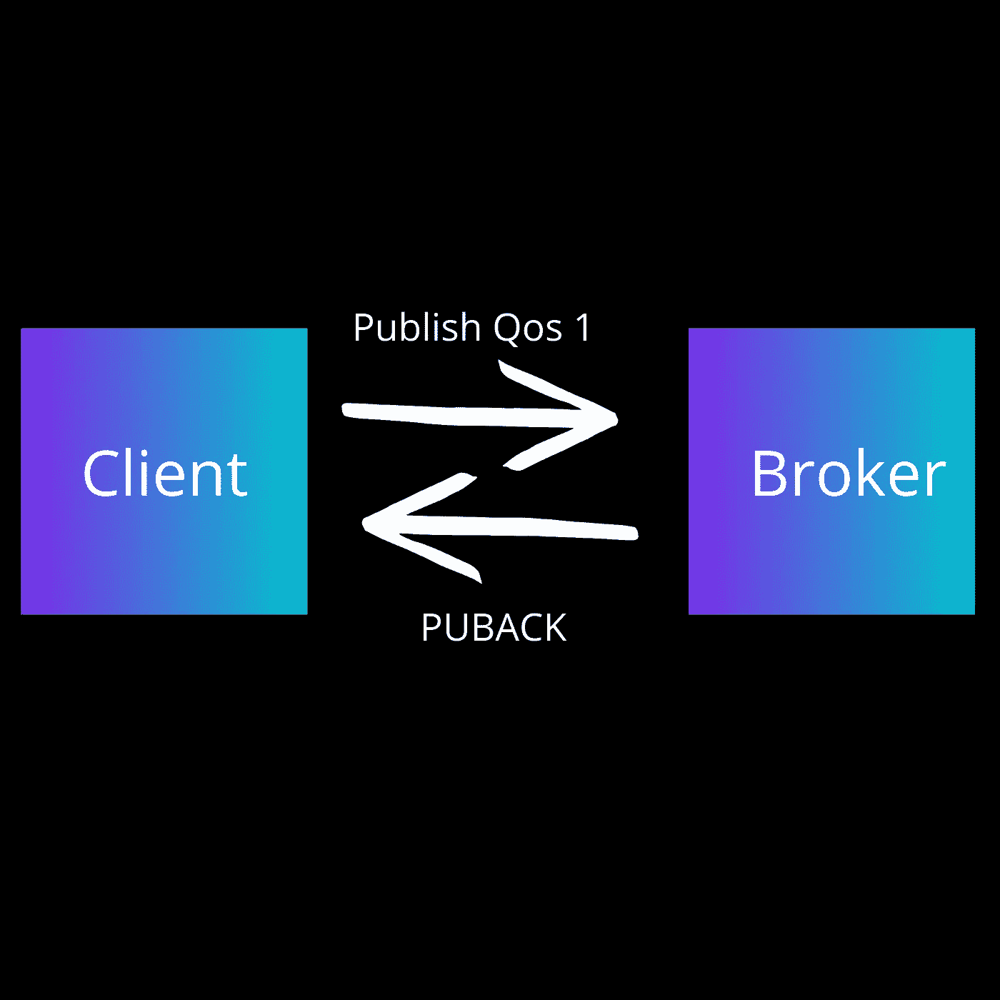

**QoS 2(仅一次):**这是最高级别的服务。邮件只传递给收件人一次。发送方将向接收方发布带有包标识符的发布包(发送方和接收方将使用原始发布消息的包标识符来协调消息的传递)，接收方收到 QoS 级别为 2 的消息后，将处理该消息，并向发送方发送 PUBREC 包以确认发布包。一旦发送方从接收方接收到 PUBREC 包，发送方就可以安全地丢弃最初的 PUBLISH 包。发送方将接收 PUBREC 数据包，并使用 PUBREL 数据包进行响应。在接收方获得 PUBREL 包之后，接收方丢弃所有存储的状态，并用 PUBCOMP 包进行响应。发送方收到 PUBCOMP 包后，包标识符将可供重用。

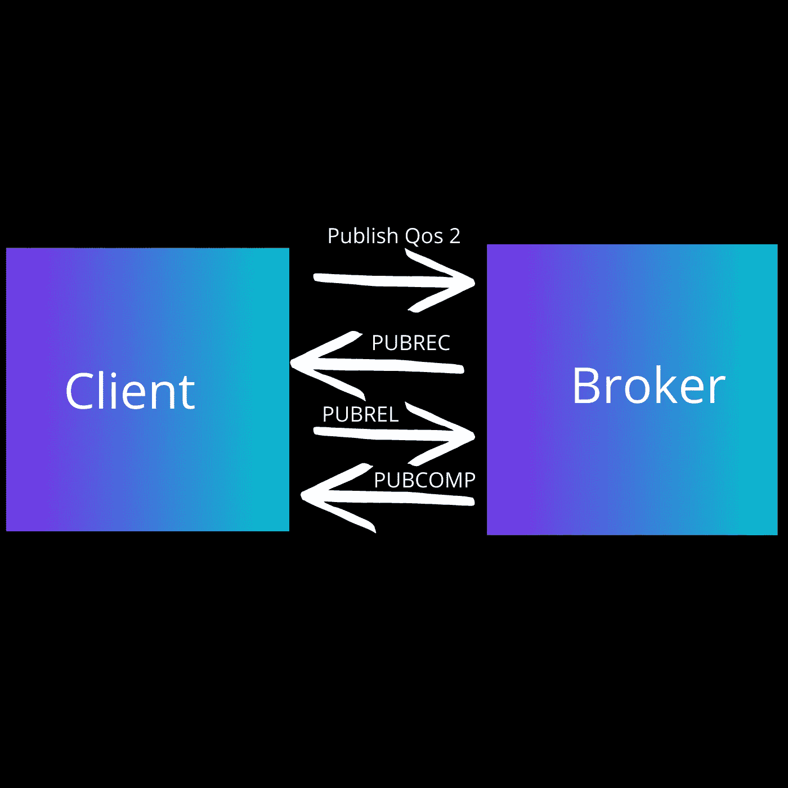

**保活时间:**客户/经纪人发送/接收每条消息所允许的最大时间间隔。如果保持活动时间已过，代理将强制关闭与客户端的连接。为了保持长期运行的连接，客户端需要向代理发送 PINGREQ 数据包，代理将使用 PINGRES 数据包进行响应。这样，我们可以确保客户端可以在更长的时间内保持与代理的连接，而无需发送/接收任何实际消息。

> 注意: **PINGRES** 包是由大多数流行的 MQTT 库自动发送的，在客户端没有任何额外的实现。

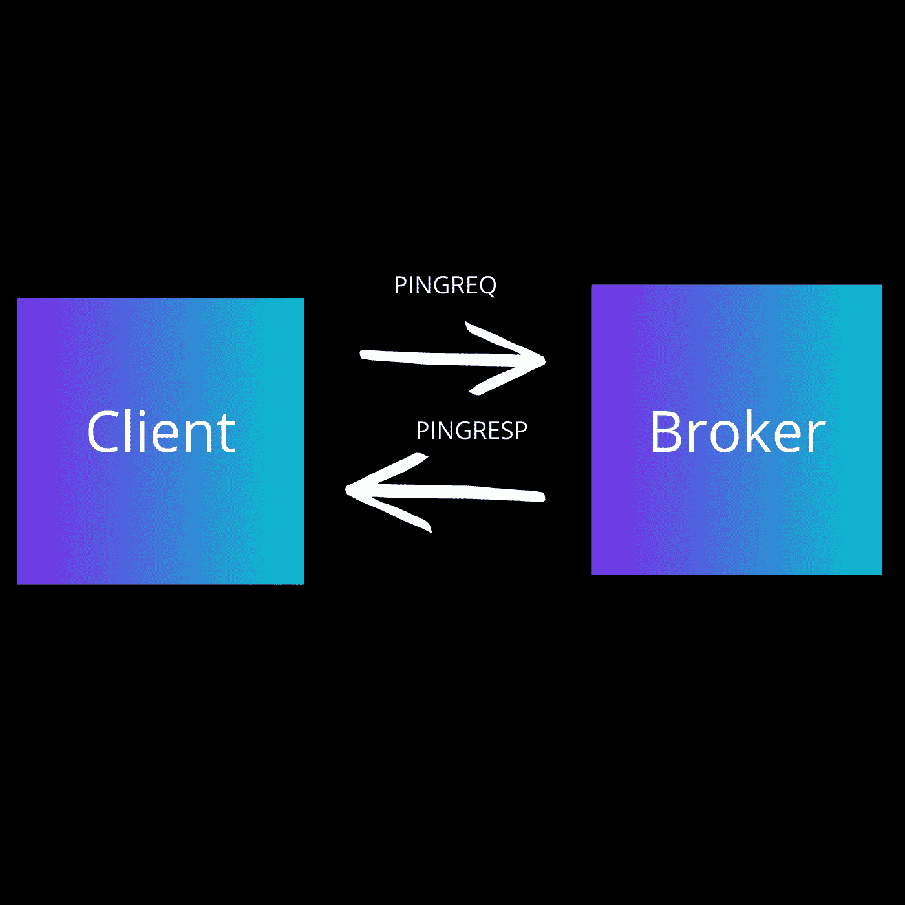

## **发布者/订阅者流程**

*   客户端将与代理建立 TCP 连接，这是通过向代理发送 CONNECT 数据包来完成的。此时，如果需要，代理将进行身份验证/授权，并使用带有适当状态代码的 CONNACK 数据包进行响应。
*   客户端可以为已建立的连接指定保持活动超时。如果保持活动时间已过，客户端应该向代理发送一个 PINGREQ 包，然后代理将使用一个 PINGRES 包进行响应。如果客户机未能发送 PINGREQ 数据包，或者在保持活动时间之前没有启动与代理的任何类型的通信，代理本身将断开客户机。大多数 MQTT 客户端库在幕后处理 PING 逻辑。
*   订户可以通过使用 SUBSCRIBE/subak 包注册某个主题。
*   订户可以通过使用取消订阅/取消订阅数据包来取消注册某个主题。
*   如果发布者/订阅者想要终止 MQTT 会话，它首先向代理发送一个 DISCONNECT 消息，然后关闭连接。

> **让我们开始有趣的事情吧。**

**在 AWS 上部署 MQTT 代理的步骤:**

今天，我们将在 AWS EC2 实例上部署 HiveMQ 代理的预构建映像。

***步骤 1:登录 AWS 控制台，导航到 EC2 服务，然后单击启动实例。***

***第二步:点击社区 AMI 标签。***

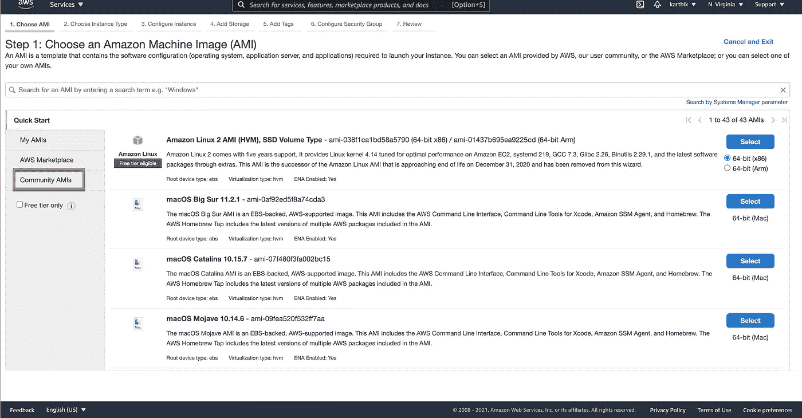

***第三步:搜索并选择 HiveMQ AMI。***

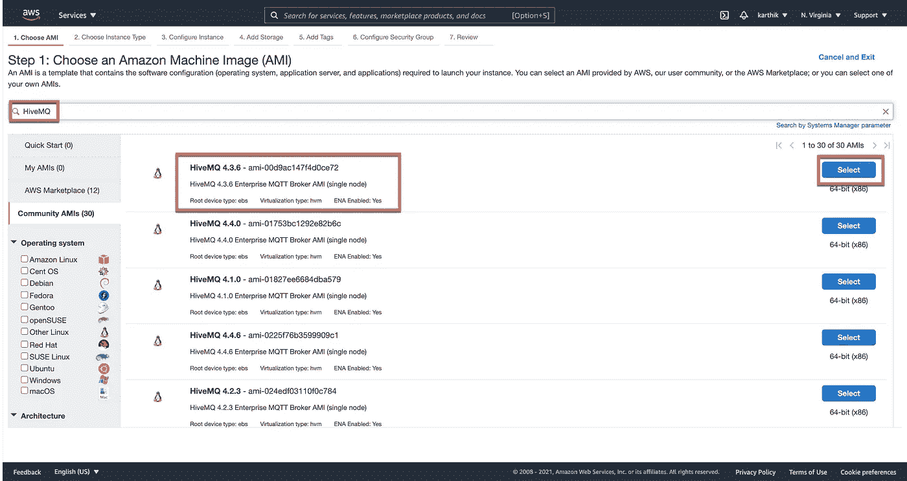

***第三步:选择实例类型(*** `***m5.xlarge***` ***或*** `***c5.xlarge***` ***是 HiveMQ 的最低要求)，然后单击下一步。***

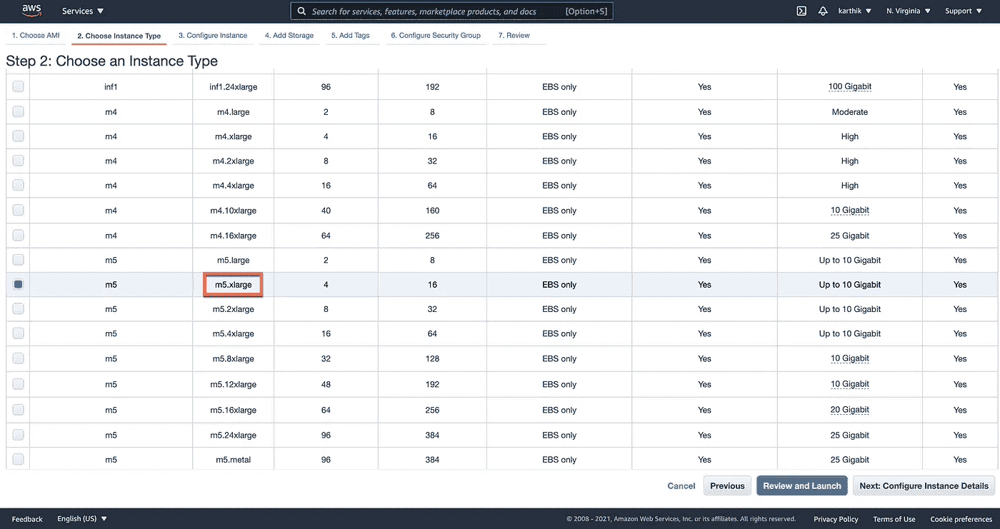

***第 4 步:配置实例详细信息如果您想要进行任何显式的更改，但我将按原样保留此部署。***

***第五步:选择存储大小(大小不能小于 20GB)，点击下一步。***

***步骤 6:添加实例标签(如果有的话)并点击下一步。***

***步骤 7:配置安全组，我们需要启用三个端口以便与代理通信，然后单击下一步。***

*   ***SSH 端口 22，用于连接到代理进行任何更改。***
*   ***代理仪表板的 TCP 端口 80。***
*   ***TCP 端口 1883 启用客户端连接。***

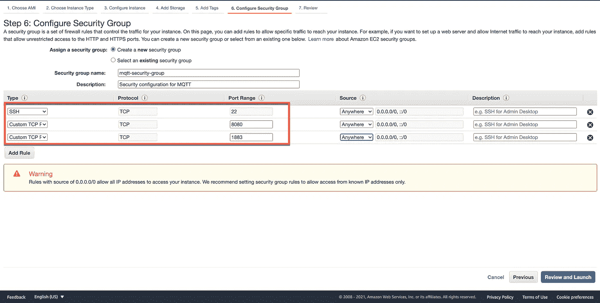

***步骤 8:查看&启动实例配置。***

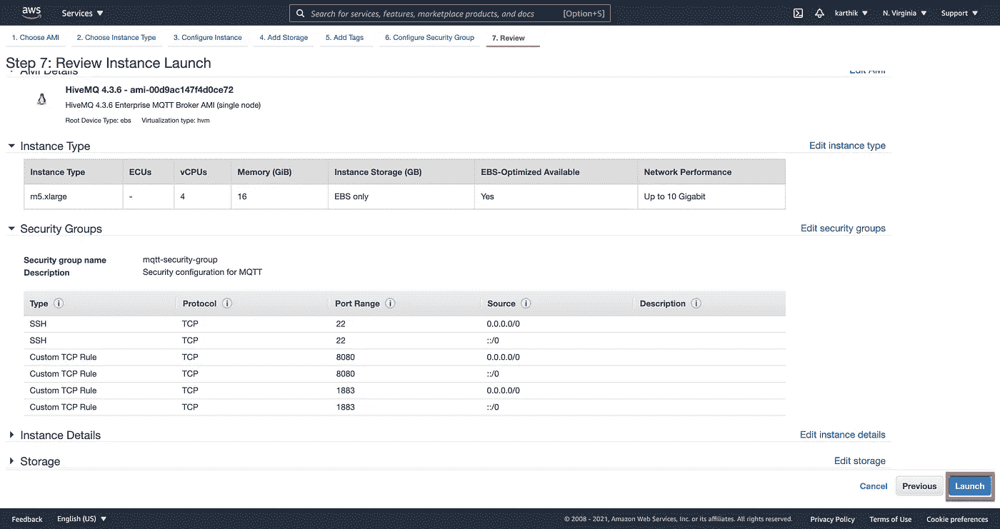

***步骤 9:选择一个现有的密钥对或创建一个新的密钥对，以便通过 SSH 连接到实例。***

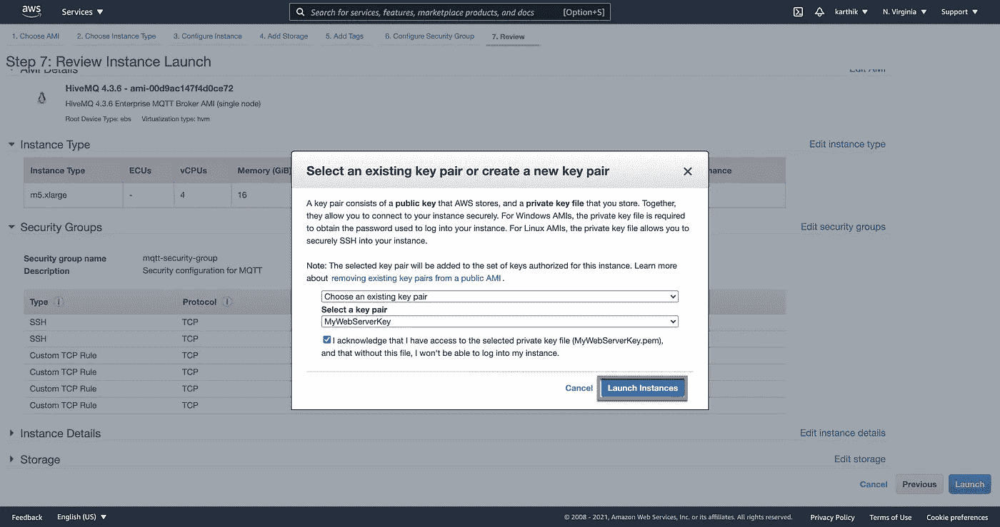

***第十步:转到 EC2 仪表板，复制公共 DNS url。***

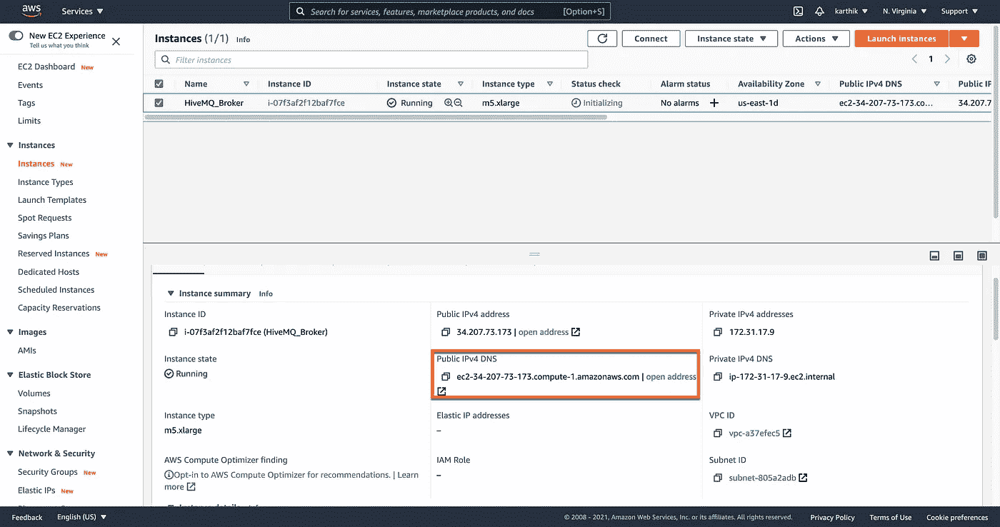

***步骤 11:使用公共 DNS url 登录 HiveMQ 仪表板。***

默认凭证为用户:`admin`密码:`hivemq`

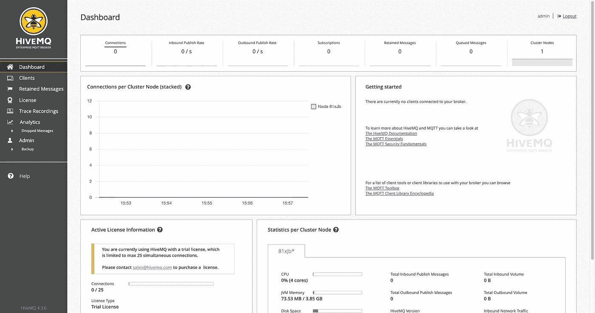

***第 12 步:您不能使用任何 MQTT 客户机连接到代理。我使用 MQTT Box 客户端连接到 HiveMQ 代理。***

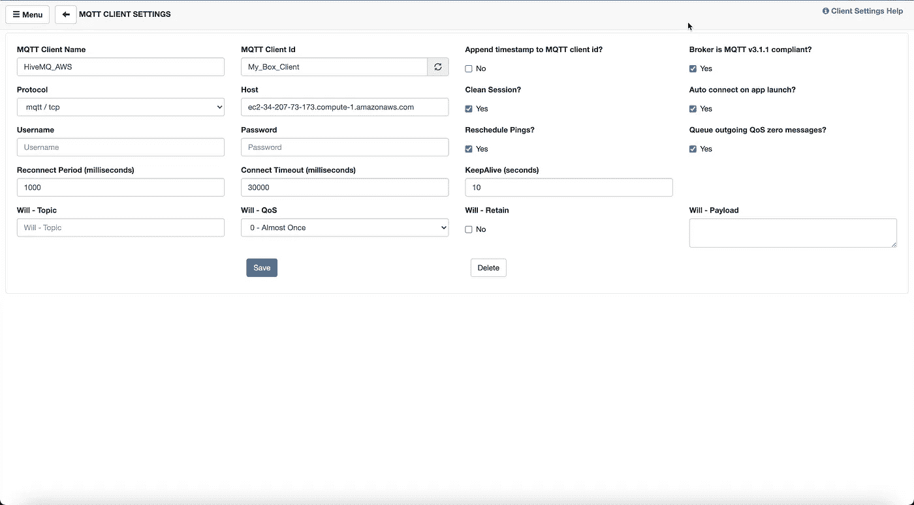

客户端成功连接后，您可以在代理仪表板上看到连接状态。

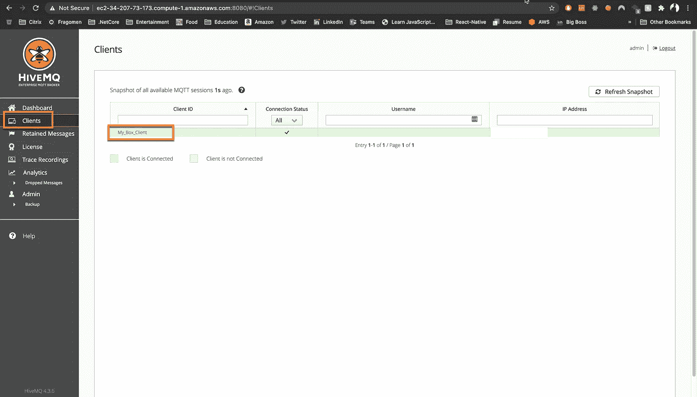

您可以针对任何主题编写测试消息。在本演示中，我将向 AWS_Test_Topic 发送一条测试消息。我还为这个测试主题配置了一个订阅者。

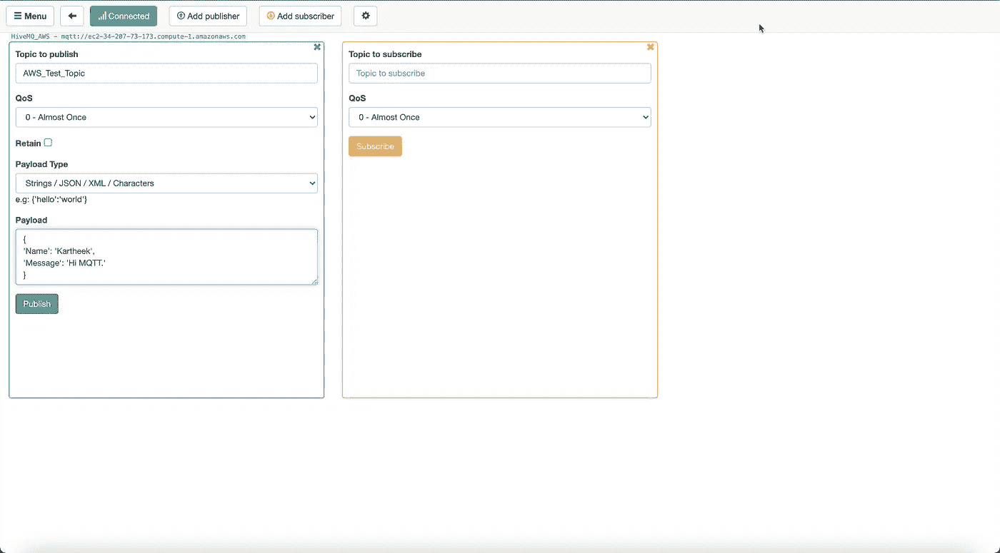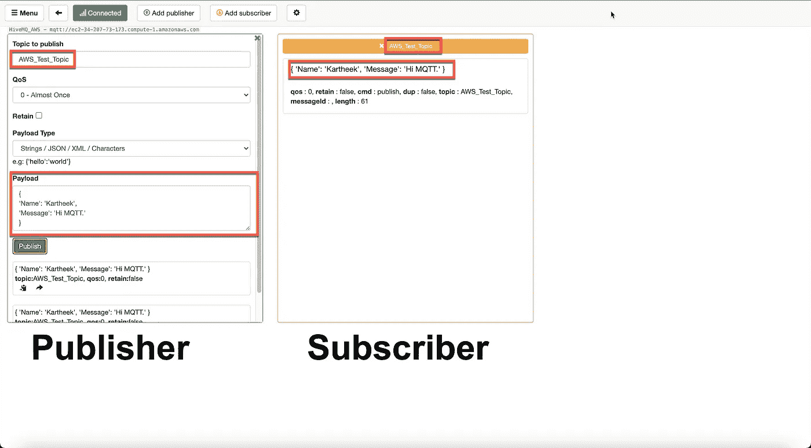

# 成功……

