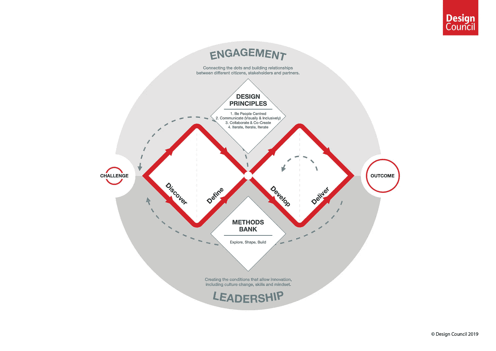
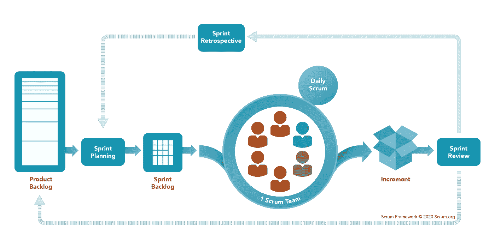
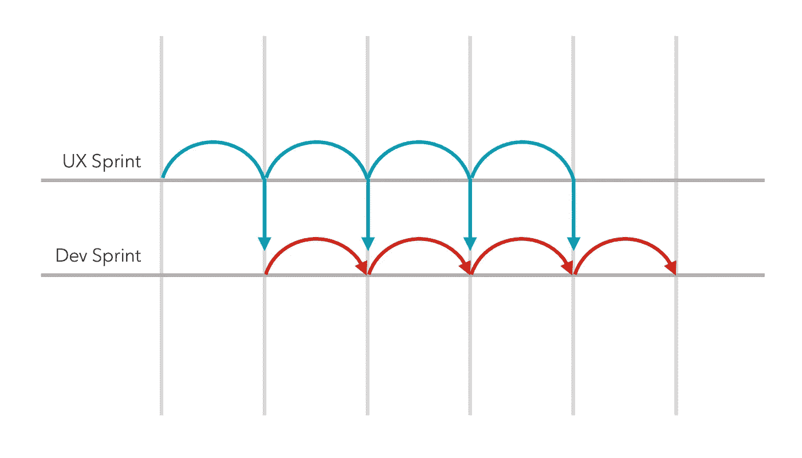
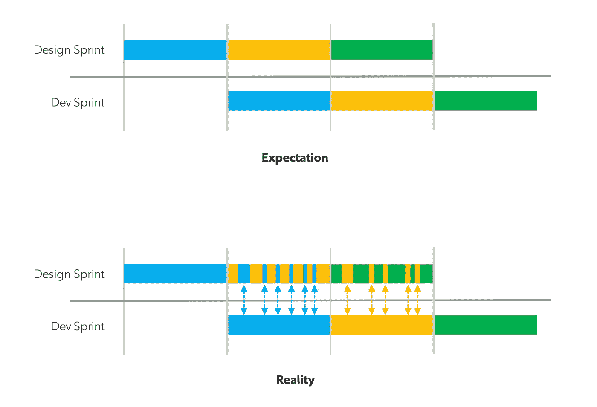
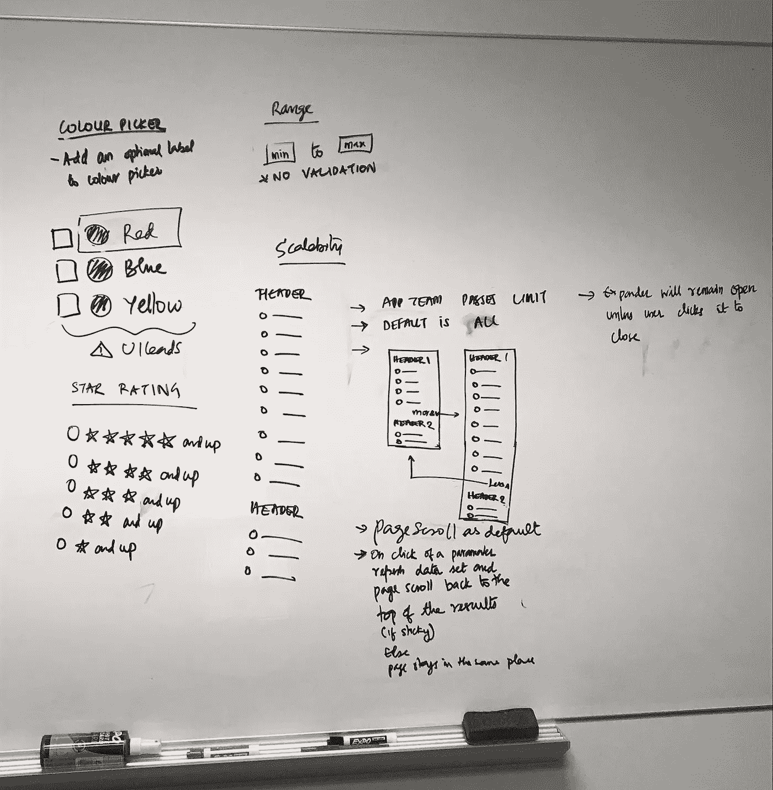
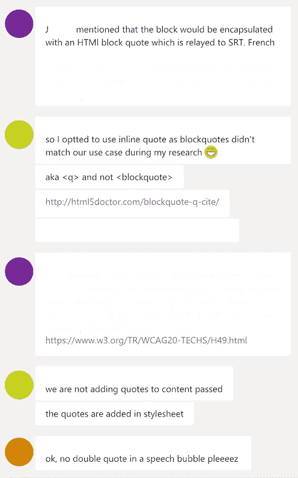
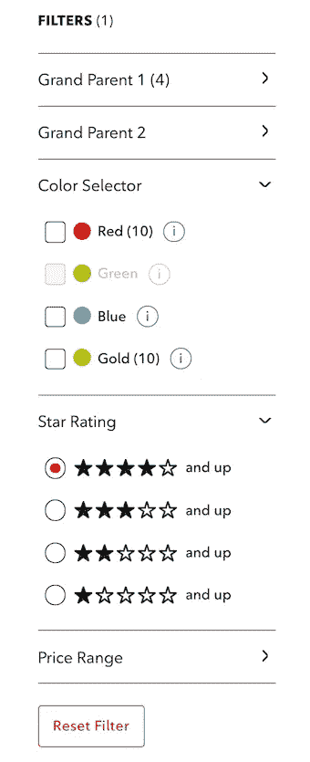
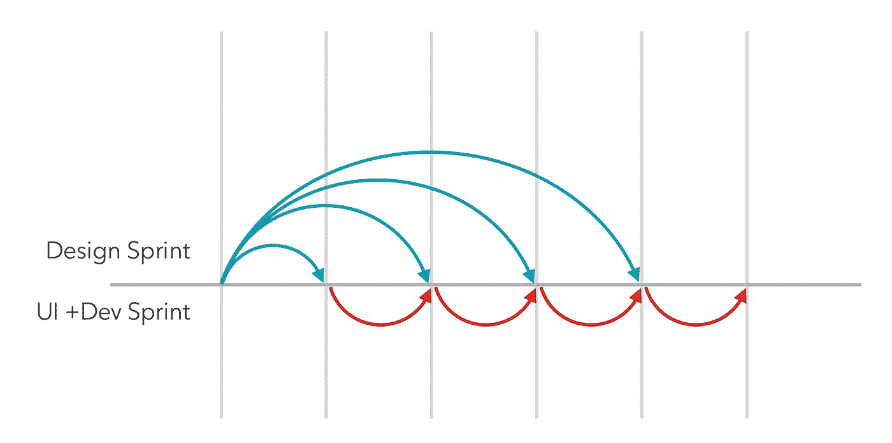
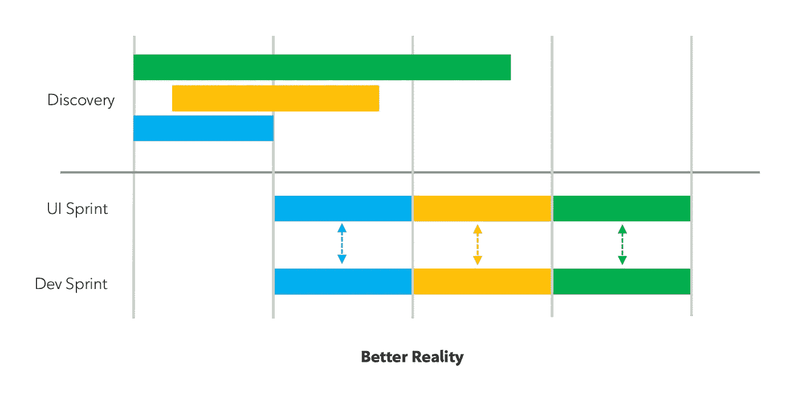

# 如何在同一个 sprint 中进行设计和开发

> 原文：<https://medium.com/geekculture/how-to-design-and-develop-in-the-same-sprint-564b7d6f8b22?source=collection_archive---------0----------------------->

或者“如何在短跑中加倍你的速度？”或者“如何做到真正的敏捷”

设计思维和敏捷互破。但是他们不需要。让我们更好地理解基础。我会尽量简短。

## **设计思维**

Courtesy: [Design Council, UK](https://www.designcouncil.org.uk/news-opinion/what-framework-innovation-design-councils-evolved-double-diamond)

英国设计委员会的设计思维框架推荐了四个不同的阶段:

*   **发现。**第一颗钻石帮助人们理解问题所在，而不是简单地假设问题所在。它包括与受这些问题影响的人交谈和共度时光。
*   **定义。**从发现阶段收集的洞察力可以帮助你以不同的方式定义挑战。
*   **发展。**第二颗钻石鼓励人们对明确定义的问题给出不同的答案，从其他地方寻找灵感，并与一系列不同的人共同设计。
*   **交付。**交付包括小规模测试不同的解决方案，拒绝那些行不通的，改进那些行得通的。

> 设计思维重视发现+先定义后设计+交付，如双菱形所示

## **敏捷+ Scrum**

现在让我们看看敏捷。我只从事过 Scrum 方法论的工作，我在这里只谈这个。

Courtesy: [scrum.org](https://www.scrum.org/resources/what-is-scrum)

紧随其后的主要 scrum 事件有:

*   [冲刺](https://www.scrum.org/resources/what-is-a-sprint-in-scrum)
*   [冲刺规划](https://www.scrum.org/resources/what-is-sprint-planning)
*   [每日混战](https://www.scrum.org/resources/what-is-a-daily-scrum)
*   [冲刺复习](https://www.scrum.org/resources/what-is-a-sprint-review)
*   [冲刺回顾](https://www.scrum.org/resources/what-is-a-sprint-retrospective)

我们将只关注 Sprint。其余的真的无伤大雅。

> 据 Scrum 的创建者称，每个 Sprint 都有一个要构建什么的目标，**一个设计**和灵活的计划，将指导构建它、工作和最终的产品增量。
> 
> 来源:[https://www.scrum.org/resources/what-is-a-sprint-in-scrum](https://www.scrum.org/resources/what-is-a-sprint-in-scrum)

## 这就是事情开始分崩离析的地方

Scrum 假设在 sprint 开始之前设计已经完成并准备好了。

因为设计需要在编码之前完成，所以一个流行的解决方案是双轨过程。

开发冲刺跟随着设计冲刺，就像一个迷你瀑布。

Dual Track Scrum

设计师发现问他们自己，“我应该如何在这个时间盒里做所有的 4d？不是所有的问题都有时间限制。我们需要一些时间来找出问题所在，进行探索，收集见解等。我如何解释研究？招聘做用户测试？设计迭代？测试？”

设计冲刺呢？你可能会问。它承诺一周的 sprint 时间与合作伙伴共同设计解决方案。Design sprint 是一个令人惊叹的框架，它让不同的利益相关者在问题上保持一致，并与最终用户一起验证假设。这是一个发现框架，而不是生产框架。我们将在本文后面讨论设计冲刺。

敏捷是一个生产框架，它假设设计冲刺已经完成，解决方案已经准备好编码。我们正在讨论将设计嵌入开发冲刺的最有效方式。

双 sprint 也有效率问题。在任何给定的时间，设计师都在进行两次冲刺。本设计 sprint 中的任务以及对上一个 sprint 中完成的任务的开发支持。

这减慢了设计和开发的速度，增加了返工，并在合作伙伴之间产生了不良的工作关系，因为他们互相减慢了对方的速度，并为对方的失败埋下了伏笔。

双轨冲刺的期望与现实相差甚远:*(蓝、黄、绿条代表每次冲刺完成的任务/故事)*

设计师、开发人员和 QA 不断地互相打断，因为他们在解决不同的问题。他们互相拖累，互相为失败做准备。合伙人之间没有‘流动’。

## 发现与生产

没有认识到设计和设计生产需要是两件不同的事情是组织不能在他们的设计操作中找到效率的主要原因。

Scrum 是一种生产方法，而不是设计方法。但这并不是说设计师不能在 scrum 中工作。

他们可以。有一种方法可以做到。

将设计和设计生产分成两个流—发现流和生产流。双菱形中的前两个/三个 D 出现在发现流中，只有最后一个 D 出现在生产流中。

但这并不是说生产中没有设计。战术设计发生在生产中，战略设计发生在发现中。

## 发现流

在这个流程中，团队遵循双菱形的前三个 d。设计师与产品负责人、设计研究员(在某些情况下，还有开发人员)共同创建解决方案。这是一个粗略的+抽象的问题解决方案，它捕获了所有的数据点、边缘情况、流程的顺序、一些基本的交互设计等等。

在这一阶段，设计师不会创建完美的像素模型，但视觉设计有一个总的方向感。这是你进行设计冲刺的最佳时机。如果你没有一个好的核心团队，后勤工作会非常繁重，会让你筋疲力尽。向你的 scrum 主管和产品负责人寻求帮助，帮助你做好后勤工作。寻求所有你能得到的帮助，因为设计冲刺是最简单和最快速的方法来协调问题陈述和解决方法。没有这两个，dev sprint 可能会变成一场噩梦。

或者，你可以更精简一些，把它作为你的故事在特定格式下的“提炼”。Basecamp 有一个很好的格式，他们称之为整形。在“塑造”结束时，他们创建了一个称为[间距](https://basecamp.com/shapeup/1.5-chapter-06#examples)的细化需求。你可以根据自己的情况选择设计自己的格式。

在这个阶段，你也可以创建线框，并和你的用户一起测试。目标是在编码之前确定产品/功能的功能设计及其依赖和约束。(同样，不是像素完美的模拟)

这需要和你的伙伴共同创造。(这对速度至关重要)

这里有一个例子可以说明这一点。为了保持简单，我使用了“增强过滤器”作为例子。但是它可以进一步扩展到更复杂的流程。

Shaped up by the PO, Design Lead, Dev Lead, QA Lead and A11Y specialist

Partial screenshot of a pitch co-written by PO, Design Lead, Dev Lead, QA Lead and A11Y specialist

## 生产流

根据在发现阶段商定的解决方案，PO、设计师、开发人员、QA 和 A11Y 专家(以及其他相关人员)进入冲刺阶段。

因为视觉设计和开发是同时发生的，所以团队之间避免了许多来回，这成倍地提高了团队的速度。

再也不用同时进行两次冲刺了。在冲刺阶段，所有的合作伙伴都在解决同一个问题。在冲刺阶段，合伙人之间的每一个决定都是作为一个团队来考虑的。

没有更多的最终审查和反馈，返工和所有的头痛和心痛。

以下是一位设计师、开发人员和 A11Y 专家之间聊天的部分截图:

Screenshot of a designer, developer and A11Y expert ‘co-located’ digitally

团队在 sprint 中共同定位和构建，他们同时设计和开发。因为大多数视觉设计决策都是在设计指南和/或设计系统中捕获的，所以设计者和开发者能够共同构建解决方案。

设计师和开发人员每天分享进展，并相互进行日常演示，正因为如此，大量的视觉设计微调发生在前端代码上。设计者立即更新模型以反映这些变化。

这就是过滤器最后的样子。不错吧。

Finished version of designed and coded filters

实际上，整个过程现在看起来像这样:

Improved Dual Track

A better reality is when Discovery and Production are separated and UI+Dev happens in same sprint

从 2019 年末开始，我一直在尝试这种模式，并取得了巨大的成功。团队的速度几乎翻了一倍。过去需要两次冲刺的事情现在只需要一次冲刺。这简直是一个奇迹。

> 先探索+塑造。稍后构建+迭代

然而，这需要一些先决条件

*   参与的每个人都需要勇于尝试——Scrum master、PO、设计师、开发人员、QA 和其他合作伙伴
*   只有互相尊重和好奇的团队才能做到这一点。交战的派系永远不会实现这种敏捷的涅槃。(如果你的采购订单、设计师和开发人员意见不一致，就不要尝试这样做)
*   应该没有**批准或签署**。团队应该被授权做决定和承担风险。来自领导和管理层的任何反馈应该发生在 sprint 之后，并且应该作为增强或 bug 来处理。这个团队应该不受任何监督。这是强制性的。(让他们做好自己的工作。如果你不信任他们，就换掉他们。不要停留在它们上面)
*   在撰写了一个推介之后，没有范围蔓延。任何新的需求或想法都应该作为一个增强来添加(和敏捷一样)
*   阅读这本[书](https://basecamp.com/shapeup)。多次。请你的团队阅读这篇文章。多次。阅读，直到“振作起来”的精神成为你自然的思考方式。

非常感谢[瑞安·辛格](/@rjs)把这些都写在这本[惊人的书中](https://basecamp.com/shapeup)。感谢 [Rami Dahhan](https://www.linkedin.com/in/ramidahhan/) 让我读了这篇文章(多次)。感谢[阿米尔·阿布拉](https://www.linkedin.com/in/abura/)、[贾斯汀·君](https://www.linkedin.com/in/justin-jun-b9938021/)、[马德胡马蒂·帕拉尼萨米](https://www.linkedin.com/in/madhumathi-palanisamy-0b1b60147/)、[乔安娜·柯尔伯](https://www.linkedin.com/in/joannakolbe/)、[瑞安·Ku](https://www.linkedin.com/in/kuryan/)、[科迪·马歇尔](https://www.linkedin.com/in/codymarshall3/)、[罗恩·佩萨诺](https://www.linkedin.com/in/ron-pesano-18651a35/)、[普拉纳夫·沙里格拉姆](https://www.linkedin.com/in/pranav-shaligram-b5528b13/)以及整个 dev + QA 团队将这一理论付诸实践。谢谢大家🙏🏾

如果你想了解我们如何做到这一点的更多细节，并想复制这一点，请通过 LinkedIN 联系我。开心聊天，传播消息。