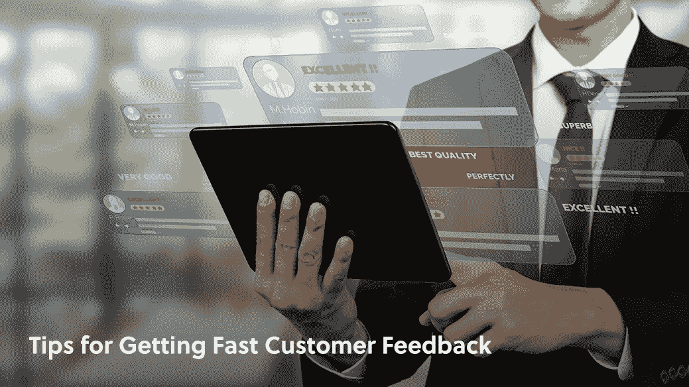

# 快速获得客户反馈的技巧

> 原文：<https://medium.com/geekculture/how-to-get-feedback-fast-7ef0aba55cbe?source=collection_archive---------24----------------------->

## **电子商务中的反馈**

我们在这一电子商务浪潮中走得越久，就越能清楚地看到[我们在过去几年中观察到的趋势将会持续下去。这些趋势包括:重新关注客户体验。](https://www.amberengine.com/blog-content/trends-in-online-sales-temporary-or-here-to-stay?utm_source=blog&utm_medium=referral&utm_campaign=medium-blogs)

从专门的客户社区到[尖端技术](https://www.amberengine.com/blog-content/top-5-examples-of-ar-product-experiences?utm_source=blog&utm_medium=referral&utm_campaign=medium-blogs)，对确保客户拥有完美体验的关注比以往任何时候都更加突出。策划完美的客户体验依赖于大量的数据；特别是客户反馈。

客户反馈不一定会出现在你的收件箱里。知道如何鼓励及时和真诚的客户反馈是一门至关重要的艺术，这可能是做出明智的 UX 决定和投资资金流失的区别。

这里有一些聪明且经过测试的小技巧，可以确保你的企业优先考虑前者。

# 伸出

同样，反馈可能不会堆积在你的收件箱里。事实上，任何在服务行业工作过的人都知道，客户可能不会特意留下反馈，除非他们的体验特别糟糕，或者好得令人难以置信。

尽管我们都希望我们的企业留下压倒性的积极影响，但我们也不能指望这种反馈。直接接触是收集客户体验数据的重要部分。这样，你的数据应该包括更普遍的经历，而不仅仅是极端的经历。

也要在聪明的时候主动伸出援手。例如，相当多的人在购物前点击离开购物车。征求反馈并跟进这个决定可以让我们了解弃车统计对你的影响。

# 保持简单

伸出手是至关重要的，但实际上得到回应也是等式的一个重要部分。如果你发出带有令人困惑的问题的长调查，愿意承诺完整和深思熟虑的回答的人的数量可能不会那么令人印象深刻。确保你的问题简短易懂。

短甜不应该代表没用。知道你在寻找什么样的数据，你会看到什么样的指标，然后定制问题，以这些方式提供有用的数据。回复率高总是好消息，但是如果回复没有给你提供任何有用的数据，那还有什么意义呢？

# 不要在设计上吝啬

诚然，有些事情做过头了，但是视觉确实对我们有影响。如果反馈表看起来单调、乏味、简单，人们可能会更没有动力去回应。

另一方面，对颜色、图像和风格化的有品位的使用通常会使体验更加愉快。虽然这肯定不是生活中最愉快的部分，但留下反馈也不应该像做作业一样。

# 监控社交媒体

虽然将社交媒体解读为可量化的数据可能会更棘手，但监控社交媒体可以让你很好地了解对你品牌的总体看法，并揭示任何需要关注的紧急问题。有些人会很快对一个严肃的问题留下负面反馈，有些人会更快地打出一条令人讨厌的推文。

同样，创建一个社区空间或论坛也是专门监控问题的好方法。一个论坛中提到的不同问题的流量和互动量可以很好地表明这个问题是一个个案现象，还是有更多的人有冤情要说。

社区页面或论坛还有一个额外的好处，那就是围绕品牌创造一种社区感，这在最近几年已经显示出有希望的结果。

# 提供激励

提到的第一点是，客户不会主动*报告大多数体验。如果留下反馈的原因更多的是收集收据上的优惠券，而不是善意地添加到数据池，你可能会观察到反馈跟进的自然上升。*

无论你愿意给出什么样的激励，也无论这些建议中的哪一条比其他的更吸引你的眼球，我们正处于顾客体验的时代，这一点怎么强调都不为过。这意味着如果你不集中精力快速获得客户反馈，你一定会落后！