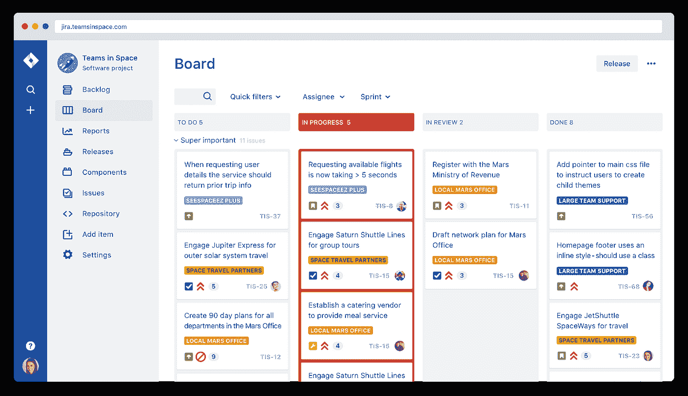
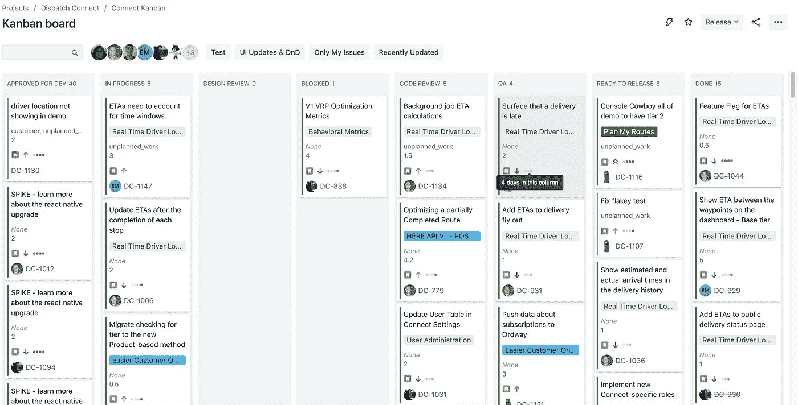
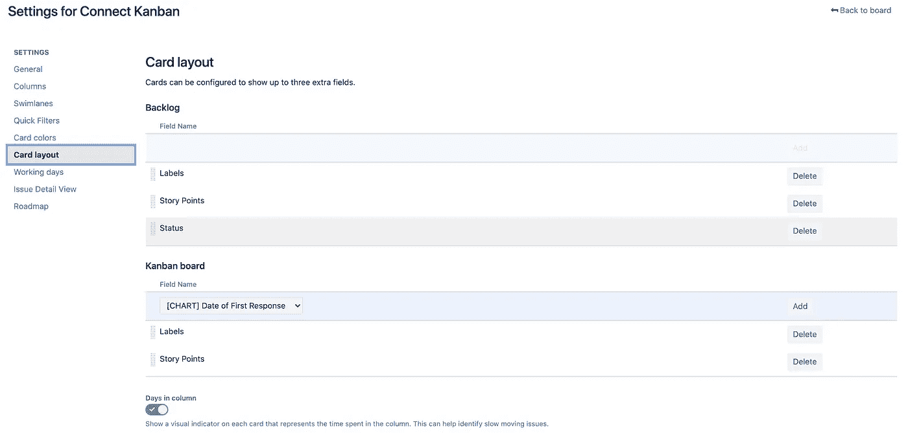
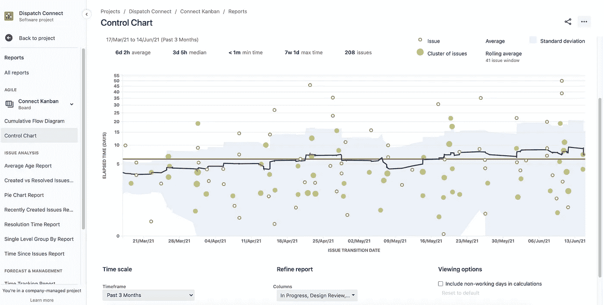
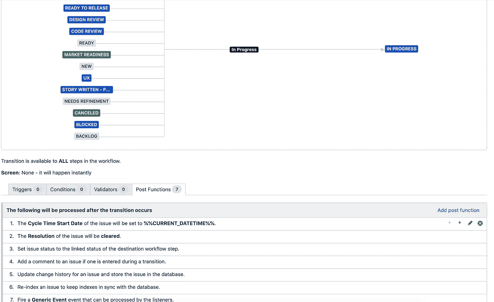
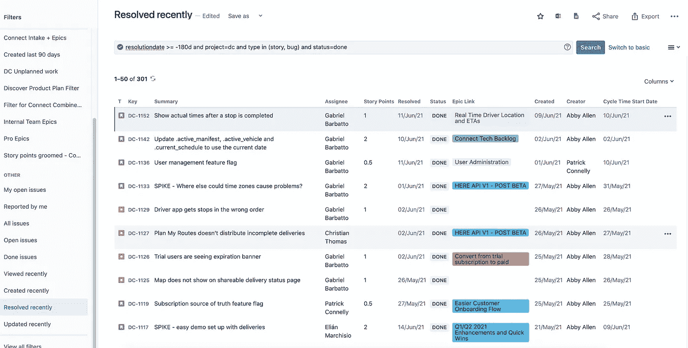
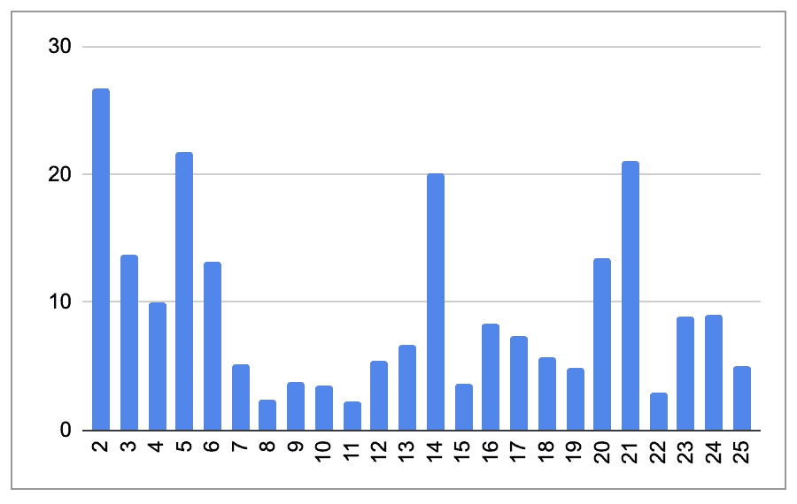

# 如何用 4 个简单的步骤破解 JIRA 来测量周期时间

> 原文：<https://medium.com/geekculture/how-to-hack-jira-to-measure-cycle-time-in-4-easy-steps-7c67e90248bd?source=collection_archive---------5----------------------->

# 什么是周期时间？

周期时间，即用户故事或其他任务经历软件开发生命周期所花费的时间，是看板中使用的一个常见度量。它取代了速度作为团队效率和可预测性的度量。

Image Credit: [Atlassian](https://www.atlassian.com/agile/project-management) — Agile Product Management

如果我们考虑上面非常简单的 JIRA 看板，周期时间将测量一个故事或任务从进行中到完成所需的时间。

# 为什么周期时间比速度更能衡量团队的可预测性？

可预测性是任何满足业务需求的敏捷团队的重要目标。如果不了解这项工作需要多长时间，我们就无法协调产品发布或实现季度目标。测量可预测性的传统敏捷方法是速度。速度取决于在工作开始前使用我们对工作将如何完成的最佳猜测所做的故事点估计。速度是基于愿望和希望的，只要团队坚持完成任务，很容易被操纵，使最不现实的时间表看起来是可以实现的。即使是最好的团队也会偶尔得到非常非常错误的故事点估计，意外的休假或意外的 bug 会使团队的速度陷入混乱。

周期时间从现实中学习。它消除了愿望和希望，并向团队展示了完成一个普通故事需要多长时间这一冷酷的事实。再加上吞吐量、待办事项的大小，以及对新工作中断路线图的频率的理解，团队可以使用周期时间来更准确地预测工作何时完成。因为周期时间衡量现实世界中发生的事情，而不仅仅是我们认为在理想条件下会发生什么的手动波动估计，我们还可以使用它来为我们的团队效率设定目标，推动持续改进和迭代。关于如何利用周期时间的更多信息，我推荐敏捷联盟关于看板方法和度量的[案例研究。](https://www.agilealliance.org/resources/experience-reports/actionable-metrics-siemens-health-services/)

# JIRA 的创新解决方案是如何失败的

尽管周期时间越来越受欢迎，JIRA 并没有为敏捷实践者提供一个有效测量周期时间的解决方案。JIRA 有两种主要的方法试图给用户这些数据:时间列指标和控制图。

注意:有一些 JIRA 插件承诺测量周期时间。完全披露:我从来没有尝试过。当有一个使用基本功能的非常简单的解决方案时，我认为没有必要为一个插件付费。

## **时间柱指示器**

See those tiny little dots? Yeah… I don’t either.

进入看板设置->卡片布局，为 JIRA 看板启用列中时间指示器。

帮助文本承诺列中的天数指示器有助于识别移动缓慢的问题。听起来很棒，对吧？如果当一个新的点被显示时，这些点是什么颜色，或者关于这个视觉指示器的任何其他东西有任何韵律或原因，它们就会是。正如你在我上面的例子中看到的，JIRA 决定为一个已经在 QA 中挂了 4 天的问题显示 3 个点(两个灰色和一个黄色)(我同意这太长了，但今天是星期一，我们的 QA 不在——给我们一点时间)。这些小点也没有以任何方式汇总，以显示团队在保持门票每周流动方面的进展。即使我们能够找出直观的指标，如果没有专门的报告，这些也只是用来识别个别问题的虚荣心指标。

## 检查图

这就把我们带到了控制图，JIRA 测量团队周期时间的草率尝试。

从 [JIRA 的控制图支持文件](https://support.atlassian.com/jira-software-cloud/docs/view-and-understand-the-control-chart/)中，我们得知

> T2:移动平均线(图表中的蓝线)是基于问题的，而不是基于时间的。对于图表中显示的每个问题，滚动平均值(在该时间点)的计算方法是:取问题本身、问题前的 X 个问题和问题后的 X 个问题，然后平均其周期时间。计算中使用了所显示问题总数的 20%(总是奇数，最少 5 个问题)。

这就是控制图的问题所在:这种基于前后 X 个问题的滚动平均值使得这种度量几乎毫无用处。我们可以每周检查一个指标，并依靠 3 周前的数字在接下来的每个星期保持不变，而不是一个指标，在你每周或 sprint 报告后，你会定期看到数字的提高或下降。这种滚动平均计算也意味着改变报告的时间范围将极大地影响结果。虽然控制图在可视化异常值以激发对话方面做得很好，但使用它来实际跟踪和减少周期时间充其量是一个令人沮丧的提议。

# 解决方案

通过几分钟的设置和每次迭代的最小努力，您可以为您的团队获得一个更有用的周期时间度量。只需要一点 JIRA 符咒和数据透视表的魔力。

## 步骤 1:创建一个自定义字段作为您的周期时间开始日期

按照 [Atlassian 支持文档](https://support.atlassian.com/jira-cloud-administration/docs/create-a-custom-field/)创建新的周期时间开始日期字段，并将其添加到您想要跟踪的任何相关问题类型的字段配置中。对于我的团队来说，我们在 Story、Bug、Spike 和 Task 中添加了新的 date 字段，并在所有创建和编辑屏幕中点击它。

## 步骤 2:将自定义字段设置为相关工作流转换的后续操作

JIRA 工作流过帐功能在工作流步骤完成后执行附加活动。这些无名的小英雄非常适合于设置一个问题转换到进展中的日期(或者任何对你的团队来说最有意义的状态)来开始测量周期时间。点击在[支持文档中阅读更多关于如何设置它们的信息。在下面的截图中，你可以看到如何。我已经将我的工作流步骤配置为自动将我的自定义周期时间开始日期设置为当前日期时间。](https://support.atlassian.com/jira-cloud-administration/docs/configure-advanced-issue-workflows/#Advancedworkflowconfiguration-postfunctions)

关于产品化的一个注意事项:我上面的例子有一个缺陷，这个缺陷可能会也可能不会影响你想要如何为你的团队度量事物。因为这个 post 函数将在每次问题转换到进行中时运行，所以如果问题从代码审查或 QA 返回到进行中，它将覆盖以前的值。要防止这种情况，请更新您的工作流程，使其不再重复使用此过渡，并且只在适当的过渡上设置 post 功能。

## 步骤 3-从批量问题搜索中导出报告

发布工作流更改后，您可能需要等待几天或几周时间来累积数据。一旦您有足够的信息来满足您的报告粒度，就该开始使用 JIRA 的高级问题搜索功能了。您需要为此保存一个过滤器，以确保一致性。我的示例查询获取我的项目中在过去 180 天内解决的所有 story、spike 或 bug 类型的问题。然后，我设置列来显示周期时间开始日期、解决日期、问题 id、受理人以及我可能想要报告的任何其他信息。注意:我的团队正处于 sprints 和看板之间的过渡阶段，所以尽管它们有缺陷，我们仍然用点来估计。将点估计值与周期时间进行比较是一个非常有趣的练习，它展示了我们的估计有多不准确。

导出此报告，然后将其导入您选择的电子表格应用程序。

## 步骤 4-设置数据透视表和图表

Google Sheets 是我最喜欢的电子表格应用程序。在进口了我的生 JIRA 之后。我添加了两个新的助手列:周期时间天数和周数。

周期时间是周期时间开始日期和解决日期之间的天数。在 Google Sheets 中，这可以通过公式*=天数(解决日期，周期时间开始日期)*轻松完成。

周数帮助我一周一周地报告这一点，而不必与数据透视表日期字段斗争。如果你比我有更多的每周数据透视表技能，这是可选的。通过 *=weekNum(决议日期)*，可以很容易地在 Google sheets 中计算出来。

接下来，我建立了一个数据透视表，以周数为行，以问题类型为列，以平均周期天数为值。

一旦我建立了数据透视表，就很容易将数据转换成下图:

Cycle time in days for all issue types, year to date

# 结论

正如你所看到的，让 JIRA 向你展示一个详细的周期时间指标是很容易的。您可以自定义此流程，以显示交付周期、仅在 QA 中花费的时间或您想要衡量的任何其他相关状态。对于更新的数字，只要导出数据并更新数据透视表和图表就可以了。如果你真的很聪明，你可能会让 JIRA 自动把这个邮件发给你，然后让扎皮尔生成谷歌电子表格。也许我会在以后的文章中对此进行调查，但是现在我的团队需要我调查导致我们的周期时间每隔几周就会急剧增加的瓶颈。