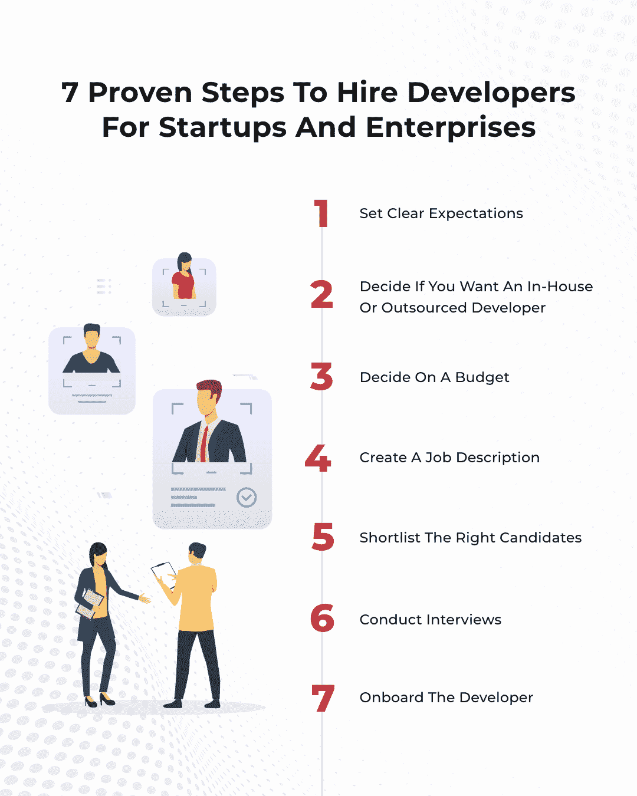

# 创业公司和企业如何招聘开发人员？

> 原文：<https://medium.com/geekculture/how-to-hire-developers-for-startups-and-enterprises-3442ad7a841?source=collection_archive---------16----------------------->

找到并雇佣合适的人才可能很困难，但这对任何企业或初创公司的成功都至关重要。尽管这很重要，但许多公司匆忙进入招聘过程，最终花费了比他们应该花费的更多的时间和金钱，从长远来看很少或没有结果。

如果你也计划为你的项目雇用开发人员，你需要考虑几个因素，比如他们在行业中的经验、技术专长等等，这样你就不会犯大多数创业公司犯的同样的错误。

这七个建议将帮助你确保你找到了合适的人来帮助你的企业向前发展。

让我们开始吧！

# 为创业公司和企业雇佣开发人员的 7 个经验证的技巧

# 1.设定明确的期望

在你开始招聘之前，有一系列的期望是很重要的。这将使你、你的团队和潜在的候选人更容易。例如，一些公司可能正在寻找能够从事特定类型项目或作为特定团队一部分的人。其他公司可能希望开发人员具备特定的技能或经验水平。明确你想要的是什么，这样双方都知道他们会得到什么。

对于初创公司来说，这一点尤其重要，因为他们的需求在不断变化——这意味着他们的需求也可能发生变化。这就是为什么保持这些期望的灵活性是明智的，但也要足够精确，以便各方都知道对他们的期望是什么。这种方法有助于每个人保持专注和积极，随时了解自己在公司的位置。

# 2.决定你是想要内部的还是外包的开发人员

初创公司可以根据项目的具体需求选择开发人员的雇佣类型——无论他们是希望外包、雇佣自由职业者，还是让内部开发人员在办公室或远程工作。

你甚至可以在合同的基础上雇佣开发者，这将允许你在合同期内以固定的价格支付给开发者。为了获得更大的灵活性，如果你是一家初创企业，你可以外包专门的开发人员来帮助你满足不断变化的需求。

> **也可阅读:**[**2023 年十大软件发展趋势**](https://www.quytech.com/blog/software-development-trends/)

雇佣一个内部开发团队也有一些独特的好处，因为你会有更好的沟通和协调的好处。

然而，事实证明，对于刚刚起步的初创公司来说，远程开发人员是一个更具成本效益的选择。这一切都归结于选择最适合你的创业需求的雇佣模式。

# 3.决定预算

预算在每一步都是必不可少的——即使是在决定雇佣专职开发人员的预算时。所以你最好根据项目要求来决定你的预算。

这样做将有助于您在预算范围内雇佣合适的开发人员。此外，通过提供更多的灵活性、股票期权和与公司的良好关系，初创公司可以在选择合适的候选人方面领先一步。你也可以以合理的价格雇佣印度 的移动应用开发者。

# 4.创建工作描述

下一步你需要做的是创建一份工作描述。你需要提到工作要求，项目所需的技术技能，以及你在候选人身上寻找的其他必要的东西。你需要做的是记住一些重要的变量，比如使描述易于阅读，包括技术栈，增加优势等。，同时创建职位描述。

# 5.列出合适的候选人名单

发布职位描述后，你会收到候选人的简介。继续列出候选人名单，同时记住你的项目需要的要求。这样做可以让你列出合适的候选人名单，你可以面试他们来填补你的项目。

# 6.进行面试

现在开始进行面试，为你的项目雇佣完美的开发人员。以下是你在筛选候选人时需要记住的一些基本事项。

*   他们对推动你的创业、学习曲线以及他们为你的创业愿景做出贡献的能力有多渴望？
*   检查候选人的经验、投资组合或专业知识。
*   确保你寻找的是他们的技能、知识和能力，而不是经验或相关品牌。
*   你看到什么领导素质了吗？候选人是否表现出足够的主动性来认可他们在你的创业公司中的领域？
*   他们是团队成员吗？你觉得候选人和你的团队相处得好吗？

# 7.开发人员板载

既然你已经为你即将到来的项目选择了候选人，现在就有必要让开发人员加入进来。确保你把他们很好地介绍给你的团队，并告诉他们所有的事情，以便轻松地开始工作。这样，你可以邀请新的候选人开始你的项目，让你的创业更上一层楼。

# 总结一下！

所以，这是为创业公司和企业雇佣专业开发人员的七个步骤。通过仔细阅读它们，你也可以为你的项目找到并雇佣最合适的开发人员。你还可以[雇佣以及时交付和可扩展产品闻名的印度](https://www.quytech.com/hire-dedicated-developers.php)开发者。