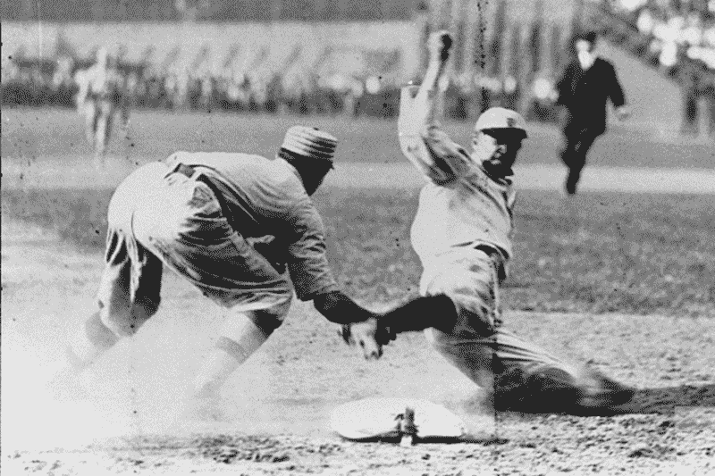
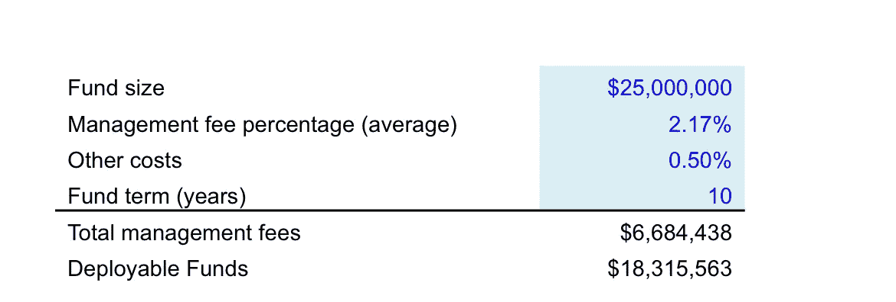

# 如何在回报高度集中的行业打出“本垒打”？

> 原文：<https://medium.com/geekculture/how-to-hit-a-home-run-in-the-industry-of-highly-concentrated-returns-39c5c8f88d95?source=collection_archive---------4----------------------->

*当你启动第一只种子前/种子基金时，如何考虑投资组合的构建和储备分配*

Photo Credit: National Baseball Library and Archives, via UMass.edu

我能告诉他们的就是挑一个好的，然后把它藏起来。我回到休息区，他们问我撞到了什么，我告诉他们我不知道，除了看起来不错。

-贝比·鲁斯

与风险投资的普遍观点相反，**从一个低于 5000 万美元的基金获得成功的前期种子和种子投资主要是关于初始投资组合的构建**。当然，在理想世界中，你希望尽早获得尽可能多的所有权，并预留大量资金用于后续融资。但是我们并不是生活在理想的世界里。在资本有限的新兴经理人的现实世界中，**你需要在更大的前期所有权**——并因此接受错过大的更高风险——**或者将大部分可用资本分配给后续轮次**之间做出选择。尽管这最后一种策略被较大的多阶段风险投资公司广泛采用，但它给较小的新兴基金管理公司带来了独特的挑战，带来了较高的风险，最终导致所有权比例明显较低，现金对现金回报平平。

建立一个能够带来优异表现的投资组合并不容易，新兴经理人在这样做时会遇到特殊的挑战。[霍斯利大桥](https://www.horsleybridge.com)与 a16z 共享的历史数据表明**仅约 6%的投资(占投资金额的 4.5%)产生了约 60%的总回报。**成功的多阶段投资者掌握的策略可能不会立即适用于第一次担任经理的人。考虑一下一只小型风险基金的粗略计算:如果我从一只 2500 万美元的基金中投资，目标是拥有一个由 20 家公司组成的投资组合，扣除管理费和各种相关费用，我有大约 1830 万美元的资本可用于投资，或者平均每个投资组合公司有大约 120 万美元。因此，要想有机会回报基金，我需要在退出时持有我最好的公司的 5%左右。考虑到我们不知道谁是现阶段的赢家(因为“柠檬尚未成熟”)，并假设从第一轮资本到流动性事件的 2 倍稀释，我们在第一轮中寻找 10%的目标所有权。

Source: Our Own Calculations

这已经是一个很难实现的目标，因为至少在我的经验中，初创公司的种子期前估值/安全上限在 1000 万至 1500 万美元之间，这些初创公司拥有坚实的创始团队和有趣的商业想法，能够解决主要的客户难题。此外，作为一名基金经理，你希望表现优异的投资组合公司在随后几轮融资*中表现出持续增长的估值提升倍数(在牛市中为 2.5 倍或更高，就像今天一样)，并因此提高每股价格。这一点，再加上近年来早期估值的大幅上升，使得通过执行按比例配股来双倍押注赢家的策略，对于大多数新兴种子基金经理来说，成本高得惊人。

Source: Pitchbook Data

谈到按比例分配的权利，即使你作为种子投资者能够获得这一权利，早期的风投也不总是能够获得这一权利，因为如果它是一家快速增长的公司，往往没有空间。虽然这对于拥有真正市场力量和良好声誉的多阶段风险投资来说不是什么问题，但没有无限现金供应形式的谈判杠杆和优越的前期牵引力的小额资金更有可能被挤出后续轮次。这让你不得不将后续部分重新分配给投资组合中另一家可能不那么令人兴奋的公司。

风投从事回报业务，而不是投资业务。真正重要的是现金对现金的回报倍数，因此赢家的**退出价值和** **最终所有权至关重要。**作为 pre-seed/seed 基金经理，我们没有无限的资源投资于单个公司，因此在早期培养良好的判断和战略对一个人的成功至关重要。尽管没有放之四海而皆准的“最佳方法”来考虑投资组合的构建和储备分配，但以下是我的一些核心指导原则，这些原则来自于我对自己投资组合的深刻反思，以及世界上一些最优秀的超早期投资者的见解:

1.**正确的投资组合规模是一个判断要求**，是 GP 带宽的一个函数，并在多样化和集中性之间取得正确的平衡。虽然由于全科医生的人力资源限制,“喷洒和祈祷”的方法并不真正有效，但仔细思考每年要进行的一些新投资并保持动手是一种很好的精神锻炼，我将在未来的文章中更多地谈到这一点。

2.“低买高卖。”在股票最便宜的时候积极投资，伺机跟进，直到我们在后续基金中筹集到更多资金，这似乎是一个可行的策略，但需要巨大的信念、价格纪律和勇气。跟进对于向创业者表示支持并与后期投资者建立关系很重要，但在这种基金规模水平下，完全按比例投资几乎没有经济意义。

3.**数据分析，尤其是基于你独有的历史表现的数据分析，是女王。**超早期挑选赢家并通过明智的现金配置提高回报的能力将成就或毁掉一个人的风险投资生涯。最终，我们会因为我们的判断、专业知识和结果而获得报酬。首只基金的主要目标是证明我们作为管理者的价值，并尽可能多地收集数据，以便为后续基金提供杠杆。因此，收集和分析相关行业和市场的数据——包括我们自己和他人的数据——对于建立更好的投资组合模型和磨练敏锐、准确的判断至关重要。智能数据分析帮助我们更好地预测投资组合表现以及未来融资轮次的时机、规模和概率。

4.**风险投资中的 20% / 80%法则**。在一个由 20 家公司组成的投资组合中，平均有 4 家公司表现良好并推动业绩，只需要偶尔参与。我们的目标是找出我们投资组合中的落后公司，只要有一些合理的纪律和指导，它们就有机会带来良好的回报。那么，一个精明的风投的任务就是卷起袖子，帮助这些创始人最大化他们的业务成果。

5.在世界其他地方关心之前投资。我非常喜欢迈克·梅普斯的这句话，因为它概括了我的投资哲学的一个关键组成部分——一个已经证明了高回报的部分。超前投资利用了专业新兴经理人独有的优势:填补服务不足的市场和创始人阶层资金缺口的能力和愿望。尽管你可能没有大型风险投资公司近乎无限的资本和谈判能力，但你确实对当前融资领域的缺口和目标市场未满足的需求有着深刻的理解——这种洞察力有着巨大的、但未被充分认识的价值。这可以让主流风投模式之外的专注的早期投资者看到大公司看不到的机会，让你获得竞争优势。在交易中处于早期，会看到来自后期风投的强劲需求，以及随之而来的估值的急剧上升，这也有可能限制稀释。

6.做一个“有信念的投资者”与上述相关，作为一名新兴经理人，关键是要磨练自己的能力，超越主导行业偏见，遵循自己对创始人承诺的深思熟虑的信念——特别关注可能不符合典型(过度)宣传特征的创始团队。培养与特定创始人合作的专业技能，并以亲身实践的方式帮助他们满足最迫切的需求，将使你有限的跟进能力变得不那么重要，尤其是如果你的基金战略和方法事先得到了明确的沟通。以我的经验来看，基于信念的投资和及早发现趋势能让聪明的独立风投以更低的投入价格获得股份，从而带来更高的倍数和更好的回报。

**最后的想法**

Photo credit: Google Search

虽然你不可能“在没有很多三振出局的情况下获得大满贯”，但你*可以*使用这些指导方针来优化你的策略，以获得高于平均水平的表现，这将展示你作为基金经理的能力。理解在风险投资中有许多成功的方法，并仔细思考你的基金运作模式，使用自上而下(即预期净回报及其背后的数学)和自下而上(你认为你能提供什么)的方法；当然，对传统的行业智慧持保留态度将大大增加从有限合伙人那里筹集资金的机会，并在风险投资的迷人世界中取得成功。