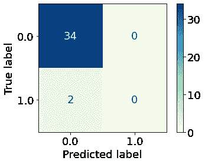

# 如何识别阶层失衡

> 原文：<https://medium.com/geekculture/how-to-identify-class-imbalance-529fcadeaf7?source=collection_archive---------33----------------------->

## 使用来自单身汉的数据简要解释数据集中的阶级不平衡，因为为什么不。

我们生活在一个不平衡的世界。美国收入最高的 1%的人拥有这个 T2 国家 30%的家庭财富。怀俄明州的总人口是纽约市的 1/14。《单身汉 T4》共有 25 季，每一季平均有大约 25 名参赛者，总共有 625 名女性自愿签署协议，放弃与一个每晚给他妈妈打电话的半成功的 30 多岁男人恋爱的机会。

我只是说，机会对他们不利。

但当涉及到数据科学时，类别不平衡具体指的是包含来自一个特定子组的不成比例的观察数据。这种情况经常发生，是用于获取数据的随机抽样过程的结果，并且实际上可以表明您的数据实际上代表了您试图建模的总体。例如，如果你正在收集关于一种罕见疾病的数据，随机抽样的人群可能会出现有利于未患病人群的阶层不平衡，因为患病人群比未患病人群少得多。

尽管类别不平衡可能是数据可用性的良好指标，但它也可能导致一些不可靠的分析。为了演示，我将使用来自 kaggle 的这个[数据集](https://www.kaggle.com/jasminedogu/bachelorettedataset),其中包含关于第 11-15 季《单身女郎》中参赛者的信息。一些值得注意的特征包括家乡、身高、年龄，以及参赛者在表演时是否有女朋友(对于外行人来说，这是一件非常糟糕的事情)。

让我们仔细看看最后一个特性。

Code used to produce the following graph

哇！那么多相亲节目的选手都没有女朋友！你对男人的信心恢复了吗？？先别急着下任何疯狂的结论。正如你所看到的，在我们的数据中，有女朋友的参赛者和没有女朋友的参赛者之间确实存在阶级不平衡，但是很难说出每一类中赢得单身女子芳心的比例。为此，我们将使用镶嵌图:

Code use to produce the following graph

这张镶嵌图虽然由于不平衡而显得有点局促，但显示了每个类别的相对大小。绿色区域代表所有没有女朋友的参赛者，而红色区域代表有女朋友的参赛者。每个类别底部的部分代表获胜的比例。

哦。看起来大约三分之一有女朋友的参赛者赢了。呀！

除了我们数据的这一特征的不平衡，如上所述，每个赛季平均有 25 名参赛者，只有一人能够获胜，这意味着我们的目标变量，无论是否有人获胜，也将具有不平衡。

通常，建模的第一步是创建一个基线模型，有时称为“虚拟模型”(不是针对我们的任何单身女子参赛者，那些美丽的白痴)，它只预测大多数阶级。在我们的例子中，大多数班级是那些没有把最后一朵玫瑰带回家的人。

Confusion matrix for dummy model

这个混淆矩阵显示，在 36 名参赛者的样本中，有 2 名获胜者，而我们的模型没有预测到任何人获胜。(但我的意思是，*单身女郎中有赢家吗？我会让你决定。)尽管如此，这个模型还是有 94%的准确率！！！*

*事实证明，虚拟模型的高准确度分数是类别不平衡的结果，因为即使没有预测任何赢家，我们的模型仍然可以是高度准确的。因此，准确性并不总是最准确的衡量标准。*

*有很多方法可以用来纠正班级失衡。一种这样的技术是合成少数过采样，或 SMOTE。顾名思义，SMOTE 使用数据集的少数类的特征来创建人工数据，以平衡不平衡。在我们的上下文中，SMOTE 创建的数据点并不是真正的参赛者，但乍一看，它们似乎是，有点像在第一次玫瑰仪式上被送回家的人。它们是填充数据；他们都叫杰克森，是的，他们都带了一把吉他。*