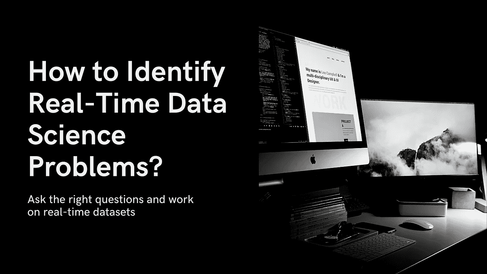
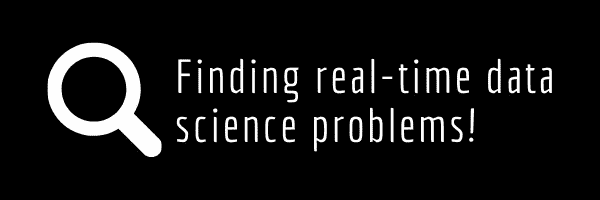

# 如何识别实时数据科学问题？

> 原文：<https://medium.com/geekculture/how-to-identify-real-time-data-science-problems-7f65fd7eadb1?source=collection_archive---------34----------------------->

## 问正确的问题，处理实时数据集

Image created by [Akshay Toshniwal](https://linkedin.com/in/akshaytoshniwal) using [Canva](https://canva.com)

“数据”这个术语，以及相应的“数据是新的石油”这句话，如今已经耳熟能详了。在当前的场景中，由于 COVID 疫情，世界已经虚拟化和数字化，数据自那时以来增长了很多。这些数据以不同的方式出现，可以用于更好的决策流程和高效的业务成果。

当我们谈论数据时，我们总是试图从中找到一些有价值的信息。这些信息可以是多方面的。从过滤数据项到分组，从可视化到分类数据，可以通过多种方式获得数据结果。除了这些简单的操作之外，结果还可以是从给定的信息中预测或预报出一些东西。

# 在处理任何数据问题之前，您需要问哪些问题？

每当你试图解决一个涉及数据和信息的问题时，总是试图回答某个特定的问题，这将帮助你确保更好的结果。这些问题的答案让你清楚地看到自己解决问题的能力，并让你知道可以遵循什么样的理想过程来产生结果。

解决任何问题都要有明确的心态和目标，才会有更好更快的结果。您不会希望回滚并来回工作。相反，在你解决问题之前，列出一系列你想要达到的目标。通过回答一系列问题，这些目标很容易识别。

Image created by [Akshay Toshniwal](https://linkedin.com/in/akshaytoshniwal) using [Canva](https://canva.com)

要继续解决下一个数据问题，请回答以下问题:

1.  什么是输入数据，什么是需要生成的结果？
2.  数据来源于哪里？关于共享的信息，该来源可靠吗？
3.  数据与产生特定结果相关吗？
4.  数据大小是否足以确保更好的准确性、效率或整个系统的性能？
5.  数据的格式是什么？(在大多数情况下这并不重要)
6.  结果的格式是什么？(结果很重要，因为这是您希望向最终用户展示的东西)

一旦你解决了这些问题，并且以一种明确的、结构化的方式找到了每个问题的答案，那么你就一定能继续解决这个问题。

如果没有，迭代多个实例，并尝试回答上述所有问题。

# 如何识别实时数据科学问题？

数据无处不在，这的确是事实。让我告诉你，无论你属于什么行业，什么业务部门，你都是在和数据打交道。从你的智能手机到你手中的智能手表，你一直在接触数据和信息。然后处理、使用和分析这些信息，以提供建议、预测和许多其他事情来改善用户体验。

这些生成的数据结果不仅限于改善用户体验，它还有助于做出更好的决策，产生隐藏的洞察力，为企业及其利益相关者增加价值，等等。有多种方法可以增加任何组织的价值。一种方法是通过解决数据问题。在此之前，重要的是识别这些问题并了解它们的相同影响。

Image created by [Akshay Toshniwal](https://linkedin.com/in/akshaytoshniwal) using [Canva](https://canva.com)

今天，我们使用数字设备，以不同的方式与我们互动，并实时处理数据。这不是魔法。神奇之处在于识别某些用例并将数据科学技术应用于它们。使用案例的范围可以从简单地分析和/或可视化数据到为最终用户提供一定级别的建议，这完全取决于问题是什么以及从中会产生什么结果。

**确定可以使用数据科学方法和技术解决的现实业务问题的几种方法**

1.  **社交媒体:**你使用社交媒体，对吗？使用你自己的社交媒体数据来了解你的活动是什么，你如何使用它们，你的使用频率是多少，等等。
2.  **流媒体平台:【YouTube、网飞、亚马逊 Prime 等流媒体平台以视频的形式提供多媒体数据，以用户评分和评论、用户评论等形式提供文本数据。这些数据集可用于确定平台的运行情况，也可用于进行对比分析。**
3.  电子商务平台:电子商务数据是你可以处理的最详细的数据集之一。它包含了大量的信息。产品信息、用户评论、产品图片、类别列表、产品推荐信息、优惠和折扣等。这些数据可用于可视化、分类、预测和许多其他数据结果。
4.  日常活动:一整天中，你可能会遇到很多事情。可以是你看电视节目的时候，也可以是你写博客的时候，也可以是你阅读的时候。脑海中突然冒出建造某物的想法。你所做的一切都与今天的数据有关。你可以跟踪这一点点信息，对其进行筛选，并生成不同类型的有用数据结果。
5.  **商业和金融数据:**如今，加密货币在金融市场引起了广泛关注。对此类密码的投资者越来越多。通过应用数据科学技能来跟踪和监控数据，并在需要时进行相应的进一步处理，来了解加密市场将是一个好主意。除了这种加密技术，您还可以随时使用财务数据来获取公司的详细信息并了解其性能。

简而言之，随着数据的大量可用，识别不同领域的不同痛点并解决它们以使事情变得更好是很重要的。

# 结论

在解决和识别有效且具有挑战性的棘手问题之前，提出一组正确的问题对于解决实时数据科学问题非常重要。数据可以来源于或提取自多个在线存储库(在一定程度上)，但定义问题陈述更具挑战性。

我对所有人的建议是首先定义问题，然后集中精力获取与之相关的数据集。

我希望这有助于您理解实时数据科学问题的新观点，以及如何解决这些问题。

想了解更多关于技术、商业、企业家精神等方面的更新和见解，你可以关注我的[阿克谢演讲](https://linkedin.com/in/akshaytoshniwal)