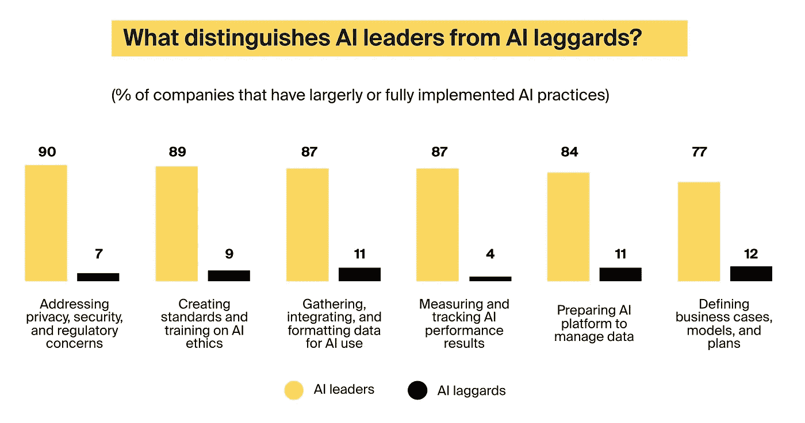
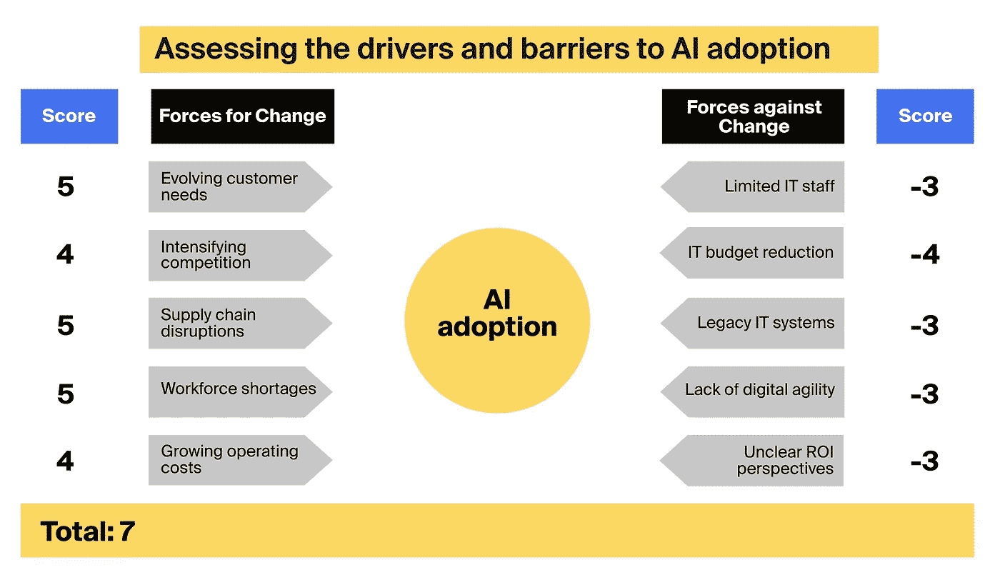

# 如何在商业中实现人工智能

> 原文：<https://medium.com/geekculture/how-to-implement-ai-in-business-eaae9d01cd04?source=collection_archive---------15----------------------->

从接听客户的电话到找出为什么你的设备比过去消耗更多的能源，人工智能可以做很多事情。

但是也有很多算法失败的地方，促使人类工作者介入并微调他们的表现。

如何实施人工智能并开始从中受益——持续地、大规模地、足够快地赢得高管对未来项目的支持？

问题是，在没有经验丰富的人工智能顾问参与的情况下，大多数公司仍然缺乏合适的经验、人员和技术栈来释放人工智能的全部潜力。

根据德勤(Deloitte)2020 年的调查，数字化成熟的企业[在推出人工智能项目](https://www2.deloitte.com/us/en/insights/industry/technology/artificial-intelligence-roi.html)仅 1.2 年后就看到了 4.3%的投资回报率。同时，人工智能落后者的投资回报率很少超过 0.2%，平均回收期为 1.6 年。

德勤还发现，看到人工智能投资有形和快速回报的公司从第一天起就为人工智能计划奠定了正确的基础。

普华永道[呼应了这种观点](https://www.pwc.com/us/en/tech-effect/ai-analytics/ai-business-survey.html)，声称人工智能领导者采取整体方法来开发和实施人工智能，并同时解决三个业务成果——即业务转型、[系统现代化](https://itrexgroup.com/services/legacy-application-modernization/)和增强的决策制定。

那么，如何在你的组织中使用 AI，并加入人工智能领导者的行列？

为了回答这个问题，我们进行了广泛的研究，与 ITRex 专家进行了交谈，并检查了我们投资组合中的项目。这是我们学到的。

# 如何在商业中实施人工智能:企业进行智能转型的 5 步指南

免责声明:为创新而创新不会给你的公司带来任何好处。

有时候，像[机器人流程自动化(RPA)](https://itrexgroup.com/services/robotic-process-automation/) 这样简单的技术可以像人工智能算法一样处理任务，没有必要让事情过于复杂。

在其他情况下(想想[基于人工智能的医学成像解决方案](https://itrexgroup.com/blog/artificial-intelligence-in-radiology-use-cases-predictions/))，可能没有足够的数据让机器学习模型在 CT 扫描中高精度地识别恶性肿瘤。

偶尔，需要多层神经网络和几个月的无人值守算法训练才能[将数据中心冷却成本降低 20%](https://www.blog.google/inside-google/infrastructure/safety-first-ai-autonomous-data-center-cooling-and-industrial-control/) 。

> *人工智能不是某种能够神奇地提高员工生产率和利润的银弹解决方案。然而，它确实有潜力改变您的业务。*

事不宜迟，这是你实现人工智能的指南

# 第一步:熟悉人工智能的能力和局限性

公司可以将人工智能集成到各种任务中，从[挖掘社交数据以提供更好的客户服务](https://itrexgroup.com/blog/ai-sentiment-analysis-in-customer-service-use-cases-benefits-expert-tips/)到[检测供应链中的低效率](https://itrexgroup.com/blog/ai-in-supply-chain-use-cases-implementation-roadmap/)。

从更广泛的角度来看，人工智能在商业中的应用包括:

*   行程安排
*   预测(以及“如果-否则”分析)
*   流程改进和自动化
*   资源管理和分配
*   报告
*   网络安全管理

这个列表并不详尽，因为人工智能在硬件设计和云计算的巨大进步的推动下继续发展。

促进或接管独立任务和整个过程的算法在数据源、处理和解释能力方面有所不同——这是你在制定人工智能采用策略时需要记住的。

让我们以**监督机器学习**为例。人工智能工程师可以训练算法，通过给 Instagram 帖子中的猫喂食我们猫朋友的注释图像来检测它们。当面对不熟悉的物体时，这些算法会严重失灵。

但是，如果我们从 ML 模型训练过程中提取标记数据，我们将获得**无监督的机器学习**算法，这些算法处理大量信息——再次以猫的选择为例——直到有意义的见解。不过，无监督的 ML 模型仍然需要一些初始训练。例如，我们可以告诉算法，某个特定的数据库只包含猫和狗的图像，并让人工智能来计算。

还有**强化学习**——一种让算法在野外自由活动的技术，这样它们可以提出商业问题的解决方案，并从自己的错误中学习。这种[类型的人工智能](https://itrexgroup.com/blog/ai-types-subsets-use-cases/)可以帮助总结长文或预测股市趋势。

最后，还有**深度神经网络**，通过针对各种参数分析标记和未标记的数据进行智能预测。深度学习已经在现代自然语言处理(NLP)和[计算机视觉(CV)解决方案](https://itrexgroup.com/services/computer-vision/)中找到了出路，例如语音助手和具有面部识别功能的[软件](https://itrexgroup.com/blog/how-much-does-a-facial-recognition-system-cost/)。

> *无论人工智能解决方案的预测有多准确，在某些情况下，必须有人类专家* [*监督 AI 的实现过程*](https://itrexgroup.com/blog/why-use-human-in-the-loop-machine-learning-approach/) *并将算法搅拌到正确的方向。*

例如，人工智能可以通过[识别 COVID 相关肺炎患者](https://itrexgroup.com/blog/examples-and-benefits-of-ai-in-healthcare/)来节省肺部学家的大量时间，但最终是人类医生审查扫描结果以确认或排除诊断。

在几个领域，如果没有有效的监控，实施人工智能就没有什么意义:

*   生成创意内容，如观点文章和转换优化的文本
*   编写复杂的软件系统(顺便说一下，像 GitHub Copilot 和 Tabnine 这样的工具确实可以预测和建议你的编辑器中的代码行，但我们不建议使用它们，除非是高级软件工程师使用它们)
*   独立做出判断和道德决定
*   为现实世界的问题提出创新的、开箱即用的解决方案

如果你的内部 IT 团队难以独自驾驭动态的人工智能领域，你可以寻求一家提供技术咨询服务的外部公司的帮助。

# 第二步:定义你的人工智能实现目标

为了开始在商业中使用人工智能，找出你希望用人工智能解决的问题，将你的计划与有形的结果联系起来。

为此，您需要与可能从实施 AI 中受益的组织单位召开会议。贵公司的高管应该是这些讨论的一部分和推动力。

此外，审核您的流程和数据，以及影响您组织的外部和内部因素。有大量的技术和框架来支持你的决策。这些包括寺庙微观和宏观环境分析，评估你的关键资产的 VRIO 框架，以及总结你的公司的优势和劣势的 SWOT。另一个评估人工智能采用的驱动因素和障碍的伟大工具是库尔特·勒温的力场分析。这份清单并不详尽；尽管如此，这可能是你的人工智能实施之旅的起点。

评估在您的组织中实施 AI 的利弊的一种方法是执行力场分析。在这样做的时候，给每一个因素打分。如果你的综合得分是积极的，采用人工智能的好处超过了潜在的挑战。

专家[认为，你应该根据近期可见性和它们可能给你的公司带来的财务价值来优先考虑人工智能用例](https://www.pcmag.com/news/10-steps-to-adopting-artificial-intelligence-in-your-business)。这就是为什么你需要具体的目标和方法来衡量它们。

回到人工智能投资回报的问题，关键是[区分硬投资回报和软投资回报](https://www.pwc.com/us/en/tech-effect/ai-analytics/artificial-intelligence-roi.html)。

以下是贵公司通过实施人工智能可以实现的硬投资回报率:

*   繁重任务的自动化节省了时间
*   人工智能辅助决策带来的生产力提升
*   由于自动化程度提高和员工生产率提高，劳动力和运营成本降低
*   由于客户群的增长和所提供服务的更高价值，收入增加

软投资回报人工智能的采用可以提供范围:

*   个性化的客户体验，对客户满意度和忠诚度产生积极影响
*   技能保留，围绕着不断研究和验证新的人工智能实施概念，并有助于开发内部人工智能技能
*   组织和数字灵活性，使您的员工能够改进技术系统和整个工作流程，以应对新的挑战和机遇

实施人工智能试点的所有目标都应该是具体的、可衡量的、可实现的、相关的和有时限的(SMART)。例如，您的公司可能希望[将保险索赔处理时间](https://itrexgroup.com/blog/rpa-in-healthcare/)从 20 秒减少到三秒，同时在 Q1 2023 年之前实现 30%的索赔管理成本削减。

为了设定现实的目标，你可以利用几种技术，包括市场研究、与竞争对手进行基准测试，以及咨询外部[数据科学](https://itrexgroup.com/services/data-science-consulting/)和[机器学习专家](https://itrexgroup.com/services/machine-learning-development/)。

# 第三步:评估你的人工智能准备情况

人工智能就绪性术语指的是一个组织实施人工智能和利用技术实现业务成果的能力(见步骤 2)。

一旦你确定了你的业务的哪些方面可以受益于人工智能，是时候评估你执行人工智能实施计划所需的工具了。

据 ITRex 首席执行官兼联合创始人 [Vitali Likhadzed](https://www.linkedin.com/in/vitalilikhadzed/) 称，你的人工智能实施战略将依赖于五个关键组成部分:

*   **AI 开发天赋。**您的内部 IT 专家和主题专家(SME)知道如何在上一步指定的时间范围内实施人工智能吗——在技术和业务方面？如果没有，您是否有预算将人工智能开发外包给第三方，或者购买并部署 SaaS 解决方案？然而，采用后一种选择，你仍然需要雇佣人工智能开发人员来配置和定制软件。
*   **软件开发、采购和维护成本。根据你的业务目标，你可以选择一个基于 SaaS 的人工智能工具，或者选择[定制软件工程](https://itrexgroup.com/services/software-engineering/)路线。这两种方法都有其优点和缺点，例如较长的 AI 实施周期和有限的定制选项之间的权衡。人工智能系统的总拥有成本(TCO)，无论是定制的还是位于 SaaS 的，都将包括供应商和维护费用，以及建立和运营云基础设施的价格(稍后将详细介绍)。例如，总部位于 SaaS 的数据分析平台的[成本可能在每年 10，000 美元到 25，000 美元之间，许可成本只占最终估算的一小部分。](https://itrexgroup.com/blog/factors-behind-data-analytics-cost/)**
*   **数据。**人工智能算法的好坏取决于你提供给它们的数据。图像、视频、音频文件、PDF 文档、传感器读数和其他难以解释和修改的数据(即非结构化数据)占您公司 IT 基础架构中存储的所有信息的 90%。定位、聚合和准备算法训练是创建精确、高性能人工智能解决方案的重要一步。
*   **计算和存储资源。** Microsoft Azure、Amazon Web Services、Google Cloud 和其他著名的云计算供应商提供了在云中培训、部署和运行机器学习模型的资源。你的数据也将存在于云中——整齐有序的数据仓库中，数据湖中，或者被称为[数据湖库](https://itrexgroup.com/blog/data-warehouse-vs-data-lake-vs-data-lakehouse-differences-use-cases-tips/)的混合数据存储解决方案中。因此，开发云计算服务对人工智能的实现至关重要。你应该正确配置你的云基础设施——否则，实施人工智能的成本可能会超过你的潜在收入。
*   **员工培训。**即使你与经验丰富的人工智能开发人员合作，你仍然需要[对员工进行新技术的教育](https://itrexgroup.com/services/ai-for-education/)，以便他们能够有效地完成工作——无论是现在还是将来，当你接近企业范围的人工智能采用时。

根据[英特尔的分类](https://www.intel.com/content/dam/www/public/us/en/documents/white-papers/ai-readiness-model-whitepaper.pdf)，拥有所有五个人工智能构建模块的公司已经达到了人工智能基础和运营就绪状态。这些企业可以继续实施人工智能实施计划——如果他们拥有强大的数据治理和网络安全战略，并遵循开发运营和敏捷交付最佳实践，他们更有可能成功。

如果您的组织不符合这些标准，您可以与一家[数字转型服务公司](https://itrexgroup.com/services/digital-transformation-services/)合作，升级您的 IT 基础设施并考虑 AI 实施选项。

# 第四步:开始将人工智能集成到选定的流程中，同时规划规模

在 ITRex，我们遵循“从小处着手，快速部署，并从错误中学习”的原则我们建议‌our 的客户遵循同样的咒语——尤其是在商业中实施人工智能的时候。

Gartner 报告称[只有 53%的人工智能项目从原型成功进入生产](https://www.gartner.com/en/newsroom/press-releases/2020-10-19-gartner-identifies-the-top-strategic-technology-trends-for-2021)。其中一个原因可能是公司未能在现实生活中的无菌测试环境中复制他们通过概念验证取得的结果，人工智能算法消耗来自多个来源的数据并增强不同的流程。

采用人工智能的一个实用方法是在脑海中有一个更大的画面，而不是专注于选定用例的孤立的概念证明(POC)，即使后者[与雄心勃勃的 moonshot 计划相比可能看起来像一个低挂的水果](https://hbr.org/2018/01/artificial-intelligence-for-the-real-world)。

通过尽早为你的全公司人工智能采用战略创建蓝图，你还可以避免 75%的人工智能先驱的命运，他们[可能在 2025 年](https://newsroom.accenture.com/news/failure-to-scale-artificial-intelligence-could-put-75-percent-of-organizations-out-of-business-accenture-study-shows.htm)前倒闭，不知道如何大规模实施人工智能。

此外，人工智能 POC 的合理时间表不应超过三个月。如果您没有在这个框架内实现预期的结果，那么让它停下来并转移到其他的使用场景可能是有意义的。

# 第五步:实现人工智能卓越

在启动试点、监控算法性能和收集初步反馈后，您可以利用您的知识在公司的流程和 IT 基础设施中一层一层地集成人工智能。

为此，您需要设置:

*   强大的数据治理框架，确保整个公司安全高效的数据管理
*   一个[集成数据生态系统](/geekculture/how-ai-powered-data-ecosystems-improve-retail-resilience-in-times-of-crisis-9753472ea8e2)，用于收集、存储和组织算法训练的信息
*   一个人工智能卓越中心，您的内部团队将在这里与第三方专家携手合作，获得新技能，不断提高人工智能性能，并测试新概念
*   促进敏捷决策和持续业务流程重新设计的基础:随着人工智能将增强或自动化您组织内的更多流程，您将需要验证人类和机器增强和补充彼此的工作

实施人工智能的渐进式方法可以帮助你更快地实现投资回报，获得首席执行官的认可，并鼓励其他部门尝试新技术。

理解人工智能是利用这项技术促进公司发展和繁荣的第一步。

为了帮助你开始，我们编写了人工智能商业指南([下载此处](https://itrexgroup.com/blog/how-to-implement-ai-in-business/))——这是一本电子书，涵盖了你可能对该技术的所有问题，从其类型和应用到企业范围内人工智能采用的实用技巧。

*原载于 2022 年 9 月 1 日***。**